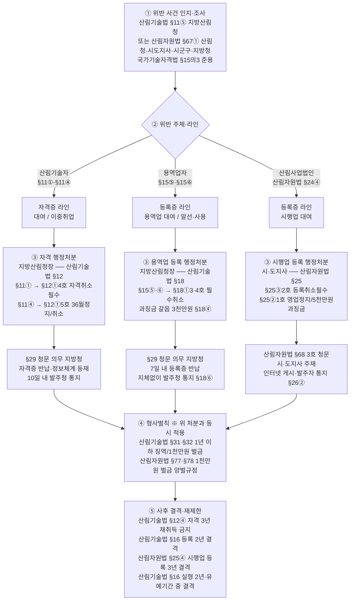
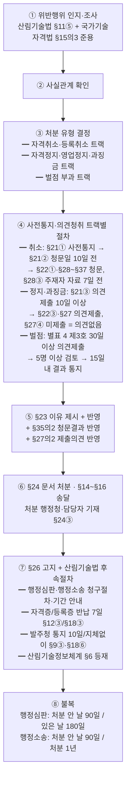

# FM Wiki — 산림작업 묶음 (NotebookLM 업로드용)

wiki/산림작업/ 아래 모든 페이지를 자동으로 합친 묶음입니다.

- 생성일: 2026-07-21 16:06
- 원본 저장소: https://github.com/chinguli4/FM-WIKI

각 페이지 시작에 `원본 경로:` 표시가 있어 GitHub 원문을 추적할 수 있습니다.

═══════════════════════════════════════════════════════════════
원본 경로: wiki/산림작업/감사대응/일상감사_의뢰.md
═══════════════════════════════════════════════════════════════

# 일상감사 의뢰 — 신규자 실무 가이드

> 근거: [[행정규칙/예규/산림청_일상감사_실시지침]] (예규 제703호, 2022-12-28)
> 상위: [[행정규칙/훈령/산림청_감사규정]] §18②4
> 감사기구: **법무감사담당관실** (본청·소속기관 공통)

> 신규자 교육에서 "내 사업도 일상감사 대상인가? 무엇을 어떻게 의뢰하나?" 질문이 자주 나오는 사안. 본 페이지는 **집행부서 담당자 관점**에서 의뢰 흐름·서식·자주 묻는 케이스를 정리.

---

## 1. 한눈에 보는 흐름

```
[집행부서]                              [법무감사담당관실]
사업 추진 결정
   │
   │ 일상감사 대상 여부 확인 (§6)
   │
   ├─ 대상 아님 → 통상 결재 진행
   │
   └─ 대상
       │
       │ 최종 결재 전 + 충분한 시간 확보
       │
       └→ 일상감사 의뢰서(별지 제1호) + 관련서류·참고자료
                                      │
                                      │ 담당자 지정, 관리대장 기입
                                      │ 서면감사(원칙) — 필요시 실지감사
                                      │
                                      │  ≤ 7일 (+1회 7일 연장)
                                      ▼
                          일상감사 의견서(별지 제3호)
                          ① 이견 없음 / ② 위법·부당 지적
       ┌──────────────────────────────┘
       │
       │ ① 이견 없음 → 최종 결재 (의견서 첨부)
       │
       │ ② 이의 있으면 → 재검토 요청 (7일 이내) ──→ 7일 내 통지
       │
       └→ 조치 → 14일 이내 조치결과통보서(별지 제4호)
                 → 최종 결재 시 의견서 + 조치결과 첨부
```

> ⚠️ **의견서 받기 전까지 집행 불가** (§13①). 긴급 사안은 사전 협의로 결재 후 의뢰 가능 — 그래도 위법·부당시 사후 조치 요구 받음.

---

## 2. 내 업무는 의뢰 대상인가? (§6)

### 의뢰해야 하는 9개 + 1 (§6①)

| 분류 | 대상업무 | 산림 실무 예시 |
|------|---------|---------------|
| 계획 | 성과관리시행계획 수립 | 부서 연간 성과관리시행계획 |
| 계획 | 신규사업 사업시행지침 | 새 사업 첫 회계연도 사업시행지침 작성 시 |
| **계약** | **수의계약 기준액 초과 공사** | 「국가계약법 시행령」 §26①5호 가목1) 초과 산림사업 공사 |
| **계약** | **수의계약 기준액 초과 물품·용역·기타** | 가목3)~5) 초과 — **숲가꾸기·조림·임도 설계·감리 용역**, 산림조사 용역 등 |
| 계약 | 설계변경 등으로 최종 추정가격이 일상감사 대상금액 신규 초과 | 당초 기준액 미만이었으나 변경 후 초과 |
| 계약 | 일상감사 받은 공사 → 설계변경 등으로 **공사비 10% 이상 증액** | 임도공사 등 변경계약 |
| 계약 | **연간 단가계약** 체결·변경 | 묘목·자재 연간 단가계약 |
| 예산 | 자체 이·전용 | 산림사업비 세목 간 전용 |
| 예산 | 예비비 집행 | 산불·산사태 등 재난 대응 예비비 |
| 규정 | 예산·회계관련 규정 제·개정 | — |
| (추가) | 감사기구의 장이 필요하다고 인정 | — |

> 수의계약 기준액 자체는 [[타부처법령/기획재정부/정부입찰계약집행기준/3-7장_지명_수의계약_서류구비]] 참고 (소액수의 추정가격 2천만/5천만 등).

### 제외되는 경우 (§6②) — 3가지만 기억

| 호 | 제외 조건 |
|----|----------|
| 1 | **계약을 조달청에 의뢰**한 경우 (위 §6①3호~6호 업무 중) |
| 2 | 다른 법령에 의해 인가·허가·승인 절차를 거친 경우 |
| 3 | **전년도 일상감사 사업비 대비 10% 이내 증액되는 동일사업**으로 일반경쟁 또는 관련 법령 위탁 물품제조·구매·용역 |

> 산림사업 발주에서 가장 빈번한 제외 사유는 **1호 조달청 의뢰** — 예: 조달청 시설공사 적격심사([[타부처법령/기획재정부/조달청_시설공사_적격심사_세부기준]])로 진행하는 임도공사. 다만 **수의계약·소액공사 등 청 자체 발주**는 제외 안 됨.

---

## 3. 의뢰 시기 — 언제 보내야 하나 (§7, §11)

- **원칙**: 최종 결재권자(전결권자 포함) **결재 직전**
- **최소 확보 기간**: 7일 (+ 1회 한해 7일 연장) → 보수적으로 **14일 여유** 잡고 의뢰
- **사전 검토 활용 가능**: 장시간 소요 예상 시 의뢰 전에 사본 제출하여 사전 검토 받을 수 있음
- **긴급 사안**: 감사기구의 장과 **사전 협의** 후 결재 → 사후 의뢰 가능

> ⚠️ 신규자 흔한 실수 — "결재 직전에 보내면 된다"가 아니라 **결재 직전에 의견서를 받고 있어야** 한다. 의뢰는 **결재 예정일 - 14일** 정도가 안전.

---

## 4. 무엇을 첨부하나 — 의뢰서 + 관련서류 (§8①)

### 필수

- **별지 제1호서식 일상감사 의뢰서** (예규 첨부 — [출처](https://www.law.go.kr/LSW/flDownload.do?flSeq=123274983))

### 관련서류·참고자료 — 사안별 권장

| 사안 | 권장 첨부 |
|------|----------|
| 공사·용역 계약 | 사업계획서, 설계도서·과업지시서, **원가계산서·예정가격 산정서**, 계약방법 결정 사유서, 발주 공고문 초안 |
| 설계변경 | 당초·변경 설계서 비교표, 변경 사유서, 변경 원가계산서, 변경 후 공사비 증감률 |
| 수의계약 | **수의계약 사유서** (국가계약법 시행령 §26 해당 호 명시), 단일 공급자 입증자료, 견적서 |
| 연간 단가계약 | 단가 산출 근거, 전년도 단가 비교, 수량 산출 근거 |
| 예비비·이전용 | 집행계획서, 이·전용 사유서, 예산편성 근거 |
| 신규사업 시행지침 | 사업시행지침안, 사업 추진계획 |
| 성과관리시행계획 | 시행계획안, 성과지표 |

> 감사기구의 장의 **중점 검토 9개 항목**(§10③)을 미리 검토해두면 의견서 회신 빨라짐:
> 합법성·필요성 / 타당성(경제성·효과성·효율성) / 사업목적 명확성 / 추진 주체 적정성 / 재원조달·집행 적절성 / **원가계산·예정가격 산정 적정성** / 계약방법·절차 적정성 / 지명입찰·수의계약 사유 해당 여부 / 예산 목적외 사용 여부

---

## 5. 의견서 받고 나면 (§11~12)

### 의견 종류

- **이견 없음**: 그대로 결재 진행 — 결재 시 의견서 첨부
- **위법·부당 지적**: 가능한 한 개선대안·시정방안이 함께 제시됨

### 이의 있을 때

- 의견서 수령일부터 **7일 이내**, 사유 + 입증자료 첨부하여 **재검토 요청**
- 감사기구의 장은 7일 이내에 인용·기각 결정

### 의견 이행

- 조치 → **14일 이내** 별지 제4호서식 **조치결과통보서** 송부
- **최종 결재 서류에 의견서 + 조치결과 첨부** (부적정 사유 통보 받았으면 그것까지 포함)

---

## 6. 자주 묻는 판단

| 상황 | 적용 기준 | 근거 |
|------|----------|------|
| 임도공사 — 조달청 의뢰 | **의뢰 제외** (§6②1) | [[행정규칙/예규/산림청_일상감사_실시지침]] §6②1 |
| 임도공사 — 청 자체 발주, 수의계약 기준액 초과 | **의뢰 대상** | §6①3 |
| 숲가꾸기 설계·감리 용역, 수의계약 기준액 초과 | **의뢰 대상** (용역) | §6①3 |
| 설계변경으로 공사비 8% 증액 | **의뢰 불요** (10% 미만) | §6①5 |
| 설계변경으로 공사비 12% 증액 | **의뢰 대상** | §6①5 |
| 묘목 연간 단가계약 체결 | **의뢰 대상** | §6①6 |
| 산불 발생 → 긴급 복구 예비비 집행 | **의뢰 대상** — 단 긴급 시 §8②에 따라 결재 후 의뢰 협의 가능 | §6①8 + §8② |
| 전년 사업비 대비 8% 증액된 동종 일반경쟁 용역 | **의뢰 제외** (10% 이내) | §6②3 |
| 일상감사를 받은 사업에서 또 감사 지적 받으면? | **면책 안 됨** — 자체감사 결과 위법·부당 사항은 일상감사 거쳤어도 책임 발생 | §13③ |

---

## 7. 신규자 체크리스트

- [ ] 사업 계획 단계에서 **§6① 9개 중 하나 해당 여부** 확인
- [ ] 해당 시 §6② 3개 제외 사유에 해당하는지 확인 (특히 조달청 의뢰 여부)
- [ ] 최종 결재 예정일 **14일 전** 의뢰 일정 잡기
- [ ] 의뢰서(별지 제1호) + 사안별 관련서류 준비
- [ ] 의뢰 전에 §10③ 중점 9개 항목 자체 점검
- [ ] 의견서 수령 → 조치 → **14일 내** 조치결과통보서 송부
- [ ] 최종 결재 시 의견서·조치결과 첨부 확인 (§12③)

---

## 관련 페이지

- [[행정규칙/예규/산림청_일상감사_실시지침]] — 원문
- [[행정규칙/훈령/산림청_감사규정]] — 자체감사 일반 절차 (일상감사는 §18②4에 따라 연간감사계획에 반영)
- [[산림작업/숲가꾸기/감사지적_재발방지]] — 종합감사 지적 사례(재발방지)
- [[타부처법령/기획재정부/국가계약법]] — 수의계약 일반 원칙
- [[타부처법령/기획재정부/정부입찰계약집행기준/3-7장_지명_수의계약_서류구비]] — 수의계약 기준액·서류
- [[타부처법령/기획재정부/조달청_시설공사_적격심사_세부기준]] — 조달청 의뢰 시 (일상감사 제외 사유)


═══════════════════════════════════════════════════════════════
원본 경로: wiki/산림작업/벌채/국유림_목재수확_업무절차.md
═══════════════════════════════════════════════════════════════

# 국유림 목재수확·입목처분 업무절차

> 근거: 산림자원법 §36·§36의4·§36의5, 시행령 §43의2~§43의7, 국유림법 §9·§10·§27, 동부지방산림청 「목재수확 업무 매뉴얼」(2026.3)

## 핵심 판단

| 질문 | 판단 | 다음 조치 |
|---|---|---|
| 경영계획에 편성되었는가? | 아니오 | 변경승인 전 실행 금지 |
| 제한지역·벌채금지구역인가? | 예 | 제척 또는 법정 예외 별도 검토 |
| 10ha 이상인가? | 예 | 전문기관 사전타당성조사 |
| 20ha 이상인가? | 예 | 지방산림청 심의위원회 심의 |
| 친환경벌채 대상 5ha 이상인가? | 예 | 존치 20%·영향권 포함 50% 설계 |
| 운재로가 필요한가? | 예 | 산지일시사용·계약서 부기·복구·준공검사 |
| 설계·조사를 위탁하는가? | 예 | 기술자 배치와 원자료 검수 |

## 절차

`경영계획 확인 → 제한지역 제척 → 사전 현장조사·가설계 → 주민의견 → 10ha 조사 → 20ha 심의 → 현장조사·설계 → 예정가격 → 공고·계약 → 인도 → 운재로 준공 → 벌채·반출 → 완료검사`

## 단계별 담당자 통제

### 1. 대상지

- 경영계획·사업이력·기준벌기령·수종갱신 근거를 한 묶음으로 보관
- 공간정보와 현장 불일치 시 현장을 기준으로 재실측하고 데이터 갱신
- 경영계획 미편성지는 변경승인 뒤 실행

### 2. 설계

- 하나의 벌채구역 30ha 이하
- 군상·수림대 존치 20% 이상
- 군상+수림대+산림영향권 50% 이상
- 운재로 신설 최소화, 계곡·수림대 단절 방지
- 조사·심의 조건을 도면과 물량내역에 반영

### 3. 매각

- 원자료와 시스템 입력자료·평정서 3자 대조
- 공고문에 표준지조사·현장확인·운재로 조건 명시
- 계약서에 대부·사용허가와 산지일시사용 면적·기간 부기

### 4. 사후관리

- 운재로 준공검사 후 반출
- 변경은 사전승인·변경계약·비용조정
- 반출기간 연장은 객관적 증빙과 규정상 한도 확인
- 완료검사 전 계약보증금 반환 금지

## 자주 묻는 판단

| 상황 | 적용 기준 | 근거 |
|---|---|---|
| 18ha 벌채 | 사전타당성조사 필요, 법정 20ha 심의는 면적기준상 미해당 | 시행령 §43의2·§43의6 |
| 22ha 벌채 | 사전타당성조사와 심의 모두 필요 | 같은 근거 |
| 운재로 현장 변경 | 구두 승인만으로 불가; 실측·변경계약·면적·비용·복구 갱신 | 국유림법 시행규칙 §27⑤, 계약서 §13 |
| 시스템 품등 자동입력 | 원자료와 수종·경급별 품등비율 재검산 | 2026 매뉴얼 감사사례 |
| 반출기간 만료 후 연장 요청 | 원칙적으로 사전 신청·결정; 사후 소급연장 금지 방향으로 검토 | 시행요령 §22·감사사례 |

## 관련 페이지

- [[매뉴얼/2026_목재수확_업무매뉴얼_동부지방산림청/index]]
- [[매뉴얼/2026_목재수확_업무매뉴얼_동부지방산림청/09_통합체크리스트]]
- [[행정규칙/고시/친환경벌채_운영요령]]
- [[국유재산/사용허가_대부]] — 운재로·작업부지의 국유림 사용권원
- [[국유재산/관련인허가_의제협의]] — 산지일시사용·벌채 의제와 변경협의


═══════════════════════════════════════════════════════════════
원본 경로: wiki/산림작업/벌채/작업설계기준.md
═══════════════════════════════════════════════════════════════

# 벌채 작업설계·조사 기준

> 근거: 산림자원법 시행규칙 별표 3, 산림기술법 §25·시행령 §15 별표 5, 국유임산물 매각예정가격 사정기준 등 시행요령
> 범위: 국유림 목재수확·입목처분 설계 중심

## 설계도서의 역할

설계도서는 벌채 수량만 산출하는 문서가 아니다. 적법한 벌채구역, 생태·재해 보호구역, 운재로, 예정가격 인자를 하나의 기준도면과 원자료로 연결해야 한다.

## 필수 구성

1. 사업개요: 위치·경영계획·면적·사업종·기간
2. 제한지역 검토: 법정·기능별·생태·재해 중첩도
3. 벌채설계: 벌채구역·벌채면적·잔존구역·군상·수림대·산림영향권
4. 현장조사: 매목·수고·조재율·품등·재적
5. 운재로: 기설·신설·보수 노선, 폭·길이·면적·절성토·배수·복구
6. 예정가격 인자: 집재·운반·시장·비용 조사
7. 조림·사후관리: 후계림, 부산물, 재해예방
8. 사전타당성조사·심의 의견 반영표

## 면적 정의

| 항목 | 정의·용도 |
|---|---|
| 벌채구역 | 실제 벌채지와 군상·수림대·단목 존치지를 모두 포함 |
| 벌채면적 | 벌채구역 내 실제 벌채되는 면적, 산림영향권 포함 개념 확인 |
| 잔존구역 | 군상·수림대·벌채금지구역 등 실제 존치 구역 |
| 운재로 면적 | 벌채구역 안·밖을 분리하여 계약서와 산지일시사용에 사용 |

면적표와 GIS 도형의 합계를 일치시키며, 하나의 벌채구역은 최대 30ha 기준을 확인한다.

## 조사방법

전수조사와 표준지조사 중 임분의 균질성·면적·정확성 요구에 맞는 방법을 선택한다. 표준지의 개수·비율을 일률적으로 고정하지 않고 적용 중인 시행요령·조사기준과 임상별 대표성에 따라 정한다.

> 종전 페이지의 `0.04ha 표준지`, `면적별 고정 개소수`는 근거가 명확하지 않아 법정 기준처럼 제시하지 않는다. 적용 사업의 현행 조사기준을 직접 확인한다.

### 원자료

- 매목조사야장
- 수고측정야장과 수고곡선
- 공시목 안배조서
- 조재율·품등조사서
- 재적조서와 집계표
- 운재로 실측·종횡단 자료
- 대금사정 인자조사서

## 친환경벌채 설계

- 군상·수림대 존치면적 20% 이상
- 산림영향권 포함 합계 50% 이상
- 군상 최소 폭 50m, 수림대 가능한 최소 폭 20m 검토
- 8부 능선·계곡·급경사·도로변·임연부 우선
- 연접벌채 거리와 조림 준공 후 4년 예외 확인
- QGIS 산출값은 평균수고·군상직경 입력값과 현장조건을 함께 검수

## 운재로 설계

- 기설시설 활용과 신설 최소화
- 계곡·수림대 횡단 최소화
- 노폭·종단·횡단·절성토·배수·복구 명시
- 벌채구역 밖 면적 별도 산출
- 변경 시 승인·변경계약·예정가격·복구량 갱신 절차 명시

> 종전 페이지의 경사도별 집재장비, 3m 폭, 40~60m 간격은 이번 원문과 현재 위키의 원문 근거로 일반 법정 기준임을 확인하지 못해 삭제했다. 현장·장비·산지관리 기준에 따라 설계한다.

## 위탁기술자와 검수

산림기술법 시행령 별표 5의 산림 조사사업 배치기준을 계약 시점에 확인한다. 매뉴얼은 5ha 이하 초급, 10ha 이하 중급, 20ha 이하 고급, 20ha 초과 특급으로 설명하지만 최신 별표 원문을 우선한다.

검수 시 자격·소속·실제 참여, 야장 원본, 도면·면적, 공시목, 시스템 입력자료를 표본 대조한다.

## 감리

감리 대상·자격·배치는 산림기술법령과 해당 사업유형의 현행 기준으로 판단한다. 종전 페이지의 `총사업비 1억원 이상`과 특정 자격 단정은 현재 근거 확인 없이 일반화되어 삭제했다.

## 관련 페이지

- [[매뉴얼/2026_목재수확_업무매뉴얼_동부지방산림청/04_현장조사_재적조사_위탁]]
- [[매뉴얼/2026_목재수확_업무매뉴얼_동부지방산림청/10_현행검증표]]
- [[행정규칙/고시/벌채예정수량조사서_작성서식]]


═══════════════════════════════════════════════════════════════
원본 경로: wiki/산림작업/벌채/지침.md
═══════════════════════════════════════════════════════════════

# 벌채 지침

> 근거: 산림자원법 §36·시행령 §41~§43의7·시행규칙 별표 3, 지속가능한 산림자원 관리지침, 친환경벌채 운영요령
> 국유림 입목처분 절차: [[산림작업/벌채/국유림_목재수확_업무절차]]

## 적용 전에 구분할 것

| 구분 | 판단 기준 |
|---|---|
| 국유림 목재수확·입목처분 | 국유림경영계획, 국유림법령, 국유임산물 매각기준 추가 적용 |
| 공·사유림 벌채 | 산림경영계획 인가·입목벌채 허가·신고 주체와 서류 별도 확인 |
| 산림사업 실행 | 산림자원법 §14 실행신고와 §36 허가·신고 관계 확인 |
| 재난·피해목 | 사전타당성조사 면제·신고 특례가 있더라도 안전·복구기준 별도 적용 |

## 핵심 법정 분기

| 조건 | 기준 | 근거 |
|---|---|---|
| 입목벌채등 10ha 이상 | 전문기관 사전타당성조사 | 시행령 §43의2 |
| 입목벌채등 20ha 이상 | 심의위원회 심의 | 시행령 §43의6 |
| 친환경벌채 대상 5ha 이상 | 군상·수림대·산림영향권 기준 적용 | 시행규칙 별표 3·운영요령 |
| 하나의 벌채구역 | 최대 30ha | 시행규칙 별표 3 |

> 과거 이 페이지의 `최대 개벌면적 50ha`는 현행 근거와 충돌하여 2026-07-13에 30ha로 정정했다.

## 벌채 가능성 검토 순서

1. 산림경영계획 편성·인가 및 변경 필요 여부
2. 기준벌기령·수종갱신·왜림·피해목 등 벌채 사유
3. 산림자원법 §36②와 시행령 §41의 제한지역
4. 산림보호구역·백두대간·사방지·공원·국가유산 등 개별법 제한
5. 지속가능한 산림자원 관리지침의 기능별 벌채 제한
6. 친환경벌채 면적·존치·연접 기준
7. 운반로·작업로의 산지일시사용·복구계획
8. 10ha 사전타당성조사와 20ha 심의

## 친환경벌채 핵심

- 군상·수림대 존치면적: 벌채면적의 20% 이상
- 군상+수림대+산림영향권: 벌채구역의 50% 이상
- 군상: 1개 이상 권장, 최소 폭 50m 이상
- 수림대: 가능한 최소 폭 20m 이상, 기존 임분과 연결
- 배치: 8부 능선·급경사·계곡·도로변·임연부 우선
- 사전점검: 희귀종·경관·상수원·토사유출·벌채금지구역
- 사후관리: 잔존목·부산물·운재로·복구·임의변경 점검

## 기능별 주의

- 수원함양림: 골라베기 원칙, 불가피한 모두베기·어미나무작업은 지침상 소면적 기준 확인
- 산지재해방지림·자연환경보전림: 공익적 피해복구 외 벌채 제한을 우선 검토
- 산림휴양림·생활환경보전림: 공간이용·경관·방풍·미세먼지 기능별 제한 확인
- 계곡부·암석지·석력지: 벌채금지 또는 존치구역으로 우선 검토

## 운반로·작업로

산림자원법 §36⑨의 의제 여부와 별개로 설치·복구계획을 작성한다. 국유임산물 매각에서는 계약서에 대부·사용허가 및 산지일시사용 면적·기간을 부기하고, 변경계약·준공검사 후 반출한다.

## 벌채 후 확인

- 경계침범·오벌·도벌·잔존목 피해
- 계곡·배수로 부산물 적치
- 운재로 임의변경·절성토·배수·복구
- 조림·후계림 조성계획 이행
- 허가·신고 또는 계약 내용대로 실행되었는지 확인

## 관련 페이지

- [[행정규칙/고시/친환경벌채_운영요령]] §3~§9
- [[행정규칙/훈령/지속가능한_산림자원_관리지침_일반지침]]
- [[법령/산림자원법/법률_3장_이용]] §36·§36의4·§36의5
- [[매뉴얼/2026_목재수확_업무매뉴얼_동부지방산림청/index]]
- [[국유재산/사용허가_대부]] — 국유림 운재로·작업부지 사용관계
- [[국유재산/무단점유_변상금_철거]] — 경계침범·계약면적 밖 사용 대응


═══════════════════════════════════════════════════════════════
원본 경로: wiki/산림작업/숲가꾸기/감사지적_재발방지.md
═══════════════════════════════════════════════════════════════

# 숲가꾸기사업 감사 지적사항 재발방지 업무요령

> 근거: 숲가꾸기 설계·감리 및 사업시행 지침 (훈령 제1502호), 산불예방 숲가꾸기 사업시행 기준, 임업진흥법 시행령 §16, 임업기계장비 보급 및 운영지침 §16  
> 출처: 2026년 동부지방산림청 종합감사 결과(2026.04.) — 지적사항 1. 숲가꾸기사업 추진 부적정(가~라)

---

## 핵심 기준 요약

| 항목 | 지적 내용 | 근거 조항 | 핵심 원칙 |
|------|-----------|-----------|-----------|
| 가 | 산물수집 장비 설계 반영 부적정 | 숲가꾸기 설계·감리 지침 §3장 기능분야 품셈 | 설계 장비 = 현장 실사용 장비 |
| 나-① | 산물수집량 변경 시 품셈 미정산 | 산불예방 숲가꾸기 사업시행 기준 | 증감 발생 시 반드시 설계변경 |
| 나-② | 무상대여 장비 기계경비 이중계상 | 임업진흥법 시행령 §16 + 임업기계장비 운영지침 §16 | 무상대여 = 기계경비 미계상 |
| 다 | 산림기술정보 통합관리시스템 등록 지연 | 숲가꾸기 설계·감리 지침 §20·§21 | 작업 **착수 전** 등록 완료 |
| 라 | 감리용역 계약 시기 위반 | 숲가꾸기 설계·감리 지침 §28 | 실시설계 완료 **전** 감리자 선정 |

---

## 가. 산물수집 임업기계장비 설계 반영

### 원칙
설계서 작성 시 **해당 국유림관리소의 임업기계장비 보유현황**을 먼저 확인하고, 실제 현장에서 사용할 장비의 품셈을 그대로 반영하여야 한다. 설계 장비와 현장 투입 장비가 다르면 사업비 산출 근거가 무효가 된다.

### 자주 발생하는 오류
- 설계서: 2드럼 케이블윈치(또는 HAM200) → 현장: 스마트집재기(또는 다른 장비)
- 전년도 설계서를 그대로 복사하면서 보유장비 변경사항을 반영하지 않음

### 업무 절차
1. 설계 착수 전 관리소 임업기계장비 보유·운용 현황 목록 확인
2. 현장 조건(경사, 작업면적, 산물 밀도)에 맞는 장비 유형 결정
3. 결정된 장비의 품셈을 설계내역서에 반영
4. 사업시행 중 장비 변경이 불가피할 경우 **착수 전 설계변경 승인** 후 변경

### 체크리스트
| 확인 | 점검 항목 | 시점 |
|------|-----------|------|
| [ ] | 관리소 보유 임업기계장비 목록 확인 (기종·수량·운용 가능 여부) | 설계 착수 전 |
| [ ] | 설계내역서의 장비 기종·품셈이 현장 투입 예정 장비와 일치 | 설계 완료 검수 시 |
| [ ] | 감리자의 실시설계 사전검토 보고서에 장비 적정성 검토의견 포함 여부 | 감리 사전검토 접수 시 |
| [ ] | 사업착수 신청서의 기계장비 기종·수량이 설계내역서와 동일 | 착수 승인 전 |
| [ ] | 현장 투입 장비가 설계 장비와 달라질 경우 설계변경 완료 여부 | 사업 진행 중 |

---

## 나. 산물수집 품셈 적용 및 기계경비 정산

### 나-① 산물수집량 변경에 따른 설계변경 의무

#### 원칙
작업량의 증감 차이가 현저하거나 사업면적·수집 산물량에 증감이 발생하면 **설계변경을 통해 사업비를 정산**하여야 한다. 당초 품셈을 그대로 적용하면 과부족이 발생한다.

#### 설계변경 필요 시점
- ha당 산물수집량이 설계치와 현저히 달라질 때
- HAM200 등 기계장비 소요인력이 수집량 변경으로 달라질 때
- 사업면적이 변경될 때

#### 체크리스트
| 확인 | 점검 항목 | 시점 |
|------|-----------|------|
| [ ] | 사업 진행 중 ha당 산물수집량 실적 모니터링 | 사업 시행 중 |
| [ ] | 수집량이 설계치와 10% 이상 차이 날 경우 설계변경 검토 | 수집량 확인 시 |
| [ ] | 설계변경 완료 후 변경된 품셈으로 정산 | 준공 정산 전 |
| [ ] | 기계장비(HAM200 등) 소요인력 품셈이 변경 수집량 기준으로 재산출됨 | 정산서 검토 시 |

### 나-② 무상대여 임업기계장비의 기계경비 처리

#### 원칙
국유림관리소가 국유림영림단에 임업기계장비를 **무상으로 대여**한 경우, 해당 사업의 단가산출서에 **기계경비를 계상하지 않아야** 한다. 무상대여 후 기계경비를 사업비에도 반영하면 이중지급이다.

#### 근거
- 임업진흥법 시행령 §16: 영림단 활성화를 위한 임업기계장비 지원 가능
- 임업기계장비 보급 및 운영지침 §16: 산림사업을 위해 임업기계장비를 무상대여하는 경우 해당 사업의 단가산출서에 기계경비를 계상하지 않아야 함

#### 체크리스트
| 확인 | 점검 항목 | 시점 |
|------|-----------|------|
| [ ] | 사업시행 예정 영림단에 관리소가 임업기계장비를 무상대여 하는지 확인 | 사업 발주 전 |
| [ ] | 무상대여 장비가 있는 경우 해당 기계경비 항목을 단가산출서에서 제거 | 설계내역서 작성 시 |
| [ ] | 준공 정산 시 무상대여 장비의 기계경비가 포함되어 있지 않은지 재확인 | 준공 정산 전 |

---

## 다. 산림기술정보 통합관리시스템 작업원 등록

### 원칙 (숲가꾸기 설계·감리 지침 §20·§21)
- 사업시행자는 숲가꾸기 작업 **착수 전** 작업원 운영계획서를 감독자 경유 발주자에게 제출
- 감독자(관리소 담당자)는 사업착수 및 작업원 교체 시 현장대리인·작업원의 인적사항과 자격정보를 **산림기술정보 통합관리시스템**에 등록
- 등록 목적: 타지역 사업장과의 이중등록 여부 및 자격정보 확인

### 등록 시점 기준

| 상황 | 올바른 등록 시점 | 위반 사례 |
|------|-----------------|-----------|
| 사업 최초 착수 | 착수 **전** 완료 | 착수 후 등록 (2026년 감사 66건 지적) |
| 작업원 교체 | 교체 **전** 또는 교체 즉시 | 교체 후 지연 등록 |
| 사업 완료 후 | 해당 없음 (등록 의무 미이행) | 완료 후 등록 (2026년 감사 5건 지적) |

### 체크리스트
| 확인 | 점검 항목 | 시점 |
|------|-----------|------|
| [ ] | 사업시행자로부터 작업원 운영계획서 수령 (착수 전) | 착수 승인 전 |
| [ ] | 현장대리인 인적사항·자격정보 시스템 등록 완료 | 착수 전 |
| [ ] | 작업원 전원 인적사항·자격정보 시스템 등록 완료 | 착수 전 |
| [ ] | 자격증 보유여부 (솎아베기: 50%, 그 외: 30% 기능2급 이상) 충족 | 착수 전 |
| [ ] | 타지역 이중등록 여부 시스템에서 확인 | 착수 전 |
| [ ] | 작업원 교체 발생 시 시스템 즉시 업데이트 | 교체 시 |
| [ ] | 시스템 등록일이 착수일보다 이른지 최종 확인 (준공서류 검토 포함) | 준공 검사 시 |

### 실무 팁
시스템 등록은 **착수 승인의 전제조건**으로 관리한다. 착수신청서 접수 시 시스템 등록 완료 캡처화면을 첨부 서류로 요구하면 착수 후 등록 문제를 원천 차단할 수 있다.

---

## 라. 감리용역 시행 시기

### 원칙 (숲가꾸기 설계·감리 지침 §28)
- **실시설계 용역 완료 전**에 감리자를 선정하여 감리자가 실시설계 내용을 사전 검토하도록 하여야 함
- 전년도에 실시설계를 실행한 경우: **사업실행(착공) 이전**에 감리용역 계약 체결 완료
- 감리자로부터 **실시설계 사전검토 보고서**를 제출받아 필요한 조치를 한 후 사업 발주

### 감리용역 계약 시점 판단

| 실시설계 시기 | 감리용역 계약 시점 | 위반 패턴 |
|---------------|-------------------|-----------|
| 당해 연도 설계·시행 | 실시설계 완료 **전** 감리자 선정 | 설계 완료 후 감리 발주 → 사전검토 불가 |
| 전년도 설계 | 당해 연도 **착공 전** 계약 체결 | 착공 후 감리 계약 → 사전검토 의미 없음 |

### 체크리스트
| 확인 | 점검 항목 | 시점 |
|------|-----------|------|
| [ ] | 연간 사업계획 수립 시 감리발주 일정을 실시설계 완료 전으로 설정 | 연초 사업계획 수립 시 |
| [ ] | 실시설계 용역 계약 시 감리 발주 예정일 동시 설정 | 설계 발주 시 |
| [ ] | 감리용역 계약 체결 완료 (실시설계 완료 또는 사업착공 중 먼저 도래하는 시점 이전) | 설계 완료 전 |
| [ ] | 감리자로부터 실시설계 사전검토 보고서 수령 (설계도·서 납품 후 → 사업착공 전) | 사업 발주 전 |
| [ ] | 사전검토 보고서 검토 결과 설계 보완사항 있을 경우 조치 완료 후 사업 발주 | 사업 발주 전 |
| [ ] | 감리용역 계약일이 사업시행 계약일보다 앞선지 확인 | 사업 착수 시 |

### 실무 팁
감리발주가 늦어지는 주된 이유는 예산집행 일정이나 입찰절차 지연이다. 연초에 **설계·감리·사업시행 3단계 일정표**를 작성하고 감리 계약 지연이 발생하면 사업착공을 대기시키는 것이 원칙이다.

---

## 종합 체크리스트 (숲가꾸기사업 연간 사이클)

### 전년도 하반기 (사업계획·설계 단계)
| 확인 | 항목 |
|------|------|
| [ ] | 당해연도 사업 대상지 확정 및 설계용역 계획 수립 |
| [ ] | 관리소 보유 임업기계장비 현황 확인 → 설계 시 반영 예정 장비 목록 작성 |
| [ ] | **감리용역 발주 일정을 실시설계 완료 전으로 배정** |
| [ ] | 영림단 무상대여 예정 장비가 있는 경우 → 기계경비 미계상 설계 지침 전달 |

### 당해연도 초 (감리 선정·설계 완료 단계)
| 확인 | 항목 |
|------|------|
| [ ] | 감리용역 계약 체결 완료 (실시설계 완료 이전) |
| [ ] | 실시설계 용역 완료 → 감리자에게 실시설계도·서 전달 |
| [ ] | 감리자 실시설계 사전검토 보고서 수령 |
| [ ] | 사전검토 의견 처리 결과 확인 후 사업시행 발주 |

### 사업착수 단계
| 확인 | 항목 |
|------|------|
| [ ] | 사업시행자로부터 작업원 운영계획서 수령 |
| [ ] | 산림기술정보 통합관리시스템에 현장대리인·작업원 등록 완료 |
| [ ] | 자격요건 충족 비율 확인 (솎아베기 수반: 50%, 그 외: 30% 이상 기능2급) |
| [ ] | 이중등록 여부 시스템 확인 |
| [ ] | 설계서 장비 기종과 투입 예정 장비 일치 확인 |
| [ ] | **위 항목 미충족 시 착수 승인 보류** |

### 사업시행 중
| 확인 | 항목 |
|------|------|
| [ ] | ha당 산물수집량 실적 모니터링 (설계치 대비 10% 이상 차이 시 설계변경 검토) |
| [ ] | 작업원 교체 발생 시 즉시 시스템 업데이트 |
| [ ] | 장비 변경 필요 시 설계변경 선행 처리 |

### 준공·정산 단계
| 확인 | 항목 |
|------|------|
| [ ] | 시스템 등록일이 착수일 이전인지 확인 |
| [ ] | 정산 품셈이 변경된 산물수집량 기준으로 적용됐는지 확인 |
| [ ] | 무상대여 장비의 기계경비가 정산서에 포함되어 있지 않은지 확인 |
| [ ] | 감리완료보고서 및 사전검토 보고서 서류 보존 확인 |

---

## 자주 묻는 판단

| 상황 | 적용 기준 | 근거 |
|------|-----------|------|
| 설계한 장비가 고장 나서 다른 장비로 교체해야 한다 | 사업착수 전 설계변경 → 변경된 장비 품셈 적용 | 숲가꾸기 설계·감리 지침 §3장 품셈 |
| 영림단에 스마트집재기를 무상대여 했다. 설계서에 스마트집재기 기계경비가 있는데? | 해당 기계경비 항목 삭제 후 재정산 | 임업기계장비 운영지침 §16 |
| 산물량이 설계보다 줄었는데 그냥 설계 단가로 정산해도 되나? | 안 됨. 설계변경으로 품셈 재산출 후 정산 | 산불예방 숲가꾸기 사업시행 기준 |
| 감리 계약이 늦어졌는데 착공을 먼저 해도 되나? | 안 됨. 감리 계약 후 실시설계 사전검토 보고서 받은 뒤 착공 | 숲가꾸기 설계·감리 지침 §28 |
| 작업원을 시스템에 등록하지 않고 착수신청을 했다. 착수 승인해도 되나? | 안 됨. 등록 완료 확인 후 착수 승인 | 숲가꾸기 설계·감리 지침 §21 |
| 작업원 1명이 다른 사업장에 중복 등록되어 있다. 어떻게 처리하나? | 해당 작업원 투입 보류 후 소속 사업시행자와 중복 여부 확인 및 해소 | 숲가꾸기 설계·감리 지침 §21 |

---

## 관련 페이지

- [[행정규칙/훈령/숲가꾸기_설계감리_사업시행지침]] — §21(작업원 시스템 등록), §28(감리시기), §3장 품셈 원칙
- [[산림작업/숲가꾸기/큰나무가꾸기_솎아베기_감리]] — 감리 발주·사전검토·체크리스트 (큰나무가꾸기 특화)
- [[산림작업/숲가꾸기/큰나무가꾸기_솎아베기_설계]] — 실시설계 발주·장비 선정 기준
- [[매뉴얼/산불예방_숲가꾸기_사업시행_기준/3장_감리_사업시행]] — 산불예방 숲가꾸기 설계변경·품셈 기준
- [[매뉴얼/숲가꾸기_품질관리_매뉴얼/3장_체크리스트]] — 단계별 품질관리 확인사항
- [[매뉴얼/숲가꾸기사업_실무편람/README]] — 부실 설계·감리 예방 포인트


═══════════════════════════════════════════════════════════════
원본 경로: wiki/산림작업/숲가꾸기/산불예방_숲가꾸기_점검요령.md
═══════════════════════════════════════════════════════════════

# 산불예방 숲가꾸기 사업지 점검 요령

> 근거: 산불예방 숲가꾸기 사업 시행기준 (2026-04-10), 숲가꾸기 설계·감리 및 사업시행 지침 (훈령 1502호)

발주청 담당자가 산불예방 숲가꾸기 사업지를 점검할 때 활용하는 실무 지침이다.  
정기 현장점검·준공검사·상위기관 점검 등 목적과 무관하게 공통으로 적용한다.

---

## 점검 흐름

```
① 사전 서류 수령 → ② 서류 검토 (설계 → 시공 → 감리) → ③ 현장 출발
        ↓
④ 현장 도착 → ⑤ 표준지 및 시공 상태 확인 → ⑥ 소명 처리 → ⑦ 결과 정리
```

> **핵심 원칙** — 서류를 현장에서 처음 받으면 시간이 크게 소요된다. 방문 전 파일로 미리 받아 검토하고, 확인사항 목록을 정리한 뒤 출발한다.

---

## 1. 사전 준비

### 가. 수령할 자료 (방문 전 파일 요청)

| 자료 | 비고 |
|------|------|
| 설계서 + 설계 원가계산서 | |
| 감리보고서 일체 | |
| 시공 추진 서류 전체 | 안전관리계획서·착공신고서·작업원 명단 포함 |
| **표준지 배치도 + 작업지시도** | 별도 요청 — 현장 도착 후 요청하면 점검 지연 |
| 수치파일 (GIS·shp 등) | 태블릿에 탑재 후 현장 이동 중 표준지 위치·작업 경계 확인 |

### 나. 태블릿 준비

- 수치파일 탑재 → 이동 중 실시간 표준지 위치·운반로 노선 파악
- 기술정보시스템 접속 환경 확인 (기술자 배치 현장 조회)
- 설계감리자 동행 여부 사전 협의 (오류 발견 시 현장 즉시 소명 가능)

---

## 2. 설계서류 점검

### 가. 원가계산서 구조

#### ① 핵심구역·일반구역 분리

- 일반구역만 있고 핵심구역이 없으면 산불예방 숲가꾸기 사업 자체가 성립하지 않음 → **지적**
- 핵심구역만 있는 구성은 가능; 일반구역만 있는 구성은 불가

#### ② 선목비 계상 위치

- 선목비는 반드시 **시공 원가계산서** 내에 계상
- 재경비·기술료 항목에 합산하면 과다 계상 → **지적**
- 근거: 「숲가꾸기 설계·감리 및 사업시행 지침」 품셈 기준

#### ③ 중층 소나무류 제거 (흉고직경 4~8 cm)

- 4~8 cm 소나무류는 별도 **"중층 소나무류 제거"** 품목으로 계상
- 솎아베기(10 cm 이상)와 중복 계상 여부 확인

### 나. 수집 방법 일관성

수집 방법에 따라 조재품 계상 여부가 달라진다. 중복 계상이 가장 빈번한 오류다.

| 설계 수집 방법 | 조재품 | 확인 포인트 |
|--------------|-------|-----------|
| 전목 | 별도 계상 필요 | 지조품과 중복 여부 |
| 전간 | 별도 계상 필요 | 지조품과 중복 여부 |
| **단목** | **계상 불가** | 단목 + 조재품 동시 계상 → **지적** |

### 다. 집적(야적) 수량

- 집적 대상 = **이용목만** (지조·자투리나무 합산 금지)
- 검산식: 제거량 − 이용목 = 지조량
- 지조량 = 수피포함 입목수간재적 × 전환계수 (수종별 0.183~0.409)
- 지조를 이용목에 합산하여 집적품을 계상하는 사례 빈번 → 확인 필수

### 라. 가지치기 설계 적정성

- 핵심구역 소나무류: 형질 구분 없이 **전량 5 m 범위** 실행이 기준
- 잔존 소나무류 100% 가지치기 적용 시 → 과다 설계 의심, 현장 확인 필수

> 가지가 이미 없는 수령목에 100% 관양하는 사례 빈번. 설계 표준지 사진으로 1차 판단 가능 — 사진에 이미 가지가 없다면 근거 소명 요구.

### 마. 표준지

| 항목 | 기준 |
|------|------|
| 조사비율 | 핵심구역 **5% 이상** (최소 3개; 소반 분리 시 소반별 1개↑), 일반구역 **1% 이상** |
| 표준지 크기 | **20 × 20 m (400 ㎡)** |
| 표준지 배치도 | 설계서 첨부 의무 — 없으면 지적 |
| 작업지시도 | 설계서 첨부 의무 — 없으면 지적 |

### 바. 경계 표시 단계별 구분

경계 표시는 단계마다 주체와 방법이 다르다. 단계별 이행 여부를 각각 확인한다.

| 단계 | 주체 | 방법 |
|------|------|------|
| 설계 — 구역경계 확정 | 설계자 | 흰색 마킹테이프 (10 m 간격) |
| 설계 — 표준지 경계 | 설계자 | 흰색 페인트 (근주부 지면 30 cm 이하) |
| 선목 — 제거목 표시 | 선목자 | 적색 페인트 "O" 표시 |
| 감리 — 예비완료검사 표준지 | 감리자 | 황색 마킹테이프 (코너 2겹, 중간 1겹) |

> 설계자의 경계 확정이 완료되었더라도 시공자의 별도 경계 표시 이행이 요구된다. 시공자가 설계자 몫으로 미루고 미실시하는 사례 있음.

### 사. 설계변경

- 면적·수량 변경이 있었다면 **변경계약** 체결 여부 확인
- 정산으로 대체하는 것은 원칙 위반 (단, 합의서 첨부 관행 존재 — 별도 확인)

---

## 3. 시공서류 점검

### 가. 안전관리계획서

- **제출** 여부 + **승인** 여부 각각 확인
- 제출만 하고 승인 미이행 사례 있음

### 나. 기술자 배치

- 기술정보시스템 접속 → 기술자 등록 날짜 ≤ 착공일 여부
- 시스템 등록 인원 = 현장 기술자 배치 확인표 인원 일치 여부
- 현장 기술자 배치 확인표(선식) 착공신고서 첨부 여부

### 다. 작업원 관리

- 착공 신고 작업원과 실질 작업자 간 차이 발생 시 → **중간 작업원 변경 서류** 필요
- 변경 서류 없이 인원이 달라진 경우 → 지적

### 라. 안전관리비

- 사용액 ≥ 원가계산서 산출액 (미달 시 정산)
- 안전관리비 내역 인원과 실제 작업원 인원 대조 — 불일치 시 지적

---

## 4. 감리서류 점검

### 가. 실시설계 사전검토 보고서

- 선목 착수 **전** 감리자의 현장 착사 후 제출 의무
- 없으면 지적

### 나. 예비사업완료검사 보고서 ← 자주 누락, 반드시 확인

- 선목 완료 후 감리자 제출 의무
- 기본품에 포함된 항목이라 간과하기 쉬움 — 없으면 반드시 지적

### 다. 생산재 검척

| 방식 | 품 기준 | 확인 포인트 |
|------|--------|-----------|
| 개별 검척 | 0.67 인/100 ㎥ (초급기술자) | 감리자 직접 측정; 검척 조사서(야장) 제출 여부 |
| 층적 검척 | 개별 검척 품의 **10%** | 층적 측정 데이터 제출 여부 |

- 감리자가 시공자에게 검척을 위임하면 **위반** → 지적
- 설계 방식(개별/층적)과 실제 시행 방식 불일치 → 지적

### 라. 감리보고서

- 중간 감리보고서 내용이 매회 동일하면 형식적 작성 → 지적사항
- 설계변경 발생 시 변경계약 체결 여부 연계 확인

---

## 5. 현장 점검

### 가. 핵심구역·일반구역 구분 확인

| 구역 | 산물 처리 | 가지치기 | 임내정리 |
|------|---------|---------|---------|
| **핵심구역** | 전량 임외 반출 의무 (원목·지조·가지·중하층 소나무류 전부) | 소나무류 전량 5 m | **적용 불가** |
| 일반구역 | 수간부만 수집 가능; 나머지 임내 존치 가능 | 필요 시 선별 실행 | 가능 |

- 핵심구역에 임내정리가 설계·시공된 경우 → 지적

### 나. 표준지 현장 확인

- 야장 지참 → 제거목 표시(적색 페인트 "O")와 야장 본수 대조
  - 불일치 → 표준조사 오류 판단 → 지적
- 표준지 크기 20×20 m 준수 여부 육안 확인
- 수치파일 위치와 실제 표준지 위치 일치 여부

### 다. 시공 상태 확인

- 핵심구역 선목 지점 전체 완료 여부 (일부 집중 시공 후 면적 부풀리는 사례 있음)
- 가지치기 이행 여부 (잘린 가지 흔적·고사지 제거 여부 육안 확인)
- 핵심구역 산물 임내 잔류 없는지 확인

---

## 6. 소명 처리

| 상황 | 처리 방법 |
|------|---------|
| 현장에서 즉시 소명 가능 | 확인·처리 후 다음 항목으로 |
| 현장에서 소명 불가 | 서면 소명 요청 후 복귀 — 현장 체류 시간 최소화 |
| 설계감리자 동행 시 | 오류 발견 → 현장에서 즉시 소명 받아 효율 향상 |

---

## 자주 묻는 판단

| 상황 | 적용 기준 | 근거 |
|------|---------|------|
| 일반구역만 있고 핵심구역 없음 | 사업 무효 | 산불예방 숲가꾸기 사업시행 기준 §공간구분 |
| 단목 설계 + 조재품 동시 계상 | 중복 지적 | 단목은 조재 완료 상태이므로 조재품 불필요 |
| 잔존 소나무류 100% 가지치기 | 과다 설계 의심 — 현장 확인 | 기준: 핵심구역 전량 5 m |
| 감리자가 시공자에게 검척 위임 | 위반 지적 | 감리자 직접 측정 의무 |
| 핵심구역 임내정리 시공 | 지적 | 핵심구역 산물 전량 임외 반출 의무 |
| 예비사업완료검사 보고서 없음 | 지적 | 기본품 포함 제출 의무 |

---

## 관련 페이지

- [[산불예방_숲가꾸기_사업시행_기준/1장_적용기준]] — 핵심·일반구역 기준, 간벌 후 입목본수
- [[산불예방_숲가꾸기_사업시행_기준/2장_추진체계_설계_선목]] — 표준지·선목 품셈 기준
- [[산불예방_숲가꾸기_사업시행_기준/3장_감리_사업시행]] — 예비완료검사·생산재 검척 기준
- [[행정규칙/훈령/숲가꾸기_설계감리_사업시행지침]] — 감리 기준 훈령
- [[숲가꾸기/감사지적_재발방지]] — 동부청 감사 지적사항 재발방지 체크리스트
- [[산불예방_숲가꾸기_점검체크리스트]] — 현장 휴대용 체크리스트


═══════════════════════════════════════════════════════════════
원본 경로: wiki/산림작업/숲가꾸기/산불예방_숲가꾸기_점검체크리스트.md
═══════════════════════════════════════════════════════════════

# 산불예방 숲가꾸기 사업지 점검 체크리스트

> 근거: 산불예방 숲가꾸기 사업 시행기준 (2026-04-10), 숲가꾸기 설계·감리 및 사업시행 지침 (훈령 1502호)  
> 용도: 발주청 담당자 현장 점검 시 휴대용  
> 세부 판단 근거 → [[산불예방_숲가꾸기_점검요령]]

---

**사업지명**: ________________  **점검일**: ________________  **점검자**: ________________

---

## A. 사전 준비

| | 항목 | 비고 |
|--|------|------|
| [ ] | 설계서·원가계산서 파일 수령 | |
| [ ] | 감리보고서 일체 수령 | |
| [ ] | 시공 추진 서류 수령 | 안전관리계획서·착공신고서·작업원 명단 포함 |
| [ ] | 표준지 배치도·작업지시도 별도 수령 | 누락 잦음 — 출발 전 확인 |
| [ ] | 수치파일 태블릿 탑재 | 표준지 위치·작업 경계 현장 확인용 |
| [ ] | 설계감리자 동행 여부 확인 | |

---

## B. 설계서류

### B-1. 원가계산서

| | 항목 | 판정 기준 | 결과 |
|--|------|---------|------|
| [ ] | 핵심구역·일반구역 원가계산 **분리** 여부 | 일반구역만 있으면 사업 무효 → **지적** | |
| [ ] | 선목비 위치 | 시공 원가계산서 내 계상; 재경비·기술료 합산 → **지적** | |
| [ ] | 4~8 cm 중층 소나무류 별도 품목 여부 | 솎아베기(10 cm↑)와 구분; 중복 → **지적** | |
| [ ] | 단목 설계 시 조재품 중복 여부 | 단목 + 조재품 동시 계상 → **지적** | |
| [ ] | 집적 수량 = 이용목만 | 지조 합산 시 → **지적** | |

### B-2. 가지치기·표준지·경계

| | 항목 | 판정 기준 | 결과 |
|--|------|---------|------|
| [ ] | 가지치기 100% 적용 시 현장 근거 | 과다 설계 의심 → 현장 확인 필수 | |
| [ ] | 표준지 배치도 첨부 여부 | 없으면 → **지적** | |
| [ ] | 작업지시도 첨부 여부 | 없으면 → **지적** | |
| [ ] | 표준지 조사비율 | 핵심 5%↑(최소 3개) / 일반 1%↑; 미달 → **지적** | |
| [ ] | 표준지 크기 | 20×20 m (400 ㎡) | |
| [ ] | 설계변경 이력 — 변경계약 여부 | 정산 대체 시 → 원칙 위반 확인 | |

---

## C. 시공서류

| | 항목 | 판정 기준 | 결과 |
|--|------|---------|------|
| [ ] | 안전관리계획서 **제출** 여부 | | |
| [ ] | 안전관리계획서 **승인** 여부 | 제출만으로 불충분 → **지적** | |
| [ ] | 기술정보시스템 — 기술자 등록 날짜 ≤ 착공일 | 착공 후 등록 → **지적** | |
| [ ] | 시스템 등록 인원 = 현장 배치 확인표 인원 | 불일치 → **지적** | |
| [ ] | 작업원 변경 시 중간 변경 서류 존재 | 없으면 → **지적** | |
| [ ] | 안전관리비 사용액 ≥ 원가계산서 산출액 | 미달 → 정산 요구 | |
| [ ] | 안전관리비 내역 인원 = 실제 작업원 | 불일치 → **지적** | |

---

## D. 감리서류

| | 항목 | 판정 기준 | 결과 |
|--|------|---------|------|
| [ ] | 실시설계 **사전검토 보고서** | 선목 착수 전 제출 의무; 없으면 → **지적** | |
| [ ] | ⚠️ **예비사업완료검사 보고서** | 선목 완료 후 제출 의무 — 자주 누락; 없으면 → **지적** | |
| [ ] | 생산재 검척 방식 일치 | 설계(개별/층적) ↔ 실시 방식 불일치 → **지적** | |
| [ ] | 개별 검척 시 검척 조사서(야장) | 감리 직접 측정 증빙; 없으면 → **지적** | |
| [ ] | 감리 **직접** 검척 여부 | 시공자 위임 → **지적** | |
| [ ] | 중간 감리보고서 내용 실질성 | 매회 동일 내용 반복 → 지적사항 | |

---

## E. 현장

### E-1. 표준지

| | 항목 | 판정 기준 | 결과 |
|--|------|---------|------|
| [ ] | 표준지 위치 = 수치파일 일치 | 불일치 → **지적** | |
| [ ] | 표준지 크기 20×20 m 준수 | 육안 확인 | |
| [ ] | 제거목 표시(적색 "O") = 야장 본수 일치 | 불일치 → 표준조사 오류 → **지적** | |

### E-2. 시공 상태

| | 항목 | 판정 기준 | 결과 |
|--|------|---------|------|
| [ ] | 핵심구역 산물 **전량 임외 반출** | 임내 잔류 → **지적** | |
| [ ] | 핵심구역 **임내정리 시공 없음** | 있으면 → **지적** | |
| [ ] | 가지치기 이행 여부 (5 m 범위) | 육안 확인 — 절단 흔적·고사지 | |
| [ ] | 핵심구역 선목 지점 전체 완료 | 일부 집중 시공 후 면적 부풀리기 여부 | |
| [ ] | 경계 표시 단계별 이행 | 흰색 마킹테이프(구역) / 적색 페인트(제거목) / 황색 마킹테이프(감리 표준지) | |

---

## F. 소명 및 결과 처리

| | 항목 |
|--|------|
| [ ] | 현장 소명 가능 사항 처리 완료 |
| [ ] | 소명 불가 사항 → 서면 소명 요청 발송 |
| [ ] | 지적사항 목록 작성 완료 |

---

## 지적사항 요약

| 번호 | 구분 | 지적 내용 | 소명 결과 | 처리 |
|------|------|---------|---------|------|
| 1 | | | | |
| 2 | | | | |
| 3 | | | | |
| 4 | | | | |
| 5 | | | | |

---

## 관련 페이지

- [[산불예방_숲가꾸기_점검요령]] — 각 항목 세부 판단 기준
- [[산불예방_숲가꾸기_사업시행_기준/3장_감리_사업시행]] — 예비완료검사·검척 품셈 기준
- [[숲가꾸기/감사지적_재발방지]] — 동부청 감사 기 지적사항


═══════════════════════════════════════════════════════════════
원본 경로: wiki/산림작업/숲가꾸기/작업종류.md
═══════════════════════════════════════════════════════════════

# 숲가꾸기 작업종류별 세부 기준

> 근거: 조림·숲가꾸기 사업 시행지침, 산림청 숲가꾸기 기술 매뉴얼

## 1. 풀베기

### 대상 및 목적
- 대상: 조림 후 1~5년 이내 조림지
- 목적: 잡초·관목 경쟁 억제 → 묘목 광합성·생장 확보

### 시행 기준
| 항목 | 기준 |
|------|------|
| 시행 시기 | 6~8월 (성장 최성기 이전) |
| 시행 횟수 | 연 1~2회 (수종·지역에 따라 결정) |
| 존치 폭 | 묘목 주변 50~100cm 내 제거 |
| 작업 방법 | 낫·예취기 (임의 소각 금지) |

### 풀베기 방법
- **전면베기**: 조림지 전면 잡초 제거 (평탄지·완경사지)
- **줄베기**: 식재열을 중심으로 1.0m 폭 제거 (급경사지, 토양침식 우려)
- **돌려베기**: 묘목 주변 반경 50cm 내 원형으로 제거

### 주의사항
- 조림 묘목 손상 주의
- 조류 번식기(4~6월) 작업 지양
- 야생화·희귀식물 발견 시 존치

---

## 2. 어린나무가꾸기

### 대상 및 목적
- 대상: 5~15년생 임분 (조림지 또는 천연갱신지)
- 목적: 미래목 선발, 불량목·피압목·덩굴 제거

### 시행 기준
| 항목 | 기준 |
|------|------|
| 시행 시기 | 연중 가능 (동계 작업 선호) |
| 잔존 밀도 | ha당 3,000~5,000본 수준으로 정리 |
| 제거 대상 | 피압목·불량형질목·덩굴·외래수종 |
| 미래목 선발 | ha당 2,000~3,000본 선발 표시 |

### 미래목 선발 기준
1. **수관**: 균형 잡힌 원추형, 수관폭 충분
2. **줄기**: 통직하고 분지 없음
3. **생장**: 우세목 또는 공동우세목
4. **위치**: 균등 배치 (집중 배치 지양)
5. **수종**: 목표 수종 우선

### 덩굴 제거
- 제거 대상: 칡·등나무·으름덩굴·청미래덩굴 등
- 방법: 지제부 절단 + 필요시 약제 처리 (칡 등)
- 약제 사용: 산림청 등록 제초제, 단목처리 원칙

---

## 3. 가지치기

### 대상 및 목적
- 대상: 10~20년생 임분, 미래목으로 선발된 수목
- 목적: 무절재(無節材) 생산, 통직성·수간 품질 향상

### 시행 기준
| 항목 | 기준 |
|------|------|
| 시행 시기 | 11월 ~ 익년 3월 (수액 이동 전) |
| 가지치기 높이 | 수고의 1/3~1/2 이하 (최대 3~4m) |
| 대상 본수 | ha당 미래목 전체 (500~1,000본 수준) |
| 가지 절단면 | 지환 (枝環) 바깥쪽 절단 (지환 손상 금지) |

### 수종별 가지치기 유의사항
| 수종 | 유의사항 |
|------|----------|
| 소나무 | 생가지 과도 제거 시 고사 위험, 수관 1/3 이상 존치 |
| 낙엽송 | 자연낙지 잘 됨, 살아있는 가지만 선별 제거 |
| 참나무류 | 대경 가지 절단 시 부후 우려, 5cm 미만 가지 위주 |
| 잣나무 | 연약하여 무리한 절단 금지 |

### 절단 방법
1. 가지 아랫면 먼저 절단 (껍질 찢김 방지)
2. 지환 바깥쪽 수직 절단
3. 절단면 매끄럽게 마무리
4. 직경 5cm 이상 절단면: 방부처리 권장

---

## 4. 솎아베기 (간벌)

### 대상 및 목적
- 대상: 15년생 이상, 밀도 과다 임분
- 목적: 우량목 생장 공간 확보, 임분 건강성 향상

### 솎아베기 강도 기준

| 임분 상태 | 간벌률 (본수 기준) | 비고 |
|-----------|------------------|------|
| 경도 과밀 | 20~25% | 초기 간벌 |
| 중도 과밀 | 25~35% | 일반적 수준 |
| 강도 과밀 | 35~40% | 최대 권장 수준 |

> 1회 간벌 강도 40% 초과 금지 (임분 교란 및 풍해 위험)

### 솎아베기 방법

#### 하층간벌 (下層間伐)
- 피압목·불량목 위주 제거
- 상층 우세목 최대한 잔존
- 적용: 인공림 위주

#### 상층간벌 (上層間伐)
- 우세목 중 불필요한 경쟁목 제거
- 미래목 중심으로 수관 확보
- 적용: 지위 양호한 임분

#### 수형목간벌
- 미래목 중심 관리
- 미래목 수관 간섭목 우선 제거

### 잔존 임분 기준

| 수종 | ha당 잔존 본수 (목표) |
|------|----------------------|
| 소나무 | 400~600본 (벌기 기준) |
| 낙엽송 | 400~500본 |
| 잣나무 | 400~600본 |
| 편백 | 500~700본 |
| 참나무류 | 300~500본 |

### 잔재물 처리
- 간벌목: 소경재(직경 6cm 이상) 반출 권장
- 잔가지·잎: 임내 분산 또는 파쇄

---

## 5. 작업종류별 비교 요약

| 구분 | 풀베기 | 어린나무가꾸기 | 가지치기 | 솎아베기 |
|------|--------|--------------|---------|---------|
| 대상 임령 | 1~5년 | 5~15년 | 10~20년 | 15년 이상 |
| 주요 목적 | 활착 지원 | 미래목 선발 | 품질 향상 | 생장 촉진 |
| 제거 대상 | 잡초·관목 | 불량목·덩굴 | 생가지 | 경쟁목 |
| 연간 실행 | 1~2회 | 1회 | 1회 | 1회 |

## 참고

- [숲가꾸기 지침](./지침.md)
- [산림청 숲가꾸기 기술 매뉴얼](https://www.forest.go.kr)
- [국립산림과학원 임분 밀도관리 연구](https://www.nifos.forest.go.kr)


═══════════════════════════════════════════════════════════════
원본 경로: wiki/산림작업/숲가꾸기/지침.md
═══════════════════════════════════════════════════════════════

# 숲가꾸기 지침

> 근거: 산림기술 진흥 및 관리에 관한 법률 §15, 숲가꾸기 설계·감리 및 사업시행 지침 (훈령 제1502호, 2021-08-09)  
> 원문 행정규칙: [[행정규칙/훈령/숲가꾸기_설계감리_사업시행지침]]

## 1. 숲가꾸기의 정의 및 목적

숲가꾸기란 산림의 건강성·다양성을 높이고 우량 목재 생산 또는 공익기능 증진을 위하여 실시하는 산림 육성 작업을 말한다.

**목적**
- 임목 생장량 증진
- 우량목 선발·육성
- 임분 건강성 및 생물다양성 향상
- 산불·병해충 피해 예방 (연료 감소)

## 2. 숲가꾸기 작업 종류

| 작업 종류 | 시기 (임령) | 주요 내용 |
|-----------|------------|-----------|
| 풀베기 | 조림 후 1~5년 | 경쟁 식생 제거로 묘목 활착 지원 |
| 어린나무가꾸기 | 5~15년생 | 우량목 선발, 불량목·덩굴 제거 |
| 가지치기 | 10~20년생 | 무절재 생산, 통직성 확보 |
| 솎아베기 (간벌) | 15년생 이후 | 밀도 조절, 우량목 생장 촉진 |

> 자세한 내용 → [작업종류별 기준](./작업종류.md)

## 3. 사업 시행 기준

### 3.1 대상지 요건
- 조림 후 관리가 필요한 인공림·천연림
- 산림경영계획상 숲가꾸기 예정지
- 국·공·사유림 구분 없이 적용 (보조금 지원 시 조건 상이)

### 3.2 작업 금지 시기
- **풀베기**: 조류 번식기 (4~6월) 가급적 지양
- **솎아베기**: 수액 이동기 (봄·가을) 작업 시 상처 최소화
- 산불 위험 기간 중 잔재물 소각 금지

### 3.3 보조금 지원 기준 (국비 지원)
| 구분 | 지원율 |
|------|--------|
| 국유림 | 100% |
| 공유림 | 80% |
| 사유림 | 60~70% (경영계획 인가 여부에 따라 차등) |

## 4. 작업 설계 및 감리

- 사업비 5천만 원 이상: 작업설계 의무
- 사업비 3억 원 이상: 감리 의무
- 설계 자격: 산림경영기술자 2급 이상

## 5. 잔재물 처리

| 방법 | 적용 조건 |
|------|-----------|
| 임내 분산·방치 | 경사 15° 이하, 토양침식 우려 없는 곳 |
| 집적 후 파쇄 | 병해충 피해 우려 시, 단지 조성 지역 |
| 수집 후 반출 | 바이오매스 에너지 활용, 임도 접근 용이 지역 |
| 소각 | 산불 위험기간 외, 지방자치단체 허가 후 실시 |

> 소나무재선충 피해 우려 지역: 잔재물 소각 또는 훈증처리 의무

## 6. 환경·생태 고려사항

- 고사목·노목 ha당 5~10본 존치 (생물다양성 보전)
- 계류변 10m 이내 완충구역 설정
- 야생동물 이동 통로 확보
- 침입외래종 제거 시 종 확인 후 작업

## 7. 작업 완료 보고

- 완료 후 30일 이내 시·군·구에 보고
- 보고 서류: 작업 완료 보고서, 사진대지 (착공 전·중·후)
- 보조금 정산: 완료 보고 후 60일 이내

## 참고

- [작업종류별 세부 기준](./작업종류.md)
- [조림 지침](../조림/지침.md)
- [산림자원법 제20조](https://www.law.go.kr)
- [숲가꾸기 사업 시행지침 (산림청)](https://www.forest.go.kr)


═══════════════════════════════════════════════════════════════
원본 경로: wiki/산림작업/숲가꾸기/큰나무가꾸기_솎아베기_감리.md
═══════════════════════════════════════════════════════════════

# 큰나무가꾸기 솎아베기 — 감리 단계 체크리스트

> 적용: 국유림 큰나무가꾸기 솎아베기 / 발주자(관리소 담당자) 관점  
> 근거: 숲가꾸기 설계·감리 및 사업시행 지침, 2025 숲가꾸기사업 실무편람의 감리단계·담당자 일러두기  
> 주의: 감리자는 사업시행 후 결과만 확인하는 사람이 아니다. 관리소 담당자는 감리 과업에 설계 사전검토, 안전·품질 현장확인, 시정·작업중지 권한 사용, 보완시공 확인을 명확히 넣어야 한다.  
> 전체 흐름: [큰나무가꾸기_솎아베기_발주관리](큰나무가꾸기_솎아베기_발주관리.md) (순서 7~8)

---

## A. 감리 발주 전 내부 확인

| 확인 | 항목 | 관리소 판단 기준 |
|------|------|------------------|
| [ ] | 발주 시점 | 사업시행 발주 전에 감리자가 실시설계 사전검토를 할 수 있는 일정인지 확인 |
| [ ] | 감리 범위 | 설계검토, 현장감리, 중간점검, 예비완료검사, 감리완료보고가 모두 포함됨 |
| [ ] | 안전 과업 | 위험성평가표, 안전관리계획, 보호구, 위험구역 표시, 작업중지 기준 검토를 과업에 명시 |
| [ ] | 집재·운재 과업 | 기계화 집재, 운재로, 토장, 계곡부, 등산로 통제, 장비작업반경 검토를 포함 |
| [ ] | 이해상충 | 설계자·사업시행자와 감리자의 이해상충 가능성을 확인 |
| [ ] | 현장 방문계획 | 감리자가 현장 방문 횟수, 주요 점검 시점, GPS 트랙·사진 제출 방식을 제시하도록 요구 |

---

## B. 감리 과업지시서에 반드시 넣을 내용

| 확인 | 과업 요구사항 | 감리자에게 요구할 산출물 |
|------|---------------|--------------------------|
| [ ] | 실시설계 도서 사전검토 | 설계검토 의견서, 보완요구 목록, 반영 여부 확인표 |
| [ ] | 표준지 적정성 확인 | 표준지 좌표·사진·도면 대조표, 표준지 편중 여부 의견 |
| [ ] | 소반별 시방서 검토 | 소반별 현장 차이 반영 여부 검토표 |
| [ ] | 작업지시도 검토 | 작업방법, 위험구역, 작업로·집재로·토장, 통제구간 표시 여부 검토 |
| [ ] | 할인·할증 검토 | 경사도, 장애물 정도, 산물수집·집재 조건의 품셈 반영 검토 |
| [ ] | 선목 기준 검토 | 미래목·제거목 기준, 표식 기준, 제거 대상목 우선순위 검토 |
| [ ] | 안전계획 검토 | 위험성평가표와 설계 위험구역의 일치 여부, 작업중지 기준 검토 |
| [ ] | 사업시행 중 현장감리 | 감리일지, 중간감리보고서, 현장사진, GPS 트랙, 시정지시서 |
| [ ] | 보완시공 확인 | 보완 전후 사진, 시정완료 확인서, 감리자 확인의견 |
| [ ] | 준공 전 예비확인 | 예비완료검사 결과, 미흡사항 목록, 준공검사 의견 |

---

## C. 감리 착수·검토 때 받을 자료

| 확인 | 자료 | 접수 기준 |
|------|------|-----------|
| [ ] | 감리 착수보고서 | 감리 시작일, 감리 구역, 담당 감리원, 업무범위가 명시됨 |
| [ ] | 감리원 자격·선임자료 | 감리 수행 자격과 실제 투입자가 일치 |
| [ ] | 감리수행계획서 | 설계검토, 현장점검, 중간점검, 준공검사 일정이 있음 |
| [ ] | 실시설계 사전검토 보고서 | 설계도서별 검토 결과와 보완 필요사항이 구체적임 |
| [ ] | 설계 보완 반영 확인표 | 감리 의견이 최종 설계도서에 반영됐는지 확인 가능 |
| [ ] | 현장 방문 기록 | 사진, 좌표, GPS 트랙 또는 이동기록으로 현장 확인이 증명됨 |
| [ ] | 감리일지·중간감리보고서 | 품질·안전·환경·민원·시정사항이 구분되어 기록됨 |
| [ ] | 시정지시·작업중지 자료 | 지시 사유, 대상 구역, 조치기한, 완료 확인이 남아 있음 |
| [ ] | 감리완료보고서 | 준공검사 의견, 보완시공 이행 여부, 자료 인계 목록이 포함됨 |

---

## D. 관리소 검토 질문

| 확인 | 질문 | 보완 지시 기준 |
|------|------|----------------|
| [ ] | 각 소반의 차이가 설계서에 어떻게 반영됐는가 | 시방서·단가산출서가 대동소이하면 보완 |
| [ ] | 표준지가 현장을 대표하는가 | 도로·임도 주변 편중, 좌표·사진 불일치, 현장 미확인 시 보완 |
| [ ] | 작업지시도만 보고 작업방법을 이해할 수 있는가 | 도면에 작업내용이 없거나 구역별 방법이 불명확하면 보완 |
| [ ] | 감리자의 사전검토 의견이 최종 설계에 반영됐는가 | 의견서만 있고 반영 확인이 없으면 보완 |
| [ ] | "적정" 판단의 근거가 있는가 | 감리보고서에 사진·표준지 결과·현장기록 없이 총평만 있으면 보완 |
| [ ] | 설계와 다른 장비·집재 방식이 예정되어 있는가 | 임의 변경이면 작업 전 설계변경·승인 절차 요구 |
| [ ] | 안전관리계획이 현장 위험과 연결되는가 | 위험성평가표와 위험구역도·작업계획이 따로 놀면 보완 |
| [ ] | 감리자가 시정·작업중지 권한을 실제 행사할 수 있는가 | 과업지시서와 감리수행계획에 권한·절차가 없으면 보완 |

---

## E. 검토 결과 처리

| 확인 | 판단 | 관리소 조치 | 기록 |
|------|------|-------------|------|
| [ ] | 적정 | 사업시행 발주 또는 착수 승인 단계로 이동 | 감리 사전검토 접수 공문, 검토의견 |
| [ ] | 경미 보완 | 감리자·설계자에게 보완 요청 후 수정본 확인 | 보완요구서, 반영 확인표 |
| [ ] | 중대 보완 | 사업시행 발주 보류, 현장 재확인 또는 설계 재검토 | 회의록, 현장확인 기록, 보완 설계도서 |
| [ ] | 안전 중대 누락 | 해당 공정 착수 금지, 위험성평가·안전계획 재작성 요구 | 작업보류 지시, 감리 검토의견 |
| [ ] | 감리 부실 | 감리보고서 보완, 현장 재점검, 계약관리 검토 | 감리 보완요구서, 재점검 결과 |

---

## 관련 wiki

- [큰나무가꾸기_솎아베기_발주관리](큰나무가꾸기_솎아베기_발주관리.md) — 전체 흐름·업무 원칙·17단계 순서표
- [큰나무가꾸기_솎아베기_설계](큰나무가꾸기_솎아베기_설계.md) — 실시설계 발주·검수 (감리 이전 단계)
- [큰나무가꾸기_솎아베기_시행](큰나무가꾸기_솎아베기_시행.md) — 착수 전 승인·집재운재 현장점검 (감리 이후 단계)
- [숲가꾸기 설계·감리 및 사업시행 지침](../../행정규칙/훈령/숲가꾸기_설계감리_사업시행지침.md) — 감리기준 조항
- [숲가꾸기 품질관리 매뉴얼 — 단계별 절차](../../매뉴얼/숲가꾸기_품질관리_매뉴얼/2장_단계별절차.md) — 감리 단계 절차
- [숲가꾸기 품질관리 체크리스트](../../매뉴얼/숲가꾸기_품질관리_매뉴얼/3장_체크리스트.md) — 감리 단계 품질관리 확인사항
- [숲가꾸기사업 실무편람](../../매뉴얼/숲가꾸기사업_실무편람/README.md) — 부실 감리 예방 포인트


═══════════════════════════════════════════════════════════════
원본 경로: wiki/산림작업/숲가꾸기/큰나무가꾸기_솎아베기_발주관리.md
═══════════════════════════════════════════════════════════════

# 큰나무가꾸기 솎아베기 발주관리 — 전체 개요

> 적용 가정: 국유림 큰나무가꾸기 솎아베기, 집재·운재 포함, 체인톱 중심 작업 + 기계화 집재, 급경사지·전도위험목·계곡부·등산로·고사목 존재  
> 발주 순서: 실시설계 용역 → 감리 용역 → 사업시행 계약  
> 기준 문서: 숲가꾸기 설계·감리 및 사업시행 지침, 산림사업 표준안전 작업지침, 숲가꾸기 품질관리 매뉴얼, 숲가꾸기사업 실무편람, 산림사업 표준품셈

---

## 세분화 파일 안내

이 파일은 전체 흐름과 원칙을 담는 개요다. 단계별 상세 체크리스트는 아래 파일에서 확인한다.

| 단계 | 파일 | 주요 내용 |
|------|------|-----------|
| 설계 | [큰나무가꾸기_솎아베기_설계.md](큰나무가꾸기_솎아베기_설계.md) | 실시설계 발주·과업지시서·설계 성과품 검수 체크리스트 |
| 감리 | [큰나무가꾸기_솎아베기_감리.md](큰나무가꾸기_솎아베기_감리.md) | 감리 발주·설계 사전검토·감리수행 체크리스트 |
| 시행 | [큰나무가꾸기_솎아베기_시행.md](큰나무가꾸기_솎아베기_시행.md) | 위험성평가·착수 전 승인·집재운재 현장점검 체크리스트 |
| 준공 | [큰나무가꾸기_솎아베기_준공.md](큰나무가꾸기_솎아베기_준공.md) | 준공·감리완료·사후정리 체크리스트 |

---

## 업무 원칙

관리소 담당자는 직접 벌목·집재 방법을 대신 설계하거나 시공하지 않는다. 대신 발주자·감독자로서 다음 4가지를 직접 관리한다.

1. 위험요소가 과업지시서와 설계도서에 빠지지 않게 한다.
2. 설계자·감리자·사업시행자가 제출해야 할 자료를 단계별로 받는다.
3. 설계도서, 감리 검토의견, 사업시행계획, 실제 현장 이행이 서로 맞는지 확인한다.
4. 급박한 위험, 설계 미준수, 안전조치 미흡이 있으면 보완·시정·작업중지를 지시하고 기록을 남긴다.

---

## 실무편람 반영 포인트

`2025 숲가꾸기사업(설계·감리·사업) 실무편람`은 법령 원문은 아니지만, 발주처 담당자가 실제로 놓치기 쉬운 부실 설계·부실 감리·현장관리 문제를 정리한 자료다. 이 문서에서는 실무편람의 관점을 다음처럼 적용한다.

| 편람 포인트 | 발주관리 적용 |
|-------------|---------------|
| 소반별 현장 차이가 없는 복사·붙여넣기식 설계를 경계 | 소반별 시방서, ha당 단가산출서, 작업지시도를 서로 대조 |
| 표준지는 시공·감리의 기준점 | 표준지 좌표·사진·도면 일치, 접근성 좋은 곳 편중 여부 확인 |
| 작업지시도는 현장 실행의 핵심 문서 | 작업구역, 작업방법, 집재방향, 위험구역, 토장, 통제구간 표시 여부 확인 |
| 감리는 설계 완료 후 서류검사가 아니라 설계 사전검토부터 참여 | 감리 발주 시 설계 사전검토 보고서와 보완 반영 확인을 과업화 |
| 감리보고서의 "적정" 표현은 근거로 검증 | 감리일지, 표준지 조사결과, GPS 트랙, 현장사진, 시정조치 이행자료 요구 |
| 설계와 다른 장비·작업방법은 임의 변경 불가 | 인력 집재→기계화 집재 등 변경 시 합동 현장확인, 감리 검토, 발주자 승인 필요 |
| 안전관리는 착수 전 승인 조건 | 안전관리계획서, 위험성평가표, 안전교육 기록, 보호구·장비 점검, 보험자료를 착수 전 확인 |

---

## 전체 업무 순서표

| 순서 | 단계 | 관리소 직원이 직접 할 일 | 계약상대자로부터 받을 것 | 핵심 확인 |
|---:|------|--------------------------|--------------------------|-----------|
| 1 | 사업 기본구상 | 대상지, 사업목적, 큰나무가꾸기 솎아베기 필요성, 산물수집 필요성, 예산 범위 정리 | — | 산림경영계획·임소반도·GIS·임상도와 사업목적 일치 |
| 2 | 위험 사전분류 | 급경사지, 전도위험목, 고사목, 계곡부, 등산로, 접근로, 장비 진입 가능성 표시 | 필요 시 현장사진, 위치도, 위험구역 초안 | 설계 과업에 넣을 위험요소 목록 확정 |
| 3 | 실시설계 발주 | 과업지시서에 작업구역, 집재·운재, 기계화 작업로, 위험구역 표시, 안전관리 반영을 명시 | 설계용역 착수계, 책임기술자 선임, 수행계획서 | 안전을 설계성과품 요구사항으로 편입 |
| 4 | 설계 현장조사 관리 | 설계자 현장조사 동행 또는 확인, 위험목·고사목·등산로 인접부·계곡부·집재선 후보 확인 | 현장조사야장, 표준지 조사자료, 위험요소 조사표, 사진대지, GPS 트랙 | 위험요소와 집재·운재 조건이 도면화되는지 확인 |
| 5 | 실시설계 성과 검토 | 시공 가능성, 작업강도, 산물처리, 집재·운재 방식, 안전대책 검토 | 설계설명서, 소반별 시방서, 작업지시도, 표준지배치도, 사업비 원가계산서, 설계내역서 | 설계·안전·품셈·현장조건 일치 |
| 6 | 설계 보완 | 위험구역 누락, 장비 진입로 불명확, 집재 방향 부적정, 등산로 통제계획 미흡 시 보완 지시 | 보완 설계도서, 위험구역도, 등산로 통제·안내계획, 작업로·집재로 위치도 | 사업시행 발주 전 설계 리스크 해소 |
| 7 | 감리 발주 | 감리 과업에 설계 사전검토, 현장 안전관리 이행 확인, 중간감리, 예비완료검사를 명시 | 감리 착수계, 감리원 선임계, 감리수행계획서 | 감리자가 사업시행 전부터 설계를 검토하도록 배치 |
| 8 | 감리 설계검토 | 감리자의 실시설계 사전검토를 받아 사업시행 발주 전 오류 보완 | 실시설계 사전검토 보고서, 설계 보완의견, 안전·품질 위험 검토의견 | 감리 의견 반영 후 사업시행 발주 |
| 9 | 사업시행 발주 | 계약조건에 작업중지, 위험성평가, 보호구, 작업 전 안전점검 회의, 등산로 통제 조건 포함 | 입찰·계약서류, 수행자격, 인력·장비 투입계획 | 설계와 감리 검토의견을 계약조건으로 연결 |
| 10 | 착수 전 승인 | 현장대리인·작업원·장비·안전계획이 설계와 맞는지 승인 전 확인 | 착수계, 현장대리인 선임계, 작업계획서, 작업원 운영계획서, 장비투입계획, 안전관리계획서, 비상연락망, 보험자료 | 서류 승인 전 현장 착수 금지 |
| 11 | 작업 전 안전 게이트 | 벌목·집재 전 위험성평가, 보호구, 장비점검, 등산로 통제, 대피로 확인 | 위험성평가표, 작업 전 안전점검 회의록, 보호구 지급대장, 체인톱·집재장비 점검표, 통제 사진 | 작업 가능한 상태인지 최종 판단 |
| 12 | 솎아베기 작업 관리 | 제거목·작업강도 준수, 벌도목 수고 2배 안전거리, 대피장소, 걸림목 처리 확인 | 작업일지, 전·중·후 사진, 안전교육일지, 감리일지, 시정조치 이행자료 | 품질과 안전을 같은 점검 단위로 관리 |
| 13 | 집재·운재 관리 | 집재 방향, 와이어로프 내각 출입통제, 장비 작업반경, 원목 굴러떨어짐 위험, 계곡부 훼손 방지 확인 | 집재·운재 작업기록, 장비점검표, 작업구역 출입통제 사진, 운재로·작업로 정리 사진 | 기계화 작업의 위험구역 통제 |
| 14 | 중간점검·감리 | 감리자와 현장점검, 안전 미흡·설계 미준수 시 시정 또는 작업중지 | 중간감리보고서, 감리일지, 시정지시서, 시정완료 사진, 설계변경 요청서 | 시정조치 이행 확인 후 다음 공정 진행 |
| 15 | 완료 전 예비확인 | 산물처리, 작업로 정리, 등산로 원상회복, 폐유·폐자재 수거 확인 | 완료계 초안, 작업실적, 완료도면, 사진대지, 산물처리 내역 | 준공검사 전 현장 리스크 제거 |
| 16 | 준공·감리완료 | 감리 예비완료검사 후 준공검사, 수량·품질·안전기록 대조 | 감리완료보고서, 예비완료검사 결과, 준공검사 신청서, 최종 사진첩, 안전점검 종합자료 | 설계·감리·시공·안전기록 일치 |
| 17 | 사후정리 | 관리대장·준공도면 비치, 민원·안전사고 기록 정리, 다음 사업 설계에 반영 | 최종 성과품 전자파일, GIS/GPS 자료, 재발방지·개선사항 정리표 | 다음 발주 조건으로 환류 |

---

## 관련 wiki

- [큰나무가꾸기_솎아베기_설계](큰나무가꾸기_솎아베기_설계.md) — 실시설계 발주·과업지시서·설계 성과품 검수
- [큰나무가꾸기_솎아베기_감리](큰나무가꾸기_솎아베기_감리.md) — 감리 발주·설계 사전검토·감리수행 확인
- [큰나무가꾸기_솎아베기_시행](큰나무가꾸기_솎아베기_시행.md) — 위험성평가·착수 전 승인·집재운재 현장점검
- [큰나무가꾸기_솎아베기_준공](큰나무가꾸기_솎아베기_준공.md) — 준공·감리완료·사후정리
- [숲가꾸기 설계·감리 및 사업시행 지침](../../행정규칙/훈령/숲가꾸기_설계감리_사업시행지침.md) — 설계·감리·사업시행 기본 절차
- [숲가꾸기사업 실무편람](../../매뉴얼/숲가꾸기사업_실무편람/README.md) — 담당자 관점 부실 설계·감리·시공 예방 포인트
- [산림사업 표준안전 작업지침](../../행정규칙/고시/산림사업_표준안전_작업지침/README.md) — 작업 전 안전점검·위험요소 점검·작업별 안전수칙


═══════════════════════════════════════════════════════════════
원본 경로: wiki/산림작업/숲가꾸기/큰나무가꾸기_솎아베기_설계.md
═══════════════════════════════════════════════════════════════

# 큰나무가꾸기 솎아베기 — 설계 단계 체크리스트

> 적용: 국유림 큰나무가꾸기 솎아베기 / 발주자(관리소 담당자) 관점  
> 근거: 숲가꾸기 설계·감리 및 사업시행 지침, 2025 숲가꾸기사업 실무편람, 산림사업 표준안전 작업지침  
> 전체 흐름: [큰나무가꾸기_솎아베기_발주관리](큰나무가꾸기_솎아베기_발주관리.md) (순서 1~6)

---

## A. 실시설계 발주 전 내부 확인

| 확인 | 항목 | 담당자 판단 기준 | 증빙 |
|------|------|------------------|------|
| [ ] | 사업유형 확정 | 큰나무가꾸기 솎아베기이며 집재·운재 포함 여부를 내부 계획에 명시 | 사업계획서, 결재문서 |
| [ ] | 대상지 경계 | 임소반, 지번, 사업면적, 제외구역이 GIS·도면·현장과 일치 | 위치도, 임소반도, GIS 캡처 |
| [ ] | 산림경영계획 연계 | 산림경영계획상 숲가꾸기 예정, 임분상태, 목표 기능과 맞음 | 산림경영계획 관련 자료 |
| [ ] | 위험요소 초안 | 급경사지, 전도위험목, 고사목, 계곡부, 등산로, 민가·시설물, 송전선 등 사전 표시 | 위험요소 위치도, 현장사진 |
| [ ] | 산물 처리 방향 | 임내정리, 집재, 운재, 매각, 바이오매스 활용 중 적용 방향 설정 | 산물처리 방침, 예산 검토 |
| [ ] | 장비 사용 가능성 | 체인톱, 윈치, 트랙터부착형 집재기, 포워더 등 후보 장비 진입 가능성 검토 | 접근로 사진, 장비 진입 검토 메모 |
| [ ] | 등산로·이용객 영향 | 등산로 통제, 우회 안내, 안내문 설치 필요성 판단 | 등산로 위치도, 민원 예상 검토 |
| [ ] | 계곡부·습지 영향 | 계류 주변 훼손, 토사 유출, 원목 적치 금지구역 사전 설정 | 계곡부 사진, 보호구역 표시 |

---

## B. 과업지시서에 반드시 넣을 내용

| 확인 | 과업 요구사항 | 설계자에게 요구할 산출물 |
|------|---------------|--------------------------|
| [ ] | 작업구역과 제외구역을 도면에 구분 | 작업지시도, 위치도, 소반별 작업구역도 |
| [ ] | 표준지 조사와 임분 현황을 근거로 작업강도 산정 | 표준지 조사야장, 표준지배치도, 산출근거 |
| [ ] | 제거목·존치목 기준 제시 | 소반별 시방서, 선목 기준, 표식 기준 |
| [ ] | 급경사지·전도위험목·고사목·계곡부·등산로 위험 반영 | 위험요소 조사표, 위험구역도, 사진대지 |
| [ ] | 체인톱 벌목 안전거리와 대피로 반영 | 작업방법 설명, 벌목 작업 안전계획 |
| [ ] | 집재·운재 방식 비교 후 선정 | 집재·운재 계획도, 장비 선정 사유, 집재거리 산정 |
| [ ] | 기계화 작업로·집재로·토장 위치 제시 | 작업로·집재로 위치도, 토장 위치도, 복구계획 |
| [ ] | 등산로 통제·안내 계획 포함 | 통제구간도, 안내판 위치, 작업시간대 관리방안 |
| [ ] | 계곡부 보호와 토사유출 방지 반영 | 계곡부 완충구역, 횡단·적치 금지구역, 훼손 방지계획 |
| [ ] | 산업안전보건법상 위험성평가와 연동 가능한 위험요인 목록화 | 위험요인 목록, 위험저감대책, 현장점검 항목 |
| [ ] | 품셈 적용 근거 명시 | 원가계산서, 설계내역서, 품셈 적용 조서 |
| [ ] | 전자성과품 제출 | 원본 문서, PDF, GIS/GPS 자료, 사진 원본 |

---

## C. 설계 성과품 접수 시 받을 자료

| 확인 | 자료 | 접수 기준 |
|------|------|-----------|
| [ ] | 설계설명서 | 사업목적, 대상지, 작업방법, 안전·환경 고려사항이 포함됨 |
| [ ] | 소반별 시방서 | 소반별 솎아베기 강도, 제거 기준, 집재·운재 방식이 구체적임 |
| [ ] | 작업지시도 | 작업구역, 제외구역, 위험구역, 작업로, 집재로, 토장이 표시됨 |
| [ ] | 표준지배치도·조사야장 | 표준지 위치와 조사값이 설계 수량 산출과 연결됨 |
| [ ] | 위험요소 조사표 | 급경사지·전도위험목·고사목·계곡부·등산로 위험이 누락되지 않음 |
| [ ] | 집재·운재 계획 | 집재 방향, 거리, 장비, 작업반경, 위험구역 통제가 제시됨 |
| [ ] | 등산로 통제계획 | 통제구간, 안내문, 우회로, 통제시간, 민원 대응 방안이 있음 |
| [ ] | 사업비 원가계산서·내역서 | 나무베기, 작업장관리, 집재·운재, 안전관리 관련 항목이 구분됨 |
| [ ] | 사진대지 | 주요 위험지점, 장비 진입로, 계곡부, 등산로, 토장 후보지가 촬영됨 |
| [ ] | 전자파일 | 한글·엑셀·PDF·GIS/GPS·사진 원본이 납품됨 |

---

## D. 관리소 검수 포인트

| 확인 | 검수 질문 | 보완 지시 기준 |
|------|-----------|----------------|
| [ ] | 설계도면만 보고 현장 작업 순서를 이해할 수 있는가 | 작업순서, 집재 방향, 토장 위치가 불명확하면 보완 |
| [ ] | 위험목·고사목 처리가 일반 솎아베기와 구분되는가 | 위험목 처리방법, 접근금지, 장비 보조 필요성이 없으면 보완 |
| [ ] | 급경사지에서 원목 굴러떨어짐 위험을 반영했는가 | 하부 작업자 배치 금지, 대피장소, 집재 방향 미흡 시 보완 |
| [ ] | 등산로 이용객 통제계획이 실행 가능한가 | 안내문 위치, 통제 인력, 통제 시간대가 없으면 보완 |
| [ ] | 계곡부에 원목 적치·장비 진입·토사 유출 위험이 없는가 | 완충구역·금지구역·복구계획이 없으면 보완 |
| [ ] | 집재장비가 현장 조건에 맞는가 | 경사, 접근로, 집재거리, 측방집재거리 산정이 없으면 보완 |
| [ ] | 체인톱 작업 안전거리가 작업구역 폭과 충돌하지 않는가 | 벌도목 수고 2배 안전거리 확보가 어려우면 작업방법 재검토 |
| [ ] | 설계내역이 작업방법과 맞는가 | 집재·운재를 설계했는데 품셈·장비비·작업로가 빠지면 보완 |
| [ ] | 사업시행자 착수계 제출 시 확인할 항목이 도출되는가 | 위험성평가·장비점검·보호구·통제계획으로 연결되지 않으면 보완 |

---

## E. 설계 검수 결과 처리

| 확인 | 처리 | 남길 기록 |
|------|------|-----------|
| [ ] | 이상 없음 | 설계 성과품 접수 및 감리 사전검토 단계로 이동 | 설계 검수조서, 접수 공문 |
| [ ] | 경미 보완 | 보완 요청 후 수정본 접수 | 보완요구서, 수정 전후 비교표 |
| [ ] | 중대 보완 | 사업시행 발주 보류, 현장 재확인 또는 설계 재검토 | 현장확인 기록, 회의록, 보완 설계도서 |
| [ ] | 감리 검토 필요 | 감리 발주 후 실시설계 사전검토 보고서로 재확인 | 감리 검토요청 공문, 사전검토 보고서 |

---

## 관련 wiki

- [큰나무가꾸기_솎아베기_발주관리](큰나무가꾸기_솎아베기_발주관리.md) — 전체 흐름·업무 원칙·17단계 순서표
- [큰나무가꾸기_솎아베기_감리](큰나무가꾸기_솎아베기_감리.md) — 감리 발주·설계 사전검토 (설계 검수 후 다음 단계)
- [숲가꾸기 설계·감리 및 사업시행 지침](../../행정규칙/훈령/숲가꾸기_설계감리_사업시행지침.md) — 설계기준 조항
- [숲가꾸기사업 실무편람](../../매뉴얼/숲가꾸기사업_실무편람/README.md) — 부실 설계 예방 포인트
- [산림사업 표준품셈 — 나무베기](../../행정규칙/고시/산림사업_표준품셈/4장_나무베기.md) — 솎아베기·나무베기 품셈
- [산림사업 표준품셈 — 집재 및 운재](../../행정규칙/고시/산림사업_표준품셈/7장_집재및운재.md) — 집재·운재 장비별 품셈
- [산림사업 표준품셈 — 작업장 관리](../../행정규칙/고시/산림사업_표준품셈/3장_작업장관리.md) — 작업장관리·기계화 작업로 기준


═══════════════════════════════════════════════════════════════
원본 경로: wiki/산림작업/숲가꾸기/큰나무가꾸기_솎아베기_시행.md
═══════════════════════════════════════════════════════════════

# 큰나무가꾸기 솎아베기 — 사업시행 단계 체크리스트 (집재·운재 포함)

> 적용: 국유림 큰나무가꾸기 솎아베기 / 발주자(관리소 담당자) 관점  
> 근거: 숲가꾸기 설계·감리 및 사업시행 지침, 2025 숲가꾸기사업 실무편람, 산림사업 표준안전 작업지침 제36조(위험성평가), 산림사업 표준품셈 집재 및 운재  
> 주의: 착수 승인은 서류 접수가 아니라 현장 작업을 시작해도 되는지 판단하는 절차다. 집재·운재는 품질과 안전사고 위험이 동시에 커지는 구간이다.  
> 전체 흐름: [큰나무가꾸기_솎아베기_발주관리](큰나무가꾸기_솎아베기_발주관리.md) (순서 9~14)

---

## 1. 위험성평가 작성·검토 (착수 전~작업 중)

> 위험성평가 작성·이행의 직접 주체는 사업시행자다. 관리소 담당자는 발주자·감독자로서 위험성평가표를 접수·검토하고, 누락 또는 형식 작성이 있으면 보완을 요구한다.

### 1-A. 역할 구분

| 주체 | 직접 해야 할 일 | 남길 자료 |
|------|----------------|-----------|
| 관리소 담당자 | 설계 위험요소가 위험성평가 대상에 반영됐는지 확인, 미흡 시 보완 요구, 작업착수·계속작업 가능 여부 판단 | 검토의견, 보완요구서, 현장점검 기록 |
| 사업시행자 | 위험성평가 작성, 작업자 참여, 위험성 감소대책 수립·이행, 수시평가·주간점검 | 위험성평가표, 참여자 명부, 개선조치 결과, 주간점검표 |
| 감리자 | 위험성평가와 설계도서·현장 작업의 일치 여부 확인, 미흡사항 시정 요구 | 감리일지, 중간감리보고서, 시정지시·확인자료 |
| 설계자 | 실시설계 단계에서 위험요인 목록과 위험구역을 도면·시방서에 반영 | 위험요소 조사표, 위험구역도, 작업방법 검토자료 |

### 1-B. 제출·검토 시점

| 확인 | 시점 | 사업시행자에게 받을 것 | 관리소 조치 |
|------|------|------------------------|-------------|
| [ ] | 착수 전 | 최초 위험성평가표, 위험성 감소대책, 작업자 참여 기록 | 착수계 승인 전 검토, 누락 시 보완 요구 |
| [ ] | 매일 작업 전 | 작업 전 안전점검 회의록, 당일 작업구역·위험요인 공유 기록 | 위험요인과 작업내용 불일치 시 작업 전 보완 지시 |
| [ ] | 작업방법 변경 전 | 변경 작업 위험성평가표, 변경 사유, 변경 작업방법 | 감리자 검토 후 작업 허용 여부 판단 |
| [ ] | 신규 장비 투입 전 | 장비별 위험성평가, 장비점검표, 운전자·신호수 배치계획 | 장비 작업반경·출입통제 확인 |
| [ ] | 급격한 환경변화 후 | 강풍·호우·폭설·토사유출·산불위험 등 수시평가표 | 작업중지 또는 작업재개 조건 결정 |
| [ ] | 위험목·걸림목 추가 발견 시 | 위험목 처리 위험성평가, 접근금지 조치, 처리계획 | 처리 전 감리자·현장대리인과 작업방법 확인 |
| [ ] | 주 1회 이상 | 위험성 감소대책 이행점검표, 미조치 사항 목록 | 미조치 사항 완료 전 다음 공정 제한 |
| [ ] | 사고·아차사고 발생 후 | 사고·아차사고 기록, 재평가표, 재발방지대책 | 작업중지·현장보존·재발방지대책 이행 확인 |

### 1-C. 위험성평가 대상 작업 단위

| 확인 | 작업 단위 | 반드시 포함할 위험요인 |
|------|-----------|------------------------|
| [ ] | 체인톱 벌목·조재 | 베임, 킥백, 벌도목 전도방향 이탈, 수고 2배 안전거리 미확보 |
| [ ] | 전도위험목·고사목·걸림목 처리 | 불시 전도, 부러진 가지 낙하, 걸림목 하부 진입, 무리한 인력 처리 |
| [ ] | 급경사지 작업 | 미끄러짐, 추락, 원목 굴러떨어짐, 상하 동시작업 |
| [ ] | 집재·운재 | 와이어로프 파단, 내각 진입, 장비 작업반경 충돌, 원목 튐·낙하 |
| [ ] | 기계화 작업로·토장 | 장비 전도, 토사유출, 노폭 부족, 회차·적재 공간 부족 |
| [ ] | 계곡부 인접 작업 | 토사·잔재물 유입, 장비 진입에 따른 훼손, 유류 유출 |
| [ ] | 등산로 인접 작업 | 이용객 진입, 낙하목·비산물, 안내 미흡에 따른 민원·사고 |
| [ ] | 기상·계절 요인 | 강풍, 호우, 폭설, 결빙, 폭염, 산불위험, 벌·진드기 |
| [ ] | 응급상황 대응 | 통신 불량, 구급차 접근 곤란, 구조 위치 설명 곤란 |

### 1-D. 관리소 검토 포인트

| 확인 | 검토 질문 | 보완 지시 기준 |
|------|-----------|----------------|
| [ ] | 설계서의 위험구역이 위험성평가표에 모두 들어갔는가 | 설계 위험요소가 빠져 있으면 보완 |
| [ ] | 작업자 참여 기록이 있는가 | 현장대리인 단독 작성이면 보완 |
| [ ] | 위험요인별 감소대책이 구체적인가 | "주의", "교육 철저"만 있으면 보완 |
| [ ] | 감소대책에 담당자와 이행시점이 있는가 | 누가 언제 조치하는지 없으면 보완 |
| [ ] | 보호구 지급·착용이 작업별로 구분되어 있는가 | 체인톱·집재·급경사지 보호구 구분이 없으면 보완 |
| [ ] | 작업중지 기준이 명시되어 있는가 | 강풍·호우·걸림목·등산객 진입 등 중지 기준이 없으면 보완 |
| [ ] | 수시평가 사유가 명시되어 있는가 | 장비 변경·작업로 변경·위험목 추가 발견 시 재평가 기준이 없으면 보완 |
| [ ] | 주간점검 항목이 감소대책과 연결되는가 | 점검표가 일반 안전순찰 수준이면 보완 |
| [ ] | 감리자가 검토할 수 있는 형태인가 | 작업구역·공정·위험요인이 도면·일정과 연결되지 않으면 보완 |
| [ ] | 개선조치 완료 전 작업을 막을 수 있는가 | 미조치 사항이 있어도 작업 계속 가능하게 작성되어 있으면 보완 |

### 1-E. 고위험 항목별 최소 감소대책

| 위험 항목 | 최소 감소대책 | 증빙 |
|-----------|---------------|------|
| 전도위험목·고사목 | 접근금지 표시, 대피로·대피장소 선정, 견인기구·기계장비 활용 여부 판단 | 위험목 위치도, 처리 전후 사진, 작업회의록 |
| 걸림목 | 걸림목 하부 진입 금지, 무리한 인력 처리 금지, 견인·기계집재 장치 사용 검토 | 걸림목 처리계획, 출입통제 사진 |
| 급경사지 원목 굴러떨어짐 | 하부 작업자 배치 금지, 상하작업 금지, 말뚝·고임 등 굴러떨어짐 방지 | 작업구역 통제 사진, 감리일지 |
| 체인톱 작업 | 안전거리 확보, 킥백 방지 교육, 체인브레이크·날 상태 점검, 보호구 착용 | 체인톱 점검표, 보호구 착용 사진 |
| 와이어로프·윈치 집재 | 내각 출입금지, 신호수 배치, 와이어로프 손상 점검, 최대하중 확인 | 장비점검표, 신호수 배치도 |
| 포워더·트랙터 등 운재 | 운행로 경사·노폭 확인, 전도 위험구간 통제, 후진·회차 유도 | 운재로 사진, 장비 운행계획 |
| 등산로 인접 작업 | 작업시간 통제, 안내판·현수막, 감시인 배치, 우회로 안내 | 통제계획, 안내문 사진 |
| 계곡부 작업 | 원목·잔재물 적치 금지, 유류 유출 방지, 횡단 최소화, 작업 후 정리 | 계곡부 전후 사진, 정리 확인서 |
| 기상 악화 | 강풍·호우·폭설·결빙 시 작업중지, 재개 전 수시평가 | 작업중지 기록, 재개 전 점검표 |
| 응급상황 | 비상연락망, 구조 지점 좌표, 통신 가능 지점, 구급용구 비치 | 비상연락망, 위치도, 구급용구 대장 |

### 1-F. 검토 결과 처리

| 확인 | 판단 | 관리소 조치 | 기록 |
|------|------|-------------|------|
| [ ] | 적정 | 착수 또는 해당 공정 진행 허용 | 검토의견, 접수 기록 |
| [ ] | 일부 미흡 | 보완 후 작업 진행 | 보완요구서, 보완본 |
| [ ] | 중대 누락 | 해당 공정 착수 보류 | 작업보류 지시, 감리 검토의견 |
| [ ] | 급박한 위험 | 즉시 작업중지·대피·현장보존 | 작업중지 지시서, 현장사진, 보고기록 |
| [ ] | 반복 미이행 | 감리자 중간보고 및 계약관리 검토 | 시정지시 이력, 회의록 |

---

## 2. 착수 전 승인

### 2-A. 착수 전 제출받을 자료

| 확인 | 자료 | 접수 기준 |
|------|------|-----------|
| [ ] | 착수계 | 계약명, 착수일, 대상지, 공사기간, 현장 책임자가 계약내용과 일치 |
| [ ] | 현장대리인 선임계 | 자격·경력·상주 가능 여부, 다른 사업장 중복 배치 여부 확인 가능 |
| [ ] | 작업계획서 | 작업구역, 공정, 작업순서, 작업방법, 산물처리, 집재·운재 방식이 설계와 일치 |
| [ ] | 작업원 운영계획서 | 작업원 명단, 자격, 역할, 연락처, 구역별 배치, 교체 절차가 명시 |
| [ ] | 장비투입계획 | 체인톱, 윈치, 트랙터부착형 집재기, 포워더 등 장비명·운전자·점검계획 포함 |
| [ ] | 집재·운재 세부계획 | 집재방향, 운재로, 토장, 작업반경, 신호수, 통제구역, 반출일정 포함 |
| [ ] | 안전관리계획서 | 안전조직, 위험구역, 비상통로, 집합장소, 작업중지 기준, 보고체계 포함 |
| [ ] | 위험성평가표 | 설계 위험구역과 작업단위별 위험요인이 빠짐없이 반영 |
| [ ] | 작업 전 안전교육 계획 | 체인톱, 급경사지, 집재·운재, 등산로 통제, 응급조치 교육이 구분됨 |
| [ ] | 보호구 지급·착용 계획 | 체인톱 보호구, 안전모, 보안경, 안전화, 장갑, 안전로프 등 작업별 구분 |
| [ ] | 보험가입 증명 | 산재보험 등 작업자 보호 관련 보험자료 제출 |
| [ ] | 비상연락망·구조계획 | 119, 관리소, 감리자, 현장대리인, 구조 위치 좌표, 통신 가능 지점 포함 |
| [ ] | 등산로·민원 대응계획 | 안내판, 현수막, 통제 인력, 우회 안내, 작업시간, 민원 연락처 포함 |
| [ ] | 계곡부·토사유출 방지계획 | 원목·잔재물 적치 금지구역, 유류 유출 방지, 작업 후 정리 기준 포함 |

### 2-B. 관리소 승인 전 검토 질문

| 확인 | 질문 | 승인 보류 기준 |
|------|------|----------------|
| [ ] | 감리자의 실시설계 사전검토 의견이 반영됐는가 | 보완의견 미반영 상태면 착수 보류 |
| [ ] | 작업계획서가 최종 설계도서와 일치하는가 | 작업구역·작업방법·집재방식이 다르면 보완 |
| [ ] | 현장대리인과 작업원 자격이 기준을 충족하는가 | 자격 확인 불가, 중복 배치 의심, 작업원 구성 미달이면 보완 |
| [ ] | 위험성평가표가 현장 위험을 실제로 다루는가 | 급경사지·위험목·등산로·계곡부·집재장비 위험이 빠지면 보완 |
| [ ] | 장비투입계획이 설계와 맞는가 | 설계에 없는 장비 투입 또는 인력 집재→기계화 집재 변경이면 승인 전 검토 |
| [ ] | 작업중지 기준이 명확한가 | 강풍·호우·걸림목·이용객 진입·장비 이상 시 중지 기준이 없으면 보완 |
| [ ] | 응급상황 대응이 가능한가 | 통신 불량지, 구급차 접근 곤란지, 구조 좌표가 정리되지 않으면 보완 |
| [ ] | 등산로·임도 이용자 통제가 실행 가능한가 | 안내·통제 인력 없이 표지판만 계획되어 있으면 보완 |
| [ ] | 계곡부·토장·운재로 관리가 구체적인가 | 원목 적치·반출·복구 기준이 없으면 보완 |
| [ ] | 착수 전 현장 설명이 필요한가 | 위험구역이 많거나 설계변경 가능성이 있으면 착수회의 또는 합동 현장확인 실시 |

### 2-C. 착수회의 진행 항목

| 확인 | 항목 | 회의에서 확정할 내용 | 남길 기록 |
|------|------|----------------------|-----------|
| [ ] | 참석자 | 관리소 담당자, 감리자, 현장대리인, 장비책임자, 작업반장 | 참석자 명부 |
| [ ] | 작업구역 확인 | 시작 구역, 제외구역, 등산로·계곡부·토장 위치 | 회의록, 도면 표시본 |
| [ ] | 고위험 작업 확인 | 위험목, 고사목, 걸림목, 급경사지, 기계화 집재 구간 | 위험구역 목록 |
| [ ] | 작업중지 기준 확인 | 악천후, 장비 이상, 이용객 진입, 설계 미준수, 사고·아차사고 | 작업중지 기준표 |
| [ ] | 보고체계 확인 | 사고, 설계변경, 민원, 안전 미흡, 보완시공 발생 시 보고 순서 | 비상연락망 |
| [ ] | 감리 점검계획 확인 | 최초 작업, 집재·운재 시작, 중간점검, 완료 전 점검 일정 | 감리수행계획 수정본 |

### 2-D. 착수 승인 처리

| 확인 | 판단 | 관리소 조치 | 기록 |
|------|------|-------------|------|
| [ ] | 적정 | 착수 승인, 작업 전 안전회의 후 작업 허용 | 착수 승인 검토표, 회의록 |
| [ ] | 일부 미흡 | 보완 제출 후 해당 항목 확인 | 보완요구서, 보완본 |
| [ ] | 중대 미흡 | 착수 보류, 감리자 재검토 또는 현장 재확인 | 착수보류 통보, 현장확인 기록 |
| [ ] | 특정 공정 위험 | 해당 공정 제한 승인, 위험 해소 후 진행 | 공정제한 조건, 재검토 의견 |
| [ ] | 급박한 위험 | 착수 불허 또는 작업중지 지시 | 작업중지 지시, 보고기록 |

---

## 3. 집재·운재 작업 중 현장점검

### 3-A. 현장점검 시점

| 확인 | 시점 | 점검 이유 | 받을 자료 |
|------|------|-----------|-----------|
| [ ] | 최초 집재·운재 시작 전 | 계획과 현장 배치가 맞는지 확인 | 집재·운재 작업계획, 장비점검표, 위험성평가표 |
| [ ] | 신규 장비 투입 전 | 장비 작업반경과 운전자·신호수 배치 확인 | 장비투입 변경계획, 운전자 확인자료 |
| [ ] | 집재방향·토장 변경 전 | 설계변경 또는 승인 필요 여부 판단 | 변경 사유서, 감리 검토의견 |
| [ ] | 강우·강풍·결빙 후 | 토사유출, 미끄러짐, 원목 유실 위험 확인 | 작업재개 전 점검표 |
| [ ] | 중간감리 시점 | 품질·안전·환경관리 동시 확인 | 감리일지, 중간감리보고서 |
| [ ] | 반출 전 | 산물 적치, 운재로, 민원·통행 지장 확인 | 반출계획, 토장 사진 |
| [ ] | 사고·아차사고·민원 발생 후 | 원인 확인과 재발방지 | 사고기록, 재평가표, 조치결과 |

### 3-B. 관리소 현장점검 항목

| 확인 | 항목 | 현장 판단 기준 | 미흡 시 조치 |
|------|------|----------------|--------------|
| [ ] | 작업구역 통제 | 집재선, 장비 작업반경, 와이어로프 내각에 작업자·이용객 진입 없음 | 즉시 통제 보완 또는 작업중지 |
| [ ] | 신호수 배치 | 장비운전자와 작업자 간 신호체계가 정해져 있고 시야·무전 확보 | 신호수 배치 보완 |
| [ ] | 와이어로프 상태 | 손상, 꼬임, 마모, 체결 불량, 과부하 사용 없음 | 장비점검 후 재개 |
| [ ] | 원목 굴러떨어짐 | 급경사지 하부 작업자 배치 금지, 고임·말뚝 등 방지조치 확인 | 하부 작업 중지, 방지조치 보완 |
| [ ] | 장비 전도 위험 | 운재로 경사, 노폭, 회차 공간, 지반 상태가 장비 운행 가능 | 운행 제한, 경로 재검토 |
| [ ] | 잔존목 훼손 | 장비 이동·집재 중 미래목·잔존목 수피 훼손 최소화 | 작업방법 보완, 훼손 기록 |
| [ ] | 계곡부 보호 | 계곡부 원목·잔재물 적치 없음, 유류 유출 방지, 횡단 최소화 | 즉시 정리, 방지대책 보완 |
| [ ] | 등산로·임도 통제 | 안내판, 현수막, 감시인, 우회 안내가 실제 설치·운영 | 통제 완료 전 작업 제한 |
| [ ] | 토장 관리 | 적치 높이, 굴러떨어짐 방지, 반출 동선, 배수·유실 위험 관리 | 토장 정리 또는 위치 재검토 |
| [ ] | 작업기록 | 작업일지, 전·중·후 사진, 장비점검, 감리일지가 당일 작업과 일치 | 기록 보완 요구 |

### 3-C. 설계변경·작업방법 변경 판단

| 확인 | 변경 상황 | 관리소 판단 |
|------|-----------|-------------|
| [ ] | 인력 집재 대신 기계화 집재를 하려는 경우 | 감리자와 합동 현장확인, 안전성·환경영향·품셈 검토 후 공식 승인 전 작업 금지 |
| [ ] | 집재방향을 바꾸려는 경우 | 원목 굴러떨어짐, 하부 작업자, 잔존목 훼손, 계곡부 영향 검토 |
| [ ] | 운재로·작업로를 새로 내거나 넓히려는 경우 | 설계변경 필요성, 산림훼손, 토사유출, 복구계획 검토 |
| [ ] | 토장 위치를 바꾸려는 경우 | 임도·등산로 통행, 민원, 수해·유실, 반출 안전 검토 |
| [ ] | 장비 규격을 바꾸려는 경우 | 작업반경, 지반 지지력, 운전자 자격, 위험성평가 재작성 확인 |

### 3-D. 현장점검 결과 처리

| 확인 | 판단 | 관리소 조치 | 기록 |
|------|------|-------------|------|
| [ ] | 적정 | 작업 계속 허용 | 현장점검표, 사진 |
| [ ] | 경미 미흡 | 현장 보완 후 작업 계속 | 구두지시 기록, 보완사진 |
| [ ] | 안전 미흡 | 보완 완료 전 해당 작업 제한 | 시정지시서, 감리일지 |
| [ ] | 설계 미준수 | 감리 검토, 설계변경 또는 원상 이행 요구 | 설계변경 검토서, 회의록 |
| [ ] | 급박한 위험 | 즉시 작업중지, 대피, 현장보존, 보고 | 작업중지 지시서, 현장사진, 보고기록 |
| [ ] | 반복 미이행 | 중간감리보고 반영, 계약관리 검토 | 시정지시 이력, 재점검 결과 |

---

## 관련 wiki

- [큰나무가꾸기_솎아베기_발주관리](큰나무가꾸기_솎아베기_발주관리.md) — 전체 흐름·업무 원칙·17단계 순서표
- [큰나무가꾸기_솎아베기_감리](큰나무가꾸기_솎아베기_감리.md) — 감리 발주·설계 사전검토 (시행 이전 단계)
- [큰나무가꾸기_솎아베기_준공](큰나무가꾸기_솎아베기_준공.md) — 준공·감리완료·사후정리 (시행 이후 단계)
- [산림사업 표준안전 작업지침](../../행정규칙/고시/산림사업_표준안전_작업지침/README.md) — 집재운재 안전수칙
- [제5장(3·4·5절) 집재운재](../../행정규칙/고시/산림사업_표준안전_작업지침/4장_예불기_집재운재_약제.md) — 타워야더·소형 윈치 안전수칙
- [산림사업 표준품셈 — 집재 및 운재](../../행정규칙/고시/산림사업_표준품셈/7장_집재및운재.md) — 집재·운재 장비별 품셈
- [숲가꾸기사업 실무편람](../../매뉴얼/숲가꾸기사업_실무편람/README.md) — 현장 안전관리·집재운재 관리 포인트


═══════════════════════════════════════════════════════════════
원본 경로: wiki/산림작업/숲가꾸기/큰나무가꾸기_솎아베기_준공.md
═══════════════════════════════════════════════════════════════

# 큰나무가꾸기 솎아베기 — 준공·감리완료·사후정리 체크리스트

> 적용: 국유림 큰나무가꾸기 솎아베기 / 발주자(관리소 담당자) 관점  
> 근거: 숲가꾸기 설계·감리 및 사업시행 지침의 완료검사·감리완료, 2025 숲가꾸기사업 실무편람의 작업 완료·사후관리·감리완료보고  
> 주의: 준공은 면적과 수량만 맞추는 절차가 아니다. 설계도서, 작업실적, 감리보고, 안전기록, 산물처리, 민원·사고 조치, 사후관리 필요사항이 서로 맞아야 완료 처리할 수 있다.  
> 전체 흐름: [큰나무가꾸기_솎아베기_발주관리](큰나무가꾸기_솎아베기_발주관리.md) (순서 15~17)

---

## A. 준공 전 사업시행자에게 받을 자료

| 확인 | 자료 | 접수 기준 |
|------|------|-----------|
| [ ] | 완료계·준공검사 신청서 | 계약명, 완료일, 대상지, 사업량이 계약·설계와 일치 |
| [ ] | 작업실적 집계표 | 소반별 작업량, 솎아베기 면적, 산물수집량, 운재·반출량이 구분됨 |
| [ ] | 완료도면 | 실제 작업구역, 제외구역, 작업로, 집재로, 토장, 반출로가 표시됨 |
| [ ] | 전·중·후 사진대지 | 주요 작업구역, 위험구역, 등산로, 계곡부, 토장, 집재·운재 구간 포함 |
| [ ] | 작업일지 | 작업일, 작업자, 장비, 작업구역, 기상, 특이사항이 연속 기록됨 |
| [ ] | 안전관리 종합자료 | 위험성평가표, 안전교육, 보호구 지급, 장비점검, 작업중지·재개 기록 포함 |
| [ ] | 시정조치 이행자료 | 감리자·관리소 지시사항의 전후 사진과 완료 확인 포함 |
| [ ] | 산물처리 자료 | 임내정리, 집재, 운재, 매각, 반출, 잔재물 정리 내역이 명확 |
| [ ] | 등산로·임도 원상회복 자료 | 안내판 철거, 통행 지장물 제거, 훼손지 정리 사진 포함 |
| [ ] | 폐기물·유류 정리 자료 | 폐유, 폐자재, 쓰레기 수거 확인 |
| [ ] | 민원·사고 처리기록 | 민원, 사고, 아차사고, 보상·조치 결과가 있으면 첨부 |

---

## B. 감리자에게 받을 자료

| 확인 | 자료 | 접수 기준 |
|------|------|-----------|
| [ ] | 예비완료검사 결과 | 준공검사 전 미흡사항과 보완 완료 여부가 정리됨 |
| [ ] | 감리완료보고서 | 설계 이행, 품질, 안전, 환경, 시정조치, 민원 처리 결과가 구분됨 |
| [ ] | 감리일지 전체 | 실제 현장 방문일, 점검내용, 사진, 지시사항이 연속됨 |
| [ ] | 중간감리보고서 | 주요 공정별 품질·안전 점검 결과와 조치가 확인됨 |
| [ ] | 시정지시·보완시공 확인서 | 지시 사유, 조치기한, 완료 확인, 전후 사진이 있음 |
| [ ] | 표준지·작업확인 자료 | 표준지 조사결과, 작업확인조서, GPS 또는 위치자료가 있음 |
| [ ] | 준공검사 의견 | 준공 가능 여부, 보류 사유, 사후관리 필요사항이 명시됨 |
| [ ] | 자료 인계 목록 | 전자파일, 도면, 사진, GPS, 보고서 원본 목록이 정리됨 |

---

## C. 관리소 준공검사 현장 확인

| 확인 | 항목 | 현장 판단 기준 | 미흡 시 조치 |
|------|------|----------------|--------------|
| [ ] | 작업구역 완결성 | 접근성 좋은 곳만 작업하지 않고 깊은 곳·급경사지도 설계대로 이행 | 미실행 구역 확인 및 보완시공 |
| [ ] | 솎아베기 품질 | 제거목·존치목 기준, 미래목 보호, 과도한 하층 제거 여부 확인 | 감리자 의견 받아 보완 |
| [ ] | 잔존목 피해 | 벌목·집재·운재 중 수피 훼손, 도복, 손상목 발생 여부 확인 | 피해 기록 및 조치 |
| [ ] | 산물처리 | 설계된 임내정리·집재·운재·반출·적치가 이행됨 | 산물 정리 또는 반출 보완 |
| [ ] | 작업로·운재로 정리 | 토사유출, 배수, 패임, 훼손지 복구 상태 확인 | 복구 보완 |
| [ ] | 계곡부 정리 | 원목·잔재물·토사·폐기물 유입 없음 | 즉시 정리 |
| [ ] | 등산로·임도 정리 | 통행 지장물, 안내문 방치, 훼손, 민원 소지가 없음 | 원상회복 요구 |
| [ ] | 토장 정리 | 원목 반출, 잔재물 정리, 굴러떨어짐·유실 위험 해소 | 토장 정리 보완 |
| [ ] | 안전시설 철거·정리 | 필요한 통제시설은 유지하고 불필요한 자재는 회수 | 정리 보완 |
| [ ] | 폐기물 수거 | 폐유, 폐자재, 쓰레기, 장비 부속품 등이 남지 않음 | 수거 확인 후 준공 |

---

## D. 서류 대조 검토

| 확인 | 대조 항목 | 보완 지시 기준 |
|------|-----------|----------------|
| [ ] | 설계도서 vs 완료도면 | 실제 작업구역·작업로·토장이 다르면 사유와 승인자료 확인 |
| [ ] | 작업일지 vs 사진대지 | 작업일·구역·장비가 사진과 맞지 않으면 보완 |
| [ ] | 위험성평가 vs 안전기록 | 위험성평가에 있는 감소대책의 이행 증빙이 없으면 보완 |
| [ ] | 감리일지 vs 감리완료보고서 | 감리일지 지적사항이 완료보고서에서 누락되면 보완 |
| [ ] | 시정지시 vs 완료 확인 | 시정지시가 있는데 완료 확인자료가 없으면 준공 보류 |
| [ ] | 산물처리 계획 vs 반출자료 | 집재·운재·매각·반출량이 맞지 않으면 정산 전 보완 |
| [ ] | 민원·사고 기록 vs 조치결과 | 처리 결과가 없으면 완료 전 조치계획 확정 |

---

## E. 준공·감리완료 처리

| 확인 | 판단 | 관리소 조치 | 기록 |
|------|------|-------------|------|
| [ ] | 적정 | 준공검사 완료, 감리완료보고 접수 | 준공검사조서, 감리완료보고서 |
| [ ] | 경미 보완 | 보완 후 준공 처리 | 보완요구서, 보완사진 |
| [ ] | 중대 미흡 | 준공 보류, 보완시공 지시 | 준공보류 사유서, 시정지시서 |
| [ ] | 수량·품질 불일치 | 실측·감리 의견 재확인, 정산 검토 | 실측기록, 정산 검토자료 |
| [ ] | 안전·민원 미종결 | 조치 완료 전 완료 처리 보류 | 사고·민원 처리기록 |

---

## F. 사후정리·환류

| 확인 | 항목 | 관리소가 남길 것 |
|------|------|------------------|
| [ ] | 전자성과품 정리 | 설계도서, 완료도면, 사진, GPS, 감리보고서, 안전자료 전자파일 |
| [ ] | 관리대장 갱신 | 사업명, 위치, 면적, 사업량, 산물처리, 준공일, 특이사항 |
| [ ] | 사후 위험요소 기록 | 남은 위험목, 토사유출 우려, 계곡부 정리 필요, 민원 가능 지점 |
| [ ] | 다음 사업 반영 | 설계 누락, 감리 미흡, 집재·운재 문제, 안전조치 개선사항 |
| [ ] | 민원·사고 재발방지 | 민원·사고·아차사고 원인과 재발방지대책 |
| [ ] | 교육·과업지시서 환류 | 다음 발주 과업지시서에 추가할 문구와 체크 항목 |

---

## 관련 wiki

- [큰나무가꾸기_솎아베기_발주관리](큰나무가꾸기_솎아베기_발주관리.md) — 전체 흐름·업무 원칙·17단계 순서표
- [큰나무가꾸기_솎아베기_시행](큰나무가꾸기_솎아베기_시행.md) — 착수 전 승인·집재운재 현장점검 (준공 이전 단계)
- [숲가꾸기 설계·감리 및 사업시행 지침](../../행정규칙/훈령/숲가꾸기_설계감리_사업시행지침.md) — 완료검사·감리완료 조항
- [숲가꾸기 품질관리 매뉴얼 — 단계별 절차](../../매뉴얼/숲가꾸기_품질관리_매뉴얼/2장_단계별절차.md) — 준공 단계 절차
- [숲가꾸기 품질관리 체크리스트](../../매뉴얼/숲가꾸기_품질관리_매뉴얼/3장_체크리스트.md) — 준공·완료 단계 확인사항
- [숲가꾸기사업 실무편람](../../매뉴얼/숲가꾸기사업_실무편람/README.md) — 작업 완료·사후관리 포인트


═══════════════════════════════════════════════════════════════
원본 경로: wiki/산림작업/자원조성/국유림관리소_발주청_처분청_개념.md
═══════════════════════════════════════════════════════════════

# 발주청(국유림관리소) vs 처분청(지방산림청) — 개념자료

> 문서 세트: **① 개념자료(본 문서)** · [[국유림관리소_위반사항_처리절차|② 처리 방법 절차]] · [[국유림관리소_발주청_처분청_법령발췌|③ 관계법령 발췌본]]
> 근거: 산림기술법 §2 8호·§24·§25③·§26·§29·§30·시행령 §20①, 산림자원법 §70·시행령 §71⑦·§79⑥, 국가계약법 §6·§27·국가재정법 §6, 「산림청 소관 회계직공무원의 관직지정 규정」(훈령 1709호) §2·§5(재무관=계약담당공무원), 사법경찰관리직무법 §6, 형사소송법 §234②·§237

산림토목·조림·숲가꾸기 사업에서 국가계약법·산림기술진흥법 위반이 발생했을 때, **누가 무엇을 할 수 있는가**를 하나의 개념 축으로 정리한다.

---

## 1. 핵심 개념 — 발주청과 처분청의 분리

> **국유림관리소 = 발주청(發注廳)** · **지방산림청 = 처분청(處分廳)**

| | 발주청 | 처분청 |
|---|--------|--------|
| **주체** | **국유림관리소장** (관리소 명의 발주 사업) | **지방산림청장** |
| **지위 근거** | 산림기술법 §2 8호 — "발주하는 **국가**…의 장" | 산림청장 권한의 **수임자**(산림기술법 §30①·시행령 §20①) |
| **권한 성격** | 법이 **발주청에 직접 부여**한 권한 (위임 불요) | 산림청장 처분권을 **위임**받아 행사 |
| **핵심 역할** | 위반의 **적발·측정·요청·계약조치** | 자격·등록의 **박탈(처분)** |
| **대표 권한** | 부실측정·벌점(§24①), 입찰 불이익(§24②), 시정명령(§24④), 기술자 교체요청(§25③), 안전관리계획 승인(§26②), 계약 해지·지체상금·정산 | 자격취소·정지(§12), 용역업 등록취소·영업정지·과징금(§18), §11⑤ 행정조사, §29 청문 |

**한 문장 요약**: **발주청(관리소)은 "잡아내고 조치를 요청"하고, 처분청(지방청)은 "자격·등록을 박탈"한다.** 두 권한은 근거가 달라 한 기관에 합쳐지지 않는다.

### 1-1. 계약상대자 유형별 처분청 — 어디로 의뢰하는가 ★

발주청(관리소)이 처분을 이송할 **처분청은 계약상대자(위반 주체)의 등록·자격 유형에 따라 갈린다.** 크게 **산림청 라인(지방산림청장)**과 **지자체 라인(시·도지사 = 제3의 기관)**으로 나뉜다.

| 계약상대자 (위반 주체) | 등록·자격 근거 | 처분 근거 | **처분청** | 소속 라인 |
|----------------------|--------------|-----------|-----------|-----------|
| 산림기술자 (개인) | 산림기술법 §9 자격 | §12 자격취소·정지 | **지방산림청장** | 산림청(국가) |
| **산림기술용역업자 (설계·감리업)** | 산림기술법 §15 등록 | §18 등록취소·영업정지·과징금 | **지방산림청장** | 산림청(국가) |
| **산림사업법인 (시행업자)** | 산림자원법 §24 등록 | §25 영업정지·등록취소·과징금 | **시·도지사(지자체)** | 지방자치단체(**제3의 기관**) |

> **두 갈래로 기억**:
> - **산림청 라인(지방산림청장)** — 산림기술자(개인)와 **산림기술용역업(설계·감리업)은 함께 지방청**이 처분한다. 관리소와 같은 산림청 조직 내부 이송이라 절차가 단순(→ [[산림기술법_행정조치요청_첨부서류]]).
> - **지자체 라인(시·도지사)** — 산림사업법인(조림·숲가꾸기·벌채 **시행업**)은 국가(산림청)와 별개인 지방자치단체 = **제3의 기관**이 처분한다. 따라서 관리소는 자기 처분도, 지방청 이송도 아닌 **시·도지사에 처분 의뢰(협조)**를 한다(→ [[국유림관리소_위반사항_처리절차]] §3-1).
>
> ⚠️ 계약상대자가 용역업·시행업 지위를 겸하거나, 한 사건이 산림기술자(개인)+시행업체(법인)에 동시에 걸치면 **처분도 두 라인(지방청 + 시·도지사)에서 분리 진행**된다.

---

## 2. 왜 나뉘는가 — 권한의 3층위

관리소의 권한은 서로 다른 세 근거에서 나온다. 이 셋을 구분해야 "관리소가 할 수 있는 것"의 경계가 명확해진다.

| 층위 | 무엇을 정하나 | 규정 | 관리소장 |
|------|--------------|------|:---:|
| **① 전결** | 기관 **내부**에서 누가(직급) 결재하는가 | 위임전결규정(동부청 훈령 205호·산림청 규정) | 사무 범위와 **무관** |
| **② 재위임 사무** | 법정 **처분권**을 지방청→관리소장에 이관 | 산림자원법 시행령 §71⑦·§79⑥ | 이관된 **좁은 범위**만 |
| **③ 발주청 권한** | 발주 주체에게 **직접** 부여된 권한 | 산림기술법 §24·§25③·§26 등 | 발주 주체이면 **직접** |

> - **① 전결 ≠ ② 재위임**: 위임전결규정은 "제반업무의 전결사항과 절차"(내부 결재선)만 정한다. 국유림관리소로 **어떤 법정 사무가 넘어가는지는 규율하지 않는다**. 결재선을 어떻게 짜든, 재위임 사무에 없는 처분은 관리소장에게 권한 자체가 없다.
> - **③ 발주청 권한은 위임 문제가 아니다**: 산림기술법은 벌점·시정명령·안전관리계획 승인 등을 처음부터 "**발주청**"에게 부여했다. 관리소가 발주 주체이면 재위임 여부와 무관하게 **당연히** 행사한다.

---

## 3. 발주청 지위의 성립 요건 — "사업별 귀속"

발주청은 기관의 고정 속성이 아니라 **그 사업을 실제로 누가 발주했는가**로 정해진다.

| 발주 주체 | 그 사업의 발주청 | 관리소의 발주청 권한 |
|-----------|----------------|:---:|
| 국유림관리소 명의 발주 | **국유림관리소장** | ✅ 직접 행사 |
| 지방산림청 직접 발주 | 지방산림청장 | ❌ (관리소는 발주청 아님) |

**근거 (산림기술법 §2 8호)**: "발주청"이란 산림기술용역·산림사업시행을 **발주하는 국가**, 지방자치단체, 출자기관, 대통령령으로 정하는 기관·단체(시행령 §2③: 공기업·준정부기관·지방공사·출연기관 등)**의 장**을 말한다. → 국유림관리소는 "국가"(산림청 소속기관)이자 자기 명의 발주·계약 주체이므로 관리소 발주 사업의 발주청 = 관리소장. 시행령 §2③은 "국가·지자체 외" 확장 주체만 열거하므로 국가기관인 관리소는 별도 열거 없이 이미 발주청이다.

### 3-1. 국가계약법상 지위 — 발주청 = 계약담당공무원(재무관)

산림기술법의 "발주청"은 국가계약법 체계에서 **계약담당공무원(재무관)**과 같은 인격이다.

| 산림기술법 | 국가계약법 | 국유림관리소 | 근거 |
|-----------|-----------|-------------|------|
| **발주청** | **계약담당공무원(재무관)** | 관리소장/지정 재무관 | 산림기술법 §2 8호 + 회계직공무원 관직지정 규정 §5 |
| (없음) | **각 중앙관서의 장** | **산림청장** | 국가재정법 §6 |

- **재무관 = 계약담당공무원**: 「산림청 소관 회계직공무원의 관직지정 규정」(훈령 1709호) §2·§5는 국고금관리법 §21 **재무관**(지출원인행위=계약 체결 담당)을 별표 1로 지정하고, §5②로 "지정 직위 임명자는 별도 발령 없이 회계직공무원으로 본다"고 규정. → 국유림관리소 발주 사업에서 관리소 재무관이 계약담당공무원이자 발주청.
- **부정당제재(§27)만 예외**: 국가계약법 §27 입찰참가자격 제한은 "**각 중앙관서의 장(산림청장)**" 권한. 관리소장은 계약담당공무원일 뿐 중앙관서의 장이 아니므로 제재권 없음 → 산림청 라인 이송. 계약 해지·지체상금·정산은 계약담당공무원으로서 직접 하되, **입찰참가자격 제한은 별개**임에 유의.

---

## 4. 주체별 역할 매트릭스

한 위반 사건에 여러 기관이 관여한다. 발주청(관리소)을 기준으로 각 주체의 역할을 배치하면:

| 주체 | 역할 | 대표 근거 |
|------|------|-----------|
| **국유림관리소(발주청)** | 적발·부실측정·벌점·시정명령·입찰 불이익·안전관리계획 승인·계약조치(해지·지체상금·정산)·산림자원법 과태료·벌채허가·**현장 산림범죄 특사경 수사**·**특사경 밖 형사혐의 관할 경찰서 직접 수사의뢰·고발(기관 명의)** | 산림기술법 §24·§25③·§26, 산림자원법 §71⑦·§79⑥, 사법경찰직무법 §6, 형소법 §234②·§237 |
| **지방산림청(처분청)** | 산림기술자 자격취소·정지(§12)·용역업 등록취소·영업정지·과징금(§18)·§11⑤ 행정조사·§29 청문 | 산림기술법 §30①·시행령 §20① |
| **시·도지사** | 산림사업법인(시행업체) 영업정지·등록취소·과징금(§25)·§68 청문 | 산림자원법 §25·§68 |
| **산림청 본청** | 부정당업자 입찰참가자격 제한(위임전결 라인)·벌점 종합관리·공개 | 국가계약법 §27, 산림기술법 §24③ |
| **수사기관(관할 경찰서·검찰)** | 관리소가 직접 수사의뢰·고발한 특사경 밖 범죄(계약·자격 비리) 수사 | 형소법, 사법경찰직무법 §6 반대해석 |

---

## 5. 발주청이 "직접" vs "요청·이송"

발주청(관리소)의 조치를 **자기 완결형**과 **핸드오프형**으로 나누면:

**자기 완결형 (관리소가 시작하고 끝냄)**
- 계약 해지·해제, 지체상금, 계약보증금 국고귀속, 정산 감액·환수 (계약담당공무원)
- 부실측정·벌점 부과(§24①), 입찰 불이익(§24②) — 종합관리·공개만 산림청 통보(§24③)
- 시정명령(§24④) — 결과를 산림청 제출
- 기술자 교체요청(§25③), 안전관리계획 승인·반려(§26②)
- 산림자원법 과태료 부과(§79⑥), 입목벌채 허가·신고 수리(시행령 §71⑦)
- 현장 산림범죄(무허가벌채·산물절취) 특사경 직접 수사(사법경찰직무법 §6)
- **특사경 밖 형사혐의(계약·자격 비리) → 관리소가 기관 명의로 관할 경찰서에 직접 수사의뢰·고발(형소법 §234②·§237)** — 본청 경유 불필요

**핸드오프형 (관리소가 적발·요청, 처분은 타 기관)**
- 산림기술자 자격취소·정지 → **지방산림청장**(§12)
- 용역업 등록취소·영업정지·과징금 → **지방산림청장**(§18)
- 산림사업법인 영업정지·등록취소 → **시·도지사**(§25)
- 부정당업자 입찰참가자격 제한 → **산림청 본청**(§27, 재위임 사무 밖)

> 📌 **특사경 밖 형사혐의는 관리소가 직접 처리한다** — 일반 업무 중 인지한 계약·자격 비리는 **관리소가 기관(관리소장) 명의로 관할 경찰서에 직접 수사의뢰·고발**한다(형소법 §234②·§237). **본청을 거치지 않는다.** 담당자 개인이 아니라 기관장 명의로 처리하여 창구를 일원화한다.
>
> ※ 자체감사 절차를 거친 고발(산림청 감사규정 감사처분심의위 라인)은 별개 트랙이며 본 처리 흐름에서는 다루지 않는다 — 필요 시 [[../../행정규칙/훈령/산림청_감사규정]] 참조.

---

## 6. 개념도 — 발주청 기준 처리 경로

> PDF·문서 변환에서도 깨지지 않도록 표·텍스트로 구성. 위반은 항상 **발주청(국유림관리소)**에서 출발하여, 조치 유형에 따라 자기 완결되거나 타 기관으로 이송된다.

```
                          위반 발생
                   (산림토목·조림·숲가꾸기)
                              │
                   ┌──────────┴──────────┐
                   │  국유림관리소 = 발주청   │  ← 적발·측정·요청의 기점
                   └──────────┬──────────┘
   ┌────────┬─────────┬───────┼────────┬─────────┐
[자기완결][현장범죄][수사의뢰][자격·등록][시행업체] [부정당]
 관리소   관리소    관리소     지방산림청  시·도지사  산림청본청
(발주청) (특사경) (관할경찰서) (처분청)           (중앙관서장)
```

| 경로 | 조치 | 최종 주체 | 근거 |
|------|------|-----------|------|
| **자기완결** | 벌점·시정명령·입찰불이익·안전관리계획 승인·계약(해지·지체상금·정산)·과태료·벌채허가 | 국유림관리소(발주청) | 산림기술법 §24·§26, 산림자원법 §71⑦·§79⑥ |
| **현장범죄** | 무허가벌채·산물절취 등 특사경 수사 | 국유림관리소(특사경) | 사법경찰직무법 §6 |
| **수사의뢰** | 특사경 밖 형사혐의(계약·자격 비리) 관할 경찰서 수사의뢰·고발 | **국유림관리소(기관 명의)** | 형소법 §234②·§237 |
| **자격·등록** | 자격취소·정지·용역업 등록취소·영업정지·§29 청문 | 지방산림청(처분청) | 산림기술법 §12·§18·§30① |
| **시행업체** | 산림사업법인 영업정지·등록취소 | 시·도지사 | 산림자원법 §25·§68 |
| **부정당** | 입찰참가자격 제한 | 산림청 본청(중앙관서의 장) | 국가계약법 §27 |

---

## 7. 자주 하는 혼동 — 바로잡기

| 오해 | 바로잡기 |
|------|----------|
| "관리소가 발주청이니 자격취소도 할 수 있다" | ❌ 발주청 권한과 처분권은 근거가 다르다. 자격·등록 처분은 지방청 위임 사무. 관리소는 요청만. |
| "위임전결규정에 넣으면 관리소가 처분할 수 있다" | ❌ 전결은 내부 결재선일 뿐. 법정 처분권 이관은 재위임 사무(시행령)로만 가능. |
| "관리소는 발주청이 아니라 지방청 하부라 발주청 권한이 없다" | ❌ 관리소 명의 발주 사업이면 관리소장이 발주청. §24·§26 발주청 권한 직접 행사. |
| "지방청이 발주한 사업도 관리소가 벌점 준다" | ❌ 발주청은 사업별 귀속. 그 사업은 지방청장이 발주청. |
| "특사경 밖 형사혐의는 관리소가 처리 못 한다 / 본청을 거쳐야 한다" | ❌ 일반 업무 중 인지한 계약·자격 비리는 **관리소가 기관(관리소장) 명의로 관할 경찰서에 직접 수사의뢰·고발**한다(형소법 §234②). 본청 경유 불요. |
| "관리소 담당자 개인이 알아서 고발하면 된다" | ❌ 개인이 아니라 **기관장 명의**로 처리한다(창구 일원화). 직접 경로인 점(관할 경찰서)과 기관 명의인 점을 함께 지킨다. |

---

## 관련 페이지

- [[국유림관리소_위반사항_처리절차]] — ② 처리 방법 절차(실무 순서·흐름도·FAQ)
- [[국유림관리소_발주청_처분청_법령발췌]] — ③ 관계법령 발췌본(조문 원문 취합)
- [[산림기술자_자격관리_체계]] — 산림기술법 5트랙 처분 체계
- [[../../타부처법령/기획재정부/국가계약법]] — 발주 기본법·부정당제재
- [[../../법령/산림자원법/법률_5_6장_보칙_벌칙]] — §70 위임·§79 과태료


═══════════════════════════════════════════════════════════════
원본 경로: wiki/산림작업/자원조성/국유림관리소_발주청_처분청_법령발췌.md
═══════════════════════════════════════════════════════════════

# 발주청·처분청 관계법령 발췌본 — 국유림관리소 주체 기준

> 문서 세트: [[국유림관리소_발주청_처분청_개념|① 개념자료]] · [[국유림관리소_위반사항_처리절차|② 처리 방법 절차]] · **③ 관계법령 발췌본(본 문서)**
>
> 취합 목적: 국유림관리소(발주청)와 지방산림청(처분청)의 권한 경계에 적용되는 모든 조문을 한 페이지에 원문 취합. **발주청 권한 / 처분청 위임 / 국유림관리소 재위임 / 수사·고발** 순으로 배열.
> 출처 구분:
> - 산림기술법·산림자원법: raw 원문(`raw/legalize-kr/kr/…`)에서 직접 인용
> - 국가계약법: raw 미보유 — wiki 정리본([[../../타부처법령/기획재정부/국가계약법]]) 기준 요약(원문 재확인 권장)
> - 사법경찰직무법·형사소송법: wiki 수록본([[../../법령/산림기술법/조문발췌_자격대여_이중취업]])에서 인용 (자체감사 고발 라인 = 감사규정 감사처분심의위는 본 발췌 범위 외 — [[../../행정규칙/훈령/산림청_감사규정]] 참조)
> - 「산림청 소관 회계직공무원의 관직지정 규정」(훈령 1709호): raw 원문(`raw/admrule-kr/농림축산식품부/산림청/훈령/…`)에서 직접 인용 — 재무관=계약담당공무원 확정 근거

---

## A. 발주청 권한 조문 — 국유림관리소장이 직접 행사

### A-1. 발주청 정의 — 산림기술법 §2 8호

> **8.** "발주청"이란 산림기술용역 또는 산림사업시행을 발주하는 **국가**, 지방자치단체, 국가 또는 지방자치단체가 납입자본금의 2분의 1 이상을 출자한 기관, 그 밖에 대통령령으로 정하는 기관ㆍ단체의 장을 말한다.

**시행령 §2③ (대통령령으로 정하는 기관·단체)**
> 1. 「공공기관의 운영에 관한 법률」 §5 공기업 또는 준정부기관
> 2. 「지방공기업법」 지방공사 및 지방공단
> 3. 국가 또는 지방자치단체의 출연기관
> 4. 국가·지자체·공기업·준정부기관이 사업 시행을 위탁한 자
> 5. 「사회기반시설에 대한 민간투자법」 사업시행자(중앙행정기관장 승인받은 자 한정)

> 📌 국유림관리소는 본문의 "**국가**"에 해당(산림청 소속기관)하며 자기 명의 발주·계약 주체 → **관리소 발주 사업의 발주청 = 국유림관리소장**. 시행령 §2③은 "국가·지자체 외" 확장 주체만 열거하므로 관리소는 별도 열거 없이 이미 발주청.

### A-2. 부실 측정·벌점·시정명령 — 산림기술법 §24

> **①** 산림청장, 지방자치단체의 장 또는 **발주청**은 다음 각 호의 어느 하나에 해당하는 자가 산림기술용역업 또는 산림사업시행업을 성실하게 수행하지 아니함으로써 부실이 발생하여 발주청에 손해를 끼친 경우에는 **부실의 정도를 측정하여 벌점을 주어야 한다.**
> 　1. 산림기술용역업자 　2. 산림사업시행업자 　3. 이에 고용된 산림기술자
>
> **②** **발주청**은 제1항에 따라 벌점을 받은 자에게는 그 벌점에 따라 **입찰 시 불이익을 주어야 한다.**
>
> **③** 지방자치단체의 장과 **발주청**은 벌점을 준 경우 그 내용을 **산림청장에게 통보**하여야 하며, 산림청장은 그 벌점을 종합관리하고 공개하여야 한다.
>
> **④** **발주청**은 산림기술자가 업무를 성실하게 수행하지 아니함으로써 산림사업이 부실하게 될 우려가 있으면 농림축산식품부령으로 정하는 바에 따라 그 산림기술자에게 **시정명령 등 필요한 조치**를 하고, 그 결과를 산림청장에게 제출하여야 한다.
>
> **⑤** 측정대상·기준·불이익 내용·벌점 공개·관리 사항은 농림축산식품부령(→ 별표 4).

> 📌 §24는 벌점·입찰불이익·시정명령을 모두 **"발주청"에게 직접 부여** — 국유림관리소장이 재위임과 무관하게 직접 행사. 세부기준은 [[../../법령/산림기술법/별표4_벌점관리기준]].

### A-3. 기술자 교체요청 — 산림기술법 §25③

> **③** **발주청**은 제1항에 따라 산림사업 현장에 배치된 산림기술자등이 신체적ㆍ정신적 장애 등의 이유로 업무를 수행할 능력이 없다고 인정하는 경우에는 산림사업시행업자에게 **산림기술자를 교체할 것을 요청**할 수 있다. 이 경우 산림사업시행업자는 정당한 사유가 없으면 이에 따라야 한다.

### A-4. 안전관리계획 승인 — 산림기술법 §26

> **②** 산림사업시행업자는 안전점검 및 안전관리조직 등 산림사업의 **안전관리계획**을 수립하고, 이를 **발주청에 제출하여 승인**을 받아야 한다.
>
> **⑤** 산림사업시행업자는 안전관리계획을 수립하고 안전점검을 한 산림사업을 준공한 경우 **종합보고서**를 작성하여 **발주청에 제출**하여야 한다.
>
> **⑥** **발주청**은 제출받은 종합보고서를 농림축산식품부령으로 정하는 바에 따라 **보존ㆍ관리**하여야 한다.

**시행령 §16 (안전관리계획의 수립·심사)**
> **③** 산림사업시행업자는 안전관리계획을 산림사업 착수 전에 **발주청에 제출하여 승인**을 받아야 한다.
> **④** **발주청**은 제출받은 경우 **7일 이내**에 적정/조건부적정/부적정으로 심사하여 결과를 통보하여야 한다.
> **⑤** 발주청은 적정·조건부적정 시 **승인서 발급**.

### A-5. 계약 계속수행 결정 — 산림기술법 §18⑥~⑧ (발주청 판단)

> **⑥** 등록취소·영업정지처분을 받은 산림기술용역업자는 **발주청**에 지체 없이 통지하여야 한다.
> **⑦** 처분 전 체결한 계약 업무는 계속 수행할 수 있다.
> **⑧** 다만 ① **발주청이 통지·인지일부터 30일 이내 계약 해지**, ② 처분일부터 30일 이내 **발주청 동의 미획득**, ③ 필수취소 사유 → 계속 수행 불가.

> 📌 처분(§18①) 권한은 지방청이나, **계약 계속수행 여부의 결정권은 발주청(관리소)**에 있다.

---

## B. 처분청 위임 조문 — 지방산림청장 소관 (관리소 권한 아님)

### B-1. 위임 근거 — 산림기술법 §30

> **①** 이 법에 따른 **산림청장의 권한**은 대통령령으로 정하는 바에 따라 그 일부를 **소속 기관의 장** 또는 **시ㆍ도지사**에게 위임할 수 있다.
> **②** 산림청장·시ㆍ도지사의 업무는 공공기관·기술인회 등에 위탁할 수 있다.

### B-2. 위임 범위 — 시행령 §20① (→ 지방산림청장)

> **①** 산림청장은 법 §30①에 따라 **다음 각 호의 권한을 지방산림청장에게 위임한다.**
> 　1. 법 §11⑤ **명의 대여 금지 등 위반 여부 조사**
> 　2. 법 §12① **산림기술자 자격취소 또는 자격정지**
> 　3. 법 §18①·② **산림기술용역업 등록취소·영업정지·등록말소**
> 　3의2. 법 §18④·⑤ **산림기술용역업자 과징금 부과·징수**
> 　4. 법 §22① **산림기술용역업자 지도·감독**
> 　5. 법 §33 **과태료 부과·징수**

> 📌 위임 도달점은 **지방산림청장까지**다. **국유림관리소장으로의 재위임 조문은 없다** — 자격·등록 처분은 반드시 지방청 소관.

### B-3. 청문 — 산림기술법 §29 (처분권 따라 지방청)

> 산림청장은 다음 처분을 하려는 경우 청문을 하여야 한다.
> 　3. §12① **산림기술자 자격취소**
> 　4. §18① **산림기술용역업 등록취소**

> 📌 §30①로 처분권이 지방청에 위임된 이상 청문 실시 의무도 지방청에 따라간다(행정절차법 §28).

---

## C. 국유림관리소 재위임 조문 — 산림자원법 라인

### C-1. 재위임 근거 — 산림자원법 §70

> **①** 산림청장의 권한은 대통령령으로 정하는 바에 따라 그 일부를 시ㆍ도지사나 소속 기관의 장에게 위임할 수 있으며, 위임받은 시ㆍ도지사나 소속 기관의 장은 **산림청장의 승인을 받아** 위임받은 권한의 일부를 시장ㆍ군수ㆍ구청장이나 **2차 소속 기관의 장에게 재위임**할 수 있다.
> **③** **지방산림청장의 권한은 대통령령으로 정하는 바에 따라 그 일부를 지방산림청국유림관리소장에게 위임**할 수 있다.
> **④** 산림청장·지자체장·지방산림청장의 업무는 관련 기관·단체에 위탁할 수 있다.

### C-2. 재위임 범위 — 산림자원법 시행령 §71⑦

> **⑦** **지방산림청장은 법 §70③에 따라 다음 각 호의 권한을 지방산림청국유림관리소장에게 위임한다.** <개정 2023.6.27, 2024.4.30>
> 　1. 법 §36① **입목의 벌채, 임산물의 굴취ㆍ채취의 허가**
> 　2. 법 §36⑤ 입목의 벌채, 임산물의 굴취ㆍ채취(임업시험·연구용 한정) **신고의 수리**

### C-3. 과태료 부과권 — 산림자원법 §79⑥

> **⑥** 과태료는 산림청장ㆍ시ㆍ도지사ㆍ시장ㆍ군수ㆍ구청장ㆍ지방산림청장이나 **지방산림청국유림관리소장**이 부과ㆍ징수한다.

> 📌 산림자원법 라인에서 관리소장에게 재위임된 처분성 권한은 **벌채 허가·신고 수리(§71⑦) + 과태료(§79⑥)**뿐. 채종림 지정·영림단·보조금 반환은 지방청에 머묾(시행령 §71⑥).

---

## D. 시행업체(산림사업법인) — 시·도지사(지자체) 소관

조림·숲가꾸기·벌채 **시행업체(산림사업법인, 산림자원법 §24 등록)**의 처분은 지방청·관리소가 아니라 **산림청 라인 밖의 시·도지사(지자체 = 제3의 기관)** 소관이다. 발주청(관리소)은 처분권이 없어 **처분 의뢰(공문)** + 발주청 권한 병행으로 처리한다. 처분표는 [[산림사업법인]]·[[산림기술자_자격관리_체계]] 참조.

### D-1. 처분 — 산림자원법 §25

> **①** **시ㆍ도지사**는 산림사업법인이 다음에 해당하면 기간을 정하여 **시정을 명할 수 있다**: 1. 공정예정표대로 미착수 2. **발주기관이 확인한 결과 부실시공 우려** 2의2. 변경등록 미신청 3. §67① 보고·자료제출 불이행·조사 거부.
> **②** **시ㆍ도지사**는 다음에 해당하면 **6개월 이내 영업정지 또는 5천만원 이하 과징금**: 1. §24① 등록요건 미달 2. 시정명령 미이행.
> **③** **시ㆍ도지사**는 다음에 해당하면 **등록취소·고시**: 1. 거짓·부정 등록 2. §24④ **등록증 대여** 3. 영업정지기간 중 사업 또는 3회 이상 영업정지 4. 폐업(처분절차 진행 중이면 종결 후).
> **④** 등록취소(③1~3호) 후 **3년** 미경과자 재등록 불가.
> **⑤** 과징금 미납 시 「지방행정제재ㆍ부과금 징수법」에 따라 징수.

> 📌 §25①2호 "**발주기관이 확인한 결과** 부실시공 우려"가 발주청(관리소)의 부실측정·현장확인 결과가 시·도지사 처분으로 연결되는 통로다.

### D-2. 처분 후 계약·통지 — 산림자원법 §26

> **①** 영업정지·등록취소 처분을 받은 산림사업법인이라도 **처분 전 체결한 도급계약은 계속 시행** 가능.
> **②** **시ㆍ도지사**는 영업정지·등록취소 처분 시 인터넷 게시 + **지체 없이 발주자에게 통지**하여야 한다.
> **③** 발주자는 §2 통지를 받거나 처분 사실을 안 날부터 **30일 이내까지만 도급계약을 해지**할 수 있다.
> **④** 등록취소된 산림사업법인이 계속 시행하는 경우 완성 시까지 산림사업법인으로 본다.

> 📌 §26③ **계약 해지 판단(30일)은 발주자=발주청(관리소) 권한**. 처분은 시·도지사가, 계약 후속조치는 발주청이 한다.

### D-3. 청문·조사

> - **§68 3호** — 산림사업법인 등록취소 시 **시·도지사 청문** 의무.
> - **§67①** — 산림청장·시·도지사·시군구청장·**지방산림청장**은 산림사업법인 등에 **보고·자료제출·출입·조사·검사·질문** 가능(발주청·지방청도 증거 확보 가능 → 시·도지사 처분 의뢰의 근거).

> 📌 **제3의 기관 일반화**: 산림자원법상 처분 주체가 시·도지사(또는 시·군·구청장 등) 산림청 라인 밖 기관인 경우, 관리소는 처분권 없이 **관할 처분청에 공문 의뢰 + 발주청 권한(벌점·계약조치) 병행** 구조로 처리한다.

---

## E. 수사·고발 조문 — 확장 행정행위

### E-1. 특별사법경찰 직무범위 — 사법경찰관리직무법 §6

> 산림청 소속 4급부터 9급까지의 일반직공무원 및 이에 상당하는 별정직공무원은 **소속 관서의 관할 구역에 있는 임야에서 발생하는 산림ㆍ임산물 또는 수렵에 관한 범죄**에 관하여 사법경찰관리의 직무를 수행한다.

> 📌 국유림관리소 4~9급은 특별사법경찰관리. **현장 산림범죄(무허가벌채·산물절취 등)는 관리소가 직접 수사** 가능. 단 **자격증 대여·이중취업·계약비리는 직무범위 밖** → 고발 후 일반 경찰·검찰 수사.

### E-2. 공무원 고발의무·방식 — 형사소송법 §234·§237

> **§234②** 공무원은 그 직무를 행함에 있어 범죄가 있다고 사료하는 때에는 **고발하여야 한다.**
> **§237①** 고소 또는 고발은 **서면 또는 구술**로써 검사 또는 사법경찰관에게 하여야 한다.

> 📌 §234② 공무원 고발의무의 이행 방식: 특사경 밖 형사혐의(계약·자격 비리)를 인지하면 **국유림관리소가 기관(관리소장) 명의로 관할 경찰서(수사기관)에 직접 수사의뢰·고발**한다. **본청을 거치지 않는다.** 단 담당자 개인이 아니라 기관장 명의로 처리하여 창구를 일원화한다.

> 📌 **고발·수사 2트랙**:
> - **A. 특사경 수사** — 현장 산림범죄(무허가벌채·산물절취)만 관리소 특사경이 직접 수사(§6).
> - **B. 관리소 직접 수사의뢰·고발** — 특사경 밖 형사혐의(계약·자격 비리)는 **관리소가 기관 명의로 관할 경찰서에 직접 수사의뢰·고발**(형소법 §234②·§237). **본청 경유 불요.**
>
> ※ 자체감사 절차를 거친 고발(산림청 감사규정 감사처분심의위 라인)은 별개 트랙으로 본 발췌 범위에서 제외한다 — 필요 시 [[../../행정규칙/훈령/산림청_감사규정]] 참조.

---

## F. 국가계약법 라인 — 발주 주체의 지위 확정

산림기술법의 "발주청"이 국가계약법 체계에서 **어떤 지위인지**를 확정한다. 국가계약법 본문은 raw 미보유(§6·§27 조문은 wiki 정리본 [[../../타부처법령/기획재정부/국가계약법]] 기준)이나, 관직 지정의 실체는 산림청 훈령으로 확인된다.

### F-1. 국가계약법상 3단 지위

| 지위 | 해당자 | 권한 |
|------|--------|------|
| **각 중앙관서의 장** | **산림청장** (국가재정법 §6 중앙관서) | 계약제도 총괄, **부정당업자 입찰참가자격 제한(§27)** |
| **계약사무 위임** | 국가계약법 §6 — 각 중앙관서의 장이 소속 공무원(계약담당공무원) 또는 소속기관장에 위임 | 개별 계약사무 처리권 이관 |
| **계약담당공무원(재무관)** | **국유림관리소 지정 재무관(통상 관리소장 또는 지정 과장)** | 개별 계약의 체결·이행·해지·지체상금·보증금·정산 |

### F-2. 관직 지정 근거 — 「산림청 소관 회계직공무원의 관직지정 규정」(훈령 1709호, 2026-02-23)

> **§2** "회계직공무원"이란 「국고금관리법」 §21·§22의 **재무관**, §22의 **지출관**, §9의 수입징수관, 「물품관리법」 물품관리관 등의 관직에 해당하는 공무원을 말한다.
> **§5①** 회계책임관·수입징수관·**재무관**·지출관 등을 **별표 1(산림청 회계직공무원 일람표)**과 같이 지정한다.
> **§5②** 지정된 직위에 임명된 사람은 **따로 발령함이 없어도** 당해 직명의 회계직공무원으로 임명된 것으로 본다.

> 📌 **재무관 = 국가계약법상 계약담당공무원**. 국고금관리법 §21 재무관은 "지출원인행위"(=계약 체결 등)를 담당한다. 별표 1(일람표, PDF 첨부·본문 미수록)에서 각 관서(국유림관리소 포함)의 재무관 직위가 지정되며, §5②에 따라 그 직위 임명자는 자동으로 재무관(계약담당공무원)이 된다. → **국유림관리소가 발주한 사업에서 관리소의 재무관이 계약담당공무원이자 산림기술법상 발주청의 지위를 겸한다.**

### F-3. 발주청(산림기술법) ↔ 계약담당공무원(국가계약법) 매핑

| 산림기술법 | 국가계약법 | 국유림관리소 |
|-----------|-----------|-------------|
| **발주청**(§2 8호) — 벌점·시정명령·안전관리계획 승인 | **계약담당공무원(재무관)** — 계약 체결·해지·지체상금·정산 | **관리소장/지정 재무관**이 겸함 → 직접 행사 |
| (해당 없음) | **각 중앙관서의 장** — 부정당제재(§27) | **산림청장** → 관리소 권한 밖 |

> 📌 **부정당업자 입찰참가자격 제한(§27)이 관리소 권한 밖인 국가계약법적 이유**: §27 제재는 "**각 중앙관서의 장**" 권한이다. 국유림관리소장은 **계약담당공무원(재무관)**일 뿐 중앙관서의 장이 아니며, 부정당제재를 관리소장에게 위임한 근거는 회계직공무원 관직지정 규정에도, 위임전결규정(전결=내부 결재선)에도 없다. → 관리소는 제재 사유를 조사·입증하여 **지방청→산림청(중앙관서의 장) 요청**, 산림청이 제재 처분·나라장터 등록.
>
> ⚠️ 계약상 조치(해지·지체상금·보증금 국고귀속·정산 감액)는 **계약담당공무원 지위에서 관리소가 직접** 한다 — 부정당제재(중앙관서의 장 권한)와 구별. 계약 해지는 하되, 그 업체의 **입찰참가자격 제한은 산림청 라인**이다.

---

## 관련 페이지

- [[국유림관리소_발주청_처분청_개념]] — ① 개념자료(발주청/처분청 3층위)
- [[국유림관리소_위반사항_처리절차]] — ② 처리 방법 절차
- [[../../법령/산림기술법/법률_나머지조항]] — §24·§30 원문 페이지
- [[../../법령/산림기술법/법률_자격관리_벌칙]] — §11·§12·§18·§29 원문
- [[../../법령/산림기술법/조문발췌_자격대여_이중취업]] — 자격대여·이중취업 조문 취합(수사·고발 타법)
- [[../../법령/산림자원법/법률_5_6장_보칙_벌칙]] — §70·§79 원문
- [[../../행정규칙/훈령/산림청_감사규정]] — 감사결과 처리·수사의뢰


═══════════════════════════════════════════════════════════════
원본 경로: wiki/산림작업/자원조성/국유림관리소_위반사항_처리절차.md
═══════════════════════════════════════════════════════════════

# 국유림관리소 위반사항 처리절차 — 국가계약법·산림기술진흥법 (관리소 관점)

> 문서 세트: [[국유림관리소_발주청_처분청_개념|① 개념자료]] · **② 처리 방법 절차(본 문서)** · [[국유림관리소_발주청_처분청_법령발췌|③ 관계법령 발췌본]]
> 개념 축: **국유림관리소 = 발주청(적발·측정·요청·계약조치)** · **지방산림청 = 처분청(자격·등록 박탈)**. 왜 이렇게 나뉘는지는 [[국유림관리소_발주청_처분청_개념|① 개념자료]] 참조.

> 근거: 산림기술법 §2 8호(발주청 정의)·시행령 §2③(발주청 범위)·§24(부실측정·벌점)·§26(안전관리계획 승인)·§30(위임)·시행령 §20①, 산림자원법 §70(위임·위탁)·§79(과태료)·시행령 §71⑦(국유림관리소장 재위임), 국가계약법 §27(부정당업자 제재), 사법경찰관리직무법 §6, 형사소송법 §234②·§237, 「동부지방산림청 위임전결규정」(훈령 205호)·「산림청 위임전결사항 규정」 (자체감사 고발 라인은 범위 외 — [[../../행정규칙/훈령/산림청_감사규정]] 참조)
>
> 권한 3층위: ① 전결(내부 결재선) ② 재위임 사무(시행령 위임조항) ③ **발주청 권한**(발주 주체이면 직접) — §1-3·§1-4 참조
>
> 관점: **국유림관리소(2차 소속기관)가 발주청으로서** 조림·숲가꾸기·산림토목 사업 시행 중 국가계약법·산림기술진흥법 위반을 인지했을 때의 처리 절차. 지방산림청(1차 소속기관)·시·도지사·본청과의 권한 경계를 명확히 한다.

---

## 0. 한 줄 요약

국유림관리소는 **발주청(계약담당공무원)으로서 할 수 있는 조치**(계약상 조치·부실측정·벌점·시정명령·산림자원법 과태료·현장범죄 특사경 수사)와, **처분청이 아니어서 넘겨야 하는 조치**(자격·등록 처분, 부정당제재, 감사결과 고발)가 명확히 갈린다. **산림기술법상 자격·등록 처분권은 지방산림청장까지만 위임되고 국유림관리소장에게는 재위임되지 않는다.**

---

## 1. 재위임 규정 — 지방산림청(1차) → 국유림관리소(2차)

### 1-1. 산림자원법 라인 — 재위임 있음(제한적)

| 근거 | 재위임 내용 | 관리소 권한 |
|------|------------|:---:|
| **산림자원법 §70③** | 지방산림청장 권한 → 국유림관리소장 위임 근거 | — |
| **시행령 §71⑦ 1호** | 법 §36① 입목벌채·임산물 굴취·채취 **허가** | ✅ |
| **시행령 §71⑦ 2호** | 법 §36⑤ 벌채·굴취·채취(임업시험·연구용 한정) **신고 수리** | ✅ |
| **산림자원법 §79⑥** | 과태료 부과·징수(조문에 "국유림관리소장" 명시) | ✅ |
| 시행령 §71⑥ | 채종림 지정·해제, 영림단 운영, 보조금 반환 → **지방산림청장에 머묾**(관리소 재위임 없음) | ❌ |

> 즉 산림자원법에서 국유림관리소장에게 재위임된 **처분성 권한은 벌채 허가·신고 수리 두 가지 + 과태료**뿐이다.

### 1-2. 산림기술법 라인 — 재위임 **없음** ★

**산림기술법 §30① + 시행령 §20①은 산림청장 권한을 「지방산림청장」까지만 위임한다.** 국유림관리소장으로의 재위임 조문이 존재하지 않는다.

| 처분 | 위임 도달점 | 관리소 |
|------|:---:|:---:|
| 자격취소·자격정지(§12) | 지방산림청장(영 §20①2호) | ❌ |
| 용역업 등록취소·영업정지·과징금(§18) | 지방산림청장(영 §20①3·3의2호) | ❌ |
| 명의대여·이중취업 행정조사(§11⑤) | 지방산림청장(영 §20①1호) | ❌ |
| 지도·감독(§22)·과태료(§33) | 지방산림청장(영 §20①4·5호) | ❌ |

> ⚠️ 이것이 관리소 실무의 핵심 제약이다. 부실·자격 위반을 **적발**하는 것은 발주청인 관리소이지만, **자격·등록 처분**은 반드시 지방산림청으로 이송해야 한다. 상세 처분 체계는 [[산림기술자_자격관리_체계]] 참조.

### 1-3. 두 층위 구별 — 「위임전결」 ≠ 「재위임 사무」 ★

국유림관리소장의 처분 권한 근거를 볼 때 **전혀 다른 두 규정 층위를 혼동하면 안 된다.**

| 층위 | 규정 | 규율 대상 | 국유림관리소장 |
|------|------|----------|----------------|
| **① 전결(내부 결재선)** | 「동부지방산림청 위임전결규정」(훈령 205호), 「산림청 위임전결사항 규정」 | 기관 **내부**에서 어느 직급이 결재(전결)하는가 — 과장·팀장급 전결사항(별표) | 규율 대상 아님. 관리소 자체 결재선 문제 |
| **② 재위임 사무(법정 권한 이관)** | 산림자원법 §70③·시행령 §71⑦, 각 법령 시행령 위임조항, 「행정권한의 위임 및 위탁에 관한 규정」(대통령령) | 법령상 **처분 권한 자체**를 지방산림청장 → 국유림관리소장에게 이관 | **국유림관리소장은 여기서 이관된 사무 범위 내에서만 처분한다** |

> **동부지방산림청 위임전결규정 원문 확인**: 제1조 목적이 "제반업무에 관한 **전결사항과 그 절차**"로, 제4조는 "과장 및 팀장급의 위임 전결사항은 **별표**와 같다"고 규정할 뿐이다(별표 전결사항은 PDF 첨부·본문 미수록). 즉 이 규정은 **지방청 내부 결재권자를 정할 뿐, 국유림관리소로 어떤 법정 사무가 넘어가는지는 규율하지 않는다.** 「산림청 위임전결사항 규정」도 동일하게 목적이 "전결사항과 그 절차"로 순수 내부 결재선 규정이다.
>
> **결론**: 국유림관리소장이 처분할 수 있는 사무의 범위는 위임전결규정이 아니라 **재위임 사무 규정(시행령 위임조항)**이 정한다. 본 페이지 1-1·1-2의 표가 그 재위임 사무의 실제 범위다. 재위임 사무에 없는 처분(자격·등록 처분, 부정당제재)은 국유림관리소장이 결재선을 어떻게 짜든 **애초에 처분 권한 자체가 없다.**

### 1-4. 세 번째 층위 — 「발주청 권한」은 재위임과 별개 ★★

관리소의 권한에는 **재위임 사무(②)와 무관하게 발주 주체이면 당연히 갖는 「발주청 권한」**이라는 별도 근거가 있다. 이것이 관리소가 직접 할 수 있는 조치의 대부분을 설명한다.

**발주청 정의 (산림기술법 §2 8호)**
> "발주청"이란 산림기술용역 또는 산림사업시행을 **발주하는 국가**, 지방자치단체, [출자기관], 그 밖에 대통령령으로 정하는 기관·단체(시행령 §2③: 공기업·준정부기관·지방공사·출연기관 등)**의 장**을 말한다.

- **국유림관리소는 "국가"(산림청 소속기관)** 이고, 자기 예산·계약으로 산림사업을 실제 발주·계약한다 → **관리소가 발주한 사업의 발주청 = 국유림관리소장**.
- 시행령 §2③은 "국가·지자체 외"의 확장 주체(공기업 등)만 열거 — 국가기관인 관리소는 본법 본문에서 이미 발주청이므로 별도 열거 불필요.
- ⚠️ **발주청은 사업별 귀속**: 그 사업을 **지방산림청이 직접 발주**했다면 발주청은 지방산림청장이고 관리소는 그 사업의 발주청이 아니다. 관리소 명의 발주 사업에 한해 관리소장이 발주청 권한을 행사한다.

**세 층위 종합**

| 층위 | 권한 예시 | 근거 | 관리소장 |
|------|----------|------|:---:|
| ① 전결 | (내부 결재선) | 위임전결규정 | 무관 |
| ② 재위임 사무 | 벌채 허가·신고 수리, 과태료(산림자원법) | 시행령 §71⑦·§79⑥ | ✅ 이관 범위 내 |
| **③ 발주청 권한** | 부실측정·벌점(§24①), 입찰 불이익(§24②), 시정명령(§24④), 기술자 교체요청(§25③), 안전관리계획 승인(§26②·시행령 §16), 계약 계속수행 결정(§18⑦⑧) | 산림기술법이 **발주청에 직접 부여** | ✅ **발주 주체이면 재위임과 무관하게 직접** |
| (해당 없음) | 자격취소·정지(§12), 용역업 등록취소·영업정지·과징금(§18①~⑤) | 산림청장→지방청 위임(§30①·영 §20①) | ❌ 지방청 이송 |

> **핵심**: 2·3장 흐름도에서 관리소가 "직접" 하는 조치(벌점·시정명령·안전관리계획 승인·입찰 불이익)는 **③ 발주청 권한**에서 나온다 — 재위임 사무(②)가 아니어도 발주 주체이면 당연히 행사한다. 반면 **자격·등록 처분**은 발주청 권한도 재위임 사무도 아니므로 지방청 소관이다. 발주청은 위반을 **적발·측정·요청**하고, 처분청(지방청)은 **자격·등록을 박탈**하는 역할 분담이다.

---

## 2. 처리 흐름도 ① — 국가계약법 위반

관리소는 조림·숲가꾸기·산림토목 사업의 **발주청이자 계약담당공무원**이다([[../../타부처법령/기획재정부/국가계약법]]).

```
위반 인지(담합·허위서류·부실시공·정산과다·계약불이행)
   └ 사실관계·증거 확보(검사조서·정산서·현장기록·입찰서류)
        │
        ├─[계약상]      ① 관리소 직접(계약담당공무원)
        │               계약 해지·지체상금·보증금 국고귀속·정산 감액·환수
        │               └ 산림자원법 §79 과태료 사유 시 관리소장 직접 부과(§79⑥)
        │
        ├─[부실 품질]    ② 관리소 직접(발주청)
        │               부실측정·벌점(§24)·입찰 불이익(§24②)
        │               └ 벌점 종합관리·공개는 산림청 통보(§6·§24③)
        │
        ├─[입찰참가 제한] ③ 이송 — 부정당업자 제재(§27, 중앙관서의 장 권한)
        │               관리소 권한 없음 → 지방청 → 산림청 처분·나라장터 등록
        │
        ├─[범죄 혐의]    ④ 고발/수사의뢰 → 4장
        │
        └─[일상감사 대상] 일상감사 의뢰(예규 703호)
```

**관리소 직접 vs 이송**

| 조치 | 관리소 직접 | 이송/보고 |
|------|:---:|------|
| 계약 해지·지체상금·보증금 국고귀속·정산 시정 | ✅ 계약담당공무원 | — |
| 부실측정·벌점 부과(산림기술법 §24①) | ✅ 발주청 의무 | 종합관리는 산림청 |
| 산림자원법 과태료(§79) | ✅ §79⑥ | — |
| **부정당업자 입찰참가자격 제한(§27)** | ❌ 재위임 사무 아님 | **지방산림청→산림청**(중앙관서의 장 라인) |
| 형사 고발·수사의뢰 | 조건부(3장) | — |

---

## 3. 처리 흐름도 ② — 산림기술진흥법 위반

부실 설계·감리·시공, 자격증 대여, 이중취업, 무자격 참여, 안전관리계획 미수립 등.

```
위반 인지(부실·무자격·자격대여·이중취업·안전관리 부재)
   └ 사실관계·증거 확보
        │
        ├─[발주청 권한]  ① 관리소 직접
        │               시정명령(§24④)·부실측정·벌점(§24①)·입찰 불이익(§24②)
        │               감리 시정·재시공·중지 계약대응(§17)
        │               └ 시정 결과 산림청 제출(§24④)·벌점 정보체계 공개(§6)
        │
        ├─[자격·등록 처분] ② 이송 — 처분권 없음 → 지방산림청 자원조성팀
        │               자격취소·정지(§12)·용역업 등록취소·영업정지·과징금(§18)
        │               §11⑤ 조사·§29 청문 — 모두 지방산림청장
        │               └ 이송 시 「행정조치 요청서」+ 첨부서류 체크리스트
        │
        ├─[시행업체]     ③ 이송 — 산림사업법인 → 시·도지사(산림자원법 §25)
        │
        └─[범죄 혐의]    ④ 고발/수사의뢰 → 4장
```

> 이송 시 첨부서류는 [[산림기술법_행정조치요청_첨부서류]] 체크리스트를 따른다. 시행업체(산림사업법인) 위반은 [[산림사업법인]]·[[산림기술자_자격관리_체계]] §4 통보체계 참조(지방청↔시·도지사 통보 비대칭 유의).

### 3-1. 처분청은 계약상대자 유형에 따라 갈린다 — 이송 대상 확인

관리소가 이송할 처분청은 **계약상대자(위반 주체)의 유형**으로 결정된다. 이송 전 반드시 유형을 확인한다(개념은 [[국유림관리소_발주청_처분청_개념]] §1-1).

| 계약상대자 | 처분청 | 이송 방식 |
|-----------|--------|----------|
| 산림기술자(개인) | **지방산림청장** | 산림청 내부 이송(§3, 행정조치 요청서) |
| **산림기술용역업자(설계·감리업)** | **지방산림청장** | 산림청 내부 이송 — 기술자와 동일 라인 |
| **산림사업법인(시행업자)** | **시·도지사(지자체)** | **제3의 기관 처분 의뢰**(아래 3-2) |

### 3-2. 시·도지사(지자체) 처분 의뢰 과정 — 시행업체(산림사업법인)

계약상대자가 산림사업법인(시행업자)이면 처분청이 **산림청 라인 밖의 시·도지사(지자체)**이므로, 관리소는 자기 처분도 지방청 이송도 아닌 **처분 의뢰(기관 간 협조)**를 한다.

```
① 계약상대자 유형 확인 — 산림자원법 §24 등록 산림사업법인인가?
     └ 용역업(설계·감리)이면 지방청 이송(§3), 시행업이면 아래 진행
② 관할 처분청 확인 — 산림사업법인 등록지 관할 시·도지사
③ 증거·정황 정리 — 발주청 부실측정 + 지방청·발주청 행정조사(산림자원법 §67①)
     └ 위반사실 특정·계약/정산 자료·부실측정 결과·현장점검 기록
④ 시·도지사에 처분 의뢰 공문 발송
     └ 근거: 산림자원법 §25(처분권자=시·도지사)·§67(조사)
     └ 발주청 벌점 부과(§24)는 산림청 통보(§24③)와 별개로 병행
⑤ 사후 — 시·도지사 처분 후 §26② 발주자 통지 수령
     └ §26③ 통지·인지일부터 30일 이내 도급계약 해지 판단(발주청 권한)
     └ 등록취소돼도 계속시행 중 사업은 완성까지 산림사업법인으로 봄(§26④)
```

| 단계 | 주체 | 근거 |
|------|------|------|
| 부실측정·벌점·증거 확보 | **관리소(발주청)** | 산림기술법 §24, 산림자원법 §67① |
| 처분 의뢰(공문) | 관리소(발주청) → **시·도지사** | 산림자원법 §25 |
| 영업정지·과징금·등록취소 처분 | **시·도지사** | 산림자원법 §25 |
| 등록취소 청문 | 시·도지사 | 산림자원법 §68 3호 |
| 발주자 통지 | 시·도지사 → 발주자(관리소) | 산림자원법 §26② |
| 계약 해지 판단(30일 내) | **관리소(발주청)** | 산림자원법 §26③ |

> ⚠️ **통보체계 공백 유의**: 발주청(관리소)→시·도지사 처분 의뢰의 **명문 통보 규정은 없다**. 실무상 **공문 협조 의뢰**로 처리한다. 한 사건에 산림기술자 자격처분(지방청)이 함께 걸리면 지방청 자격처분이 시행규칙 §9②에 따라 시·도지사에 통보되어 시행업체 처분 검토로 연결되나, **발주청→시·도지사 직접 경로와 시·도지사→지방청 역방향은 규정 공백**이다. 상세 [[산림기술자_자격관리_체계]] §4.
>
> 📌 **제3의 기관 일반화**: 산림자원법상 처분 주체가 시·도지사(지자체)처럼 산림청 라인 밖의 기관인 경우, 관리소는 **처분권 없음 → 관할 처분청에 공문 의뢰 + 발주청 권한(벌점·계약조치)은 별도 병행**의 구조로 처리한다. 시·군·구청장이 처분청인 사안(예: 산림자원법 §67① 시군구 조사 대상)도 동일 원리다.

---

## 4. 확장 행정행위 — 수사의뢰·고발 트랙 ★

가장 오해가 많은 영역. **"누가 수사하는가(관할)"와 "누가 고발/의뢰를 결정하는가(트랙)"를 분리**해서 봐야 한다.

### 4-1. 수사 관할 — 산림청 특별사법경찰 vs 일반 경찰·검찰

**국유림관리소 4~9급 직원은 특별사법경찰관리**다(사법경찰관리직무법 §6). 단 직무범위는 **"소속 관서 관할 임야에서 발생하는 산림·임산물·수렵에 관한 범죄"**로 한정된다.

| 위반 유형 | 특사경(관리소) 직접수사 | 일반 경찰·검찰 |
|-----------|:---:|:---:|
| 산물 절취(산림자원법 §73), 무허가 벌채(§74), 입목 손상 — **현장 산림범죄** | ✅ 관리소 특사경 관할 | (병행 가능) |
| 자격증 대여·이중취업(산림기술법 §31) | ❌ 직무범위 밖 | ✅ |
| 국가계약법 관련 입찰방해·사기·위계(형법) | ❌ 직무범위 밖 | ✅ |

> ✅ **관리소 강점**: 조림·숲가꾸기·벌채 현장에서 발생하는 **산림범죄(무허가벌채·산물절취)는 관리소 특사경이 직접 수사·송치**할 수 있다. 반면 계약비리·자격비리는 특사경 밖이므로 **관할 경찰서에 수사의뢰·고발**한다(아래 트랙 B).

### 4-2. 고발·수사의뢰 트랙 (관리소 관점)

혐의 성격에 따라 **두 갈래**다. 둘 다 **관리소가 직접** 처리하며 **본청을 거치지 않는다.**

```
                    범죄 혐의 인지
                          │
        ┌─────────────────┴─────────────────┐
   [현장 산림범죄]                    [특사경 밖 형사혐의]
  무허가벌채·산물절취                   계약비리·자격비리
        │                                  │
  트랙 A: 특사경 수사                 트랙 B: 관리소 직접 수사의뢰
  관리소 특별사법경찰관 직접             기관(관리소장) 명의
  사법경찰직무법 §6                    → 관할 경찰서 수사의뢰·고발
  → 검찰 송치                         형소법 §234②·§237
                                     ★ 본청 경유 불필요
```

| 트랙 | 대상 | 결정·수행 주체 | 근거 |
|------|------|--------------|------|
| **A. 특사경 수사** | 현장 산림범죄(무허가벌채·산물절취 등) | **관리소 특별사법경찰관** 직접 수사·송치 | 사법경찰관리직무법 §6 |
| **B. 관리소 직접 수사의뢰·고발** | 특사경 밖 형사혐의(계약·자격 비리) | **국유림관리소(관리소장 명의)** → 관할 경찰서 | 형소법 §234②·§237 |

> ⚠️ **핵심**: 특사경이 못 다루는 형사혐의(계약·자격 비리)도 **관리소가 기관(관리소장) 명의로 관할 경찰서에 직접 수사의뢰·고발**한다. 형소법 §234② 공무원 고발의무의 이행이며 **본청을 거치지 않는다.** 담당자 개인이 아니라 기관장 명의로 처리하여 창구를 일원화한다.
>
> ※ 자체감사 절차를 거친 고발(산림청 감사규정 감사처분심의위 라인)은 별개 트랙으로, 본 처리 흐름에서는 다루지 않는다 — 필요 시 [[../../행정규칙/훈령/산림청_감사규정]] 참조.
---

## 5. 전체 요약 — 관리소 직접 vs 이송 한눈에

| 조치 | 국유림관리소 직접 | 이송 대상 | 근거 |
|------|:---:|------|------|
| 입목벌채 허가·신고 수리 | ✅ | — | 산림자원법 시행령 §71⑦ |
| 산림자원법 과태료 부과 | ✅ | — | 산림자원법 §79⑥ |
| 부실측정·벌점 부과 | ✅ | (종합관리 산림청) | 산림기술법 §24① |
| 시정명령 | ✅ | — | 산림기술법 §24④ |
| 계약 해지·지체상금·보증금·정산 | ✅ | — | 국가계약법·계약예규 |
| 현장 산림범죄 수사 | ✅ 특사경 | — | 사법경찰관리직무법 §6 |
| 특사경 밖 형사혐의 수사의뢰·고발 | ✅ **관리소 명의 → 관할 경찰서** | (본청 경유 불요) | 형소법 §234②·§237 |
| 산림기술자 자격취소·정지 | ❌ | **지방산림청장** | 산림기술법 §12·§30①·영 §20① |
| 용역업 등록취소·영업정지·과징금 | ❌ | **지방산림청장** | 산림기술법 §18 |
| 산림사업법인 영업정지·등록취소 | ❌ | **시·도지사** | 산림자원법 §25 |
| 부정당업자 입찰참가자격 제한 | ❌ 재위임 사무 밖 | 산림청장(중앙관서의 장) | 국가계약법 §27 |

---

## 6. 자주 묻는 판단

| 상황 | 적용 기준 | 근거 |
|------|-----------|------|
| 숲가꾸기 현장에서 무자격자 시공 확인 | 관리소가 벌점 부과(§24)·시정명령(§24④), 자격처분은 지방청 이송 | 산림기술법 §24·§30① |
| 용역업체가 자격증 대여로 등록요건 가장 | 관리소는 조사·증빙 → 지방청이 §18 등록처분·§12 자격처분 | 산림기술법 §18·§12(영 §20①) |
| 조림사업자가 허가 없이 인접 임지 벌채 | 관리소 특사경 직접 수사 가능(현장 산림범죄) | 사법경찰관리직무법 §6, 산림자원법 §74 |
| 입찰서류 위조 정황 | 특사경 밖 → 증거·정황 정리하여 **관리소 명의로 관할 경찰서에 직접 수사의뢰·고발**(본청 경유 불요) | 형소법 §234②·§237 |
| 정산 과다청구 적발 | 계약상 감액·환수(직접) + 부정당제재 필요 시 지방청·산림청 요청 | 국가계약법 §27, 계약예규 |
| 증거인멸 우려로 급함 | 관리소 명의로 관할 경찰서에 즉시 직접 수사의뢰 | 형소법 §234②·§237 |
| 시행업체(산림사업법인) 영업정지 필요 | 관리소·지방청 권한 아님 → 시·도지사 이송 | 산림자원법 §25 |

---

## 관련 페이지

- [[산림기술자_자격관리_체계]] — 산림기술법 5트랙 처분 체계·행정절차법 처리순서·처분권자 분리(지방청/시·도지사)
- [[산림기술법_행정조치요청_첨부서류]] — 지방청 이송 시 첨부서류 체크리스트
- [[산림사업법인]] — 시행업체(시·도지사 §25) 처분·통보체계
- [[산림기술자_자격관리_QnA]] — 자격 대여·이중취업 실무 쟁점 15문
- [[../../타부처법령/기획재정부/국가계약법]] — 발주 기본법·부정당제재
- [[../../행정규칙/훈령/산림청_감사규정]] — 감사결과 처리 9종·감사처분심의위·수사의뢰(§29)
- [[../감사대응/일상감사_의뢰]] — 일상감사 의뢰 실무 흐름
- [[../../법령/산림자원법/법률_5_6장_보칙_벌칙]] — §70 위임·§79 과태료·§73~78 벌칙 원문
- [[../../법령/산림기술법/법률_나머지조항]] — §24·§30 위임 원문
- [[../../법령/산림기술법/조문발췌_자격대여_이중취업]] — 수사·고발 관련 타법 조문 취합(사법경찰·형소법·국가기술자격법)


═══════════════════════════════════════════════════════════════
원본 경로: wiki/산림작업/자원조성/국유림영림단.md
═══════════════════════════════════════════════════════════════

# 국유림영림단

> 근거: 산림자원의 조성 및 관리에 관한 법률 §23의2·§23의3  
> 시행령: §23의2 (등록요건), 시행규칙: §25의2~§25의4  
> 사무분장: 동부지방산림청 사무분장규정 제207호 — 산림경영과 자원조성담당 마·하항, 국유림관리소 자원조성담당 다항  
> 등록·관리 권한: **지방산림청장** (산림청장 → 지방산림청장 위임, 시행령 §1325)

---

## 핵심 기준

### 정의 및 목적 (법 §23의2①)

임업기능인(「임업 및 산촌 진흥촉진에 관한 법률」 §18)이 조직하여 국유림 산림사업을 효율적으로 추진하는 단체.

### 사업 범위 (법 §23의2①)

| 호 | 사업 내용 | 대행·위탁 가능 |
|----|-----------|:--------------:|
| 1 | 조림 사업 | ✅ |
| 2 | 숲가꾸기 사업 | ✅ |
| 3 | 산림병해충 방제사업 | |
| 4 | 산림용 종묘 생산 등에 관한 사업 | |
| 5 | 입목의 벌채·굴취 또는 이식 사업 | ✅ |

> 산림청장은 제1·2·5호 사업을 영림단에 **대행 또는 위탁**하여 시행할 수 있다 (법 §23의2②).  
> 영림단은 산림사업법인 등록 없이 산림사업 시행 가능 (법 §24⑦(4)).

---

## 등록 요건 (시행령 §23의2)

### 구성인원 요건

| 요건 | 기준 |
|------|------|
| 구성인원 | **6명 이상 30명 이하** |
| 기능2급 이상 산림경영기술자 비율 — 6~10명 구성 | **60% 이상** |
| 기능2급 이상 산림경영기술자 비율 — 11~30명 구성 | **50% 이상** |
| 기술초급 이상 산림경영기술자 | **1명 이상** 포함 |

> 산림경영기술자 등급 기준: 「산림기술 진흥 및 관리에 관한 법률 시행령」 별표 3

---

## 등록 절차 (시행규칙 §25의2)

### 신청 방법

| 항목 | 내용 |
|------|------|
| 제출처 | **지방산림청장** (국립산림과학원장·국립산림품종관리센터장에게도 가능) |
| 양식 | 별지 제21호의2서식 등록신청서 |

### 첨부 서류

1. **구성인원 및 산림경영기술자 명단** + 산림경영기술자 자격증 사본 (시행령 §23의2 요건 확인용)
2. **국유림관리소장 추천서** (지방산림청장에게 신청하는 경우 필수)
   - 국립산림과학원장에게 신청하는 경우: 소속 연구소장의 추천서
3. 사업자등록증명 — 행정정보 공동이용으로 확인 (신청인 미동의 시 사본 첨부)

### 등록증 발급 및 관리

- 요건 충족 확인 → **별지 제21호의3서식 등록증** 발급
- **별지 제21호의4서식 등록대장** 작성·관리 (전산 자료로 대신 가능)
- 등록증 타인 대여 금지 (법 §23의2④)

---

## 변경등록 (시행규칙 §25의3)

### 절차

1. 별지 제21호의5서식 변경신청서 제출
2. 첨부: 변경사항 증명 서류 + 등록증
3. 요건 충족 확인 → 등록증·등록대장 변경사항 기재 후 등록증 반환

### 소재지 변경 시 이송 의무

등록증 반환일부터 **10일 이내**에 변경된 소재지 관할 지방산림청장에게 관련 서류 이송.

### 등록 명의 변경 (개인 단장 → 사회적협동조합 법인)

법 §23의2③ 후단은 "등록한 사항을 변경하려는 경우"를 포괄적으로 변경등록 대상으로 규정하며, 시행규칙 §25의3도 변경 가능한 사항을 제한하지 않는다. 따라서 영림단이 사회적협동조합 설립인가를 받아 등록 명의(대표자·사업자)를 개인에서 법인으로 바꾸는 경우, **구성인원의 실체가 동일하게 유지된다면 신규등록이 아닌 변경등록으로 처리하는 것이 통상적인 방식**이다.

- 첨부: 변경사항 증명 서류(법인 등기사항증명서·설립인가증 등) + 기존 등록증 (시행규칙 §25의3①)
- 관할청은 변경 내용의 적합성(= 등록요건 계속 충족)을 확인 후 등록증·등록대장에 변경사항 기재 (시행규칙 §25의3②)
- ⚠️ 개인사업자 → 법인으로 사업자등록번호가 바뀌므로, 관할 지방산림청에 따라 처리 방식(변경등록 vs 신규등록)에 대한 판단이 다를 수 있음 — 사전에 관할청(산림경영과 자원조성담당) 확인 권장
- 거짓·부정한 방법의 변경등록은 필수 등록취소 사유 (법 §23의2⑤1)

---

## 등록취소·영업정지 (법 §23의2⑤, 시행규칙 §25의4·별표 10의2)

| 사유 | 처분 |
|------|------|
| 거짓·부정 등록·변경등록 | 등록 취소 (필수) |
| 영업정지 기간 중 사업, 3회 이상 영업정지 | 등록 취소 (필수) |
| 등록증 타인 대여 | 등록 취소 (필수) |
| 영림단 해체 | 등록 취소 |
| 등록요건 미충족 | 6개월 이내 영업정지 또는 등록취소 |

> 취소 사유 제1~3호 해당 시 취소 후 **3년간 재등록 불가** (법 §23의2⑥)  
> 세부 처분기준: 시행규칙 별표 10의2

### 등록요건 확인 조사 (법 §67⑤)

산림청장 또는 시·도지사는 등록요건 확인을 위해 구성인원의 **국민건강보험·국민연금·고용보험·산재보험** 가입 자료를 관계 기관에 요청 가능.

---

## 지원 및 육성 (법 §23의3)

- 산림청장은 건전한 육성을 위한 **시책 수립·시행 의무**
- 운영에 소요되는 경비의 일부를 **예산 범위에서 지원** 가능

---

## 국유림경영팀 (국유림경영관리 규정 §28~§31)

> 국유림경영팀은 국유림경영관리 규정(훈령 1519호) §28에 따라 별도로 정의된 현장 조직이다.  
> 법률·시행령·시행규칙에는 규정되어 있지 않으며, 국유림영림단과의 관계는 동 규정에서 명시적으로 규정되어 있지 않다.

### 구성

지방산림청장이 국유림의 효율적 경영·관리를 위해 필요 시 국유림경영팀 조직·운영 가능.  
팀 명칭: 업무 특성 또는 위치 지역을 고려하여 지방산림청장이 결정.

### 연간 사업계획 보고 체계

| 시점 | 주체 | 내용 |
|------|------|------|
| 매년 **1월 말** | 국유림경영팀장 | 조림·숲가꾸기·병해충방제 등 사업계획 → 국유림관리소장에게 제출 |
| 매년 **2월 말** | 국유림관리소장 | 현지여건에 맞게 조정 → 지방산림청장에게 제출 |
| 다음연도 예산 편성 시 | 지방산림청장 | 타당성 인정 시 예산 반영 |

### 평가

지방산림청장이 당해연도 사업수행 사항을 **연말까지** 평가.

---

## 업무 분장

| 주체 | 업무 |
|------|------|
| 산림경영과 자원조성담당 | 영림단 양성 및 임업인력 관리계획 수립, **국유림영림단 신규·변경등록 승인** |
| 국유림관리소 자원조성담당 | 영림단의 조직·훈련 및 관리 운용 (현장), 국유림경영팀 운영 |

---

## 자주 묻는 판단

| 상황 | 적용 기준 | 근거 |
|------|-----------|------|
| 구성인원 8명, 기능2급 이상 4명인 경우 | 8명의 50% = 4명 → 기준은 60% → **4.8명 이상** 필요 → 부적격 | 시행령 §23의2 가목 |
| 구성인원 15명, 기술초급 없는 경우 | 기술초급 1명 이상 미포함 → **부적격** | 시행령 §23의2 제3호 |
| 소재지 변경 후 10일 경과하도록 이송 미이행 | 관련 서류 이송 의무 위반 | 시행규칙 §25의3③ |
| 영림단이 조림 사업을 다른 사람에게 위탁 시행 | 영림단은 수탁받은 사업을 직접 수행해야 하며 재위탁 불가 | 국유림경영관리 규정 §7② 준용 |

---

## 사회적협동조합 취득 (협동조합 기본법)

> 근거: 협동조합 기본법 §2·§85~§98의2, 시행령 §18·§19  
> 소관: 설립인가 — **주 사업 소관 중앙행정기관의 장** (협동조합 정책 총괄: 기획재정부)  
> ⚠️ 이 섹션은 산림청 소관 법령이 아니다. 국유림영림단이 협동조합기본법에 따른 사회적협동조합 지위를 추가로 취득하는 경우의 개요를 정리한 것이다.

영림단이 협동조합기본법에 따른 사회적협동조합 설립인가를 받으면, **산림자원법상 국유림영림단 등록**(지방산림청장)과 **협동조합기본법상 사회적협동조합 지위**를 동시에 보유하게 된다. 두 등록·인가는 근거 법령과 관할기관이 다른 별개의 절차이다.

### 사회적협동조합의 특성 (협동조합기본법 §2·§85)

| 구분 | 내용 |
|------|------|
| 법인 성격 | **비영리법인** |
| 주사업 | 지역주민 권익·복리 증진, 취약계층 일자리·사회서비스 제공 등 공익사업 |
| 잉여금 배당 | **불가** |
| 해산 시 잔여재산 | 국가·공공기관·유사목적 비영리법인 귀속 (조합원 귀속 불가) |
| 세제 | 비영리법인 지위로 법인세법상 혜택 적용 |

### 일반협동조합과의 비교

| 구분 | 일반협동조합 | 사회적협동조합 |
|------|------------|--------------|
| 법인 성격 | 영리법인 | 비영리법인 |
| 설립 방법 | 시·도지사에 **신고** | 중앙행정기관의 장에게 **인가** |
| 잉여금 배당 | 가능 | 불가 |
| 해산 시 잔여재산 | 조합원 귀속 가능 | 국가 등 귀속 |

### 설립 절차 (협동조합기본법 §85, 시행령 §18·§19)

| 단계 | 내용 |
|------|------|
| 1. 발기인 모집 | **5인 이상** |
| 2. 정관 작성 | 목적·명칭·조합원 자격·출자금 등 14개 필수 항목 |
| 3. 설립동의자 모집 | **5인 이상** (다양한 이해관계자 구성) |
| 4. 창립총회 | 동의자 **과반수** 출석, 출석자 **2/3 이상** 찬성 |
| 5. 설립인가 신청 | **주 사업 소관 중앙행정기관의 장**에게 제출 (처리기한 60일) |
| 6. 이사장 사무인계 | 발기인 → 이사장 |
| 7. 출자금 납입 | 조합원 1좌 이상 출자 |
| 8. 설립등기 | 인가 후 **60일 이내** |

> 임업·산림사업을 주사업으로 하는 영림단 사회적협동조합의 경우, 주 사업 소관 중앙행정기관은 **산림청**이 된다.

### 국유림영림단 사회적협동조합연합회

국유림영림단으로 구성된 사회적협동조합들의 연합회가 별도로 조직되어 있다.

| 항목 | 내용 |
|------|------|
| 명칭 | 국유림영림단 사회적협동조합연합회 |
| 창립총회 | 2023년 11월 10일 |
| 소재지 | 경상북도 울진군 |
| 목적 | 산림공익증진 및 지역사회 복리증진을 위한 공공·공익 산림사업 추진 |

---

## 사회적기업 인증 (사회적기업 육성법)

> 근거: 사회적기업 육성법 §7·§8  
> 소관: **고용노동부 장관** (산림청 소관 아님)  
> ⚠️ 사회적협동조합 형태의 영림단이 추가로 신청할 수 있는 별도 인증 제도이다.

### 인증 요건 (사회적기업 육성법 §8)

| 요건 | 기준 |
|------|------|
| 조직 형태 | 민법·상법·특별법에 따른 법인·조합·비영리단체 등 |
| 유급근로자 | **1명 이상** 상시 고용 |
| 사회적 목적 | 취약계층 일자리·사회서비스 제공, 지역사회 공헌 등을 **주된 목적**으로 |
| 이윤 재투자 | 배분 가능 이윤의 **2/3 이상**을 사회적 목적에 재투자 |

### 인증 시 주요 지원

- 인건비·사회보험료 지원 (고용노동부)
- 경영지원, 판로개척, 전문인력 파견 등

> 사회적기업 인증(고용노동부), 사회적협동조합 인가(산림청장), 국유림영림단 등록(지방산림청장)은 각각 근거 법령과 관할 기관이 다른 별개의 절차이다.

---

## 관련 페이지

- [[영림단_사회적경제기업_전환_가이드]] — 사회적협동조합·사회적기업 추가 취득 의사결정 자료
- [[동부지방산림청_사무분장규정]] — 자원조성담당 업무 전체
- [[국유림경영관리_규정]] — 공동산림사업·경영대행·국유림경영팀 운영 (훈령 1519호)
- [[산림사업법인]] — 산림사업법인 등록·취소 (영림단과 구분)
- [[임업후계자_선발_독림가_관리규정]] — 임업기능인 요건 근거 (임업 및 산촌 진흥촉진에 관한 법률 §18)
- [[업무현황]] — 정리/미정리 현황


═══════════════════════════════════════════════════════════════
원본 경로: wiki/산림작업/자원조성/산림기술법_행정조치요청_첨부서류.md
═══════════════════════════════════════════════════════════════

# 산림기술법 위반 행정조치 요청 — 타 부서 첨부서류 체크리스트

> 근거: 산림기술 진흥 및 관리에 관한 법률 §11⑤(행정조사)·§12·§18·§29·§30① + 시행령 §20① + 시행규칙 §9·§14·§20 + 행정절차법 §21(사전통지 — 처분 원인사실 특정) + 형사소송법 §234②·§237(고발)
> 합성 페이지: [[산림작업/자원조성/산림기술자_자격관리_체계]] · [[산림작업/자원조성/산림기술자_자격관리_QnA]]
> 작성: 2026-07-07

동부지방산림청 사무분장상 산림기술법에 따른 행정처분은 **산림경영과 자원조성팀** 소관이다. 타 부서(발주부서·국유림관리소 등)가 §11(자격증 대여·이중취업)·§15⑤·⑥(등록증 대여) 금지행위에 대한 행정조치를 요청할 때 첨부할 서류를 정리한다.

**핵심 원칙**: 처분 절차에서 당사자(기술자·업체 대표)에게 안내하는 소명자료가 ① 소득(급여이체·원천징수) ② 고용(근로계약서) ③ 근무상황(업무일지·현장배치) ④ 이중취업 부존재 증명의 축으로 구성되므로, 요청 부서의 첨부자료도 **같은 축의 적발 측 자료**로 갖추면 처분팀이 소명과 즉시 대조할 수 있다.

---

## 1. 사건 특정 자료 (필수)

| 서류 | 내용 | 필요 이유 |
|------|------|----------|
| **행정조치 요청 공문** | 혐의 조문 특정(§11①/②/④, §15⑤·⑥), 인지 경위, 요청 취지 | 처분 트랙이 조문에 따라 갈림 — §11① 자격취소(필수) vs §11④ 자격정지 36개월 (별표 2) |
| **대상자 특정 자료** | 기술자 성명·생년월일·자격 종류·등급·자격증번호 (산림기술정보체계 §6 또는 한국산림기술인회 §13 조회 결과), 업체명·등록번호·대표자 | 행정절차법 §21 사전통지의 당사자 특정 요건 |
| **관련 사업·계약 자료** | 사업명·계약번호·계약기간, 도급/용역계약서 사본, 과업지시서, 기술자 보유 신고·현장배치 신고 서류(시행규칙 §20) | 위반의 **일시·장소·행위** 특정 — 사전통지(§21)·고발장(§237) 공통 요건 |

## 2. 위반사실 입증 자료 — 소명자료 3축과의 대응

| 소명 안내 축 | 요청 부서가 첨부할 적발 측 자료 |
|------------|--------------------------|
| ① 소득 (급여이체·원천징수·세금신고) | 급여 지급 실태 관련 확보 자료 — 통상 처분팀이 §11⑤ 행정조사(국가기술자격법 §15의3 준용)로 보완하므로 확보분만 첨부 |
| ② 고용 (근로계약서 등 고용관계) | **고용보험 피보험자격 이력 (이중 가입 확인)**, 산림기술경력증명서 중복 등재 내역 |
| ③ 근무상황 (업무일지·현장배치) | **현장배치 신고서 vs 실제 현장 점검 결과 대조자료** (현장 사진·현장확인서), 감독일지·감리보고서, 착공계·현장대리인 지정서, 출역일보 |
| ④ 이중취업 부존재 (타 업체 오신고·주말 아르바이트 등) | 타 업체 재직·등재 확인 자료 — 양쪽 업체가 모두 "산림기술자 자격이 필요한 업체"인지 확인 포함 ([[산림작업/자원조성/산림기술자_자격관리_QnA]] Q2) |

## 3. 정황·진술 자료

- **인지 경위서** — 감사·현장점검·민원·제보 중 어떤 경로인지 명시
  - 자체감사 경로인 경우 형사 고발 트랙이 **본청 감사처분심의위원회 심의**(감사규정 §39조의2)로 달라짐 — [[산림작업/자원조성/산림기술자_자격관리_체계]] §6② 트랙 B
  - 행정조사·점검 경로는 지방청이 직접 고발 가능 (형사소송법 §234② 직무상 고발 — 트랙 A)
- 관계자 진술서·확인서
- 민원·제보 서류 사본

## 4. 요청 부서 검토의견 (권장)

- 적용 조문에 대한 자체 검토의견 (§11④ vs §11① 분기 — 실제 근무 여부가 갈림, Q1·Q15 참조)
- 발주청으로서 이미 취한 조치 내역 (시정명령·계약 조치·벌점 검토 등)

---

## 실무 유의사항

1. **요청 부서가 전부 입증할 필요는 없다.** 처분권자(지방산림청장, §30①·시행령 §20①)는 §11⑤ 행정조사권으로 사업장 출입·질문·서류조사가 가능하다. 요청 부서는 **혐의의 일시·장소·행위를 특정할 수 있는 단서 자료** 수준이면 충분하다. 단, 원인사실 특정이 안 되면 행정절차법 §21 사전통지 자체가 불가능하므로 1번 표는 필수.
2. **시행업체(산림사업법인) 관련 사건은 요청 범위를 구분**한다. 기술자 자격처분(§12)은 자원조성팀 소관이지만, 시행업체 등록처분(영업정지·5천만원 과징금 — 산림자원법 §25)은 **시·도지사** 소관이다. 시·도지사 앞 통보 필요 여부를 요청 공문에 함께 적시하면 좋다.
3. **같은 자료가 형사 고발 증거로 재사용된다.** 고발장 첨부 증거가 "행정조사 결과서·고용보험 자료·계약서·현장배치 확인서"이므로([[산림작업/자원조성/산림기술자_자격관리_체계]] §6③), 처음부터 원본성 있게 확보한다.
4. **발주청 자체 권한 조치는 행정조치 요청과 분리**한다. 벌점 부과(§24·별표 4), 계약 계속수행 판단(§18⑦·⑧ — 처분 후 30일 이내), §24④ 시정명령은 발주부서가 직접 행사하는 권한이므로 처분 요청에 얹지 않는다.

## 관련 페이지

- [[산림작업/자원조성/산림기술자_자격관리_체계]] — 5트랙 처분 체계·행정절차법 처리순서·고발 절차
- [[산림작업/자원조성/산림기술자_자격관리_QnA]] — Q1(병합)·Q2(고용보험 증거력)·Q6(기관 분담)·Q8(형사·행정 독립)
- [[법령/산림기술법/조문발췌_자격대여_이중취업]] — 관련 조문 원문 취합
- [[행정규칙/훈령/동부지방산림청_사무분장규정]] — 산림경영과 자원조성담당 사무 분장
- [[타부처법령/법제처/행정절차법]] — §21 사전통지 요건


═══════════════════════════════════════════════════════════════
원본 경로: wiki/산림작업/자원조성/산림기술자_자격관리_QnA.md
═══════════════════════════════════════════════════════════════

# 산림기술자 자격관리 — 쟁점 Q&A

> 근거: 산림기술 진흥 및 관리에 관한 법률 §11·§12·§15·§18·§29·§30·§31·§32·§33 + 시행령 §20① + 시행규칙 별표 2·3 + 산림자원의 조성 및 관리에 관한 법률 §24·§25·§68 + 사법경찰관리직무법 §6
> 합성 페이지: [[산림작업/자원조성/산림기술자_자격관리_체계]]
> 작성: 2026-06-29

실무에서 자주 오해되거나 판단이 엇갈리는 쟁점을 Q&A 형식으로 정리한다. 조문 원문은 [[법령/산림기술법/조문발췄_자격대여_이중취업]] 참조.

---

## [행위 구별]

### Q1. 이중취업인데 한 곳만 실제 출근했다면, 자격 대여도 동시에 성립하나?

**A. 예 — §11④(이중취업)와 §11①(자격 대여)가 동시에 성립한다.**

이중취업(§11④)의 요건은 "두 개 이상의 업체에 중복하여 취업"이다. 한 곳만 실제 출근했다는 사실은 이중취업 성립과 무관하다 — 두 곳에 고용관계가 존재하면 요건이 충족된다.

문제는 그 다음이다. 실제로 출근하지 않은 업체(B)와의 관계에서는 "기술자의 이름·자격증이 B의 인력요건 충족에 사용되고 있지만 실제 근무는 없는" 상태가 되어 §11①(자격 대여) 요건도 충족된다.

따라서 한 사건에서 두 조항이 병합 적용된다. 처분은 더 무거운 §11① 위반(자격취소, 필수)에 흡수된다 → [Q10 참조].

| 업체 | 실제 근무 | 성립 위반 |
|------|---------|---------|
| A | 있음 | §11④ 이중취업 |
| B | 없음 | §11①자격 대여 + §11④ 이중취업 |

---

### Q2. 고용보험 두 곳 가입 = 이중취업 성립인가, 실제 근무 여부도 봐야 하나?

**A. 고용보험 이중 가입은 이중취업의 핵심 증거이지만 자동 성립은 아니다.**

§11④는 "취업"을 요건으로 한다. 고용보험 피보험자격 이중 취득은 실질적 고용관계의 강력한 간접증거다. 그러나 두 가지를 추가로 확인해야 한다.

1. **양쪽 업체가 모두 "산림기술자 자격이 필요한 업체"인가?**
   - 한쪽이 산림기술자 자격이 필요 없는 일반 업체라면 §11④ 요건 미충족
2. **고용보험 이중 취득이 실질적 고용관계를 반영하는가?**
   - 착오·오류 등재, 건강보험 지역가입자 문제 등 예외적 상황은 실질 판단 필요

실무상 고용보험 이중 가입 + 산림기술경력증명서의 중복 등재가 확인되면 이중취업 혐의가 상당히 짙어지며, 현장 배치 기록과 급여 지급 내역으로 최종 확인한다.

---

### Q3. 자격증을 빌려줬는데 대가를 받지 않았다면 자격 대여인가?

**A. 예 — 대가 수수 여부는 §11① 위반 성립과 무관하다.**

§11①은 "다른 사람에게 자기의 성명을 사용하게 하거나 자격증을 빌려주어서는 아니 된다"고 규정할 뿐, 금전 대가를 요건으로 하지 않는다. 무상으로 빌려줘도 행위 자체가 금지 대상이다.

다만 대가 없음은 형사재판에서 **범의(고의)·양형** 판단에 영향을 줄 수 있다. 법원이 정상(情狀)으로 참작할 여지가 있으나, 행정처분(자격취소)은 그와 무관하게 이루어진다.

---

### Q4. 산림경영기술자·산림토목기술자 자격을 각각 다른 업체에 사용해 취업해도 이중취업인가?

**A. 예 — 자격 종류가 달라도 이중취업이 성립한다.**

§11④는 **"산림기술자 자격이 필요한 두 개 이상의 업체에 중복하여 취업"** 을 금지한다. 어느 종류의 자격을 각 업체에 사용했는지는 요건에 포함되지 않는다.

| 사례 | 이중취업 성립 여부 |
|------|----------------|
| 산림경영기술자 A업체 + 산림경영기술자 B업체 | 성립 |
| 산림경영기술자 A업체 + 산림토목기술자 B업체 | **성립** (자격 종류 무관) |
| 산림경영기술자 용역업체 + 산림토목기술자 시행업체 | **성립** (업체 유형 무관) |
| 산림기술자 A업체 + 산림기술자 불필요 일반업체 | 불성립 (한쪽이 대상 아님) |

> 자격을 각각 사용했더라도 동시에 두 업체에 재직 중이라는 사실 자체가 문제다. "자격을 분리해서 쓰면 된다"는 오해가 실무에서 자주 발생하므로 주의해야 한다.

---

### Q15. 산림기술자의 이중취업을 소개·알선한 자도 §11③·§31①1다호 알선 처벌을 받나?

**A. 본질적으로 받지 않는다 — §11③ 알선 금지는 §11①(자격 대여)·§11②(자격 차용)의 알선에만 적용되며, §11④(이중취업)의 알선은 명문 규정이 없다.**

§11③ 문언: "누구든지 **제1항 또는 제2항**에서 금지된 행위를 알선하여서는 아니 된다."

→ §11③은 알선 대상으로 §11①·②만을 명시하며, **§11④(이중취업)은 문언상 제외**된다. 따라서 산림기술자가 두 업체에 중복 취업하는 행위를 단순 소개·중개·알선한 자에 대한 직접 형사 처벌 규정은 부재한다.

| 알선 대상 | 알선자 처벌 |
|---------|-----------|
| §11① 자격 대여 | §11③·§31①1다호 — 1년 이하 징역/1천만원 이하 벌금 |
| §11② 자격 차용 | §11③·§31①1다호 — 동일 |
| **§11④ 이중취업** | **명문 처벌 규정 없음** |

#### 트랙 전환 시 알선 처벌 작동

소개·알선의 외형이 "단순 채용 중개"가 아니라 **자격증을 등재만 시키고 실제 활동은 하지 않게 하는 형태**로 평가되면 §11④가 아닌 §11① 자격 대여 트랙으로 전환되어 알선자도 §11③·§31①1다호가 적용된다.

| 사실관계 | 적용 트랙 | 알선자 처벌 |
|---------|---------|----------|
| 산림기술자가 양 업체 모두에 실제 취업·활동 (예: 현장대리인 지정·상주) | §11④ 이중취업 | **알선 처벌 X** |
| 자격증만 등재되고 실제 활동 부재 | §11① 자격 대여 | §11③·§31①1다호 적용 ★ |
| 양면적 — 한쪽은 실제 활동, 다른 쪽은 자격증만 등재 (Q1 참조) | §11④ + §11① 병합 | 한쪽 알선에 §11③ 적용 가능 |

#### 실효성 있는 대안 트랙 — §11④ 알선자 책임

§11③이 작동하지 않는 §11④ 알선자에 대해서는 다음 트랙이 실효적이다.

| 적용 조항 | 적용 대상 | 효과 |
|---------|---------|------|
| **산림조합법 §125①2호** | 산림조합 직원 (조합의 업무·회계 위반 인정 시) | 산림청장·시·도지사의 **징계면직·정직·감봉** 요구 |
| **산림조합·산림사업법인 자체 인사규정** | 알선·결재 임직원 (자율 징계) | 자체 징계면직·정직·감봉 |
| **산림기술법 §32 양벌규정 "행위자" 처벌** | 알선·결재 임직원 (적극 가담·공동정범 입증 시) | §31 벌금형의 행위자 처벌 — 단, 형사 공범 평가는 신중 |
| **산림조합법 §41④ 결격사유 위반 책임** (조건부) | 채용 결재 직원 (시행령 별표 2 사업 + 갑이 직원 범위 + 조합이 같은 사업 수행 시) | 임직원 결격사유 위반 — 책임 분담 |

#### 입법 공백 함의

§11④ 이중취업의 **알선·중개 행위에 대한 직접 형사 처벌 규정 부재**는 입법 공백으로 평가할 여지가 있다. 실무에서는 다음과 같이 보완된다.

1. **트랙 전환 평가** — 사실관계가 §11① 자격 대여로 평가될 수 있는지 우선 검토
2. **산림조합법 §125 트랙** — 산림조합의 업무 위반 인정 시 직원 징계 요구
3. **자율 시정·자체 징계** — 조직 내부 책임 정리
4. **형사적 공범 평가** — 적극 가담·결재라인 책임이 입증되는 사안에 한정

> 자격 대여 알선은 형사 처벌, 이중취업 알선은 형사 처벌 없음 — 두 가지가 행정 단계에서 자주 혼동되므로, **사실관계 평가 단계에서 §11④ vs §11①·② 분기를 먼저 확정**하는 것이 실무상 결정적이다.

---

## [처분 주체·권한]

### Q5. 산림청장이 처분한다고 법에 쓰여 있는데, 실제로는 왜 지방산림청장이 처분하고 청문도 진행하나?

**A. 산림기술법 §30①·시행령 §20①에 따라 처분권이 지방산림청장에게 위임되어 있기 때문이다.**

산림기술법의 처분조문(§12·§18 등)은 "산림청장"을 주체로 쓴다. 그러나 같은 법 §30①은 산림청장이 권한 일부를 소속 기관의 장에게 위임할 수 있다고 규정하고, 시행령 §20①이 구체적으로 지방산림청장에게 위임되는 사무 목록을 열거한다.

위임된 사무 (시행령 §20①):
- §11⑤ 행정조사
- §12 자격취소·자격정지
- §18 등록취소·영업정지·등록말소
- §18④⑤ 과징금
- §22① 지도·감독
- §33 과태료

**청문도 지방산림청장이 실시한다.** 처분권이 위임되면 그에 부수하는 청문 의무도 처분권자를 따라간다. 행정절차법 §28은 청문 주재자를 "행정청 소속 직원 중 선정"하도록 규정하므로, 지방산림청 소속 직원이 청문을 주재한다.

---

### Q6. 지방산림청과 지자체(시·도지사) 간 처분 역할은 어디까지인가?

**A. 등록 근거 법률에 따라 다르며, 한 사건에서 두 기관이 각각 독립 처분하는 구조다.**

#### 기본 분리 원칙

| 처분 대상 | 처분 주체 | 근거 |
|---------|---------|------|
| 기술자 자격취소·정지 | **지방산림청장** | 산림기술법 §12 + §30①·시행령 §20① |
| 산림기술용역업 등록취소·영업정지 | **지방산림청장** | 산림기술법 §18 + §30①·시행령 §20① |
| 산림사업법인 영업정지·등록취소 | **시·도지사** | 산림자원법 §25 |
| 산림사업법인 등록취소 청문 | **시·도지사** | 산림자원법 §68 |

#### 같은 사건에서 두 기관이 동시에 관여하는 경우

산림자원법 등록 시행업체(산림사업법인) 소속 기술자가 자격 대여·이중취업을 한 경우:
- **지방산림청장** → 기술자 자격취소 (산림기술법 §12)
- **시·도지사** → 시행업체 영업정지 또는 등록취소 (산림자원법 §25)

두 기관이 독립적으로 처분하며, 행정조사권은 양쪽 모두 가지고 있다(산림기술법 §11⑤, 산림자원법 §67).

#### 통보 체계 공백

| 통보 방향 | 명문 근거 | 상태 |
|---------|---------|------|
| 지방산림청 → 시·도지사 (기술자 처분 통보) | 시행규칙 §9②·§14② | 규정 있음 |
| 시·도지사 → 지방산림청 (시행업체 처분 통보) | — | **명문 규정 없음** |

시·도지사가 산림사업법인 관리지침 §4 정기점검 중 인력기준 가장을 발견·처분하더라도, 지방산림청에 통보할 법적 의무가 없어 기술자 자격처분이 누락될 수 있다. 실무상 유의해야 할 구조적 공백이다.

---

## [형사·고발]

### Q7. 산림청 특별사법경찰관이 자격증 대여를 직접 수사할 수 있나?

**A. 아니다 — 자격증 대여·이중취업은 산림청 특별사법경찰관의 직무범위 밖이다.**

「사법경찰관리의 직무를 수행할 자와 그 직무범위에 관한 법률」 §6은 산림청 소속 4~9급 공무원을 특별사법경찰관리로 지정하나, 직무범위를 **"소속 관서 소관 임야에서 발생하는 산림·임산물·수렵에 관한 범죄"** 로 한정한다.

자격증 대여·이중취업은 임야에서 발생하는 물리적 범죄가 아니라 **자격관리 행정 위반 범죄**이므로 이 직무범위에 포함되지 않는다. 수사는 **일반 경찰서 또는 검찰청**에 고발해야 한다.

| 수사 가능 | 수사 불가 |
|---------|---------|
| 무허가 벌채 (임야 내 물리적 범죄) | **자격증 대여 (§11①)** |
| 임산물 절취·밀반출 | **이중취업 (§11④)** |
| 수렵 위반 | **등록증 대여 (§15⑤·⑥)** |

---

### Q8. 형사재판 결과가 나올 때까지 행정처분을 기다려야 하나?

**A. 아니다 — 행정처분과 형사절차는 독립적으로 진행된다.**

산림기술법 §12(자격처분)·§18(등록처분)은 형사재판 확정을 처분 요건으로 규정하지 않는다. 행정조사(§11⑤) 결과만으로 위반 사실이 확인되면 즉시 처분 절차(사전통지·청문·처분)를 진행할 수 있다.

형사재판이 진행 중이거나 무죄 판결이 선고되더라도 **행정처분이 자동으로 취소되지 않는다.** 행정처분의 기준은 "위반 사실"이고, 형사재판의 기준은 "합리적 의심 없는 증명"으로 서로 다르기 때문이다.

다만, 법원이 무죄를 선고하고 그 이유가 "위반 사실이 없음"이라면 행정처분의 사실적 기초가 소멸하므로 취소 소송에서 다툼의 여지가 생긴다.

---

### Q9. 기술자 개인만 처벌받나, 소속 법인도 처벌받나?

**A. 양벌규정(§32)에 따라 법인도 처벌받는다.**

산림기술법 §32: 법인의 대표자·대리인·사용인·종업원이 법인 업무와 관련하여 §31 위반행위를 하면, **행위자(기술자 개인)를 처벌하는 외에 법인에도 동일한 벌금형**을 부과한다.

단, 법인이 위반행위 방지를 위해 **상당한 주의·감독을 게을리하지 않은 경우**는 제외된다 — 이를 입증할 책임은 법인 측에 있다.

| 주체 | 처벌 근거 | 형량 |
|------|---------|------|
| 자격 대여 기술자 | §31①1가 | 1년 이하 징역 / 1천만원 이하 벌금 |
| 자격증 차용·사용 업체 임직원 | §31①1나·다 | 동일 |
| 법인(업체) | §32 양벌규정 | 해당 조문 벌금형 |

산림자원법 §78도 동일한 양벌규정을 두고 있어 산림사업법인에도 적용된다.

---

## [병합·중복]

### Q10. 자격 대여 + 이중취업이 동시에 성립하면 처분이 두 개로 가중되나?

**A. 아니다 — 더 무거운 처분(자격취소)에 흡수된다.**

시행규칙 별표 2 일반기준: **처분기준이 다른 복수 위반은 무거운 처분에 따른다.**

| 위반 | 처분기준 |
|------|---------|
| §11① 자격 대여 | **자격취소** (1차, 필수) |
| §11④ 이중취업 | 자격정지 36개월 (1차) |

→ 자격취소가 자격정지 36개월보다 무거우므로 **자격취소 1회**로 처분이 확정된다. 이중취업이 추가로 드러나도 행정처분 결과는 달라지지 않는다.

단, **형사절차에서는 다르다.** 두 행위는 각각 §31 위반으로 경합범을 구성하며, 법원의 양형 판단에서 범행 규모·반복성 입증에 불리하게 작용한다.

---

### Q11. 벌금형을 받으면 과태료도 따로 내야 하나?

**A. 같은 행위에 대해서는 아니다 — 그러나 부수 의무 위반은 별도로 부과될 수 있다.**

§31(벌금) 대상 행위(자격증 대여·이중취업·등록증 대여 등)에는 §33(과태료)이 **중복 부과되지 않는다.** §33 과태료 목록에 §11·§15⑤·⑥ 위반이 포함되어 있지 않기 때문이다.

다만 **같은 사건에서 발생한 별개의 부수 의무 위반**에는 과태료가 추가로 부과될 수 있다.

| 부수 의무 위반 | 과태료 근거 | 금액 |
|-------------|---------|------|
| §10④ 경력 거짓신고 (대여 은폐 목적) | §33①3호 | 100만원 이하 |
| §25② 현장 이탈 (자격증만 올려놓고 미배치) | §33①10호 | 100만원 이하 |

이 경우 벌금은 **자격증 대여 행위**에 대한 것이고, 과태료는 **경력 거짓신고라는 별개 행위**에 대한 것이므로 이중처벌이 아니다.

---

## [처분 범위·효과]

### Q12. 이중취업 자격정지 36개월은 감경이 가능한가, 자격취소도 감경되나?

**A. 자격정지는 감경 가능하나, 자격취소(§11① 위반)는 감경이 불가하다.**

**자격정지 감경 (별표 2 라목)**

다음 사유에 해당하면 정지기간을 **1/2 범위 내에서 감경** 가능:
- 고의·중대 과실 없는 사소한 부주의·오류
- 위반행위 즉시 정정·시정
- 위반의 내용·정도·동기·결과 고려

→ 이중취업(§11④) 1차 처분 36개월 → 최소 18개월까지 감경 가능

**자격취소 감경 — 불가**

§11①(자격 대여) 위반으로 인한 자격취소는 §12① 단서의 "취소하여야 한다(필수취소)"에 해당하며, 별표 2에 감경 규정이 없다. 사정이 어떻든 취소다.

---

### Q13. 자격취소 후 3년 결격 — 취소된 자격 종류만인가, 다른 종류의 산림기술자 자격도 막히나?

**A. 조문은 "동일한 자격"으로 한정하고 있어 취소된 자격 종류에만 적용된다.**

§12④: "자격이 취소된 자는 취소된 날부터 **3년 이내에 동일한 산림기술자 자격**을 취득할 수 없다."

"동일한 자격"은 취소된 그 자격 종류(예: 산림경영기술자 1급)를 의미한다. 따라서 문언 해석상으로는 다른 종류의 자격(산림토목기술자, 산림생태복원기술자 등) 취득은 막히지 않는다.

그러나 실무상 유의할 점이 있다:
- 산림기술정보체계(§6)에 처분 이력이 등재되며, 새 자격 취득 후 취업 시 이력이 조회된다
- 다른 자격을 취득하더라도 §11④(이중취업)·§16(결격) 등에서 여전히 불이익이 따를 수 있다
- 법 해석이 명확히 정립되지 않은 영역으로, 실무상 "다른 자격도 어렵다"는 행정청의 실질 운용이 있을 수 있다

---

### Q14. 시행업체 소속 기술자가 자격 대여했을 때 — 시행업체 등록취소가 자동으로 따라오나?

**A. 자동이 아니며, 처분 수준도 자격 대여라고 해서 반드시 등록취소가 되는 것은 아니다.**

혼동의 원인은 "자격증 대여"와 "등록증 대여"를 같은 것으로 보는 오해다.

| 구분 | 행위 주체 | 대상 | 시행업체 처분 근거 | 처분 수준 |
|------|---------|------|----------------|---------|
| **자격증 대여** | 기술자 개인 | 기술자의 자격증 | 인력기준 미충족(등록요건 미달) → **§25②1호** | 영업정지 또는 5천만원 과징금 |
| **등록증 대여** | 시행업체 | 업체의 등록증 | **§25③2호** | **등록취소 (필수)** |

기술자의 자격증 대여로 인해 시행업체의 인력요건이 사실상 미충족 상태가 되면 **§25②1호(등록요건 미달)**에 해당하여 영업정지 또는 과징금이 부과된다. 이는 **필수취소가 아니다.**

등록취소(필수)가 되려면 시행업체가 자신의 **등록증 자체를 타인에게 빌려준 별도 행위**(§25③2호)가 있어야 한다. 기술자의 자격증 대여만으로는 자동으로 등록취소까지 이어지지 않는다.

---

## 관련 wiki

- [[산림작업/자원조성/산림기술자_자격관리_체계]] — 5트랙 처분 체계·처분권자·행정처리 순서 종합
- [[산림작업/자원조성/산림사업법인]] — 시행업체(산림자원법 §24) 등록·처분·기술자 처분 분담 구조
- [[법령/산림기술법/조문발췄_자격대여_이중취업]] — 관련 법령 전 조문 발췜 취합
- [[법령/산림기술법/별표2_자격취소_자격정지_세부기준]] — 감경·가중·병합 세부기준


═══════════════════════════════════════════════════════════════
원본 경로: wiki/산림작업/자원조성/산림기술자_자격관리_체계.md
═══════════════════════════════════════════════════════════════

# 산림기술자 자격증 대여·이중취업 행정처분·벌칙 체계

> 근거: 산림기술 진흥 및 관리에 관한 법률(법률 제21405호, 시행 2026-08-28) §11·§12·§15·§16·§18·§24·§29·**§30** + 시행령 §20 + 시행규칙 §9·§14·§18 + 별표 2·3·4 + 「행정절차법」 §21·§22·§23·§24·§26·§27·§28~§37
> 원문 wiki: [[법령/산림기술법/법률_자격관리_벌칙]] · [[법령/산림기술법/별표2_자격취소_자격정지_세부기준]] · [[법령/산림기술법/별표3_등록취소_영업정지_등록말소_세부기준]] · [[법령/산림기술법/별표4_벌점관리기준]] · [[타부처법령/법제처/행정절차법]]

산림기술자 **자격증 대여(명의 대여)**, **이중취업(두 개 이상 업체 중복 취업)**, 산림기술용역업 **등록증 대여**가 발생했을 때 한 사건에서 다섯 트랙 — ① 자격 행정처분(§12), ② 등록 행정처분(§18), ③ 형사벌칙(§31·§32), ④ 과태료(§33), ⑤ 부실측정 벌점(§24·별표 4) — 이 **동시에·중첩적으로** 적용되고, **「행정절차법」**에 따른 사전통지·청문/의견제출·이유 제시·고지의 순서를 거친다. 본 페이지는 그 체계를 한 장으로 정리한다.

**섹션 구성**
1. 금지행위 — §11·§15⑤·⑥ 매트릭스
2. 위반 → 처분·벌칙 체계도(mermaid)
3. 트랙별 정리 (① 자격처분 / ② 등록처분 / ③ 형사벌칙 / ④ 과태료 / ⑤ 벌점)
4. **행정처리 순서 (행정절차법 근거)** — 처분 단계별 흐름도 + 단계별 세부 조문
5. 한 사건에서 동시 적용 사례
6. **형사 수사 주체와 고발 절차** — §31 벌금의 수사기관·특별사법경찰 직무범위·고발 절차
7. 발주청 실무 체크포인트
8. 관련 wiki
9. 관련 외부 법령·참조

---

## 1. 금지행위 — §11·§15⑤·⑥

| 구분 | 행위 주체 | 금지행위 | 근거 |
|------|----------|----------|------|
| **자격증 대여** | 산림기술자 | 자기 성명을 다른 사람에게 사용하게 하거나 산림기술자 자격증을 빌려줌 | §11① |
| 자격증 차용 | 누구든지 | 다른 사람의 명의·자격증을 빌려 산림기술용역업·산림사업시행업 수행 | §11② |
| 알선 | 누구든지 | §11①·②의 행위를 알선 | §11③ |
| **이중취업** | 산림기술자 | 산림기술자 자격이 필요한 **두 개 이상 업체에 중복 취업** | §11④ |
| **등록증 대여** | 산림기술용역업자 | 타인에게 상호·성명 사용 또는 등록증 대여 | §15⑤ |
| 등록증 차용 | 누구든지 | §15⑤ 행위 알선 또는 타인 등록증 사용 | §15⑥ |

> 산림기술자 **자격증** 라인(§11)과 산림기술용역업 **등록증** 라인(§15⑤·⑥)은 별도이며, 하나의 사건이 두 라인 모두 위반에 해당할 수 있다.

---

## 2. 위반행위 → 처분·벌칙 체계도



> **흐름도 분기 해설** — T1(자격증)·T2(용역업 등록증)·T3(시행업 등록증)는 **별개 행위**이며 별개 처분권자에서 별도로 진행된다. 한 사건이 두 라인 이상에 걸치면 처분도 분리된다. T1+T2 조합은 한 기관(지방산림청장) 처리, T1+T3 조합은 두 기관(지방청+시·도지사) 분리 처리.

---

## 3. 트랙별 정리

### 트랙 ① — 산림기술자 행정처분 (§12 + 시행규칙 별표 2)

> 세부 처분 일수는 [[법령/산림기술법/별표2_자격취소_자격정지_세부기준]] 참조 (시행규칙 §9① + 별표 2, 개정 2022.4.15).

| 위반행위 | 근거 | 1차 위반 | 2차 위반 | 3차 이상 |
|---------|------|---------|---------|---------|
| **§11① 명의대여·자격증 대여** | §12①4호 | **자격취소** | — | — |
| **§11④ 이중취업** | §12①5호 | **자격정지 36개월** | **자격취소** | — |
| 거짓·부정 자격 취득 | §12①1호 | 자격취소 | — | — |
| 거짓 서류 작성·**고의** 부실수행 | §12①2호 | 자격취소 | — | — |
| **과실**로 업무 부실수행 | §12①2호 | 자격정지 6개월 | 자격정지 12개월 | 자격취소 |
| 자격정지기간 중 업무수행 | §12①3호 | 자격취소 | — | — |
| 발주청 정당 시정명령 미이행 | §12①6호 | 자격정지 6개월 | 자격정지 12개월 | 자격취소 |
| §7② 교육·훈련 미이수 | §12①7호 | 자격정지 3개월 | 자격정지 6개월 | 자격정지 12개월 |

**일반기준 (별표 2 제1호)**
- **가중**: 최근 **3년간** 같은 위반행위로 처분받은 경우만 차수 가중. 소급 3년 전 처분은 차수 산정에서 제외
- **복수 위반 병합**: 처분기준이 다른 경우 무거운 처분에 따름. 둘 이상이 같은 자격정지면 무거운 처분기준의 **1/2까지 가중 가능**(합산 **3년 초과 불가**)
- **감경(자격정지만 해당)**: 다음 사유 시 **1/2 범위 감경 가능** — ⓐ 고의·중대 과실 아닌 사소한 부주의·오류 ⓑ 위반행위 즉시 정정·시정 ⓒ 내용·정도·동기·결과 고려

**절차·사후효과**
- **청문**: §29 — 자격취소 시 필수 (자격정지는 행정절차법 의견제출)
- **자격증 반납**: §12③ 지체 없이 산림청장에게 반납
- **재취득 금지**: §12④ — 자격취소일부터 **3년 이내** 동일 자격 재취득 불가
- **소속 업체 통지**: 시행규칙 §9③ — 처분 통보받은 산림기술용역업자·산림사업시행업자는 **10일 이내 발주청에 통지**

### 트랙 ② — 업체 행정처분 (용역업 §18 / 시행업 산림자원법 §25)

> ⚠️ **업체 유형 분기 — 처분 근거법·처분권자 다름**: 산림기술법 §18은 **산림기술용역업(설계·감리업, 지방산림청장 위임사무)**에만 적용된다. 산림자원법 §24 등록 **산림사업법인(시행업)**에 대한 처분은 산림자원법 §25에 따라 **시·도지사**가 한다. 자격대여·이중취업이 시행업체에서 발생했을 때, 기술자 처분(지방산림청장)과 업체 처분(시·도지사)이 **두 기관으로 분리**된다.

| 업체 유형 | 근거 등록법 | 등록 처분 근거 | 처분권자 |
|----------|------------|--------------|---------|
| 산림기술용역업 (설계·감리업) | 산림기술법 §15 | **산림기술법 §18** + 시행규칙 별표 3 | **지방산림청장** (시행령 §20① 3호) |
| 산림사업법인 (시행업) | 산림자원법 §24 | **산림자원법 §25** | **시·도지사** (위임 규정 없음) |

#### ② ㈎ 산림기술용역업자 처분 (산림기술법 §18 + 시행규칙 별표 3)

> 세부 처분 일수는 [[법령/산림기술법/별표3_등록취소_영업정지_등록말소_세부기준]] 참조 (시행규칙 §14① + 별표 3, 개정 2023.1.6).

| 위반행위 | 근거 | 1차 위반 | 2차 위반 | 3차 이상 |
|---------|------|---------|---------|---------|
| 거짓·부정 등록 | §18①1호 | **등록취소** | — | — |
| 등록요건 미달 | §18①2호 | 영업정지 **3개월** | 영업정지 **6개월** | **등록취소** |
| **§15⑤ 상호·성명 사용·등록증 대여** | §18①3호 | **등록취소** | — | — |
| **§15⑥ 알선·타인 등록증 사용** | §18①4호 | **등록취소** | — | — |
| 영업정지기간 중 영업 | §18①5호 | **등록취소** | — | — |
| 등록 취소된 경우 | §18② | **등록말소** | — | — |
| 폐업 후 §15④ 신고 누락 | §18② | **등록말소** | — | — |
| 휴업 후 §15④ 신고 누락 | §18② | **경고** | **등록말소** | — |

**일반기준 (별표 3 제1호)**
- **가중**: 최근 **3년간** 같은 위반행위로 처분받은 경우만 차수 가중. 소급 3년 전 처분은 차수 산정에서 제외
- **복수 위반**: 처분기준이 다른 경우 무거운 처분에 따름 (자격정지처럼 합산 가중 규정 없음)
- **일반 감경 (라목)**: 다음 사유 시 ⓐ 영업정지 → **1/2 범위 감경** ⓑ 등록취소 → **6개월 영업정지로 갈음 가능** (단 **§18①제1·3·4·5호 등록취소는 감경 불가**)
  - 사유: 고의·중대 과실 아닌 사소한 부주의·오류 / 위반 즉시 정정·시정 / 내용·정도·동기·결과 고려
- **소상공인 추가 감경 (마목, 라목과 중복 적용 불가)**: 고의·중과실 없는 「소상공인기본법」§2 소상공인 → ⓐ 영업정지 **70/100 범위 감경** ⓑ 등록취소(2호만) → 6개월 영업정지로 갈음
- **영업정지 갈음 과징금**: §18④ — §18①제2호(등록요건 미달) 영업정지를 **3천만원 이하 과징금**으로 갈음 가능

**절차·사후효과**
- **청문**: §29 — 등록취소 시 필수
- **등록증 반납**: §18③ 통지일부터 **7일 이내**
- **발주청 통지**: §18⑥ — 처분 받은 산림기술용역업자가 지체 없이 통지
- **계약 계속수행**: §18⑦·⑧ — 처분 전 체결 계약 업무는 원칙 계속수행 가능. 단 ⓐ 발주청이 30일 이내 계약 해지, ⓑ 30일 이내 발주청 동의 미획득, ⓒ 필수취소 사유(§18①1·3·4·5호) → 즉시 중단
- **결격사유**: §16②호 — 등록취소일부터 **2년 미경과자 등록 불가**
- **지위승계 효과**: §20① — 양수인등에 처분 효과 **1년간 승계** (개정 2026.2.27)

#### ② ㈏ 산림사업법인(시행업) 처분 (산림자원법 §25)

> 처분권자: **시·도지사** (산림자원법 §70 위임 규정에 지방산림청장으로의 위임 없음). 세부 행정처분 기준은 산림자원법 시행규칙(농림축산식품부령) 별표. [[산림작업/자원조성/산림사업법인]] 참조.

| 위반행위 | 근거 | 처분 |
|---------|------|------|
| **산림기술자 자격증 대여로 인한 인력 등록요건 미달** | §25②1호 | **6개월 이내 영업정지 또는 5천만원 이하 과징금** |
| 부실시공 우려·공정예정표 미준수·자료제출 거부 | §25①1·2·3호 → §25②2호 | 시정명령 → 불이행 시 영업정지 |
| 거짓·부정 등록 | §25③1호 | **등록취소(필수)** |
| **산림사업법인 등록증 대여** (※ 산림기술자 자격증 대여와 별개 행위) | §25③2호 | **등록취소(필수)** |
| 영업정지 기간 중 사업 또는 3회 이상 영업정지 | §25③3호 | **등록취소(필수)** |
| 폐업 (단 처분절차 진행 중이면 절차 종결 후) | §25③4호 | **등록취소(필수)** |
| 결격기간 | §25④ | 등록취소 후 **3년 미경과** 자 재등록 불가 (③1~3호 사유에 한정) |

**핵심 분기 — 산림기술자 자격증 대여 vs. 산림사업법인 등록증 대여**

산림기술자 자격증 대여(산림기술법 §11①) 사건만으로는 산림자원법 §25③ 등록취소(필수) 사유에 **직접 매핑되지 않는다.** 시·도지사가 시행업체에 적용하는 일반 경로:

1. **자격증을 빌려 등록요건(인력기준)을 가장한 경우** → §25②1호 등록요건 미달 → **6개월 영업정지 또는 5천만원 과징금**
2. **현장 부실시공이 함께 확인된 경우** → §25①2호 시정명령 → 불이행 시 §25②2호 영업정지
3. **산림사업법인이 자기 등록증까지 빌려준 사실이 추가 확인된 경우** → §25③2호 **등록취소(필수)**
4. **형사벌칙(별도 트랙)** — 산림사업법인 등록증 대여는 **산림자원법 §77 4호 → 1천만원 이하 벌금**(산림기술법 §31과 별개 조문). 산림기술자 자격증 대여 자체는 산림기술법 §31①1가목으로 처리.

> ⚠️ "산림기술자 자격증 대여 → 즉시 산림사업법인 등록취소"라는 도식은 **부정확**. 산림기술법 §18 별표 3 다·라목(등록증 대여 필수취소)은 **용역업체 적용**이지 시행업체 적용이 아니다.

**절차·사후효과 (산림자원법 §26 + §68)**
- **청문**: 산림자원법 §68 3호 — 등록취소 시 **시·도지사 청문 의무**
- **계약 계속수행**: §26① — 처분 전 체결한 도급계약은 계속 시행 가능. **단 §26③ 발주자는 통지·인지일부터 30일 이내 계약 해지 가능**
- **공시·발주자 통지**: §26② — 처분 시 인터넷 홈페이지 게시 + **발주자에게 지체 없이 통지**
- **등록취소 후 의제**: §26④ — 계속 시행 중인 사업의 경우 완성까지 산림사업법인으로 봄

### 트랙 ③ — 형사벌칙 (§31·§32)

| 위반조항 | 벌칙 |
|----------|------|
| §11①가목 자격증 대여 | 1년 이하 징역 / 1천만원 이하 벌금 |
| §11①나목 자격증 차용 영업 | 1년 이하 징역 / 1천만원 이하 벌금 |
| §11①다목 알선 | 1년 이하 징역 / 1천만원 이하 벌금 |
| §11①라목 **이중취업** | 1년 이하 징역 / 1천만원 이하 벌금 |
| §15① 무등록 영업 | 1년 이하 징역 / 1천만원 이하 벌금 |
| §15⑤ 등록증 대여 | 1년 이하 징역 / 1천만원 이하 벌금 |
| §15⑥ 등록증 대여 알선·사용 | 1년 이하 징역 / 1천만원 이하 벌금 |
| §17② 설계·감리 위반 | 500만원 이하 벌금 |
| **산림자원법 §24④ 산림사업법인 등록증 대여** (※ 산림기술법 §15⑤와 별개 조문) | 산림자원법 §77 4호 — **1천만원 이하 벌금** |
| **산림자원법 §23의2④ 국유림영림단 등록증 대여** | 산림자원법 §77 3호 — **1천만원 이하 벌금** |

- **양벌규정 §32**: 법인 대표자·대리인·사용인·종업원의 §31 위반 시 법인·개인에게도 **해당 조문 벌금형** 과함 (상당한 주의·감독 게을리하지 않은 경우 제외)
- **산림자원법 양벌규정 §78**: §77 위반 시 법인에도 벌금형 과함 (상당한 주의·감독 게을리하지 않은 경우 제외)
- **결격사유 §16③·④**: 본 법 또는 산림자원법 위반으로 **징역형 실형** 종료 후 2년 미경과자 / **징역형 집행유예** 기간 중인 자는 산림기술용역업 등록 불가

> ⚠️ **알선 처벌의 적용 범위 제한** — §11③ 알선 금지는 §11①(자격 대여)·§11②(자격 차용)의 알선에만 적용되며, **§11④ 이중취업의 알선·중개에는 명문 처벌 규정이 없다**. 이중취업을 단순 소개·알선한 자에 대해서는 산림기술법상 직접 형사 처벌이 어렵고, 산림조합법 §125·자체 인사규정·자율 징계 트랙으로 보완된다. 자격증만 등재되고 실제 활동이 없는 경우 §11① 자격 대여 트랙으로 평가되어 §11③ 알선 처벌이 작동 가능. 상세는 [[산림작업/자원조성/산림기술자_자격관리_QnA#Q15-산림기술자의-이중취업을-소개·알선한-자도-§11③·§31①1다호-알선-처벌을-받나]] 참조.

### 트랙 ④ — 과태료 (§33)

**원칙 — 벌금(§31)과 과태료(§33)는 분리**: 산림기술법 §33①(과태료) 목록에는 §11(자격증 대여·이중취업·알선)·§15①(무등록 영업)·§15⑤·⑥(등록증 대여·알선·사용)·§17②(부실 설계·감리) **어느 항목도 등장하지 않는다**. 즉 §31 형사벌칙 대상행위에는 **과태료를 중복 부과하지 않는 입법 구조**다.

| 위반행위 | 벌금(§31) | 과태료(§33) |
|---------|----------|-----------|
| §11① 자격증 대여 | **1년 이하 징역/1천만원 이하** | — |
| §11④ 이중취업 | **1년 이하 징역/1천만원 이하** | — |
| §11③ 알선 | **1년 이하 징역/1천만원 이하** | — |
| §15① 무등록 영업 | **1년 이하 징역/1천만원 이하** | — |
| §15⑤·⑥ 등록증 대여·알선·사용 | **1년 이하 징역/1천만원 이하** | — |
| §17② 설계·감리 위반 | 500만원 이하 벌금 | — |

**예외 — 부수 의무 위반 시 별도 과태료**: 자격증 대여·이중취업을 가리거나 함께 발생한 **다른 의무 위반**은 §33 과태료가 별도 부과될 수 있다.

| 호 | 부수 의무 위반 | 과태료 | 자격증 대여·이중취업과의 연결 |
|----|--------------|--------|-------------------------|
| §33①3호 | §10④ **경력등 거짓신고** | 100만원 이하 | 대여를 가리려 거짓 경력 신고 |
| §33①4호 | §15④ 등록사항 변경·휴폐업 기간 내 미신고 | 100만원 이하 | 기술자 변경 미신고 |
| §33①5호 | §17③·④ 시정·재시공·중지 요구 불이행 | 100만원 이하 | 감리자 시정 요구 무시 |
| §33①6호 | §20③ 처분 사실 양수인 미통지 | 100만원 이하 | 처분 받은 자가 양수인에 미통지 |
| §33①7호 | §22② 산림청장 검사 거부·방해·기피 | 100만원 이하 | 조사 방해 |
| §33①8호 | §23③ 실적 거짓신고 | 100만원 이하 | 실적 거짓신고 |
| §33①9호 | §24① 부실측정 거부·방해·기피 | 100만원 이하 | 벌점 부과 조사 거부 |
| §33①10호 | §25② **산림기술자등 현장 이탈** | 100만원 이하 | 자격증만 빌려주고 실제 현장 미배치 |
| §33①11호 | §26②·③ 안전관리계획 미수립·안전점검 미실시 | 100만원 이하 | 안전관리 부재 |

> **요약**: 본 위반(§11·§15⑤·⑥)에는 **벌금만**(과태료 ×). 동일 사건의 **부수 의무 위반은 과태료 별도 부과 가능** — 벌금과 과태료가 같은 사건에 함께 부과되는 것은 *서로 다른 행위*에 대한 것이지 동일 행위에 대한 이중 부과가 아니다.

### 트랙 ⑤ — 벌점(부실측정) (§24 + 시행규칙 §18·§19 + 별표 4)

> 자격증 대여·이중취업 자체는 별표 4 부실내용에 직접 매칭되지 않으나, **대여·이중취업 상태에서 발생한 무자격 참여·현장 이탈·부실 시공·안전사고**는 별표 4 항목으로 벌점 부과 → 입찰감점 → 신규 수주 차질로 이어진다. 자세한 내용은 [[법령/산림기술법/별표4_벌점관리기준]] · [[산림작업/자원조성/산림기술자_벌점관리]].

**대여·이중취업과 연결되는 대표 벌점 항목 (별표 4)**

| 부실항목 | 위반내용 | 벌점 |
|---------|---------|------|
| **1.7-1)** | 참여 예정 산림기술자 불참 또는 **무자격자 참여** (설계) | **2점** |
| **2.1-4)** | 산림기술자등의 허락 없이 현장 이탈 (시행) | 1점 |
| **2.4-3)** | 산림기술자등이 발주청·감리원 허락 없이 무단 현장 이탈 (시행) | 1점 |
| **2.5-1)** | 발주자 승인 없이 산림기술자등 교체 | 2점 |
| **3.6-1)** | 산림기술자등의 **자격 미달** (감리) | 2점 |
| **3.7-1)** | 참여 예정 산림기술자 불참 또는 **무자격자 참여** (감리) | **3점** |
| **2.13-1) / 3.12-1)** | 산림사업 현장 안전사고로 **사망자 발생** (1명당) | **5점 / 3점** |

**적용 효과 — 입찰참가자격 사전심사 감점 (별표 4 제5호)**

| 누계 평균벌점 | 입찰 감점 |
|---|---|
| 1점 이상 ~ 2점 미만 | 0.2점 |
| 2점 이상 ~ 5점 미만 | 0.5점 |
| 5점 이상 ~ 10점 미만 | 1점 |
| 10점 이상 ~ 15점 미만 | 2점 |
| 15점 이상 ~ 20점 미만 | 3점 |
| 20점 이상 | **5점** |

- **누계 평균벌점 산정**: 최근 **2년간 받은 벌점 합계 ÷ 2** (반기별 합산, 매 반기 말일부터 2개월 경과 후 산정)
- **소멸**: 벌점 **7점 이하**이고 마지막 부과일부터 **1년간 추가 부과 없는 경우** 전체 소멸 (별표 4 제4호 가목)
- **감경**: 전문교육 **35시간 이수**시 **7점 감경** (제4호 나목)
- **승계**: 산림기술용역업 ↔ 산림사업시행업 분야 변경 시에도 벌점 승계 (제5호 다목)
- **공개**: 매 반기 말일 2개월 경과 후 **산림기술정보체계 홈페이지에 공개** — 업체명·등록번호·업무영역 / 산림기술자 성명·기술 종류·등급·자격증 번호 (제6호)
- **공동도급 부과**: 공동이행방식은 **출자비율** 분담 / 분담이행방식은 분담 사업자에 부과 (제3호 라목)

**위반행위 → 벌점 → 행정처분 연쇄 가능성**
- 별표 4 부실은 직접 자격취소·등록취소 사유는 아니나, 동일 사실이 **§12①2호(고의·과실 부실수행, 자격취소~정지) 또는 §18①2호(등록요건 미달, 영업정지~취소)에 함께 해당**할 수 있음
- 벌점 누적은 입찰감점·공개로 **계약 수주 손실**을 일으키고, 부실 정도에 따라 발주청은 **§24④ 시정명령** → 미이행 시 **§12①6호 자격처분** 가능

---

## 4. 행정처리 순서 (행정절차법 근거)

산림기술법 §29(청문)은 청문 의무 사유만 정하고, 절차 실체는 **「행정절차법」**(법제처 소관)이 일반법으로 적용된다. 자격취소·자격정지·등록취소·영업정지·과징금·벌점 부과 처분의 전 과정은 다음 순서를 따른다.

### 처분권자 — 사안별 분리 (지방산림청장 / 시·도지사)

자격대여·이중취업 한 사건에서 **두 기관이 별도로 처분**한다. 사안별 처분권자:

| 처분 사안 | 처분권자 | 근거 |
|----------|---------|------|
| **§11⑤ 명의대여·이중취업 행정조사** | 지방산림청장 | 산림기술법 §11⑤ + §30① + 시행령 §20①1호 |
| **§12① 산림기술자 자격취소·자격정지** | **지방산림청장** | 산림기술법 §30① + 시행령 §20①2호 |
| **§29 자격취소·등록취소 청문** | 지방산림청장 (처분권 따라감) | 산림기술법 §29 + 행정절차법 §28 |
| **§18①·② 산림기술용역업 등록취소·영업정지·등록말소** | **지방산림청장** | 산림기술법 §30① + 시행령 §20①3호 |
| **§18④·⑤ 산림기술용역업 과징금** | 지방산림청장 | 시행령 §20①3의2호 |
| **§22① 산림기술용역업자 지도·감독** | 지방산림청장 | 시행령 §20①4호 |
| **§33 과태료** (산림기술법) | 지방산림청장 | 시행령 §20①5호 |
| **산림자원법 §25 산림사업법인 영업정지·과징금·등록취소** | **시·도지사** | 산림자원법 §24·§25 (지방청 위임 규정 없음) |
| **산림자원법 §68 산림사업법인 등록취소 청문** | **시·도지사** | 산림자원법 §68 3호 |
| **산림자원법 §67① 행정조사 (시행업체)** | 산림청장·시·도지사·시군구청장·**지방산림청장** | 산림자원법 §67① — **양 기관 모두 권한** |
| **산림자원법 §79 과태료** | 산림청장·시·도지사·시군구청장·지방산림청장·국유림관리소장 | 산림자원법 §79⑥ |

> **권한 구조 요약**:
> - **산림기술법 라인** (자격증·용역업 등록) — 모두 **지방산림청장**으로 위임
> - **산림자원법 라인** (시행업체 등록) — **시·도지사** 유지 (지방청 위임 없음), 행정조사는 지방산림청장도 가능
> - 자격대여 한 사건이 두 라인 모두에 걸치면, 처분도 두 기관에서 별도로 진행된다.

> **청문 실시 주체**: 산림기술법 §29는 "산림청장은 … 청문을 하여야 한다"고 규정하나, §30①·시행령 §20①에 의해 처분권이 지방산림청장에게 위임된 이상 청문 실시 의무도 처분권자에게 따라간다. 산림자원법 §68 청문은 산림사업법인 등록취소의 경우 **시·도지사**가 주재한다.

### 양 기관 간 통보 체계 — 시행규칙 §9②·§14② vs. 산림자원법 §26 비교

| 방향 | 근거 | 통보 내용 | 비고 |
|------|------|----------|------|
| **지방산림청장 → 시·도지사** | 산림기술법 시행규칙 §9② | 자격처분(자격취소·정지) 시 시·도지사 통보 + 산림기술정보체계 등재·공고 | ✅ **명시 규정 있음** — 시·도지사는 이 통보를 받아 §25 시행업체 처분 검토 가능 |
| **지방산림청장 → 시·도지사** | 시행규칙 §14② | 산림기술용역업 등록처분 시 처분일부터 **10일 이내** 시·도지사 통보 | ✅ 명시 규정 있음 |
| 시·도지사 → 지방산림청 (신규등록) | 산림사업법인 관리지침 §7 | 등록 수리 후 산림청·타 시·도·관할 기초자치단체 통보 | ⚠️ 지방산림청은 통보 대상이 아님 |
| **시·도지사 → 지방산림청** (행정처분) | 산림자원법 §26 / 관리지침 | **명시 규정 없음** | ❌ **체계 공백** — §26②는 "인터넷 게시 + 발주자 통지"만 의무화. 시·도지사가 시행업체 영업정지·등록취소 시 지방청에 통보할 의무 없음 |

> ⚠️ **체계 공백의 실무 효과 — 범위는 좁지만 실재** (2026-06-28 재검토):
>
> §25 처분 사유 7가지 중 **기술자 자격대여와 연동되는 것은 §25²1호(등록요건 미달, 인력기준 가장) 한 가지뿐**이다. 나머지(부실시공·자료제출 거부·산림사업법인 등록증 대여·3회 정지·폐업 등)는 기술자 처분과 무관하므로 통보 자체가 불필요하다.
>
> 그러나 그 좁은 영역에서는 누락 위험이 오히려 높다 — 산림사업법인 관리지침 §4는 시·도지사가 등록 적격여부 확인 시 **고용보험·산림기술경력증명서 상호 대조**를 의무화하므로, **자격증 대여로 인한 인력기준 가장은 시·도지사가 먼저 인지할 구조**다 (정기 점검·갱신등록·변경신고 처리 시점). 시·도지사가 먼저 인지 → 명문 통보 규정 없음 → 지방청 §12 자격처분 누락 가능.
>
> | 인지 주체 | 통보 흐름 | 누락 위험 |
> |---|---|---|
> | 지방청이 먼저 (§11⑤ 행정조사) | 시행규칙 §9² → 시·도지사 통보 ✅ | 없음 |
> | **시·도지사가 먼저** (관리지침 §4 인력 대조) | 명문 규정 없음 | **실재** |
> | 양 기관 동시 인지 | 각자 처리 | 없음 |
>
> **보완 방향** (좁은 영역 한정):
> 1. 산림사업법인 관리지침 §7 개정으로 **"산림기술자 자격증 대여·이중취업 사실을 인지한 경우 지방산림청에 통보" 명문화** — 가장 직접적·범위 적정
> 2. 산림기술정보체계(산림기술법 §6) 등재 의무를 시행업 §25²1호 처분에도 확장
> 3. 발주청 실무자 단위에서 시·도지사 처분 인지 시 지방청 협조 통보 검토

> ⚠️ **산림자원법 등록 시행업체(산림사업법인)는 예외**: 위 처분권자 표는 산림기술법 §15 등록 **산림기술용역업(설계·감리)**을 전제로 한다. 산림자원법 §24 등록 **산림사업법인(조림·숲가꾸기·벌채 시행업체)**의 경우 업체 등록처분(영업정지·등록취소)은 **시·도지사** 소관 (산림자원법 §25). 기술자 자격처분(§12 자격취소·자격정지)은 여전히 **지방산림청장** 소관이므로 한 사건에서 두 기관이 병렬 처분한다.
>
> | 처분 대상 | 처분 주체 | 근거 |
> |---------|---------|------|
> | 기술자 자격취소·정지 | **지방산림청장** | 산림기술법 §12 + §30①·시행령 §20① |
> | 산림기술용역업 등록취소·영업정지 | **지방산림청장** | 산림기술법 §18 + §30①·시행령 §20① |
> | 산림사업법인 등록취소·영업정지 | **시·도지사** | 산림자원법 §25 |

> **청문 실시 주체**: 산림기술법 §29는 "산림청장은 … 청문을 하여야 한다"고 규정하나, §30①·시행령 §20①에 의해 처분권이 지방산림청장에게 위임된 이상 청문 실시 의무도 처분권자(지방산림청장)에게 따라간다. 행정절차법 §28이 청문 주재자를 "행정청 소속 직원 중 선정"하도록 하므로, 청문도 지방산림청 소속 직원이 주재한다.

> **감사처분심의위원회(산림청 감사규정 §39조의2)**: 산림청장이 설치·운영하는 본청 차원의 기구로 지방산림청에 위임 규정 없음 (감사규정 검토 결과, 2026-06-26). 지방산림청이 §31 위반을 적발·고발해야 할 경우, 감사규정 §29(증거인멸·도피 우려 시 즉시 수사의뢰) 또는 형사소송법 §234②(공무원 고발의무 직접 이행)로 처리한다.

> ⚠️ **산림기술법 행정처분 vs. 산림청 감사처분심의 — 맥락 구별**
>
> 같은 자격대여·이중취업 사건에 두 절차가 **동시에·별도로** 작동할 수 있다.
>
> | 절차 | 권한자 | 근거 | 비고 |
> |------|-------|------|------|
> | 자격취소·정지 / 등록취소·영업정지 / 과징금 / 과태료 처분 | **지방산림청장** | 산림기술법 §30①·시행령 §20① | 행정조사 결과만으로 독립 처분 |
> | 처분 전·중 청문(자격취소·등록취소) | **지방산림청장** | 행정절차법 §22·§28 + 처분권 위임 | 지방청 소속 직원이 청문 주재 |
> | 형사고발 심의·의결 | **산림청 본청** (감사처분심의위원회) | 감사규정 §39조의2 — 지방청 위임 없음 | 본청 심의·산림청장 결재 후 고발 |
>
> 행정처분(지방청 독립)과 고발 결정(본청 감사처분심의)은 권한자가 다르며, 두 절차는 형사절차와 무관하게 독립 진행된다. 증거인멸·도피 우려 시에는 감사처분심의위원회를 거치지 않고 감사규정 §29에 따라 즉시 수사의뢰 가능.

---

### 처분유형별 절차 분기

| 처분 | 청문 의무 | 의견제출 | 사전통지 기한 | 처분 방식 |
|------|----------|---------|--------------|----------|
| 자격취소 (§12) | **필수**(산림기술법 §29 + 행정절차법 §22①3나 신분·자격 박탈) | (청문이 의견청취 갈음) | 청문일 **10일 전**(행정절차법 §21②) | 문서(§24) |
| 자격정지 (§12) | 의무 아님 | **의무**(행정절차법 §22③) | **10일 이상**의 의견제출기한(§21③) | 문서 |
| 등록취소 (§18) | **필수**(산림기술법 §29 + 행정절차법 §22①3가 인허가 취소) | (청문이 갈음) | 청문일 **10일 전** | 문서 |
| 영업정지 (§18) | 의무 아님 | **의무** | **10일 이상** | 문서 |
| 과징금(§18④) | 의무 아님 | **의무** | **10일 이상** | 문서 |
| 벌점(별표 4 제3호) | — | **의무**(별표 4 자체 절차) | **30일 이상** 의견제출 기회 | 문서 |

### 처분 단계별 흐름 (필수 트랙)



### 단계별 세부 — 행정절차법 조문 근거

#### ① 사전통지 — 행정절차법 §21

당사자에게 의무 부과/권익 제한 처분 시 **미리** 다음 통지 의무:
- 처분 제목 / 당사자 성명·주소 / **처분 원인 사실 + 처분 내용 + 법적 근거** / 의견제출 가능 안내 + 미제출 시 처리방법 / 의견제출기관 명칭·주소 / **의견제출기한(10일 이상)** / 그 밖에 필요한 사항
- **청문 시**: 시작일부터 **10일 전까지** 통지(§21②). 의견제출 관련 항목은 청문 주재자 소속·직위·성명, 청문 일시·장소, 불응 시 처리방법으로 갈음
- **생략 가능**(§21④): ⓐ 공공안전·복리 긴급 ⓑ 자격 상실이 법원 재판으로 객관적 증명 ⓒ 처분 성질상 의견청취 현저 곤란/명백 불필요

#### ② 의견청취 — 행정절차법 §22

- **청문 의무**(§22①): 다른 법령에서 청문 규정 / 행정청 필요 인정 / **인허가 등 취소·신분/자격 박탈·법인 설립허가 취소**
  - 산림기술법 §29 자격취소·등록취소·전문기관 지정취소·교육기관 지정취소 → 청문 의무
- **의견제출 의무**(§22③): 청문·공청회 미해당 권익제한 처분 모두 의견제출 기회 부여 (자격정지·영업정지·과징금·벌점)
- 의견청취 생략(§22④): §21④ 사유 또는 당사자 의견진술 기회 포기 명백 표시
- 처분 지연 금지(§22⑤): 의견청취 후 신속 처분

#### ③ 청문 절차 — 행정절차법 §28~§37

- **§28** 청문 주재자 공정 선정 (필요시 2명 이상) + 시작 **7일 전까지** 자료 통지
- **§29** 제척·기피·회피
- **§30** 공개 (당사자 신청 또는 주재자 인정 시. 공익·제3자 이익 침해 우려 시 비공개)
- **§31** 주재자가 예정 처분 내용·원인 사실·법적 근거 설명 → 당사자 의견·증거 제출
- **§33** 직권·신청 증거조사
- **§34** 청문조서 작성
- **§35** 청문 종결
- **§35의2** 청문조서·증거 종합하여 **처분에 반영 의무**
- **§37** 당사자는 청문 통지~종결까지 **문서 열람·복사 요청권**

#### ④ 의견제출 절차 — 행정절차법 §27·§27의2

- §27① **서면·말·정보통신망** 모두 가능
- §27② 증거자료 첨부 가능
- §27④ **정당한 이유 없이 의견제출기한 내 미제출 = 의견 없는 것으로 본다**
- §27의2① 제출 의견에 상당한 이유 인정 시 **반영 의무**
- §27의2② 미반영 처분 시 당사자가 **처분 안 날부터 90일 이내** 이유 설명 요청 시 **서면 회신**

#### ⑤ 처분 — 행정절차법 §23·§24

- **§23 이유 제시**: 근거와 이유 제시 의무 (긴급·경미·단순반복 처분 제외)
- **§24 방식**: **문서 원칙**. 처분 문서에 **행정청·담당자 소속·성명·연락처** 기재. 긴급·경미 시 말·전화·문자·팩스·전자우편 가능(당사자 요청 시 지체없이 문서 교부)

#### ⑥ 송달 — 행정절차법 §14~§16

- §14 우편·교부·정보통신망. 주소·거소·영업소·사무소·전자우편주소
- §15 송달은 도달한 때 효력 발생
- §16 천재지변·당사자 책임 없는 사유 시 기간 정지

#### ⑦ 고지 — 행정절차법 §26

처분 시 **행정심판·행정소송 제기 가능 여부, 청구절차·청구기간** 등 불복 방법 안내 의무.

#### ⑧ 산림기술법 고유 후속절차

- **자격증/등록증 반납**: 자격취소 시 지체없이(§12③) / 등록취소 통지 후 **7일 이내**(§18③)
- **발주청 통지**: 자격처분은 소속 업체가 **10일 이내** 발주청 통지(시행규칙 §9③) / 등록처분은 산림기술용역업자가 **지체없이** 발주청 통지(§18⑥)
- **산림기술정보체계 등재·공고**: 시행규칙 §9② / §14② — 처분일부터 10일 이내 지방산림청장·시·도지사·수탁기관 통보
- **계약 계속수행 판단**: 발주청은 처분 후 **30일 이내** 계약 해지 또는 계속수행 동의 결정(§18⑦·⑧)

#### ⑨ 불복

- **행정심판** (행정심판법): **처분 안 날부터 90일** / 처분 있은 날부터 **180일** 이내 청구
- **행정소송** (행정소송법): **처분 안 날부터 90일** / 처분 있은 날부터 **1년** 이내 제기
- **과징금 미납**: §18⑤ 국세 강제징수의 예에 따라 징수

---

## 5. 한 사건에서 동시 적용되는 사례 시뮬레이션

### 사례 A — 자격증 대여 (§11①)

> 산림기술자 **A**가 산림기술용역업체 **Y**에 자격증을 대여하여, Y는 그 자격증으로 등록 기술인력 요건을 충족한 것처럼 등록·신고했다. A는 실제로 Y의 현장에 배치되지 않았다.

| 트랙 | 대상 | 위반조항 / 근거 | 효과·수치 |
|------|------|--------------|---------|
| **① 자격 행정처분** | A(기술자) | §12①4호 ← §11① 위반 | **자격취소(필수)** — 별표 2 마목 |
| ① 사후 결격 | A | §12④ | **취소일부터 3년 이내 동일 자격 재취득 금지** |
| **② 등록 행정처분** | Y(용역업자) | §18①4호 ← §15⑥ 위반(타인 자격증 사용·등록요건 가장) | **등록취소(필수)** — 별표 3 라목 |
| ② 사후 결격 | Y(대표자 포함) | §16②호 | 등록취소일부터 **2년 미경과자 등록 불가** |
| **③ 형사벌칙** | A | §31①1가 | **1년 이하 징역 또는 1천만원 이하 벌금** |
| ③ 형사벌칙 | Y 대표·종업원 | §31①1나·다 | **1년 이하 징역 또는 1천만원 이하 벌금** |
| ③ 양벌규정 | 법인 Y | §32 | 법인에도 **같은 조문 벌금형** 부과 |
| ③ 사후 결격 | A·Y 대표 | §16③·④ | **실형 종료 후 2년 미경과** 또는 **집행유예 기간 중** 등록 불가 |
| **④ 부수 과태료** | A·Y | §33①10호 ← §25② **현장 이탈** | A·Y에 각 **100만원 이하 과태료** (자격증만 빌려주고 실제 현장 미배치) |
| ④ 부수 과태료 | A | §33①3호 ← §10④ **경력 거짓신고** | **100만원 이하 과태료** (대여를 가리려 거짓 경력 신고한 경우) |
| **⑤ 벌점** | Y(용역업자) | 별표 4 1.7-1) **무자격자 참여(설계)** | **2점** |
| ⑤ 벌점 | Y(용역업자) | 별표 4 3.7-1) **무자격자 참여(감리)** | **3점** |
| ⑤ 벌점 효과 | Y | 별표 4 제5호 | 누계 평균벌점에 따라 **입찰 사전심사 0.2~5점 감점** + 산림기술정보체계 **공개**(업체명·등록번호·자격증번호) |
| **⑥ 행정절차** | A·Y | 행정절차법 §22①3 신분·자격 박탈/인허가 취소 → **청문 의무** | 청문일 **10일 전 사전통지** (§21②) + **§23 이유 제시** + **§26 행정심판·소송 고지** |
| ⑥ 후속 통지 | 소속 업체 | 시행규칙 §9③ | A 처분 통보 후 **10일 이내** 발주청 통보 |
| ⑥ 후속 통지 | Y | §18⑥ | 처분 후 **지체없이** 발주청 통보 |

→ **A 측 누적**: 자격취소 + 3년 재취득 금지 + 형사벌금 + 결격 2년/유예기간 + (선택) 부수 과태료 100만원 + (선택) 100만원
→ **Y 측 누적**: 등록취소 + 2년 결격 + 양벌 벌금 + (선택) 과태료 100만원 + 벌점 2~5점·입찰감점·공개

### 사례 B — 이중취업 (§11④) — 용역업체와 시행업체 동시 취업

> 산림기술자 **A**가 산림기술용역업체 **X**(산림기술법 §15 등록, 지방산림청장 관할)에 등록된 상태에서, 동시에 산림사업법인 **Z**(산림자원법 §24 등록, **시·도지사 관할** 시행업)에도 산림기술자로 등록·취업했다. 이는 "**산림기술자 자격이 필요한 두 개 이상 업체에 중복 취업**"에 해당한다.

> ⚠️ **처분 주체 분리**: A의 자격처분은 **지방산림청장**(산림기술법 §30①·시행령 §20①), X의 영업정지는 **지방산림청장**(산림기술법 §18), **Z의 영업정지·과징금은 시·도지사**(산림자원법 §25). **세 가지 처분이 두 기관에서 별도로 진행**된다.

| 트랙                     | 대상         | 처분권자       | 위반조항 / 근거                                              | 효과·수치                                                                                                                              |
| ---------------------- | ---------- | ---------- | ------------------------------------------------------ | ---------------------------------------------------------------------------------------------------------------------------------- |
| **① 자격 행정처분 (1차)**     | A(기술자)     | **지방산림청장** | 산림기술법 §12①5호 ← §11④ 위반                                 | **자격정지 36개월** — 별표 2 바목 1차 위반                                                                                                      |
| ① 자격 행정처분 (2차)         | A(반복 시)    | 지방산림청장     | §12①5호 가중                                              | **자격취소** — 별표 2 바목 2차 위반 (최근 3년 내)                                                                                                 |
| ① 사후 결격 (취소 시)         | A          | —          | §12④                                                   | 취소일부터 **3년 이내 동일 자격 재취득 금지**                                                                                                       |
| ① 감경 (자격정지만)           | A          | 지방산림청장     | 별표 2 제1호 라목                                            | 자격정지 처분기준의 **1/2 범위 감경 가능**(고의·중과실 아닌 사소한 부주의·즉시 시정 등)                                                                             |
| **② ㈎ 용역업체 X 등록 행정처분** | X          | **지방산림청장** | 산림기술법 §18                                              | **이중취업 자체는 §18① 직접 사유 아님**. 산림기술자 보유요건 가장(假裝) 평가 시 §18①2호 등록요건 미달 → 영업정지(별표 3 나목 1차 3개월/2차 6개월/3차 등록취소) 또는 §18④ **3천만원 이하 과징금** 갈음 |
| **② ㈏ 시행업체 Z 등록 행정처분** | Z          | **시·도지사**  | **산림자원법 §25②1호** ← 등록요건 미달                             | **6개월 이내 영업정지 또는 5천만원 이하 과징금**                                                                                                     |
| ② ㈏ Z 추가 — 부실시공 우려 시   | Z          | 시·도지사      | 산림자원법 §25①2호                                           | 시정명령 → 불이행 시 §25②2호 영업정지                                                                                                           |
| ② ㈏ Z 청문 (등록취소까지 갈 경우) | Z          | 시·도지사      | 산림자원법 §68 3호                                           | 시·도지사 청문 의무                                                                                                                        |
| **③ 형사벌칙**             | A          | (경찰·검찰)    | 산림기술법 §31①1라                                           | **1년 이하 징역 또는 1천만원 이하 벌금**                                                                                                         |
| ③ 사후 결격                | A          | —          | 산림기술법 §16③·④                                           | 실형 종료 후 2년 또는 유예기간 중 등록 불가                                                                                                         |
| **④ 부수 과태료**           | A          | 지방산림청장     | §33①3호 ← §10④ **경력 거짓신고**                              | **100만원 이하** (X·Z 양쪽에서 모두 경력 등재한 경우)                                                                                               |
| ④ 부수 과태료               | A          | 지방산림청장     | §33①10호 ← §25② **현장 이탈**                               | **100만원 이하** (한 쪽 현장 무단 이탈 시)                                                                                                      |
| **⑤ 벌점**               | X 또는 Z     | 발주청        | 별표 4 2.4-3) **무단 현장 이탈(시행)**                           | **1점**                                                                                                                             |
| ⑤ 벌점                   | X 또는 Z     | 발주청        | 별표 4 2.5-1) **발주자 승인 없는 산림기술자등 교체**                    | **2점** (실제 다른 업체로 옮긴 사실이 확인된 경우)                                                                                                   |
| ⑤ 벌점                   | X 또는 Z     | 발주청        | 별표 4 1.7-1)·3.7-1) **참여 예정자 불참**                       | 설계 2점 / 감리 **3점**                                                                                                                  |
| ⑤ 벌점 효과                | X·Z        | —          | 별표 4 제5호                                               | 입찰 사전심사 감점·산림기술정보체계 공개                                                                                                             |
| **⑥ 행정절차**             | A          | 지방산림청장     | 산림기술법 §12 자격취소 → §29 청문 의무 / 자격정지 → 행정절차법 §22③ 의견제출 의무 | 청문·의견제출·이유제시·고지                                                                                                                    |
| ⑥ 행정절차                 | Z          | 시·도지사      | 영업정지 → 행정절차법 §22③ 의견제출 / 등록취소(필요시) → 산림자원법 §68 청문      | 별도 절차 진행                                                                                                                           |
| ⑥ 후속 통지                | A 소속업체 X·Z | —          | 시행규칙 §9③                                               | 처분 통보 후 **10일 이내** 발주청 통보                                                                                                          |
| ⑥ **통보 (지방청 → 시·도지사)** | 양 기관 간     | 지방산림청장     | 시행규칙 §9②                                               | A 처분 시 지방산림청장 → 시·도지사 통보 의무 (Z의 등록요건 검토 가능)                                                                                        |
| ⑥ **통보 (시·도지사 → 지방청)** | 양 기관 간     | —          | **명시 규정 없음** ⚠️                                        | 시·도지사의 Z에 대한 영업정지·등록취소 처분 → 지방청 통보 의무 명문 부재 (체계 공백)                                                                                |
| ⑥ 산림기술자 반납             | A          | —          | 산림기술법 §12③                                             | **지체없이** 자격증 반납 (취소 시)                                                                                                             |

→ **A 측 누적**: 자격정지 36월(1차)·취소(2차) + 형사벌금 + (선택) 결격 2년 + (선택) 부수 과태료 100~200만원
→ **X 측 누적 (용역업체)**: 산림기술법 §18 적용 — 등록요건 미달 영업정지 3~6월(또는 3천만원 과징금) + 벌점 1~3점·입찰감점·공개
→ **Z 측 누적 (시행업체)**: **산림자원법 §25 적용** — 영업정지 6개월 또는 **5천만원 과징금** + 벌점

> 💡 **실무 포인트 — 양 기관 정보 교류 필요**: A에 대한 지방산림청장의 자격처분 정보는 시행규칙 §9②에 따라 시·도지사에 통보되어, 시·도지사가 Z에 대한 §25 처분 여부를 결정할 수 있다. **그러나 시·도지사가 산림사업법인 관리지침에 따른 정기 보고나 자체 인지로 Z의 등록증 대여·시행업 위반을 적발한 경우, 지방청에 통보할 의무는 명문 규정이 없다** — 이 경우 같은 사건의 A에 대한 자격처분이 누락될 수 있다.

### 사례 비교 — 핵심 차이

| 항목         | 자격증 대여 (§11①)                                                                                             | 이중취업 (§11④)                                   |
| ---------- | --------------------------------------------------------------------------------------------------------- | --------------------------------------------- |
| 1차 자격처분    | **자격취소(필수)** — 별표 2 마목                                                                                    | **자격정지 36개월** — 별표 2 바목                       |
| 2차 자격처분    | (필수취소라 1차로 종결)                                                                                            | **자격취소**                                      |
| 자격정지 감경    | **불가**(취소는 감경 규정 없음)                                                                                      | **1/2 범위 감경 가능**                              |
| 등록취소(용역업체) | 산림기술법 §18①4호 **등록취소 필수** (지방산림청장)                                                                         | §18①에 직접 사유 없음 (요건 미달 §18①2호 영업정지 가능, 지방산림청장) |
| 등록취소(시행업체) | 산림자원법 §25 직접 사유 없음 (요건 미달 §25②1호 영업정지 또는 5천만원 과징금, **시·도지사**). 산림사업법인 등록증까지 빌려준 별개 사실이 있어야 §25③2호 등록취소 필수 | 산림자원법 §25 직접 사유 없음 (요건 미달 §25②1호, **시·도지사**)  |
| 형사벌칙       | §31①1가·나·다 (대여자·차용자·알선자 모두)                                                                               | §31①1라 (이중취업자 본인)                             |
| 양벌규정       | **Y 법인에도 적용**                                                                                             | A 본인 위주 (법인 가담 시 §32 적용)                      |
| 부수 과태료 트리거 | 경력 거짓신고·현장 이탈                                                                                             | 경력 거짓신고·현장 이탈                                 |
| 벌점 주요 항목   | 1.7-1)/3.7-1) **무자격자 참여 2~3점**                                                                            | 2.5-1) 미승인 교체 2점 / 2.4-3) 현장 이탈 1점            |
| 청문         | **자격취소·등록취소 모두 §29 청문 필수**                                                                                | 자격정지는 청문 의무 아님(의견제출만), 취소 시 청문                |

### 자격 대여 vs 이중취업 — 실질적 구별 (근로·소득 관점)

법 조문 요건의 차이 외에, 두 행위는 **실제 근로 여부와 수취 소득의 성격**으로도 구별된다.

| | 자격 대여 (§11①) | 이중취업 (§11④) |
|--|----------------|----------------|
| 실제 근로 | **없음** — 해당 업체 현장에 가지 않음 | **형식적으로는 있음** — 두 곳에 근로계약 존재 |
| 수취 형태 | 명의료·도장값 (실질은 임대료 성격) | 양쪽에서 급여 (근로소득 형식) |
| 실질 | 자격증을 물건처럼 빌려줌 | 형식은 취업이나, 동시에 두 현장 근무는 물리적 불가 → 한쪽(또는 양쪽)이 명의만 올라간 상태 |

> 두 조항은 **같은 불법 구조의 서로 다른 입구**다. 자격 대여는 근로관계 없이 명의만 제공하는 경우, 이중취업은 근로계약을 형식으로 삼아 명의를 제공하는 경우다.

### 병합 적발 — 이중취업 + 자격 대여 동시 성립 시 처분 원칙

이중취업 조사 중 특정 업체에 실제로 출근한 사실이 없음이 확인되면 **§11①(자격 대여)와 §11④(이중취업)가 동시에 성립**한다.

**전형적 조사 전개 흐름**

```
고용보험 이중 가입 확인 (이중취업 혐의)
    ↓
현장 배치·출근 기록 확인
    ↓
B업체 현장 미배치 확인
    ↓ (자격 대여로 전환)
B업체 급여 = 실질 명의료 확인
    ↓
§11①(자격 대여) + §11④(이중취업) 병합
```

역방향도 성립: 현장 미배치(자격 대여 혐의) → 다른 업체 실제 근무 확인 → 이중취업 추가 적발

**병합 시 처분 결과**

| 위반 | 개별 처분기준 |
|------|------------|
| §11① 자격 대여 | **자격취소** (필수, 1차) |
| §11④ 이중취업 | 자격정지 36개월 (1차) |

별표 2 일반기준 — 처분기준이 다른 복수 위반: **무거운 처분에 따름**

→ **자격취소 1회**로 흡수. 이중취업이 추가로 드러나도 처분 결과는 달라지지 않는다.

단, 형사절차에서는 두 행위가 **경합범**으로 각각 입증되어 범행의 규모·반복성 판단에 불리하게 작용한다.

---

## 6. 형사 수사 주체와 고발 절차

### §31 벌금의 수사 주체

산림기술법 §31 벌금은 **형사벌칙**이므로 형사소송법상 수사기관인 **경찰 또는 검찰**이 수사를 담당한다.

#### 산림청 권한의 범위

| 권한 종류 | 주체 | 근거 | 범위 |
|---------|------|------|------|
| **행정조사** | 산림청장 소속 직원 | 산림기술법 §11⑤ | 사업장 출입·질문·서류조사 |
| **형사 수사** | **경찰 또는 검찰** | 형사소송법 | 자격증 대여·이중취업 등 §31 위반 |

> 산림청 §11⑤ 행정조사 권한은 위반 여부 확인·증거 수집을 위한 행정적 조사에 그친다. 벌금을 부과하려면 경찰·검찰의 형사수사 → 기소 → 법원 재판을 거쳐야 한다.

#### 산림청 특별사법경찰관의 수사권 범위

「사법경찰관리의 직무를 수행할 자와 그 직무범위에 관한 법률」 §6은 산림청 소속 4~9급 공무원을 특별사법경찰관리로 지정하나, **직무범위를 "소속 관서 소관 임야에서 발생하는 산림·임산물·수렵에 관한 범죄"로 한정**한다.

| 수사 가능 (임야 내 물리적 범죄) | 수사 불가 (자격관리 행정 위반) |
|-------------------------------|-------------------------------|
| 무허가 벌채 (산림자원법 §36) | **자격증 대여 (산림기술법 §11①)** |
| 산림보호구역 훼손 (산림보호법) | **이중취업 (산림기술법 §11④)** |
| 임산물 절취·밀반출 | **무등록 용역업 영업 (§15①)** |
| 수렵 위반 | **등록증 대여 (§15⑤·⑥)** |

> 자격증 대여·이중취업은 "임야에서 발생하는 산림·임산물·수렵에 관한 범죄"가 아니라 **자격관리 행정 위반 범죄**이므로 산림청 특별사법경찰관 직무범위 밖이다. 수사는 일반 경찰서 또는 검찰청에 고발해야 한다.

---

### 고발 절차

#### ① 고발 의무 근거

형사소송법 §234②: **공무원은 직무를 행함에 있어 범죄를 인식한 때에는 고발하여야 한다.** 산림청 공무원이 §31 위반 혐의를 인지하면 고발 의무가 발생한다.

#### ② 고발 트랙 구별

> ⚠️ **고발 경로는 두 트랙이 별도로 작동한다.** 아래를 혼동하지 말 것.

**[트랙 A] 직무상 고발 — §11⑤ 행정조사 → 형사소송법 §234②**

```
행정조사 (§11⑤ 사업장 출입·질문·서류조사)
    ↓
범죄 혐의 확인
    ↓
지방산림청 담당 공무원이 직접 고발장 제출
    (감사처분심의위원회 심의 불필요 — §234② 직무상 고발 의무)
    ↓
관할 경찰서 또는 검찰청
```

- **근거**: 형사소송법 §234② "공무원은 직무를 행함에 있어 범죄를 인식한 때에는 고발하여야 한다"
- **주체**: 지방산림청장 또는 담당 공무원 (본청 경유 불필요)
- **감사처분심의위원회**: 이 트랙에는 관여하지 않는다

**[트랙 B] 감사결과 고발 — 산림청 자체감사 → 감사규정 §36조9호**

```
산림청 자체감사 실시 (종합·특정·복무감사 등)
    ↓
감사결과 범죄 혐의 확인
    ↓
감사처분심의위원회 심의·의결 (산림청 감사규정 §39조의2)
    (증거인멸·도피 우려 시 즉시 수사 의뢰 가능 — 감사규정 §29)
    ↓
산림청장 결재
    ↓
고발장 제출 → 관할 경찰서 또는 검찰청
```

- **근거**: 산림청 감사규정 §36조9호 (감사결과 처리기준 — 고발)
- **주체**: 산림청 본청 (감사처분심의위원회는 산림청장이 본청에 설치·운영, 지방산림청 위임 없음)
- **§11⑤ 행정조사와 무관**: 이 트랙은 산림청 자체감사 완료 후의 별도 절차다

#### ③ 고발 방법 (형사소송법 §237)

서면(고발장) 또는 구술로 검사·사법경찰관에게 제출. 구술 고발 시 수사기관이 조서 작성.

**고발장 필수 기재사항:**

| 항목 | 내용 |
|------|------|
| 피고발인 | 성명·주소·생년월일 |
| 위반 사실 | 자격증 대여·이중취업 구체적 일시·장소·행위 |
| 위반 법조 | 산림기술법 §11① 또는 §11④, §31①1호 |
| 증거 자료 | 행정조사 결과서·고용보험 자료·계약서·현장배치 확인서 |
| 고발기관 | 산림청 명칭·주소·대표자 |

#### ④ 고발 후 형사절차

```
고발장 접수 (경찰서 또는 검찰청)
    ↓
경찰 수사 (피의자 조사·증거 수집)
    ↓
검사 송치 → 기소 여부 결정
    ↓
기소 → 법원 재판
    ↓
§31 벌금 선고 (1년 이하 징역 / 1천만원 이하 벌금)
+ §32 양벌규정 (법인에도 벌금)
```

#### ⑤ 형사절차와 행정처분의 관계

고발과 §12(자격처분)·§18(등록처분) 행정처분은 **동시 진행 가능**하며, 형사절차 결과를 기다릴 필요 없다. 행정처분은 행정조사 결과만으로 독립적으로 이루어진다.

---

## 7. 발주청 실무 체크포인트

발주청이 산림기술용역업자·산림사업시행업자와 계약을 체결·관리할 때:

1. **자격증 진위·이중취업 확인** — 산림기술정보체계(§6) 또는 한국산림기술인회(§13)를 통한 조회
2. **현장배치 산림기술자 일치 여부** — §25① 배치된 산림기술자가 실제 현장에 있는지 점검 (현장 이탈은 §25②·§33①10호 과태료)
3. **처분 사실 통지 수령** — §18⑥ 처분받은 용역업자는 발주청에 지체없이 통지 의무
4. **계약 계속수행 판단** — §18⑦·⑧ 처분 후 30일 이내에 발주청이 ⓐ 계약 해지 또는 ⓑ 계속수행 동의 결정. 필수취소(§18① 1·3·4·5호)는 무조건 중단
5. **벌점 관리** — §24 부실 측정 시 시행규칙 별표 4 벌점관리기준 적용 → 입찰 시 불이익(§24②)

---

## 8. 관련 wiki

- [[법령/산림기술법/법률_자격관리_벌칙]] — §11·§12·§15·§16·§18·§29·§31~33 원문 발췌
- [[법령/산림기술법/별표2_자격취소_자격정지_세부기준]] — 시행규칙 §9① 별표 2
- [[법령/산림기술법/별표3_등록취소_영업정지_등록말소_세부기준]] — 시행규칙 §14① 별표 3
- [[법령/산림기술법/별표4_벌점관리기준]] — 시행규칙 §18② 별표 4 (벌점 부과기준·소멸·감경·입찰 감점·공개)
- [[타부처법령/법제처/행정절차법]] — §21·§22·§23·§24·§26·§27·§28~§37 (사전통지·청문·의견제출·이유 제시·고지)
- [[행정규칙/고시/산림기술용역업_관리지침]] — 산림기술용역업(설계·감리업) 등록 절차 — 산림기술자 자격증 사본 확인(§3), 퇴사 확인 기준(고용보험 상실신고서)
- [[산림작업/자원조성/산림사업법인]] — 산림사업법인(시행업) 등록·기술자 보유요건 (산림자원법 §24)
- [[산림작업/자원조성/국유림영림단]] — 국유림영림단 등록·취소 (산림자원법 §23의2)
- [[법령/산림자원법/법률_2장_조성육성]] — 산림기술자 인용 조항 (§13③·§23·§24·**§25 산림사업법인 등록취소** — 시·도지사 처분권)
- [[법령/산림자원법/법률_5_6장_보칙_벌칙]] — §67 행정조사·**§68 청문(시·도지사)**·§77 산림사업법인 등록증 대여 1천만원 벌금·§78 양벌규정

## 9. 관련 외부 법령·참조

- 「국가기술자격법」 §15의3 — 자격증 대여 조사 절차 준용 근거 (산림기술법 §11⑤)
- 「사법경찰관리의 직무를 수행할 자와 그 직무범위에 관한 법률」 §6 — 산림청 특별사법경찰관 직무범위 ("소속 관서 소관 임야에서 발생하는 산림·임산물·수렵에 관한 범죄")
- 「형사소송법」 §234② — 공무원의 고발 의무 / §237 — 고발 방법
- [[행정규칙/훈령/산림청_감사규정]] §29 (즉시 수사 의뢰), §36 9종 처리기준 9번째 (고발), §39조의2 (감사처분심의위원회 심의사항)
- 「행정심판법」 — 처분 안 날 90일 / 처분 있은 날 180일 청구
- 「행정소송법」 — 처분 안 날 90일 / 처분 있은 날 1년 제기
- 「소상공인기본법」 §2 — 별표 3 마목 소상공인 추가 감경 적용 근거
- 원본 PDF: `raw/law-go-kr/별표/산림기술법/별표2_*.pdf`, `별표3_*.pdf`, `별표4_*.pdf`


═══════════════════════════════════════════════════════════════
원본 경로: wiki/산림작업/자원조성/산림사업법인.md
═══════════════════════════════════════════════════════════════

# 산림사업법인

> 근거: 산림자원의 조성 및 관리에 관한 법률 §24·§25·§26, 산림청 산림사업 적격심사 세부기준 (예규 제728호, 2025-12-01)  
> 사무분장: 동부지방산림청 사무분장규정 제207호 — 산림경영과 자원조성담당 자항, 국유림관리소 자원조성담당 바항

---

## ⚠️ 법인 유형별 관리 주체 구분

산림 관련 법인은 **근거 법률과 관리 주체가 다르다**. 혼동 주의.

| 구분 | 법률 | 대상 업무 | 등록·관리 주체 | 발주기관 관여 |
|------|------|-----------|---------------|-------------|
| **산림사업법인 (시행업)** | 산림자원의 조성 및 관리에 관한 법률 §24 | 조림·숲가꾸기·벌채 등 **현장 작업** | **시·도지사 (지자체)** | 발주·감독 |
| **산림기술용역업 (설계·감리업)** | 산림기술 진흥 및 관리에 관한 법률 §15 | 산림사업 **설계·감리** 용역 | **지방산림청장** | 등록·관리·단속 |

> 이 페이지는 **시행업** 내용입니다. 설계·감리업 등록·관리 절차 → [[산림기술용역업_관리지침]]

---

## 핵심 기준

### 등록 의무 (§24①)

산림사업을 하려는 자는 **시·도지사**에게 산림사업 종류별로 등록 신청.

**등록 요건:**
1. 「민법」에 따른 법인, 또는 「협동조합 기본법」에 따른 협동조합·협동조합연합회
2. 기술수준과 자본금 등 대통령령으로 정하는 요건

### 등록 면제 (§24⑦) — 등록 없이 산림사업 가능한 자

| 호 | 해당자 |
|----|--------|
| 1 | 국가 또는 지방자치단체 |
| 2 | 산림소유자 |
| 3 | 산림조합 또는 산림조합중앙회 |
| 4 | 국유림영림단 |
| 5 | 목재생산업자 (입목벌채 사업 한정, 숲가꾸기·병해충방제 벌채 제외) |
| 6 | 나무병원 등록자 (수목 대상 산림병해충 방제사업 한정) |

### 등록 절차

1. 등록 신청 → 시·도지사 요건 검토
2. 요건 충족 시 등록증 발급 + **고시** (§24②③)
3. 등록증 타인 대여 금지 (§24④)

---

## 영업정지·등록취소 (§25)

### 시정명령 (§25①)

| 사유 |
|------|
| 정당한 사유 없이 공정예정표대로 사업 미착수 |
| 부실시공 우려 |
| 중요 사항 변경등록 기간 미준수 |
| 보고·자료제출·조사·검사 거부 |

### 영업정지 또는 과징금 (§25②)

- 등록요건 미충족 또는 시정명령 불이행 → **6개월 이내 영업정지** 또는 **5천만원 이하 과징금**

### 등록취소 (§25③, 필수 취소)

| 사유 |
|------|
| 거짓·부정 등록 |
| 등록증 타인 대여 |
| 영업정지 기간 중 사업 또는 3회 이상 영업정지 |
| 폐업 |

> 처분 내용은 인터넷 홈페이지에 게시 + 발주자에게 통지 의무 (§26②)

---

## 적격심사 세부기준 (예규 제728호, 2025-12-01)

### 적용 대상

산림청 및 소속기관 발주 산림사업 (「산림자원의 조성 및 관리에 관한 법률」 §2(3) 정의 산림사업)

### 사업규모별 평가기준

| 추정가격 | 적용 별표 |
|---------|-----------|
| 50억원 이상 | 별표 1 |
| 50억원 미만 10억원 이상 | 별표 2 |
| 10억원 미만 3억원 이상 | 별표 3 |
| 3억원 미만 1억원 이상 | 별표 4 |
| 1억원 미만 | 별표 5 |

### 평가 항목

입찰가격 + 수행능력 + 경영상태 + 결격사유

### 낙찰자 결정 기준 (§5)

- 예정가격 이하 최저가 입찰자부터 평가
- **종합평점 95점 이상**인 자를 낙찰자로 결정
- 동일 가격 2인 이상: 최고점수자 → 동점 시 추첨

### 서류 제출 기간

적격심사 대상자 통보 후 **7일 이내**

---

## 등록 적격여부 확인 기준 (관리지침, 고시 2023-133호)

> 근거: 산림사업법인 관리지침 §3~§7 (산림자원의 조성 및 관리에 관한 법률 시행규칙 §26⑤ 위임)  
> 처리기관: **시·도지사** (영업소 소재지 관할) — 지방산림청 업무 아님

### 기술수준 확인 (§4)

필수 제출 서류 2종을 상호 대조:
1. **산림기술경력증명서** — 산림기술정보체계(산림기술법 §10 수탁기관) 발급
2. **고용보험 가입증명** — 사업장별 피보험자격 취득자 목록·이력 내역서  
   *(적용 제외 근로자는 국민연금·건강보험·산재보험 가입증명 중 하나로 대체 가능)*

필요 시 고용계약서·개인별 경력사항 등 추가 서류 요구 가능.

### 자본금 확인 — 기업진단 (§5, §8~§19)

- **진단의견**: 적격·부적격·진단불능 세 가지 (§12③)
- **유효기간 확인** 필수 (기업진단 보고서·평가서)
- **진단기준일** (§10)

| 사유 | 기준일 |
|------|-------|
| 신규등록 | 등록 신청 전일로부터 30일 이내 |
| 시·도지사 요구 | 시·도지사 지정일 |
| 양도·양수 | 양도·양수 계약일 (분할합병은 등기일) |
| 법인합병 | 합병 등기일 |
| 자본금 변경 | 변경일 (법인은 변경등기일) |

**진단자** (§9): 공인회계사(법인), 세무사(법인), 중소기업 재무관리 경영지도사  
**부실자산 처리** 주요 항목 (§14): 자산총계 2% 초과 현금, 대손처리 자산, 비유동 무형자산, 1년 이상 경과 매출채권

**실질자본금** = 실질자산 − 비업무용자산 − 실질부채 − 겸업자본 (§18)

### 사무실 확인 (§6)

불인정 건물 유형: 단독주택·공동주택, 축사·온실·저장고, 무허가·가설건축물  
다른 법인과 **공간적으로 명확히 구분**되어야 하며, 사무설비·통신설비·사무인력 상시 근무 가능 공간 확인.  
원칙: 소재지 **방문 확인** (서류 확인만으로 충분하다고 판단 시 생략 가능, §6③ 단서)

### 등록 통보 (§7)

등록 수리 후 시·도지사 의무 조치:
1. 산림청, 타 시·도, 관할 기초자치단체에 **통보**
2. 산림기술정보체계(산림기술법 §6)에 **등재**

### 변경신고 처리 (§20~§22)

- 소재지 변경 시 → 변경된 소재지 관할 시·도지사가 처리 (§21①)
- 최근 1년 내 2회 이상 이전한 업체 → 사무실 실제 확인 의무 (§21③)

---

---

## 소속 산림기술자의 자격대여·이중취업 발생 시 처분 분담

산림사업법인(시행업체) 소속 산림기술자가 자격증 대여(산림기술법 §11①) 또는 이중취업(§11④)을 한 경우, **두 기관이 별도로 처분**한다. 처분 분기·근거·통보 체계를 정리한다.

### 처분 분담표

| 처분 대상 | 처분권자 | 근거 | 비고 |
|----------|---------|------|------|
| **기술자 자격취소·정지** | **지방산림청장** | 산림기술법 §12 + §30① + 시행령 §20①2호 | §11①(대여)→자격취소 필수 / §11④(이중취업)→1차 36개월 정지·2차 취소 |
| **기술자 자격취소 청문** | 지방산림청장 | 산림기술법 §29 + 행정절차법 §28 | 처분권자 따라감 |
| **산림사업법인 영업정지·과징금** | **시·도지사** | 산림자원법 §25②1호 (등록요건 미달) | 자격증 대여로 인력기준 가장 시 — 6개월 영업정지 또는 5천만원 과징금 |
| **산림사업법인 등록취소** | **시·도지사** | 산림자원법 §25③2호 | **단 산림사업법인 등록증 대여**(자격증 대여와 별개 행위)가 입증되어야 필수취소 |
| **시정명령** (부실시공·자료제출 거부 등) | 시·도지사 | 산림자원법 §25①1·2·3호 | 미이행 시 §25②2호 영업정지 |
| **산림사업법인 등록취소 청문** | 시·도지사 | 산림자원법 §68 3호 | — |
| **행정조사** | 양 기관 모두 | 산림기술법 §11⑤ / 산림자원법 §67① | 산림자원법 §67은 산림청장·시·도지사·시군구청장·**지방산림청장** 모두 권한 |
| **형사고발** (산림기술법 §31 자격증 대여) | 지방산림청 담당 공무원 직접 | 형사소송법 §234② | 직무상 고발 의무 (감사처분심의위원회 불필요) |
| **형사고발** (산림자원법 §77 4호 산림사업법인 등록증 대여) | 시·도지사 담당 공무원 또는 지방산림청 | 형사소송법 §234② | 인지 기관이 직접 고발 |

### 핵심 — 산림기술자 자격증 대여 ≠ 산림사업법인 등록취소 직결

산림기술자 자격증 대여(산림기술법 §11①)는 산림자원법 §25③ 등록취소(필수) 사유에 **자동 매핑되지 않는다**. 시·도지사가 시행업체에 대한 처분을 결정할 때 일반적인 경로:

1. 자격증을 빌려 등록요건(인력기준)을 가장한 경우 → **§25②1호 등록요건 미달 → 6개월 영업정지 또는 5천만원 과징금**
2. 부실시공 우려가 함께 확인된 경우 → §25①2호 시정명령 → 불이행 시 §25②2호 영업정지
3. **산림사업법인이 자기 등록증까지 빌려준 사실이 추가 확인된 경우** → §25③2호 등록취소(필수)

> 산림기술법 별표 3 다·라목 "등록증 대여 1차부터 필수취소"는 **용역업체 적용**이지 **시행업체에는 적용되지 않는다**. 시행업체에 대한 세부 처분기준은 산림자원법 시행규칙(농림축산식품부령).

### 통보 체계 (양 기관 간)

| 방향 | 근거 | 내용 | 상태 |
|------|------|------|------|
| 지방산림청장 → 시·도지사 | 산림기술법 시행규칙 §9② | 기술자 자격처분 시 시·도지사 통보·산림기술정보체계 등재 | ✅ **명시 규정 있음** |
| 지방산림청장 → 시·도지사 | 산림기술법 시행규칙 §14② | 용역업 등록처분 시 처분일 10일 이내 시·도지사 통보 | ✅ 명시 규정 있음 |
| 시·도지사 → 지방산림청 (신규등록) | 산림사업법인 관리지침 §7 | 등록 수리 후 산림청·타 시·도·기초자치단체 통보 | ⚠️ 지방산림청 통보 대상 아님 |
| **시·도지사 → 지방산림청 (행정처분)** | 산림자원법 §26 / 관리지침 | — | ❌ **명시 규정 없음 (체계 공백)** |

> ⚠️ **체계 공백의 실무 효과 — 범위는 좁지만 실재**:
>
> §25 처분 사유 대부분(부실시공·자료제출 거부·산림사업법인 등록증 대여·3회 정지·폐업 등)은 기술자 자격대여와 무관하므로 통보 자체가 불필요하다. 통보가 필요한 경우는 **§25²1호 등록요건 미달(인력기준 가장)** 한 가지에 한정된다.
>
> 그러나 이 좁은 영역에서는 누락 위험이 오히려 높다 — 관리지침 §4는 시·도지사가 등록 적격여부 확인 시 **고용보험·산림기술경력증명서 상호 대조**를 의무화하므로, **자격증 대여로 인한 인력기준 가장은 시·도지사가 먼저 인지할 구조**다. 시·도지사가 먼저 인지하면 명문 통보 규정이 없어 지방청 §12 자격처분이 누락될 수 있다.
>
> **보완 방향**: 산림사업법인 관리지침 §7 개정으로 **"산림기술자 자격증 대여·이중취업 사실을 인지한 경우 지방산림청에 통보"**를 명문화하는 것이 범위·효과 면에서 가장 적정. 발주청 실무자는 시·도지사 처분 인지 시 지방청 협조 통보를 검토할 필요가 있다.

상세 5트랙 처분 체계·행정처리 순서·사례 시뮬레이션은 [[산림기술자_자격관리_체계]] 참조.

---

## 관련 페이지

- [[산림기술용역업_관리지침]] — 설계·감리업 등록·관리 (지방산림청장 위임사무)
- [[산림기술자_자격관리_체계]] — 산림사업법인 보유 산림기술자의 **자격증 대여·이중취업** 적발 시 지방청(자격처분) + 시·도지사(시행업 등록처분) 분리 처리, 5트랙 동시 적용
- [[../../법령/산림기술법/README]] — 산림기술법 §11·§12·§15·§16·§18·§24·§29·§31~33 + 별표 2·3·4 + 행정처리 순서 종합
- [[산림사업_적격심사_세부기준]] — 시행업체 입찰 적격심사 기준 (예규 728호)
- [[동부지방산림청_사무분장규정]] — 자원조성담당 업무 전체
- [[국유림영림단]] — 등록 면제 대상 (§24⑦(4))
- [[업무현황]] — 정리/미정리 현황


═══════════════════════════════════════════════════════════════
원본 경로: wiki/산림작업/자원조성/시범림.md
═══════════════════════════════════════════════════════════════

# 시범림

> 근거: 국유림의 경영 및 관리에 관한 법률 §12  
> 심의: 국유림위원회 심의 사항 (§11①(3))  
> 사무분장: 동부지방산림청 사무분장규정 제207호 — 산림경영과 자원조성담당 카항, 국유림관리소 자원조성담당 아항

---

## 핵심 기준

### 목적 (§12①)

산림기술 등을 **개발·보급**하여 공·사유림의 효율적 경영을 촉진하기 위해 국유림 중 **조림성공지** 및 **경제림육성단지** 등을 시범림으로 조성·운영.

### 조성 주체

**산림청장** (시범림 지정·운영 권한)

### 편입 가능 산림 (§12②)

시범림에 근접한 **공유림·사유림**도 포함 가능 — 소유자와 협의 필요

### 조성 기준

농림축산식품부령으로 정함 (§12③)

---

## 시험림과의 구분

| 구분 | 시범림 | 시험림 |
|------|--------|--------|
| 근거 법률 | 국유림의 경영 및 관리에 관한 법률 §12 | 산림자원의 조성 및 관리에 관한 법률 §47 |
| 목적 | 기술 개발·보급, 사유림 경영 촉진 | 산림과학기술 개발·시험·연구 |
| 지정 주체 | 산림청장 | 산림청장 또는 시·도지사 |
| 대상 | 국유림 (조림성공지, 경제림육성단지 등) | 적합 산림 (소유 무관) |
| 국유림위원회 심의 | 필요 (§11①(3)) | 해당 없음 |

---

## 업무 분장

| 주체 | 업무 |
|------|------|
| 산림경영과 자원조성담당 | 시범림 **운영계획** 수립 |
| 국유림관리소 자원조성담당 | 시범림 **현장 운영** |
| 국유림위원회 | 시범림 조성·운영에 관한 사항 심의 |

---

## 관련 페이지

- [[채종림_수형목_시험림]] — 시험림 지정·해제 기준 (산림자원법 §47)
- [[동부지방산림청_사무분장규정]] — 자원조성담당 업무 전체
- [[업무현황]] — 정리/미정리 현황


═══════════════════════════════════════════════════════════════
원본 경로: wiki/산림작업/자원조성/업무현황.md
═══════════════════════════════════════════════════════════════

# 자원조성담당 업무 — 법률·행정규칙 정리 현황

> 근거: 동부지방산림청 사무분장규정 제207호 (2026-02-19 시행) 제3조④2항·제4조①6항  
> 작성: 2026-05-16

---

## 정리 완료 ✅

| 업무 항목 | 관련 법률·행정규칙·문서 | wiki 위치 |
|-----------|------------------------|-----------|
| 조림 사업계획 수립·실행 | 지속가능한 산림자원 관리지침 (훈령 1454호) §Ⅲ·Ⅳ | `산림작업/조림/지침.md`, `수종별기준.md` |
| 숲가꾸기 사업계획 수립·실행 | 지속가능한 산림자원 관리지침 §Ⅲ·Ⅳ | `산림작업/숲가꾸기/지침.md`, `작업종류.md` |
| 조림 설계·감리·사업시행 | 조림 설계·감리 및 사업시행 지침 | `행정규칙/지침/조림_설계감리_사업시행지침.md` |
| 숲가꾸기 설계·감리·사업시행 | 숲가꾸기 설계·감리 및 사업시행 지침 (훈령 1502호) | `행정규칙/훈령/숲가꾸기_설계감리_사업시행지침.md` |
| 조림비용(자재 단가) | 2026년도 조림비용 고시 (고시 2026-8호) | `행정규칙/고시/2026년도_조림비용_고시.md` |
| 산림사업 품셈 (작업·임업기계 포함) | 산림사업 표준품셈 (1~7장) | `행정규칙/고시/산림사업_표준품셈/` |
| 숲가꾸기 품질관리·산물처리 | 숲가꾸기 품질관리 매뉴얼 (2025.12) | `매뉴얼/숲가꾸기_품질관리_매뉴얼/` |
| 어린나무가꾸기 사업시행 | 어린나무가꾸기 사업시행 기준 (2026.04) | `매뉴얼/어린나무가꾸기_사업시행_기준/` |
| 공익림가꾸기 사업시행 | 공익림가꾸기 사업시행 기준 (2026.04) | `매뉴얼/공익림가꾸기_사업시행_기준/` |
| 산불예방 숲가꾸기 | 산불예방 숲가꾸기 사업시행 기준 (2026.04) | `매뉴얼/산불예방_숲가꾸기_사업시행_기준/` |
| 산불피해지 조림복원 | 산불피해지 조림복원 매뉴얼 (2025.12) | `매뉴얼/산불피해지_조림복원_매뉴얼/` |
| 국유림 공동산림사업·경영대행 | 국유림경영관리 규정 (훈령 1519호) | `행정규칙/훈령/국유림경영관리_규정.md` |

---

## raw 원본 있음 — wiki 인제스트 필요 ⚠️

| 업무 항목 | 법률·행정규칙 | 원본 위치 | wiki 위치 |
|-----------|--------------|-----------|-----------|
| 채종림·수형목 지정·해제·관리 | 산림자원의 조성 및 관리에 관한 법률 §19 | `raw/legalize-kr/…/산림자원의조성및관리에관한법률/` | `산림작업/자원조성/채종림_수형목_시험림.md` ✅ 2026-05-16 |
| 시험림 지정·해제·관리 | 산림자원의 조성 및 관리에 관한 법률 §47 | `raw/legalize-kr/…/산림자원의조성및관리에관한법률/` | `산림작업/자원조성/채종림_수형목_시험림.md` ✅ 2026-05-16 |
| 시범림 조성·운영 | 국유림의 경영 및 관리에 관한 법률 §12 | `raw/legalize-kr/…/국유림의경영및관리에관한법률/` | `산림작업/자원조성/시범림.md` ✅ 2026-05-16 |
| 국유림영림단 등록·운영 | 산림자원의 조성 및 관리에 관한 법률 §23의2~3 | `raw/legalize-kr/…/산림자원의조성및관리에관한법률/` | `산림작업/자원조성/국유림영림단.md` ✅ 2026-05-16 |
| 산림사업법인 (시행업) 등록·취소·적격심사 | 산림자원의 조성 및 관리에 관한 법률 §24~25 + 예규 728호 | `raw/legalize-kr/…` + `raw/admrule-kr/…` | `산림작업/자원조성/산림사업법인.md` ✅ 2026-05-16 ※ 등록 관할 시·도지사 (지자체) |
| **산림기술용역업 (설계·감리업) 등록·관리** | 산림기술 진흥 및 관리에 관한 법률 §15·§19·§30② + 산림기술용역업 관리지침 (고시 2025-40호) | `raw/admrule-kr/…/고시/산림기술용역업 관리지침/` | `행정규칙/고시/산림기술용역업_관리지침.md` ✅ 2026-05-23 **지방산림청장 위임사무** |
| 임업기계장비 품질인증 | 임업기계장비 품질인증 규정 (고시 2025-14호) | `raw/admrule-kr/…/산림청/고시/임업기계장비 품질인증 규정/` | `행정규칙/고시/임업기계장비_품질인증_규정.md` ✅ 2026-05-16 |
| 임업기계장비 범위 및 기준 | 임업기계장비 범위 및 기준 (고시 2022-30호) | `raw/admrule-kr/…/산림청/고시/임업기계장비 범위 및 기준/` | `행정규칙/고시/임업기계장비_범위및기준.md` ✅ 2026-05-16 |
| 임업인력 지도·임업후계자·독림가 | 임업후계자 선발·독림가 선정절차 및 관리에 관한 규정 (훈령 1432호) | `raw/admrule-kr/…/산림청/훈령/임업후계자 선발·독림가…/` | `행정규칙/훈령/임업후계자_선발_독림가_관리규정.md` ✅ 2026-05-16 |
| 산림사업법인 등록 적격여부 확인·기업진단 | 산림사업법인 관리지침 (고시 2023-133호) | `raw/admrule-kr/…/산림청/고시/산림사업법인 관리지침/` | `산림작업/자원조성/산림사업법인.md` (섹션 추가) ✅ 2026-05-22 |
| 조림·숲가꾸기 자재수급 — 묘목 고시 수종 | 산림용 종자·묘목 고시 (고시 2021-139호) | `raw/admrule-kr/…/산림청/고시/산림용 종자·묘목 고시/` | `행정규칙/고시/산림용_종자_묘목_고시.md` ✅ 2026-05-22 |
| 산림사업(산림자원 분야) 안전사고 예방 관리 | 동부지방산림청 안전보건관리규정 (훈령 제197호, 2025-07-01) | `raw/admrule-kr/…/동부지방산림청/훈령/동부지방산림청 안전보건관리규정/` | `행정규칙/훈령/동부지방산림청_안전보건관리규정.md` ✅ 2026-05-22 |

---

## 별도 수집 필요 ❌

| 업무 항목 | 사유 |
|-----------|------|
| 산림사업 안전사고 예방 관리 | 동부지방산림청 안전보건관리규정 (훈령 제197호) 인제스트 완료 → `행정규칙/훈령/동부지방산림청_안전보건관리규정.md` ✅ 2026-05-22 |
| 숲가꾸기 패트롤 지도·감독 | 2026년도 직접일자리사업 종합지침으로 인제스트 완료 → `매뉴얼/직접일자리사업_종합지침/숲가꾸기패트롤.md` ✅ 2026-05-16 |
| 조림·숲가꾸기 자재수급 계획 기준 | 별도 고시·훈령 미확인. 조림비용 고시·표준품셈으로 단가 산출 |

---

## 관련 페이지

- [[동부지방산림청_사무분장규정]] — 사무분장규정 전문 (산림경영과·국유림관리소)
- [[채종림_수형목_시험림]] — 지정·해제 절차 및 행위 제한
- [[국유림영림단]] — 등록요건·사업범위·지원
- [[산림사업법인]] — 등록·적격심사·취소 기준
- [[시범림]] — 조성 기준 및 운영


═══════════════════════════════════════════════════════════════
원본 경로: wiki/산림작업/자원조성/영림단_사회적경제기업_전환_가이드.md
═══════════════════════════════════════════════════════════════

# 영림단의 사회적협동조합·사회적기업 전환 가이드

> 근거: 협동조합 기본법 §2·§85~§98의2(사회적협동조합), 사회적기업 육성법 §7·§8(사회적기업 인증), 산림자원의 조성 및 관리에 관한 법률 §23의2~3(국유림영림단)  
> 소관: 영림단 등록 — 지방산림청장 / 사회적협동조합 인가 — 산림청장 / 사회적기업 인증 — 고용노동부 장관  
> 용도: 자원조성담당(영림단 관리) 및 영림단 구성원 참고용  
> ⚠️ 사회적협동조합·사회적기업은 산림청 소관 법령이 아니다. 영림단이 추가 지위를 검토할 때 참고하도록 정리한 합성 페이지이며, 구체적 신청은 각 소관 기관·전문가 상담을 거쳐야 한다.

---

## 1. 세 가지 지위의 관계

영림단 등록을 유지하면서 다른 지위를 **추가**로 취득하는 구조이다. 서로 배타적이지 않으며 동시에 보유할 수 있다.

```
국유림영림단 등록        (산림자원법 §23의2 — 지방산림청장)
        ↓ 별개 절차, 동시 보유 가능
사회적협동조합 설립인가   (협동조합기본법 §85  — 산림청장)
        ↓ 인가 후 추가 신청 가능
사회적기업 인증          (사회적기업육성법 §8 — 고용노동부 장관)
```

| 선택지 | 내용 |
|--------|------|
| A | 영림단만 유지 (현행) |
| B | 영림단 + 사회적협동조합 |
| C | 영림단 + 사회적협동조합 + 사회적기업 인증 |

> 사회적협동조합 없이 사회적기업 인증만 받는 것이 법적으로 불가능하지는 않으나, 실무상 법인격이 없는 임의단체는 인증 심사에서 불리하므로 B 취득 후 C를 신청하는 것이 일반적이다.

---

## 2. 담당자용 — 고려 요소 정리

### 사회적협동조합 (협동조합기본법 §85)

#### ✅ 취득 시 얻는 것

| 항목 | 내용 |
|------|------|
| 법인격 취득 | 영림단은 임의단체로 법인격이 없다. 사회적협동조합이 되면 법인으로서 계약 체결·재산 보유·소송 주체가 된다. |
| 비영리 세제 혜택 | 법인세법상 비영리법인 — 고유목적사업 관련 수입 비과세, 고유목적사업준비금 손금 산입 가능 |
| 공공조달 우대 | 사회적경제기업으로 공공기관 우선구매 대상 |
| 연합회 활동 | 국유림영림단 사회적협동조합연합회 가입 → 정책 제안·교육·연대 활동 |

#### ❌ 감수해야 할 제약

| 항목 | 내용 |
|------|------|
| 잉여금 배당 불가 | 사업 수익이 발생해도 조합원 배당 불가. 재투자·적립만 가능 |
| 해산 시 잔여재산 귀속 | 해산해도 재산이 조합원이 아닌 국가·공익법인 등에 귀속 |
| 주무관청 감독 | 설립인가 기관(산림청장)의 정기 감독·보고 의무 |
| 설립 절차 부담 | 발기인 모집 → 창립총회 → 설립인가 → 등기까지 수개월 소요 |

#### 설립 절차 (협동조합기본법 §85, 시행령 §18·§19)

| 단계 | 내용 |
|------|------|
| 1. 발기인 모집 | 5인 이상 |
| 2. 정관 작성 | 14개 필수 항목 |
| 3. 설립동의자 모집 | 5인 이상 (다양한 이해관계자) |
| 4. 창립총회 | 동의자 과반수 출석, 출석자 2/3 이상 찬성 |
| 5. 설립인가 신청 | 주 사업 소관 중앙행정기관의 장(임업·산림사업이면 산림청장), 처리기한 60일 |
| 6. 이사장 사무인계 | |
| 7. 출자금 납입 | |
| 8. 설립등기 | 인가 후 60일 이내 |

### 사회적기업 (사회적기업육성법 §8)

#### ✅ 인증 시 얻는 것

| 항목 | 내용 |
|------|------|
| 인건비 지원 | 취약계층 신규 고용(6개월 이상 유지) 시 1인당 월 50~90만 원, 최대 3년 (2026년 복원·확대) |
| 사회보험료 지원 | 사업주 부담분 일부 지원 |
| 세제 혜택 | 법인세 4년 감면(2년 100%+2년 50%), 취득세·등록면허세 50%, 재산세 25% 경감 |
| 경영 지원 | 전문인력 파견, 판로개척, 컨설팅, R&D |
| 브랜드 가치 | 인증 사회적기업 표시 → 대외 신뢰도·공공조달 경쟁력 |

#### ❌ 감수해야 할 제약

| 항목 | 내용 |
|------|------|
| 취약계층 고용 비율 | 일자리제공형: 유급근로자의 30% 이상이 취약계층 |
| 이윤 재투자 의무 | 배분 가능 이윤의 2/3 이상을 사회적 목적에 재투자 |
| 실적 보고·인증 갱신 | 고용노동부에 정기 보고, 인증 유지 심사 |
| 사업 유형 제약 | 주된 사업이 취약계층 지원·지역사회 공헌 등으로 한정 |

---

## 3. 영림단 구성원용 — 쉽게 풀어쓴 설명

### 셋은 "층층이 쌓는 것"입니다

| 계단 | 무엇인가 | 도장 찍는 곳 | 쉽게 말하면 |
|------|---------|------------|-----------|
| 1층 **영림단** | 산림사업을 맡아 하는 우리 팀 자격 | 지방산림청 | "산에서 일할 수 있는 우리 팀 이름표" |
| 2층 **사회적협동조합** | 우리 팀을 '공익 목적 회사(법인)'로 정식 등록 | 산림청 | "돈 나누는 회사가 아니라 공익 회사로 등록" |
| 3층 **사회적기업** | 공익 일 잘한다고 나라가 인정 + 지원금 | 고용노동부 | "나라가 도장 찍고 지원금 주는 것" |

- 1층(영림단)은 그대로 둡니다. 2·3층을 올려도 영림단 자격은 없어지지 않습니다.
- 보통 2층(법인)을 먼저, 그다음 3층(지원금)으로 갑니다.

### 잠깐 — '남는 돈(잉여금)'이 정확히 뭔가요?

여기서 말하는 '남는 돈'은 **일한 품삯이 아닙니다.** 순서로 보면:

1. 1년 동안 사업으로 들어온 돈 (총수입)
2. **빼기** — 직원 급여·품삯, 재료비, 장비·기름값, 사무실 운영비 등 모든 비용
3. **= 그러고도 통장에 남은 흑자** ← 이것이 '남는 돈(잉여금)'

- 일한 대가(급여·품삯·이사 보수)는 **2번 단계에서 먼저 다 받습니다.** 사회적협동조합이 되어도 이건 그대로 받습니다.
- 사회적협동조합에서 못 하는 건 **3번의 흑자를 연말에 조합원끼리 보너스처럼 나누는 것(배당)**입니다.

> 쉽게: "**일당·품삯은 매번 그대로 받는다. 다만 1년 장사하고 남긴 순이익을 연말에 동업자끼리 갈라 갖는 건 못 한다.**"

### 가장 중요한 질문 — "남은 돈, 우리가 나눠 가질 수 있나?"

> 올해 숲가꾸기로 일 다 하고 비용·급여 다 주고도 **3,000만 원이 남았다**(흑자)고 해봅시다.

| 우리 단체가… | 이 3,000만 원은? |
|------------|----------------|
| 영림단(현재) 또는 일반협동조합 | 조합원끼리 **나눠 가질 수 있음** |
| 사회적협동조합 | **한 푼도 못 나눔.** 다음 사업비·적립만 가능 |

➡️ 사회적협동조합이 되면 남은 이익을 개인이 가져갈 수 없습니다. 이걸 구성원이 받아들일 수 있느냐가 출발점입니다.

### 그럼 왜 하나? — 배당을 포기하는 대신 얻는 것

| 얻는 것 | 쉽게 말하면 |
|--------|-----------|
| 정식 법인이 됨 | 단체 이름으로 통장·계약·재산 보유 가능 |
| 세금 깎아줌 | 공익 회사라 법인세 등을 덜 냄 |
| 공공사업 딸 때 유리 | 관공서 발주 사업에서 가산점 |

### 사회적기업까지 가면 — 나라가 돈을 보태줌

| 받는 지원 | 내용 |
|----------|------|
| 인건비 지원 | 형편 어려운 분(취약계층)을 새로 뽑아 6개월 이상 고용하면 1인당 월 50~90만 원, 최대 3년 |
| 4대보험료 지원 | 사업주 부담 보험료 일부 |
| 세금 깎아줌 | 법인세 4년 감면, 취득세·재산세 등 경감 |
| 컨설팅·판로 | 전문가 파견, 판매처 연결 |

단, **직원 10명 중 3명 이상이 취약계층**이어야 하고, **이익의 2/3는 다시 공익에 써야** 하며, **매년 실적 보고**가 필요합니다.

---

## 4. 한눈에 보는 비교표

> 예시: 구성원 10명, 그중 취약계층 4명, 연 수익 3,000만 원

| 구분 | 영림단만 | + 사회적협동조합 | + 사회적기업 |
|------|---------|---------------|------------|
| 법인격 | ❌ (임의단체) | ✅ 비영리법인 | 변동 없음 |
| 남은 이익 배당 | 나눠 가질 수 있음 | ❌ 못 나눔 | ❌ 못 나눔 |
| 세금 | 그대로 | 줄어듦 | 줄어듦 |
| 나라 지원금 | 운영비 일부(법 §23의3) | 거의 없음(세제 혜택) | 인건비·보험료 지원 |
| 공공조달 우대 | ❌ | ✅ | ✅ (더 큼) |
| 매년 할 일 | 등록 유지 | + 총회·보고·감독 | + 실적제출·갱신 |
| 해산 시 재산 | 구성원 귀속 가능 | ❌ 국가 귀속 | 동일 |

➡️ **"당장 나눌 돈"을 보면 영림단/일반협동조합**, **"나라 지원금 + 안정적 일감"을 보면 사회적협동조합·사회적기업**이 유리하다.

---

## 5. 사회적기업까지 갔을 때 — 단장이 받는 혜택과 부담 (2026년 기준)

> 전제: 영림단 등록 + 사회적협동조합(법인) + 사회적기업 인증을 모두 보유한 상태. 이때 단장은 보통 사회적협동조합 이사장을 겸한다.

### 단장이 얻는 혜택

| 구분 | 구체 내용 |
|------|-----------|
| **법인세** | 인증 후 최초 소득 발생연도부터 **2년간 100% 면제 + 그다음 2년간 50% 감면** (조세특례제한법) |
| 취득세 | 50% 감면 (장비·부동산 취득 시) |
| 등록면허세 | 50% 감면 |
| 재산세 | 고유업무용 부동산 25% 경감 (2027.12.31까지) |
| **공공조달** | 사회적기업 제품·용역 공공기관 우선구매 대상 → 산림청·지자체 발주 사업에서 수의계약·가산점 기회 확대 |
| 인건비 지원 | 취약계층 신규 고용(6개월 이상 유지) 시 1인당 **월 50~90만 원, 최대 3년** (2026년 복원·확대) |
| 4대 보험료 | 사업주 부담분 일부 지원 |
| 비재정 지원 | 경영·세무 컨설팅, 판로개척, (유망기업) R&D |

### 단장이 지는 부담

| 구분 | 구체 내용 |
|------|-----------|
| **배당 포기** | 흑자가 나도 이사장 본인 포함 누구도 배당 불가. 이익의 2/3 이상 공익 재투자, 나머지는 적립만 (단, 일한 대가인 급여·이사 보수는 별개로 받음) |
| 취약계층 비율 유지 | 직원 10명 중 3명 이상 취약계층 — 무너지면 인증 위태 |
| 행정·회계 | 매년 사업보고서·결산서 제출, 경영공시, 이사회·총회 운영, 인증 갱신 → 회계·서류 담당(또는 외부 위탁) 사실상 필수 |
| 비가역성 | 해산 시 잔여재산 국가 귀속 — "안 되면 접고 자산 나누자" 불가 |
| 자립 부담 | 인건비 지원은 길어야 3년, 종료 후 인력 유지 가능 여부 사전 점검 필요 |

### 한 줄 요약

> 단장은 **세금·공공일감에서 확실히 유리**해지는 대신, **흑자를 나눠 갖는 길을 포기**하고 **행정·회계 책임과 취약계층 고용 의무**를 떠안는다. "돈을 나누는 사장"에서 "공익사업을 운영·관리하는 대표"로 역할이 바뀐다.

> ⚠️ 인건비 지원액·법인세 감면 일몰기한 등은 매년 고용노동부 지침·세법 개정으로 달라진다. 신청 시점에 연도별 기준을 반드시 확인할 것.

---

## 6. 자주 하는 오해

| 오해 | 사실 |
|------|------|
| "사회적협동조합 되면 일해도 월급을 못 받나" | ❌ 급여·품삯·이사 보수는 그대로 받는다. 못 받는 건 연말 흑자(잉여금) 배당뿐 |
| "사회적협동조합 되면 영림단 자격이 없어진다" | ❌ 둘 다 그대로 유지된다 |
| "사회적기업 되면 돈 벌면 안 된다" | ❌ 벌어도 된다. 다만 이익의 2/3는 다시 공익에 써야 한다 |
| "한번 해보고 아니면 되돌리면 된다" | ⚠️ 되돌리기 매우 어렵다. 사회적협동조합 해산 시 남은 재산이 구성원이 아닌 국가로 넘어간다 |
| "지원금은 평생 나온다" | ❌ 인건비 지원은 기간이 정해져 있다(보통 몇 년). 종료 후 자립 가능 여부를 봐야 한다 |

---

## 7. 결정 전 체크리스트

```
□ 우리는 '남은 이익을 안 나눠도' 괜찮은가?              → 아니오면 전환 보류
□ 단체 이름으로 계약·재산 보유가 꼭 필요한가?            → 예면 사회적협동조합 검토
□ 서류·총회·보고를 챙길 사람이 있는가?                  → 아니오면 부담 큼
□ 취약계층(어르신·장애인 등) 구성원이 3명 중 1명 이상인가?  → 예면 사회적기업 유리
□ 인건비 지원이 끝난 뒤에도 우리끼리 운영 가능한가?         → 장기 관점에서 점검
□ 구성원 전원이 이 변화에 동의했는가?                    → 전원 합의가 안전
```

체크가 위쪽(이익을 안 나눠도 됨 / 법인 필요 / 동의 완료)에 몰리면 **전환이 유리**하고,
"이익을 나누는 게 핵심"이라는 답이 나오면 **현재 영림단 유지**가 낫다.

---

## 8. 자주 묻는 판단

| 상황 | 적용 기준 | 근거 |
|------|-----------|------|
| 사회적협동조합이 되면 영림단 등록은 취소되는가 | 아니다. 영림단 등록(지방산림청장)과 사회적협동조합 인가(산림청장)는 별개 절차로 동시 보유 | 산림자원법 §23의2, 협동조합기본법 §85 |
| 임업·산림사업 사회적협동조합의 설립인가 신청처 | 주 사업 소관 중앙행정기관의 장 → 산림청 | 협동조합기본법 §85① |
| 사회적협동조합 잉여금을 조합원에게 배당 가능한가 | 불가. 이월결손금 보전·법정적립금·임의적립금 순으로 처리 | 협동조합기본법 (사회적협동조합 배당 금지) |
| 사회적기업 인증만 단독으로 받을 수 있는가 | 법적으로 불가능하지 않으나 법인격 없는 임의단체는 인증 심사상 불리 | 사회적기업육성법 §8 |
| 사회적협동조합 해산 시 남은 재산은 누구에게 | 정관에 따라 국가·지자체·공익법인 등에 귀속, 조합원 귀속 불가 | 협동조합기본법 (잔여재산 귀속) |
| 사회적협동조합 인가 후 영림단 등록 명의를 개인(단장)에서 법인으로 바꾸는 방식 | 구성인원 실체가 동일하면 신규등록이 아닌 **변경등록**(별지 제21호의5 + 법인 등기·인가 증명서류 + 등록증)으로 처리하는 것이 통상적. 단, 사업자등록번호가 바뀌므로 관할 지방산림청 사전 확인 권장 | 산림자원법 §23의2③ 후단, 시행규칙 §25의3 |

---

## 관련 페이지

- [[국유림영림단]] — 영림단 등록요건·사업범위·지원 (사회적협동조합·사회적기업 섹션 포함)
- [[산림사업법인]] — 시행업 등록·취소 (영림단은 등록 면제 대상)
- [[업무현황]] — 자원조성담당 업무 정리 현황

═══════════════════════════════════════════════════════════════
원본 경로: wiki/산림작업/자원조성/채종림_수형목_시험림.md
═══════════════════════════════════════════════════════════════

# 채종림·수형목·시험림 지정·관리

> 근거: 산림자원의 조성 및 관리에 관한 법률 §3(1)·§19·§47  
> 사무분장: 동부지방산림청 사무분장규정 제207호 — 산림경영과 자원조성담당 다·너항, 국유림관리소 자원조성담당 나항

---

## 핵심 기준

### 개념 정의 (§3)

| 구분 | 정의 |
|------|------|
| 채종림 | 종자 생산을 목적으로 하는 산림 |
| 수형목 | 우량나무 (형질이 뛰어난 개체 수목) |
| 시험림 | 산림과학기술 개발·시험·연구를 위해 지정된 산림 |

> 이 법은 산림이 아닌 토지에 대해서도 채종림·수형목·시험림에 관한 규정을 적용한다 (§3(1)).

---

## 채종림·수형목 (§19)

### 지정

- **국유림**: 산림청장이 국유림 중 지정
- **사유림**: 시·도지사가 소유자 신청 시 지정·보호·관리 가능

### 지정해제 사유

1. 지정목적을 달성하여 존속 필요성이 없는 경우
2. 천재지변 등으로 지정목적이 상실된 경우
3. 학교·산업·군사시설 등 공용·공공용 시설 용지로 불가피한 경우

### 행위 제한 — 채종림등에서 금지 행위 (§19⑤)

| 금지 행위 | 예외 |
|-----------|------|
| 입목·대나무의 벌채 | 숲가꾸기용 벌채: 산림청장·시·군·구청장에게 신고 후 가능 |
| 임산물의 굴취·채취 | 신고 후 가능 (지정목적 범위 내) |
| 가축의 방목 | 예외 없음 |
| 토지 형질변경 | 예외 없음 |

> 신고 수리 여부: 7일 이내 통지. 기간 내 미통지 시 수리 간주 (§19⑥⑦)

### 벌칙

- 채종림·수형목·시험림 **방화**: 7년 이상 15년 이하 징역 (§71)
- 채종림·시험림에서 산물 절취, 수형목 절취: 1년 이상 10년 이하 징역 (§72③)
- §19⑤ 위반 행위: 5년 이하 징역 또는 5천만원 이하 벌금 (§74)

---

## 시험림 (§47)

### 지정 주체

- 산림청장 또는 시·도지사

### 지정해제 사유

1. 지정목적 달성으로 존속 불필요
2. 천재지변 등으로 지정목적 상실
3. 군사시설 등 공용·공공용 시설 용지로 불가피

### 관리

- 지정 시 보호·관리 의무 발생
- 관리인 지정 가능
- 소유자·관리인에게 보호·관리 명령 가능, 비용 지원 가능
- 행위제한 및 손실보상: 채종림등 규정(§19⑤) 준용

### 고시 의무

지정 또는 지정해제 시 → 고시 + 소유자·관리인에게 통지 (§47⑤)

---

## 업무 분장

| 주체 | 업무 |
|------|------|
| 산림경영과 자원조성담당 | 채종림·수형목 **지정·해제** 및 관리계획 수립, 시험림 지정·해제 및 관리 |
| 국유림관리소 자원조성담당 | 채종림·수형목 **현장 관리** |

---

## 관련 페이지

- [[동부지방산림청_사무분장규정]] — 자원조성담당 업무 전체
- [[업무현황]] — 정리/미정리 현황
- [[시범림]] — 시범림(시험·시공 목적) 조성·운영 기준 (국유림경영관리법 §12)


═══════════════════════════════════════════════════════════════
원본 경로: wiki/산림작업/조림/수종별기준.md
═══════════════════════════════════════════════════════════════

# 수종별 조림 기준

> 근거: 조림·숲가꾸기 사업 시행지침, 국립산림과학원 수종별 조림 매뉴얼

## 1. 수종 선정 원칙

1. **적지적수(適地適樹)**: 입지 조건에 맞는 수종 선택
2. **목표 우선**: 용재, 탄소흡수, 경관, 산림복지 등 경영 목표 반영
3. **다양성**: 단순림보다 혼효림 지향
4. **향토 수종**: 생태계 적합성 우선

## 2. 침엽수

### 소나무 (Pinus densiflora)
| 항목 | 기준 |
|------|------|
| 적합 입지 | 건조한 양지, 산록~산중턱, 사질양토 |
| 부적합 입지 | 습지, 점질토, 음습한 북사면 |
| 식재 밀도 | 3,000본/ha |
| 윤벌기 | 60~80년 |
| 특이사항 | 소나무재선충 피해 위험지 식재 지양 |

### 잣나무 (Pinus koraiensis)
| 항목 | 기준 |
|------|------|
| 적합 입지 | 서늘하고 습윤한 중·북부, 심토층 깊은 곳 |
| 부적합 입지 | 건조한 남향 급경사지, 배수 불량지 |
| 식재 밀도 | 3,000본/ha |
| 윤벌기 | 70~100년 |
| 특이사항 | 남부지방 고지대 적합, 잣 생산 경관 가능 |

### 낙엽송 (Larix kaempferi)
| 항목 | 기준 |
|------|------|
| 적합 입지 | 냉량·습윤, 해발 400m 이상, 심토층 깊은 곳 |
| 부적합 입지 | 남부 저지대, 건조지, 배수 불량지 |
| 식재 밀도 | 3,000본/ha |
| 윤벌기 | 40~50년 |
| 특이사항 | 생장 빠름, 단벌기 용재 생산에 유리 |

### 편백 (Chamaecyparis obtusa)
| 항목 | 기준 |
|------|------|
| 적합 입지 | 남부지방, 습윤·비옥한 토양, 서리 피해 없는 곳 |
| 부적합 입지 | 중·북부 내륙, 건조한 능선부 |
| 식재 밀도 | 3,000본/ha |
| 윤벌기 | 60~80년 |
| 특이사항 | 피톤치드 효과, 휴양림 조성에 적합 |

### 삼나무 (Cryptomeria japonica)
| 항목 | 기준 |
|------|------|
| 적합 입지 | 제주도·남해안, 강수량 1,500mm 이상, 온난 다습 |
| 부적합 입지 | 내륙, 한랭 건조지 |
| 식재 밀도 | 3,000본/ha |
| 윤벌기 | 40~60년 |
| 특이사항 | 화분 알레르기 민원 지역 신중 검토 |

## 3. 활엽수

### 참나무류 (Quercus spp.)
| 항목 | 기준 |
|------|------|
| 해당 수종 | 신갈·굴참·졸참·상수리·떡갈·갈참 |
| 적합 입지 | 전국, 다양한 입지 (수종별 차이 있음) |
| 식재 밀도 | 3,000본/ha |
| 윤벌기 | 70~100년 (맹아갱신 시 20~30년) |
| 특이사항 | 탄소흡수량 높음, 생물다양성 기여 |

### 백합나무 (Liriodendron tulipifera)
| 항목 | 기준 |
|------|------|
| 적합 입지 | 중·남부, 비옥하고 배수 양호한 토양 |
| 부적합 입지 | 건조·척박한 사면, 석회암 지역 |
| 식재 밀도 | 2,500본/ha |
| 윤벌기 | 30~50년 |
| 특이사항 | 생장 빠름, 탄소흡수 우수, 합판·펄프 원료 |

### 산벚나무 (Prunus sargentii)
| 항목 | 기준 |
|------|------|
| 적합 입지 | 전국, 비옥한 토양, 배수 양호 |
| 식재 밀도 | 2,500본/ha |
| 윤벌기 | 50~70년 |
| 특이사항 | 경관·생태 가치 높음, 고급 목재 |

### 고로쇠나무 (Acer pictum subsp. mono)
| 항목 | 기준 |
|------|------|
| 적합 입지 | 중·북부, 냉량·습윤한 계곡부 |
| 식재 밀도 | 2,500본/ha |
| 윤벌기 | 60~80년 |
| 특이사항 | 수액 채취 임업, 관광 자원 |

## 4. 혼효림 조합 권장 예시

| 주수종 | 혼효 수종 | 혼효 비율 | 목적 |
|--------|-----------|-----------|------|
| 낙엽송 | 참나무류 | 7:3 | 용재 + 생물다양성 |
| 소나무 | 참나무류 | 6:4 | 경관 + 생태 안정 |
| 편백 | 산벚나무 | 8:2 | 휴양 + 경관 |
| 백합나무 | 오리나무 | 8:2 | 탄소흡수 + 질소고정 |

## 5. 입지 유형별 수종 선정 요약

| 입지 유형 | 권장 수종 |
|-----------|-----------|
| 건조 남향 급경사 | 소나무, 굴참나무 |
| 습윤 북향 완경사 | 잣나무, 고로쇠나무 |
| 비옥한 계곡부 | 낙엽송, 백합나무, 오동나무 |
| 남부 온난 다습 | 편백, 삼나무, 가시나무류 |
| 능선·척박지 | 소나무, 굴참나무, 오리나무 |

## 참고

- [조림 지침](./지침.md)
- [국립산림과학원 수종별 조림 매뉴얼](https://www.nifos.forest.go.kr)
- [산림청 조림 수종 고시](https://www.forest.go.kr)


═══════════════════════════════════════════════════════════════
원본 경로: wiki/산림작업/조림/지침.md
═══════════════════════════════════════════════════════════════

# 조림 지침

> 근거: 산림자원의 조성 및 관리에 관한 법률 제10조·제13조, 산림재난방지법 제49조, 조림·숲가꾸기 사업 시행지침 (산림청)

## 1. 조림의 개념

조림(造林)이란 산림의 조성·육성을 위하여 묘목을 식재하거나 파종하는 행위를 말한다.

| 구분 | 내용 |
|------|------|
| **신규조림** | 비산림지 또는 황폐지에 새로 산림을 조성 |
| **재조림** | 벌채 후 또는 피해지에 후계림을 조성 |
| **보식** | 기존 조림지의 고사·불량목을 보충 식재 |
| **수종갱신** | 저가치 임분을 우량 수종으로 교체 |

## 2. 조림 시기

| 수종 구분 | 식재 적기 |
|-----------|-----------|
| 일반 침엽수 | 3월 초 ~ 4월 중순 (춘식) |
| 일반 활엽수 | 3월 초 ~ 4월 중순, 11월 (춘·추식) |
| 상록활엽수 | 3월 ~ 4월 (기온 10℃ 이상) |
| 포트묘 | 연중 가능 (혹한·혹서기 제외) |

> **주의**: 식재 적기를 놓친 경우 포트묘(용기묘) 활용 권장

## 3. 조림 밀도 기준

### 3.1 수종별 표준 식재 본수

| 수종 | ha당 식재 본수 | 식재 간격 |
|------|--------------|-----------|
| 소나무 | 3,000본 | 1.8m × 1.8m |
| 잣나무 | 3,000본 | 1.8m × 1.8m |
| 낙엽송 | 3,000본 | 1.8m × 1.8m |
| 편백 | 3,000본 | 1.8m × 1.8m |
| 참나무류 | 3,000본 | 1.8m × 1.8m |
| 백합나무 | 2,500본 | 2.0m × 2.0m |
| 산벚나무 | 2,500본 | 2.0m × 2.0m |

> 경사·토양 조건에 따라 ±20% 범위 내 조정 가능

### 3.2 조림 밀도 결정 요인
- 목표 임분 유형 (용재림·환경림·경관림)
- 수종의 내음성 (음수·양수)
- 지위지수 (입지 생산력)
- 간벌 계획 (초기 고밀도 → 단계적 솎아베기)

## 4. 묘목 규격 기준

### 4.1 적합 묘목 기준 (산림청 고시)

| 수종 | 묘령 | 수고(cm) | 근원경(mm) |
|------|------|----------|-----------|
| 소나무 | 2-0 | 15 이상 | 4 이상 |
| 잣나무 | 2-0 | 15 이상 | 4 이상 |
| 낙엽송 | 1-0 | 25 이상 | 4 이상 |
| 편백 | 2-0 | 20 이상 | 4 이상 |
| 백합나무 | 1-0 | 30 이상 | 6 이상 |
| 참나무류 | 1-0 | 30 이상 | 6 이상 |

> 묘목표기: 묘령-이식횟수 (예: 2-0은 2년생 미이식묘)

### 4.2 불량묘목 판정 기준
- 병해충 감염묘
- 도장묘 (웃자란 묘목)
- 뿌리 건조·부패묘
- 규격 미달묘

## 5. 식재 방법

### 5.1 구덩이 파기
- 깊이: 30cm 이상 (토심 30cm 미만 지역은 가능한 범위 내)
- 크기: 30cm × 30cm 이상
- 돌·잡초 뿌리 제거 후 표토를 구덩이 바닥에 넣기

### 5.2 식재 순서
1. 구덩이 파기
2. 표토 투입
3. 묘목 식재 (수직 유지)
4. 흙 채우기 (뿌리 사이 공극 없도록)
5. 답압 (발로 다져 밀착)
6. 멀칭 (건조 방지, 필요시)

### 5.3 경사지 식재
- 등고선 방향으로 식재
- 구덩이는 수평 유지
- 지표수 흐름 방향 고려

## 6. 조림 후 관리

| 시기 | 작업 내용 |
|------|-----------|
| 식재 당해 | 활착 상황 점검, 고사목 보식 |
| 1~3년 | 풀베기 (연 1~2회) |
| 3~5년 | 어린나무가꾸기 (덩굴 제거 포함) |
| 5년 이후 | 가지치기, 솎아베기 (→ 숲가꾸기 지침 참조) |

### 보식 기준
- 고사율 20% 이상: 전면 보식
- 고사율 10~20%: 부분 보식
- 고사율 10% 미만: 보식 생략 가능

## 7. 산불피해지 복구조림

산불피해지 조림복원은 일반 재조림보다 피해조사, 복구비 산정, 자연·생태복원 제외 판단을 먼저 적용한다.

### 7.1 대상지 판단

| 구분 | 기준 |
|------|------|
| 조림복원 대상 | 산불피해지 중 피해정도가 중 또는 극심 이상이고, 조림으로 산림의 생태·환경·경제적 기능 회복이 가능한 곳 |
| 자연복원 유도 | 산불피해 경지역, 자연환경보전림, 소생 가능 지역, 임지생산력이 낮은 지역 |
| 생태복원 우선 | 산림유전자원보호구역, 백두대간보호지역, 자연공원, 야생생물 보호구역, 생태·경관보전지역, 특정도서 등 법정보호구역 |
| 조림불가지 | 암석지, 석력지, 피해 전 미입목지, 절험지 등 |

### 7.2 비용 산정

| 구분 | 단가 | 적용 |
|------|------|------|
| 조림복원 복구비 | 15,000,000원/ha | 산불피해지 복구조림 사업비 산정 |
| 2026 조림비용 | 11,625,000원/ha | 6cm 미만 입목 피해액 산정 시 조림비 항목 |
| 2025 매뉴얼 조림비용 | 11,205,000원/ha | 2025년 기준 예시·과거 피해액 산정 |

> 조림복원 복구비와 조림비용 고시는 목적이 다르다. 복구비는 복원사업 예산 산정, 조림비용 고시는 입목피해액 중 6cm 미만 입목의 조림비 항목 산정에 사용한다.

### 7.3 실행 방향

- 산림의 6대 기능과 연계하여 목재생산림, 수원함양림, 산지재해방지림, 자연환경보전림, 산림휴양림, 생활환경보전림별로 조림수종과 피해목 처리 방법을 달리 정한다.
- 산불 재발 위험이 높은 곳은 내화수림대 조성을 함께 검토한다.
- 현장여건, 묘목수급, 산주 의견, 맞춤형 조림지도, 지역산림계획을 종합해 수종을 정한다.
- 조림복원지는 작업 완료 후 3~5년 사이 모니터링하고, 실패지는 재조림 또는 보식한다.

## 8. 조림 금지 수종 (생태계 교란)
- 아까시나무 (기존 조림지 제외)
- 리기다소나무 (갱신 시 우량 수종으로 교체 유도)
- 외래 침입 수종 (산림청 고시 목록 참조)

## 참고

- [수종별 조림기준](./수종별기준.md)
- [숲가꾸기 지침](../숲가꾸기/지침.md)
- [[매뉴얼/산불피해지_조림복원_매뉴얼/2장_복원복구계획_피해조사]] — 산불피해지 피해조사·비용산정·NDMS 입력
- [[매뉴얼/산불피해지_조림복원_매뉴얼/3장_조림복원_실행]] — 기능별 조림복원·내화수림대 기준
- [[행정규칙/고시/조림비용_2025_2026_비교]] — 조림비용 연도별 단가 비교
- [[법령/산림재난방지법_산불조사복구]] — 산불 조사·복구 법률 근거
- [산림자원법 제13조](https://www.law.go.kr)
- [국가산림자원조사 수종별 조림 매뉴얼 (국립산림과학원)](https://www.nifos.forest.go.kr)

