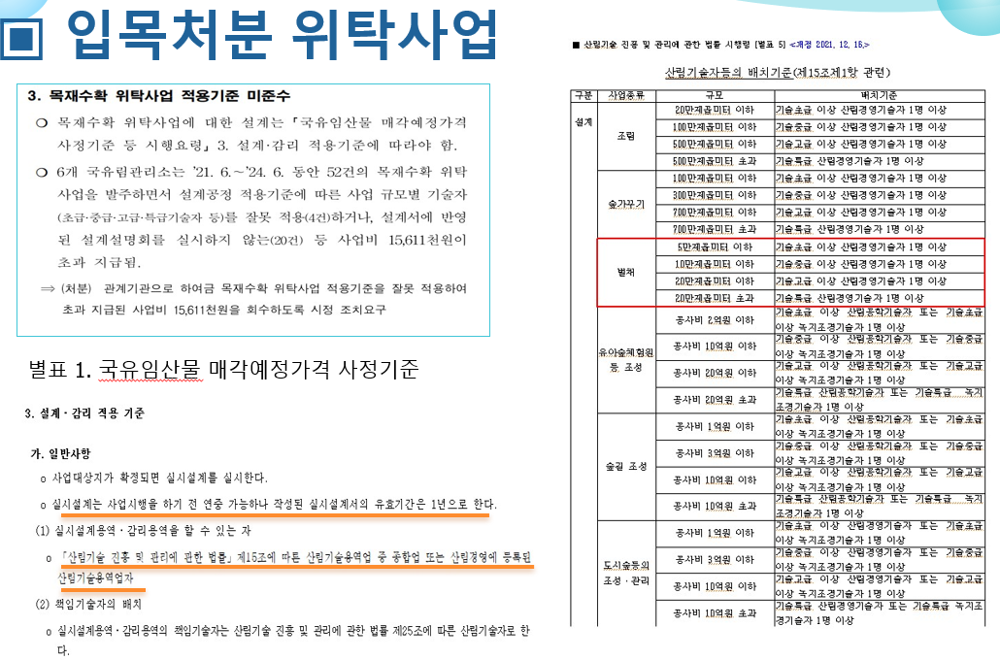
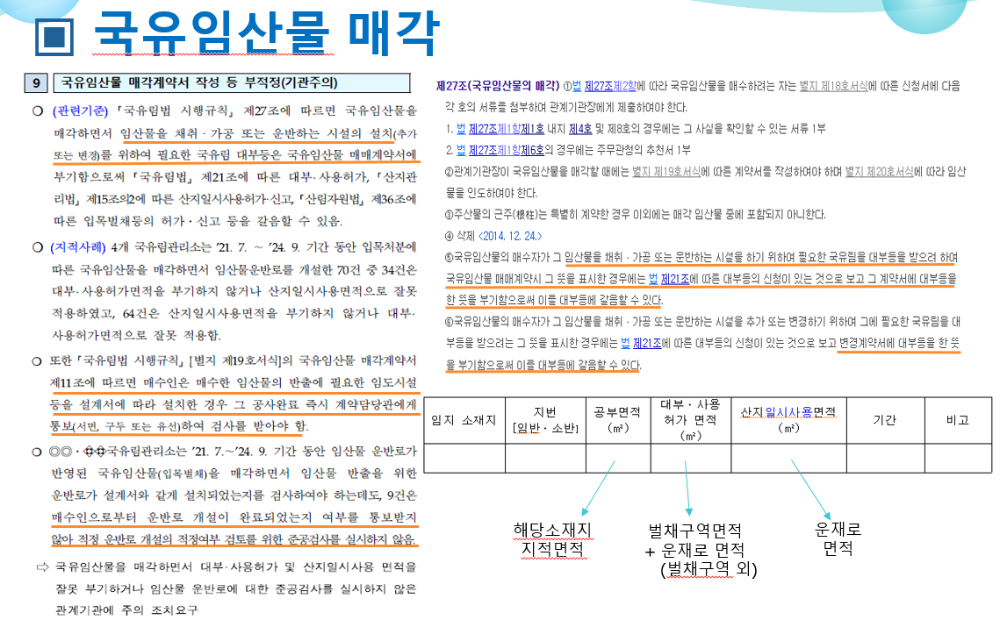
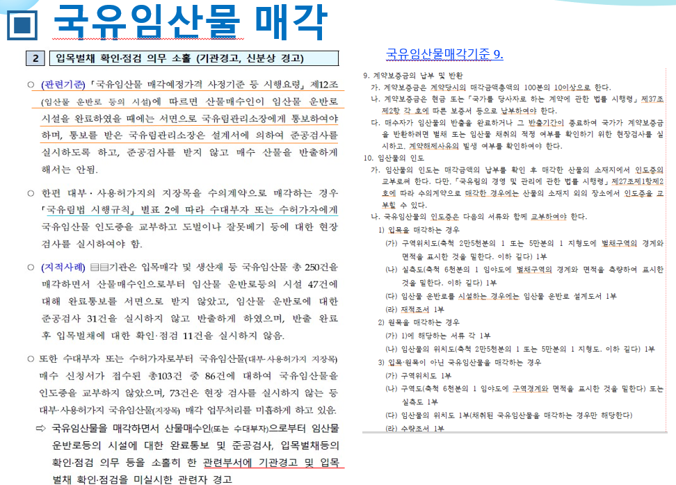
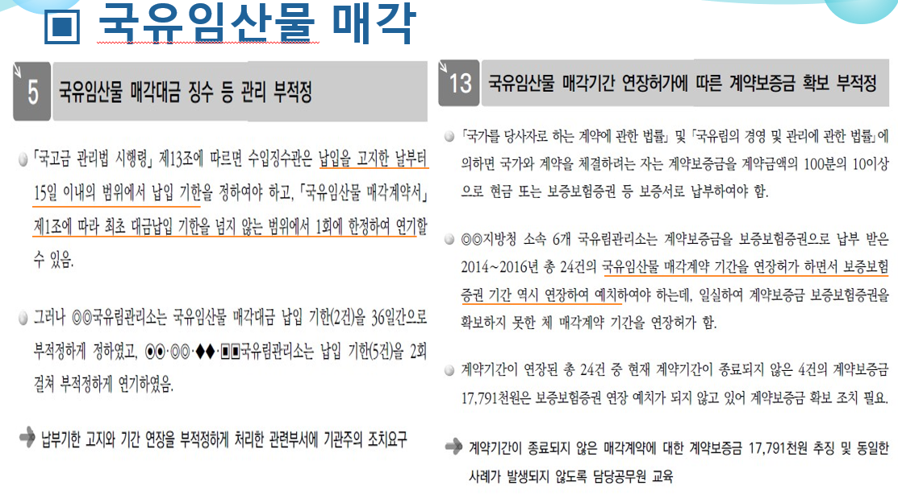
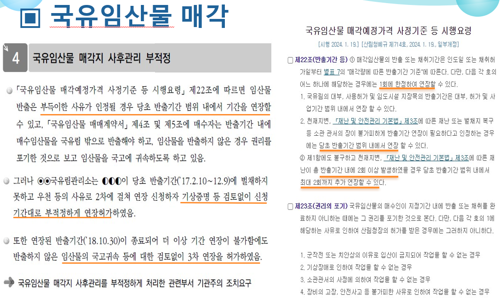
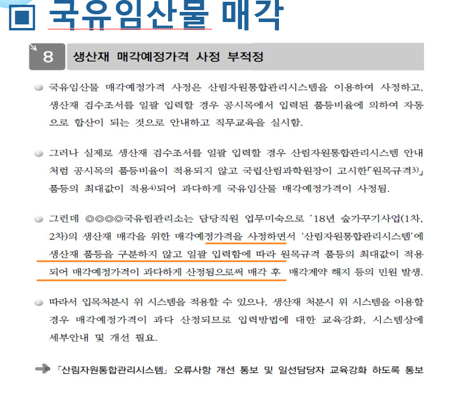

# Ⅶ. 주요 감사 지적과 재발방지

> 원본 HWPX에만 남아 있던 감사사례 이미지를 복원했다. 사례 속 관리소·개인 식별정보는 원본에서 이미 비식별화되어 있다.

## 1. 위탁사업 기술자 배치기준 미준수

- 지적: 사업규모별 책임기술자 등급을 잘못 적용하고 설계서에 반영
- 위험: 과다 지급, 설계 적법성·품질 저하
- 통제: 계약 전 면적구간 판정표 작성 → 자격증·소속 확인 → 착수계 승인 → 성과품 서명 대조

## 2. 매각계약서의 대부·사용허가 및 산지일시사용 부기 누락

- 지적: 운반로에 필요한 국유림 대부·사용허가와 산지일시사용 면적·기간을 계약서에 부기하지 않음
- 위험: 운반로 시설의 법적 근거·복구책임 불명확
- 통제: 벌채구역 전체, 벌채구역 밖 운재로, 산지일시사용 면적을 구분한 부기 점검표 사용

## 3. 임목벌채 확인·점검 의무 소홀

- 지적: 운반로 완료통보·준공검사·임목벌채 현장 확인 누락
- 위험: 무단 변경, 산림훼손, 복구 미흡, 계약보증금 부당 반환
- 통제: 완료통보 접수번호 → 준공검사서 → 벌채 중간점검 → 반출완료검사 순서 강제

## 4. 매각대금·계약보증금 관리 부적정

- 지적: 납부기한 또는 계약기간을 부적정하게 연장하고 보증보험 기간을 함께 연장하지 않음
- 통제: 연장결재 시 대금·계약기간·보증보험 만료일을 한 화면에서 확인하는 3일자 점검

## 5. 반출기간 연장 부적정

- 지적: 기상증명 등 객관자료 없이 반복 연장하거나 기간 종료 후 다시 연장
- 통제: 만료 전 신청, 규정상 사유, 증빙, 미반출량, 귀책사유, 연장한도, 보증보험을 결재문에 의무 기재

## 6. 생산재 품등 입력 오류

- 지적: 일괄입력 과정에서 공시목 품등비율이 아니라 품등 최대값이 적용되어 예정가격 과다 산정
- 통제: 입력 후 원자료·집계표·평정서의 수종별 품등비율 3자 대조, 일괄입력 건 별도 표본검사

## 재발방지 통제표

| 위험 | 예방통제 | 발견통제 | 증빙 |
|---|---|---|---|
| 기술자 등급 오류 | 면적별 기준표·착수계 승인 | 성과품 서명 대조 | 자격증·재직·참여기록 |
| 계약서 부기 누락 | 표준 부기문 사용 | 계약 전 법무·사업 교차검토 | 계약서 §13·면적표 |
| 현장검사 누락 | 단계별 완료 차단 | 월별 미검사 목록 | 통보서·검사서·사진 |
| 보증기간 공백 | 연장결재 3일자 확인 | 만료예정 알림 | 보험증권 |
| 반출기간 남용 | 사유·증빙·한도 양식화 | 종료 후 전수점검 | 기상자료·현장확인 |
| 품등입력 오류 | 원자료 직접대조 | 평정서 역검산 | 야장·집계표·출력물 |
