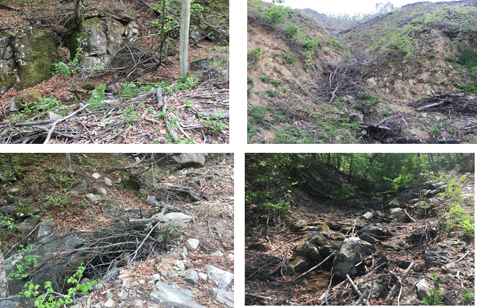
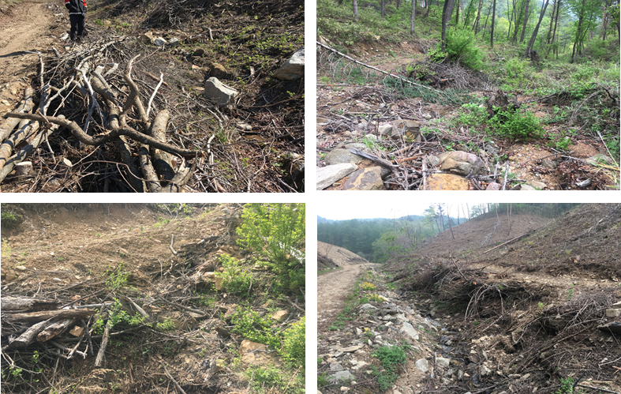
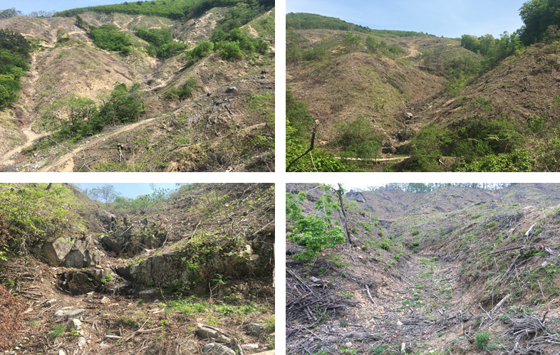
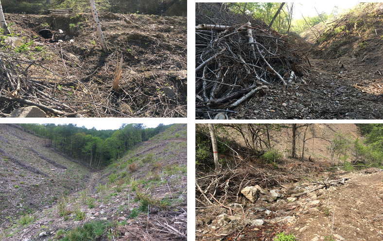
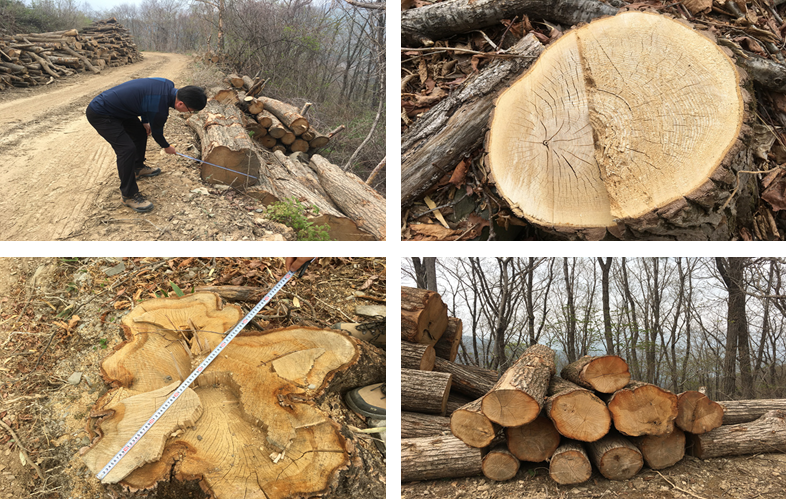
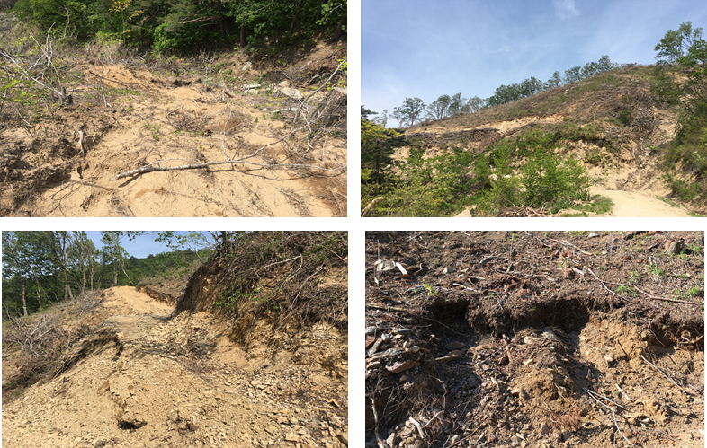
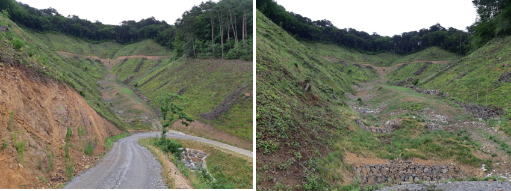

# Ⅷ. 친환경벌채 사례

## 우수 설계의 공통원칙

- 능선부·계곡부·산림습지 등 민감구역을 수림대로 연결
- 군상 위치를 획일적으로 두지 않고 산림영향권과 생태축에 따라 조정
- 기설 작업로를 활용하고 신설 운재로를 최소화
- 운재로가 계곡·수림대를 가로지르는 횟수 최소화
- 경관 노출이 큰 곳은 잔존대 폭과 배열을 조정
- 주민설명회에서 반출로·농작물·소음·교통 문제를 사전 해소
- 부산물은 수집·활용하고 농경지·계류로 유실되지 않도록 관리

원본의 우수사례 사진·도면에는 구체적 지역·공간정보가 포함되어 있어 기관명 외 식별정보를 남기지 않는 원칙에 따라 위키에는 원칙만 재구성했다.

## 현장관리 미흡사례

### 1. 계곡부 부산물 적치

집중호우 시 유목·배수막힘·토사유출을 일으킨다. 계류와 배수로에서 이격하고 유실방지 방향으로 정리한다.

### 2. 계곡부 무분별 벌채

계곡 수림대 단절은 수질·서식처·사면안정 기능을 동시에 약화한다. 벌채금지구역과 수림대 경계를 현장 표지하고 작업자에게 인계한다.

### 3. 천연림보육지 생산재 저가 매각

일괄 펄프재 판정 전에 수종·경급·결함·용도별 품등을 다시 조사한다. 사진은 대경재·특수재 가능성을 현장에서 확인해야 함을 보여준다.

### 4. 무분별한 운재로 개설과 산림훼손

노선 임의변경, 과도한 절성토, 배수 미설치는 재해와 계약 위반을 동시에 초래한다. 변경 전 승인과 변경계약, 준공검사를 분리하지 않는다.

### 5. 사방시설 주변 벌채

사방시설의 집수·배수·토사저지 기능을 훼손하지 않도록 영향권을 별도 표시하고 관리기관과 협의한다. 구체적 위치가 드러나는 원본 도면은 수록하지 않았다.

### 6. 과도한 운재로 변경

계획노선보다 총연장이 크게 늘어나면 단순 현장조정이 아니다. 환경영향·산지일시사용 면적·비용·복구량을 재산정하고 변경계약을 체결한다. 구체적 노선이 드러나는 원본 도면은 수록하지 않았다.

## 현장 판정 질문

1. 이 노선·벌채가 계곡·능선·급경사의 보호기능을 약화하는가?
2. 기설 시설로 대체하거나 신설 길이를 줄일 수 있는가?
3. 부산물이 물길로 이동할 가능성이 있는가?
4. 수림대·군상·산림영향권이 도면뿐 아니라 현장에서도 연결되는가?
5. 변경 내용이 계약·면적·예정가격·복구량에 반영되었는가?
