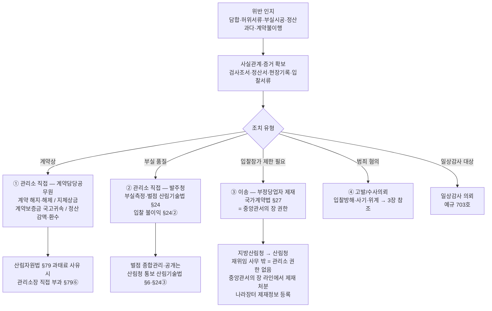
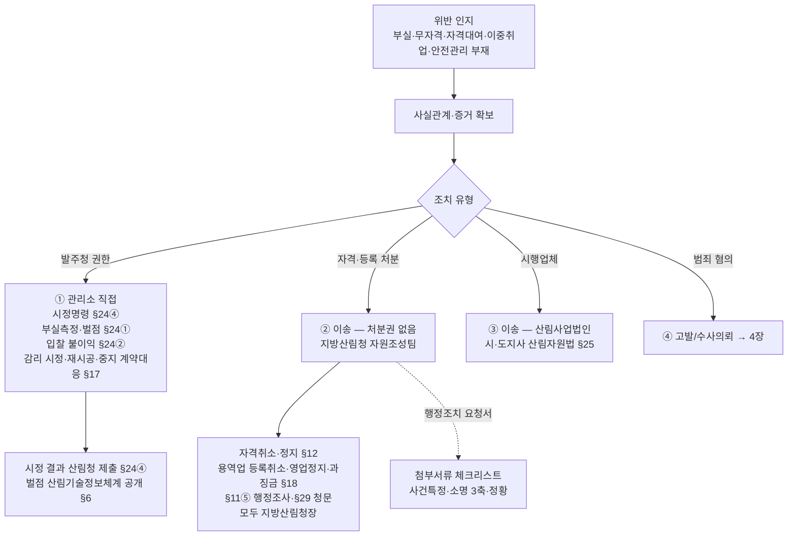
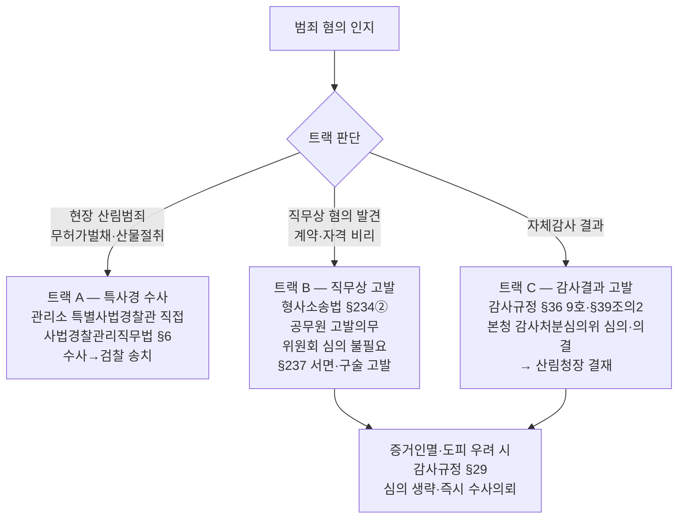

# 국유림관리소 위반사항 처리절차 — 국가계약법·산림기술진흥법 (관리소 관점)

> 문서 세트: [[국유림관리소_발주청_처분청_개념|① 개념자료]] · **② 처리 방법 절차(본 문서)** · [[국유림관리소_발주청_처분청_법령발췌|③ 관계법령 발췌본]]
> 개념 축: **국유림관리소 = 발주청(적발·측정·요청·계약조치)** · **지방산림청 = 처분청(자격·등록 박탈)**. 왜 이렇게 나뉘는지는 [[국유림관리소_발주청_처분청_개념|① 개념자료]] 참조.

> 근거: 산림기술법 §2 8호(발주청 정의)·시행령 §2③(발주청 범위)·§24(부실측정·벌점)·§26(안전관리계획 승인)·§30(위임)·시행령 §20①, 산림자원법 §70(위임·위탁)·§79(과태료)·시행령 §71⑦(국유림관리소장 재위임), 국가계약법 §27(부정당업자 제재), 산림청 감사규정(훈령 1592호) §29·§36·§39조의2, 사법경찰관리직무법 §6, 형사소송법 §234②·§237, 「동부지방산림청 위임전결규정」(훈령 205호)·「산림청 위임전결사항 규정」
>
> 권한 3층위: ① 전결(내부 결재선) ② 재위임 사무(시행령 위임조항) ③ **발주청 권한**(발주 주체이면 직접) — §1-3·§1-4 참조
>
> 관점: **국유림관리소(2차 소속기관)가 발주청으로서** 조림·숲가꾸기·산림토목 사업 시행 중 국가계약법·산림기술진흥법 위반을 인지했을 때의 처리 절차. 지방산림청(1차 소속기관)·시·도지사·본청과의 권한 경계를 명확히 한다.

---

## 0. 한 줄 요약

국유림관리소는 **발주청(계약담당공무원)으로서 할 수 있는 조치**(계약상 조치·부실측정·벌점·시정명령·산림자원법 과태료·현장범죄 특사경 수사)와, **처분청이 아니어서 넘겨야 하는 조치**(자격·등록 처분, 부정당제재, 감사결과 고발)가 명확히 갈린다. **산림기술법상 자격·등록 처분권은 지방산림청장까지만 위임되고 국유림관리소장에게는 재위임되지 않는다.**

---

## 1. 재위임 규정 — 지방산림청(1차) → 국유림관리소(2차)

### 1-1. 산림자원법 라인 — 재위임 있음(제한적)

| 근거 | 재위임 내용 | 관리소 권한 |
|------|------------|:---:|
| **산림자원법 §70③** | 지방산림청장 권한 → 국유림관리소장 위임 근거 | — |
| **시행령 §71⑦ 1호** | 법 §36① 입목벌채·임산물 굴취·채취 **허가** | ✅ |
| **시행령 §71⑦ 2호** | 법 §36⑤ 벌채·굴취·채취(임업시험·연구용 한정) **신고 수리** | ✅ |
| **산림자원법 §79⑥** | 과태료 부과·징수(조문에 "국유림관리소장" 명시) | ✅ |
| 시행령 §71⑥ | 채종림 지정·해제, 영림단 운영, 보조금 반환 → **지방산림청장에 머묾**(관리소 재위임 없음) | ❌ |

> 즉 산림자원법에서 국유림관리소장에게 재위임된 **처분성 권한은 벌채 허가·신고 수리 두 가지 + 과태료**뿐이다.

### 1-2. 산림기술법 라인 — 재위임 **없음** ★

**산림기술법 §30① + 시행령 §20①은 산림청장 권한을 「지방산림청장」까지만 위임한다.** 국유림관리소장으로의 재위임 조문이 존재하지 않는다.

| 처분 | 위임 도달점 | 관리소 |
|------|:---:|:---:|
| 자격취소·자격정지(§12) | 지방산림청장(영 §20①2호) | ❌ |
| 용역업 등록취소·영업정지·과징금(§18) | 지방산림청장(영 §20①3·3의2호) | ❌ |
| 명의대여·이중취업 행정조사(§11⑤) | 지방산림청장(영 §20①1호) | ❌ |
| 지도·감독(§22)·과태료(§33) | 지방산림청장(영 §20①4·5호) | ❌ |

> ⚠️ 이것이 관리소 실무의 핵심 제약이다. 부실·자격 위반을 **적발**하는 것은 발주청인 관리소이지만, **자격·등록 처분**은 반드시 지방산림청으로 이송해야 한다. 상세 처분 체계는 [[산림기술자_자격관리_체계]] 참조.

### 1-3. 두 층위 구별 — 「위임전결」 ≠ 「재위임 사무」 ★

국유림관리소장의 처분 권한 근거를 볼 때 **전혀 다른 두 규정 층위를 혼동하면 안 된다.**

| 층위 | 규정 | 규율 대상 | 국유림관리소장 |
|------|------|----------|----------------|
| **① 전결(내부 결재선)** | 「동부지방산림청 위임전결규정」(훈령 205호), 「산림청 위임전결사항 규정」 | 기관 **내부**에서 어느 직급이 결재(전결)하는가 — 과장·팀장급 전결사항(별표) | 규율 대상 아님. 관리소 자체 결재선 문제 |
| **② 재위임 사무(법정 권한 이관)** | 산림자원법 §70③·시행령 §71⑦, 각 법령 시행령 위임조항, 「행정권한의 위임 및 위탁에 관한 규정」(대통령령) | 법령상 **처분 권한 자체**를 지방산림청장 → 국유림관리소장에게 이관 | **국유림관리소장은 여기서 이관된 사무 범위 내에서만 처분한다** |

> **동부지방산림청 위임전결규정 원문 확인**: 제1조 목적이 "제반업무에 관한 **전결사항과 그 절차**"로, 제4조는 "과장 및 팀장급의 위임 전결사항은 **별표**와 같다"고 규정할 뿐이다(별표 전결사항은 PDF 첨부·본문 미수록). 즉 이 규정은 **지방청 내부 결재권자를 정할 뿐, 국유림관리소로 어떤 법정 사무가 넘어가는지는 규율하지 않는다.** 「산림청 위임전결사항 규정」도 동일하게 목적이 "전결사항과 그 절차"로 순수 내부 결재선 규정이다.
>
> **결론**: 국유림관리소장이 처분할 수 있는 사무의 범위는 위임전결규정이 아니라 **재위임 사무 규정(시행령 위임조항)**이 정한다. 본 페이지 1-1·1-2의 표가 그 재위임 사무의 실제 범위다. 재위임 사무에 없는 처분(자격·등록 처분, 부정당제재)은 국유림관리소장이 결재선을 어떻게 짜든 **애초에 처분 권한 자체가 없다.**

### 1-4. 세 번째 층위 — 「발주청 권한」은 재위임과 별개 ★★

관리소의 권한에는 **재위임 사무(②)와 무관하게 발주 주체이면 당연히 갖는 「발주청 권한」**이라는 별도 근거가 있다. 이것이 관리소가 직접 할 수 있는 조치의 대부분을 설명한다.

**발주청 정의 (산림기술법 §2 8호)**
> "발주청"이란 산림기술용역 또는 산림사업시행을 **발주하는 국가**, 지방자치단체, [출자기관], 그 밖에 대통령령으로 정하는 기관·단체(시행령 §2③: 공기업·준정부기관·지방공사·출연기관 등)**의 장**을 말한다.

- **국유림관리소는 "국가"(산림청 소속기관)** 이고, 자기 예산·계약으로 산림사업을 실제 발주·계약한다 → **관리소가 발주한 사업의 발주청 = 국유림관리소장**.
- 시행령 §2③은 "국가·지자체 외"의 확장 주체(공기업 등)만 열거 — 국가기관인 관리소는 본법 본문에서 이미 발주청이므로 별도 열거 불필요.
- ⚠️ **발주청은 사업별 귀속**: 그 사업을 **지방산림청이 직접 발주**했다면 발주청은 지방산림청장이고 관리소는 그 사업의 발주청이 아니다. 관리소 명의 발주 사업에 한해 관리소장이 발주청 권한을 행사한다.

**세 층위 종합**

| 층위 | 권한 예시 | 근거 | 관리소장 |
|------|----------|------|:---:|
| ① 전결 | (내부 결재선) | 위임전결규정 | 무관 |
| ② 재위임 사무 | 벌채 허가·신고 수리, 과태료(산림자원법) | 시행령 §71⑦·§79⑥ | ✅ 이관 범위 내 |
| **③ 발주청 권한** | 부실측정·벌점(§24①), 입찰 불이익(§24②), 시정명령(§24④), 기술자 교체요청(§25③), 안전관리계획 승인(§26②·시행령 §16), 계약 계속수행 결정(§18⑦⑧) | 산림기술법이 **발주청에 직접 부여** | ✅ **발주 주체이면 재위임과 무관하게 직접** |
| (해당 없음) | 자격취소·정지(§12), 용역업 등록취소·영업정지·과징금(§18①~⑤) | 산림청장→지방청 위임(§30①·영 §20①) | ❌ 지방청 이송 |

> **핵심**: 2·3장 흐름도에서 관리소가 "직접" 하는 조치(벌점·시정명령·안전관리계획 승인·입찰 불이익)는 **③ 발주청 권한**에서 나온다 — 재위임 사무(②)가 아니어도 발주 주체이면 당연히 행사한다. 반면 **자격·등록 처분**은 발주청 권한도 재위임 사무도 아니므로 지방청 소관이다. 발주청은 위반을 **적발·측정·요청**하고, 처분청(지방청)은 **자격·등록을 박탈**하는 역할 분담이다.

---

## 2. 처리 흐름도 ① — 국가계약법 위반

관리소는 조림·숲가꾸기·산림토목 사업의 **발주청이자 계약담당공무원**이다([[../../타부처법령/기획재정부/국가계약법]]).

**관리소 직접 vs 이송**

| 조치 | 관리소 직접 | 이송/보고 |
|------|:---:|------|
| 계약 해지·지체상금·보증금 국고귀속·정산 시정 | ✅ 계약담당공무원 | — |
| 부실측정·벌점 부과(산림기술법 §24①) | ✅ 발주청 의무 | 종합관리는 산림청 |
| 산림자원법 과태료(§79) | ✅ §79⑥ | — |
| **부정당업자 입찰참가자격 제한(§27)** | ❌ 재위임 사무 아님 | **지방산림청→산림청**(중앙관서의 장 라인) |
| 형사 고발·수사의뢰 | 조건부(3장) | — |

---

## 3. 처리 흐름도 ② — 산림기술진흥법 위반

부실 설계·감리·시공, 자격증 대여, 이중취업, 무자격 참여, 안전관리계획 미수립 등.

> 이송 시 첨부서류는 [[산림기술법_행정조치요청_첨부서류]] 체크리스트를 따른다. 시행업체(산림사업법인) 위반은 [[산림사업법인]]·[[산림기술자_자격관리_체계]] §4 통보체계 참조(지방청↔시·도지사 통보 비대칭 유의).

---

## 4. 확장 행정행위 — 수사의뢰·고발 트랙 ★

가장 오해가 많은 영역. **"누가 수사하는가(관할)"와 "누가 고발/의뢰를 결정하는가(트랙)"를 분리**해서 봐야 한다.

### 4-1. 수사 관할 — 산림청 특별사법경찰 vs 일반 경찰·검찰

**국유림관리소 4~9급 직원은 특별사법경찰관리**다(사법경찰관리직무법 §6). 단 직무범위는 **"소속 관서 관할 임야에서 발생하는 산림·임산물·수렵에 관한 범죄"**로 한정된다.

| 위반 유형 | 특사경(관리소) 직접수사 | 일반 경찰·검찰 |
|-----------|:---:|:---:|
| 산물 절취(산림자원법 §73), 무허가 벌채(§74), 입목 손상 — **현장 산림범죄** | ✅ 관리소 특사경 관할 | (병행 가능) |
| 자격증 대여·이중취업(산림기술법 §31) | ❌ 직무범위 밖 | ✅ |
| 국가계약법 관련 입찰방해·사기·위계(형법) | ❌ 직무범위 밖 | ✅ |

> ✅ **관리소 강점**: 조림·숲가꾸기·벌채 현장에서 발생하는 **산림범죄(무허가벌채·산물절취)는 관리소 특사경이 직접 수사·송치**할 수 있다. 반면 계약비리·자격비리는 특사경 밖이므로 고발을 통해 일반 수사기관으로 넘긴다.

### 4-2. 고발·수사의뢰 3트랙 (관리소 관점)

| 트랙 | 결정 주체 | 심의 필요 | 근거 |
|------|----------|:---:|------|
| **A. 특사경 수사** — 현장 산림범죄 | **관리소 특사경** | 불요 | 사법경찰관리직무법 §6 |
| **B. 직무상 고발** — 직무 중 혐의 발견 | **관리소 담당 공무원(고발 의무)** | 불요 | 형사소송법 §234②·§237 |
| **C. 감사결과 고발** — 자체감사 완료 후 | **산림청 본청** 감사처분심의위 | **필요** | 감사규정 §36 9호·§39조의2 |
| (공통) 증거인멸·도피 우려 | 감사담당자 | 단축 | 감사규정 §29 |

> ⚠️ **감사처분심의위원회는 산림청 본청 기구다** — 지방산림청·국유림관리소에는 위임 규정이 없다(감사규정 §39조의2). 관리소가 직무상 인지한 혐의는 위원회를 거치지 않고 **형사소송법 §234② 직무상 고발**로 직접 처리하거나, 자체감사 라인으로 올릴 경우 본청 심의를 거친다.

### 4-3. 감사결과 처리 9종(감사규정 §36) 중 관리소 연계

관리소가 자체감사·일상감사 대상이 되거나 상급 감사에서 지적될 경우: 변상명령·징계·시정·경고·주의·개선·권고·통보·**고발**(9호, 범죄혐의) 중 결정. 처리기한은 §39(시정 2개월, 징계 1개월 내 의결요구 등). 상세 [[../../행정규칙/훈령/산림청_감사규정]].

---

## 5. 전체 요약 — 관리소 직접 vs 이송 한눈에

| 조치 | 국유림관리소 직접 | 이송 대상 | 근거 |
|------|:---:|------|------|
| 입목벌채 허가·신고 수리 | ✅ | — | 산림자원법 시행령 §71⑦ |
| 산림자원법 과태료 부과 | ✅ | — | 산림자원법 §79⑥ |
| 부실측정·벌점 부과 | ✅ | (종합관리 산림청) | 산림기술법 §24① |
| 시정명령 | ✅ | — | 산림기술법 §24④ |
| 계약 해지·지체상금·보증금·정산 | ✅ | — | 국가계약법·계약예규 |
| 현장 산림범죄 수사 | ✅ 특사경 | — | 사법경찰관리직무법 §6 |
| 직무상 고발 | ✅ 공무원 의무 | 일반 수사기관 | 형사소송법 §234② |
| 산림기술자 자격취소·정지 | ❌ | **지방산림청장** | 산림기술법 §12·§30①·영 §20① |
| 용역업 등록취소·영업정지·과징금 | ❌ | **지방산림청장** | 산림기술법 §18 |
| 산림사업법인 영업정지·등록취소 | ❌ | **시·도지사** | 산림자원법 §25 |
| 부정당업자 입찰참가자격 제한 | ❌ 재위임 사무 밖 | 산림청장(중앙관서의 장) | 국가계약법 §27 |
| 감사결과 고발 심의 | ❌ | **본청 감사처분심의위** | 감사규정 §39조의2 |

---

## 6. 자주 묻는 판단

| 상황 | 적용 기준 | 근거 |
|------|-----------|------|
| 숲가꾸기 현장에서 무자격자 시공 확인 | 관리소가 벌점 부과(§24)·시정명령(§24④), 자격처분은 지방청 이송 | 산림기술법 §24·§30① |
| 용역업체가 자격증 대여로 등록요건 가장 | 관리소는 조사·증빙 → 지방청이 §18 등록처분·§12 자격처분 | 산림기술법 §18·§12(영 §20①) |
| 조림사업자가 허가 없이 인접 임지 벌채 | 관리소 특사경 직접 수사 가능(현장 산림범죄) | 사법경찰관리직무법 §6, 산림자원법 §74 |
| 입찰서류 위조 정황 | 특사경 밖 → 직무상 고발(§234②) → 일반 경찰·검찰 | 형사소송법 §234②·§237 |
| 정산 과다청구 적발 | 계약상 감액·환수(직접) + 부정당제재 필요 시 지방청·산림청 요청 | 국가계약법 §27, 계약예규 |
| 증거인멸 우려로 급함 | 감사처분심의 생략, 즉시 수사의뢰 | 감사규정 §29 |
| 시행업체(산림사업법인) 영업정지 필요 | 관리소·지방청 권한 아님 → 시·도지사 이송 | 산림자원법 §25 |

---

## 관련 페이지

- [[산림기술자_자격관리_체계]] — 산림기술법 5트랙 처분 체계·행정절차법 처리순서·처분권자 분리(지방청/시·도지사)
- [[산림기술법_행정조치요청_첨부서류]] — 지방청 이송 시 첨부서류 체크리스트
- [[산림사업법인]] — 시행업체(시·도지사 §25) 처분·통보체계
- [[산림기술자_자격관리_QnA]] — 자격 대여·이중취업 실무 쟁점 15문
- [[../../타부처법령/기획재정부/국가계약법]] — 발주 기본법·부정당제재
- [[../../행정규칙/훈령/산림청_감사규정]] — 감사결과 처리 9종·감사처분심의위·수사의뢰(§29)
- [[../감사대응/일상감사_의뢰]] — 일상감사 의뢰 실무 흐름
- [[../../법령/산림자원법/법률_5_6장_보칙_벌칙]] — §70 위임·§79 과태료·§73~78 벌칙 원문
- [[../../법령/산림기술법/법률_나머지조항]] — §24·§30 위임 원문
- [[../../법령/산림기술법/조문발췌_자격대여_이중취업]] — 수사·고발 관련 타법 조문 취합(사법경찰·형소법·국가기술자격법)
