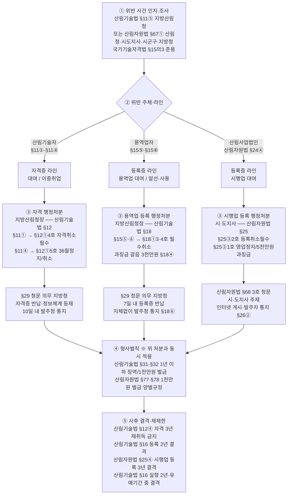
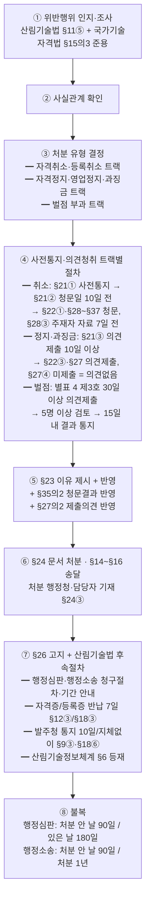

# 산림기술자 자격증 대여·이중취업 행정처분·벌칙 체계

> 근거: 산림기술 진흥 및 관리에 관한 법률(법률 제21405호, 시행 2026-08-28) §11·§12·§15·§16·§18·§24·§29·**§30** + 시행령 §20 + 시행규칙 §9·§14·§18 + 별표 2·3·4 + 「행정절차법」 §21·§22·§23·§24·§26·§27·§28~§37
> 원문 wiki: [[법령/산림기술법/법률_자격관리_벌칙]] · [[법령/산림기술법/별표2_자격취소_자격정지_세부기준]] · [[법령/산림기술법/별표3_등록취소_영업정지_등록말소_세부기준]] · [[법령/산림기술법/별표4_벌점관리기준]] · [[타부처법령/법제처/행정절차법]]

산림기술자 **자격증 대여(명의 대여)**, **이중취업(두 개 이상 업체 중복 취업)**, 산림기술용역업 **등록증 대여**가 발생했을 때 한 사건에서 다섯 트랙 — ① 자격 행정처분(§12), ② 등록 행정처분(§18), ③ 형사벌칙(§31·§32), ④ 과태료(§33), ⑤ 부실측정 벌점(§24·별표 4) — 이 **동시에·중첩적으로** 적용되고, **「행정절차법」**에 따른 사전통지·청문/의견제출·이유 제시·고지의 순서를 거친다. 본 페이지는 그 체계를 한 장으로 정리한다.

**섹션 구성**
1. 금지행위 — §11·§15⑤·⑥ 매트릭스
2. 위반 → 처분·벌칙 체계도(mermaid)
3. 트랙별 정리 (① 자격처분 / ② 등록처분 / ③ 형사벌칙 / ④ 과태료 / ⑤ 벌점)
4. **행정처리 순서 (행정절차법 근거)** — 처분 단계별 흐름도 + 단계별 세부 조문
5. 한 사건에서 동시 적용 사례
6. **형사 수사 주체와 고발 절차** — §31 벌금의 수사기관·특별사법경찰 직무범위·고발 절차
7. 발주청 실무 체크포인트
8. 관련 wiki
9. 관련 외부 법령·참조

---

## 1. 금지행위 — §11·§15⑤·⑥

| 구분 | 행위 주체 | 금지행위 | 근거 |
|------|----------|----------|------|
| **자격증 대여** | 산림기술자 | 자기 성명을 다른 사람에게 사용하게 하거나 산림기술자 자격증을 빌려줌 | §11① |
| 자격증 차용 | 누구든지 | 다른 사람의 명의·자격증을 빌려 산림기술용역업·산림사업시행업 수행 | §11② |
| 알선 | 누구든지 | §11①·②의 행위를 알선 | §11③ |
| **이중취업** | 산림기술자 | 산림기술자 자격이 필요한 **두 개 이상 업체에 중복 취업** | §11④ |
| **등록증 대여** | 산림기술용역업자 | 타인에게 상호·성명 사용 또는 등록증 대여 | §15⑤ |
| 등록증 차용 | 누구든지 | §15⑤ 행위 알선 또는 타인 등록증 사용 | §15⑥ |

> 산림기술자 **자격증** 라인(§11)과 산림기술용역업 **등록증** 라인(§15⑤·⑥)은 별도이며, 하나의 사건이 두 라인 모두 위반에 해당할 수 있다.

---

## 2. 위반행위 → 처분·벌칙 체계도



> **흐름도 분기 해설** — T1(자격증)·T2(용역업 등록증)·T3(시행업 등록증)는 **별개 행위**이며 별개 처분권자에서 별도로 진행된다. 한 사건이 두 라인 이상에 걸치면 처분도 분리된다. T1+T2 조합은 한 기관(지방산림청장) 처리, T1+T3 조합은 두 기관(지방청+시·도지사) 분리 처리.

---

## 3. 트랙별 정리

### 트랙 ① — 산림기술자 행정처분 (§12 + 시행규칙 별표 2)

> 세부 처분 일수는 [[법령/산림기술법/별표2_자격취소_자격정지_세부기준]] 참조 (시행규칙 §9① + 별표 2, 개정 2022.4.15).

| 위반행위 | 근거 | 1차 위반 | 2차 위반 | 3차 이상 |
|---------|------|---------|---------|---------|
| **§11① 명의대여·자격증 대여** | §12①4호 | **자격취소** | — | — |
| **§11④ 이중취업** | §12①5호 | **자격정지 36개월** | **자격취소** | — |
| 거짓·부정 자격 취득 | §12①1호 | 자격취소 | — | — |
| 거짓 서류 작성·**고의** 부실수행 | §12①2호 | 자격취소 | — | — |
| **과실**로 업무 부실수행 | §12①2호 | 자격정지 6개월 | 자격정지 12개월 | 자격취소 |
| 자격정지기간 중 업무수행 | §12①3호 | 자격취소 | — | — |
| 발주청 정당 시정명령 미이행 | §12①6호 | 자격정지 6개월 | 자격정지 12개월 | 자격취소 |
| §7② 교육·훈련 미이수 | §12①7호 | 자격정지 3개월 | 자격정지 6개월 | 자격정지 12개월 |

**일반기준 (별표 2 제1호)**
- **가중**: 최근 **3년간** 같은 위반행위로 처분받은 경우만 차수 가중. 소급 3년 전 처분은 차수 산정에서 제외
- **복수 위반 병합**: 처분기준이 다른 경우 무거운 처분에 따름. 둘 이상이 같은 자격정지면 무거운 처분기준의 **1/2까지 가중 가능**(합산 **3년 초과 불가**)
- **감경(자격정지만 해당)**: 다음 사유 시 **1/2 범위 감경 가능** — ⓐ 고의·중대 과실 아닌 사소한 부주의·오류 ⓑ 위반행위 즉시 정정·시정 ⓒ 내용·정도·동기·결과 고려

**절차·사후효과**
- **청문**: §29 — 자격취소 시 필수 (자격정지는 행정절차법 의견제출)
- **자격증 반납**: §12③ 지체 없이 산림청장에게 반납
- **재취득 금지**: §12④ — 자격취소일부터 **3년 이내** 동일 자격 재취득 불가
- **소속 업체 통지**: 시행규칙 §9③ — 처분 통보받은 산림기술용역업자·산림사업시행업자는 **10일 이내 발주청에 통지**

### 트랙 ② — 업체 행정처분 (용역업 §18 / 시행업 산림자원법 §25)

> ⚠️ **업체 유형 분기 — 처분 근거법·처분권자 다름**: 산림기술법 §18은 **산림기술용역업(설계·감리업, 지방산림청장 위임사무)**에만 적용된다. 산림자원법 §24 등록 **산림사업법인(시행업)**에 대한 처분은 산림자원법 §25에 따라 **시·도지사**가 한다. 자격대여·이중취업이 시행업체에서 발생했을 때, 기술자 처분(지방산림청장)과 업체 처분(시·도지사)이 **두 기관으로 분리**된다.

| 업체 유형 | 근거 등록법 | 등록 처분 근거 | 처분권자 |
|----------|------------|--------------|---------|
| 산림기술용역업 (설계·감리업) | 산림기술법 §15 | **산림기술법 §18** + 시행규칙 별표 3 | **지방산림청장** (시행령 §20① 3호) |
| 산림사업법인 (시행업) | 산림자원법 §24 | **산림자원법 §25** | **시·도지사** (위임 규정 없음) |

#### ② ㈎ 산림기술용역업자 처분 (산림기술법 §18 + 시행규칙 별표 3)

> 세부 처분 일수는 [[법령/산림기술법/별표3_등록취소_영업정지_등록말소_세부기준]] 참조 (시행규칙 §14① + 별표 3, 개정 2023.1.6).

| 위반행위 | 근거 | 1차 위반 | 2차 위반 | 3차 이상 |
|---------|------|---------|---------|---------|
| 거짓·부정 등록 | §18①1호 | **등록취소** | — | — |
| 등록요건 미달 | §18①2호 | 영업정지 **3개월** | 영업정지 **6개월** | **등록취소** |
| **§15⑤ 상호·성명 사용·등록증 대여** | §18①3호 | **등록취소** | — | — |
| **§15⑥ 알선·타인 등록증 사용** | §18①4호 | **등록취소** | — | — |
| 영업정지기간 중 영업 | §18①5호 | **등록취소** | — | — |
| 등록 취소된 경우 | §18② | **등록말소** | — | — |
| 폐업 후 §15④ 신고 누락 | §18② | **등록말소** | — | — |
| 휴업 후 §15④ 신고 누락 | §18② | **경고** | **등록말소** | — |

**일반기준 (별표 3 제1호)**
- **가중**: 최근 **3년간** 같은 위반행위로 처분받은 경우만 차수 가중. 소급 3년 전 처분은 차수 산정에서 제외
- **복수 위반**: 처분기준이 다른 경우 무거운 처분에 따름 (자격정지처럼 합산 가중 규정 없음)
- **일반 감경 (라목)**: 다음 사유 시 ⓐ 영업정지 → **1/2 범위 감경** ⓑ 등록취소 → **6개월 영업정지로 갈음 가능** (단 **§18①제1·3·4·5호 등록취소는 감경 불가**)
  - 사유: 고의·중대 과실 아닌 사소한 부주의·오류 / 위반 즉시 정정·시정 / 내용·정도·동기·결과 고려
- **소상공인 추가 감경 (마목, 라목과 중복 적용 불가)**: 고의·중과실 없는 「소상공인기본법」§2 소상공인 → ⓐ 영업정지 **70/100 범위 감경** ⓑ 등록취소(2호만) → 6개월 영업정지로 갈음
- **영업정지 갈음 과징금**: §18④ — §18①제2호(등록요건 미달) 영업정지를 **3천만원 이하 과징금**으로 갈음 가능

**절차·사후효과**
- **청문**: §29 — 등록취소 시 필수
- **등록증 반납**: §18③ 통지일부터 **7일 이내**
- **발주청 통지**: §18⑥ — 처분 받은 산림기술용역업자가 지체 없이 통지
- **계약 계속수행**: §18⑦·⑧ — 처분 전 체결 계약 업무는 원칙 계속수행 가능. 단 ⓐ 발주청이 30일 이내 계약 해지, ⓑ 30일 이내 발주청 동의 미획득, ⓒ 필수취소 사유(§18①1·3·4·5호) → 즉시 중단
- **결격사유**: §16②호 — 등록취소일부터 **2년 미경과자 등록 불가**
- **지위승계 효과**: §20① — 양수인등에 처분 효과 **1년간 승계** (개정 2026.2.27)

#### ② ㈏ 산림사업법인(시행업) 처분 (산림자원법 §25)

> 처분권자: **시·도지사** (산림자원법 §70 위임 규정에 지방산림청장으로의 위임 없음). 세부 행정처분 기준은 산림자원법 시행규칙(농림축산식품부령) 별표. [[산림작업/자원조성/산림사업법인]] 참조.

| 위반행위 | 근거 | 처분 |
|---------|------|------|
| **산림기술자 자격증 대여로 인한 인력 등록요건 미달** | §25②1호 | **6개월 이내 영업정지 또는 5천만원 이하 과징금** |
| 부실시공 우려·공정예정표 미준수·자료제출 거부 | §25①1·2·3호 → §25②2호 | 시정명령 → 불이행 시 영업정지 |
| 거짓·부정 등록 | §25③1호 | **등록취소(필수)** |
| **산림사업법인 등록증 대여** (※ 산림기술자 자격증 대여와 별개 행위) | §25③2호 | **등록취소(필수)** |
| 영업정지 기간 중 사업 또는 3회 이상 영업정지 | §25③3호 | **등록취소(필수)** |
| 폐업 (단 처분절차 진행 중이면 절차 종결 후) | §25③4호 | **등록취소(필수)** |
| 결격기간 | §25④ | 등록취소 후 **3년 미경과** 자 재등록 불가 (③1~3호 사유에 한정) |

**핵심 분기 — 산림기술자 자격증 대여 vs. 산림사업법인 등록증 대여**

산림기술자 자격증 대여(산림기술법 §11①) 사건만으로는 산림자원법 §25③ 등록취소(필수) 사유에 **직접 매핑되지 않는다.** 시·도지사가 시행업체에 적용하는 일반 경로:

1. **자격증을 빌려 등록요건(인력기준)을 가장한 경우** → §25②1호 등록요건 미달 → **6개월 영업정지 또는 5천만원 과징금**
2. **현장 부실시공이 함께 확인된 경우** → §25①2호 시정명령 → 불이행 시 §25②2호 영업정지
3. **산림사업법인이 자기 등록증까지 빌려준 사실이 추가 확인된 경우** → §25③2호 **등록취소(필수)**
4. **형사벌칙(별도 트랙)** — 산림사업법인 등록증 대여는 **산림자원법 §77 4호 → 1천만원 이하 벌금**(산림기술법 §31과 별개 조문). 산림기술자 자격증 대여 자체는 산림기술법 §31①1가목으로 처리.

> ⚠️ "산림기술자 자격증 대여 → 즉시 산림사업법인 등록취소"라는 도식은 **부정확**. 산림기술법 §18 별표 3 다·라목(등록증 대여 필수취소)은 **용역업체 적용**이지 시행업체 적용이 아니다.

**절차·사후효과 (산림자원법 §26 + §68)**
- **청문**: 산림자원법 §68 3호 — 등록취소 시 **시·도지사 청문 의무**
- **계약 계속수행**: §26① — 처분 전 체결한 도급계약은 계속 시행 가능. **단 §26③ 발주자는 통지·인지일부터 30일 이내 계약 해지 가능**
- **공시·발주자 통지**: §26② — 처분 시 인터넷 홈페이지 게시 + **발주자에게 지체 없이 통지**
- **등록취소 후 의제**: §26④ — 계속 시행 중인 사업의 경우 완성까지 산림사업법인으로 봄

### 트랙 ③ — 형사벌칙 (§31·§32)

| 위반조항 | 벌칙 |
|----------|------|
| §11①가목 자격증 대여 | 1년 이하 징역 / 1천만원 이하 벌금 |
| §11①나목 자격증 차용 영업 | 1년 이하 징역 / 1천만원 이하 벌금 |
| §11①다목 알선 | 1년 이하 징역 / 1천만원 이하 벌금 |
| §11①라목 **이중취업** | 1년 이하 징역 / 1천만원 이하 벌금 |
| §15① 무등록 영업 | 1년 이하 징역 / 1천만원 이하 벌금 |
| §15⑤ 등록증 대여 | 1년 이하 징역 / 1천만원 이하 벌금 |
| §15⑥ 등록증 대여 알선·사용 | 1년 이하 징역 / 1천만원 이하 벌금 |
| §17② 설계·감리 위반 | 500만원 이하 벌금 |
| **산림자원법 §24④ 산림사업법인 등록증 대여** (※ 산림기술법 §15⑤와 별개 조문) | 산림자원법 §77 4호 — **1천만원 이하 벌금** |
| **산림자원법 §23의2④ 국유림영림단 등록증 대여** | 산림자원법 §77 3호 — **1천만원 이하 벌금** |

- **양벌규정 §32**: 법인 대표자·대리인·사용인·종업원의 §31 위반 시 법인·개인에게도 **해당 조문 벌금형** 과함 (상당한 주의·감독 게을리하지 않은 경우 제외)
- **산림자원법 양벌규정 §78**: §77 위반 시 법인에도 벌금형 과함 (상당한 주의·감독 게을리하지 않은 경우 제외)
- **결격사유 §16③·④**: 본 법 또는 산림자원법 위반으로 **징역형 실형** 종료 후 2년 미경과자 / **징역형 집행유예** 기간 중인 자는 산림기술용역업 등록 불가

### 트랙 ④ — 과태료 (§33)

**원칙 — 벌금(§31)과 과태료(§33)는 분리**: 산림기술법 §33①(과태료) 목록에는 §11(자격증 대여·이중취업·알선)·§15①(무등록 영업)·§15⑤·⑥(등록증 대여·알선·사용)·§17②(부실 설계·감리) **어느 항목도 등장하지 않는다**. 즉 §31 형사벌칙 대상행위에는 **과태료를 중복 부과하지 않는 입법 구조**다.

| 위반행위 | 벌금(§31) | 과태료(§33) |
|---------|----------|-----------|
| §11① 자격증 대여 | **1년 이하 징역/1천만원 이하** | — |
| §11④ 이중취업 | **1년 이하 징역/1천만원 이하** | — |
| §11③ 알선 | **1년 이하 징역/1천만원 이하** | — |
| §15① 무등록 영업 | **1년 이하 징역/1천만원 이하** | — |
| §15⑤·⑥ 등록증 대여·알선·사용 | **1년 이하 징역/1천만원 이하** | — |
| §17② 설계·감리 위반 | 500만원 이하 벌금 | — |

**예외 — 부수 의무 위반 시 별도 과태료**: 자격증 대여·이중취업을 가리거나 함께 발생한 **다른 의무 위반**은 §33 과태료가 별도 부과될 수 있다.

| 호 | 부수 의무 위반 | 과태료 | 자격증 대여·이중취업과의 연결 |
|----|--------------|--------|-------------------------|
| §33①3호 | §10④ **경력등 거짓신고** | 100만원 이하 | 대여를 가리려 거짓 경력 신고 |
| §33①4호 | §15④ 등록사항 변경·휴폐업 기간 내 미신고 | 100만원 이하 | 기술자 변경 미신고 |
| §33①5호 | §17③·④ 시정·재시공·중지 요구 불이행 | 100만원 이하 | 감리자 시정 요구 무시 |
| §33①6호 | §20③ 처분 사실 양수인 미통지 | 100만원 이하 | 처분 받은 자가 양수인에 미통지 |
| §33①7호 | §22② 산림청장 검사 거부·방해·기피 | 100만원 이하 | 조사 방해 |
| §33①8호 | §23③ 실적 거짓신고 | 100만원 이하 | 실적 거짓신고 |
| §33①9호 | §24① 부실측정 거부·방해·기피 | 100만원 이하 | 벌점 부과 조사 거부 |
| §33①10호 | §25② **산림기술자등 현장 이탈** | 100만원 이하 | 자격증만 빌려주고 실제 현장 미배치 |
| §33①11호 | §26②·③ 안전관리계획 미수립·안전점검 미실시 | 100만원 이하 | 안전관리 부재 |

> **요약**: 본 위반(§11·§15⑤·⑥)에는 **벌금만**(과태료 ×). 동일 사건의 **부수 의무 위반은 과태료 별도 부과 가능** — 벌금과 과태료가 같은 사건에 함께 부과되는 것은 *서로 다른 행위*에 대한 것이지 동일 행위에 대한 이중 부과가 아니다.

### 트랙 ⑤ — 벌점(부실측정) (§24 + 시행규칙 §18·§19 + 별표 4)

> 자격증 대여·이중취업 자체는 별표 4 부실내용에 직접 매칭되지 않으나, **대여·이중취업 상태에서 발생한 무자격 참여·현장 이탈·부실 시공·안전사고**는 별표 4 항목으로 벌점 부과 → 입찰감점 → 신규 수주 차질로 이어진다. 자세한 내용은 [[법령/산림기술법/별표4_벌점관리기준]] · [[산림작업/자원조성/산림기술자_벌점관리]].

**대여·이중취업과 연결되는 대표 벌점 항목 (별표 4)**

| 부실항목 | 위반내용 | 벌점 |
|---------|---------|------|
| **1.7-1)** | 참여 예정 산림기술자 불참 또는 **무자격자 참여** (설계) | **2점** |
| **2.1-4)** | 산림기술자등의 허락 없이 현장 이탈 (시행) | 1점 |
| **2.4-3)** | 산림기술자등이 발주청·감리원 허락 없이 무단 현장 이탈 (시행) | 1점 |
| **2.5-1)** | 발주자 승인 없이 산림기술자등 교체 | 2점 |
| **3.6-1)** | 산림기술자등의 **자격 미달** (감리) | 2점 |
| **3.7-1)** | 참여 예정 산림기술자 불참 또는 **무자격자 참여** (감리) | **3점** |
| **2.13-1) / 3.12-1)** | 산림사업 현장 안전사고로 **사망자 발생** (1명당) | **5점 / 3점** |

**적용 효과 — 입찰참가자격 사전심사 감점 (별표 4 제5호)**

| 누계 평균벌점 | 입찰 감점 |
|---|---|
| 1점 이상 ~ 2점 미만 | 0.2점 |
| 2점 이상 ~ 5점 미만 | 0.5점 |
| 5점 이상 ~ 10점 미만 | 1점 |
| 10점 이상 ~ 15점 미만 | 2점 |
| 15점 이상 ~ 20점 미만 | 3점 |
| 20점 이상 | **5점** |

- **누계 평균벌점 산정**: 최근 **2년간 받은 벌점 합계 ÷ 2** (반기별 합산, 매 반기 말일부터 2개월 경과 후 산정)
- **소멸**: 벌점 **7점 이하**이고 마지막 부과일부터 **1년간 추가 부과 없는 경우** 전체 소멸 (별표 4 제4호 가목)
- **감경**: 전문교육 **35시간 이수**시 **7점 감경** (제4호 나목)
- **승계**: 산림기술용역업 ↔ 산림사업시행업 분야 변경 시에도 벌점 승계 (제5호 다목)
- **공개**: 매 반기 말일 2개월 경과 후 **산림기술정보체계 홈페이지에 공개** — 업체명·등록번호·업무영역 / 산림기술자 성명·기술 종류·등급·자격증 번호 (제6호)
- **공동도급 부과**: 공동이행방식은 **출자비율** 분담 / 분담이행방식은 분담 사업자에 부과 (제3호 라목)

**위반행위 → 벌점 → 행정처분 연쇄 가능성**
- 별표 4 부실은 직접 자격취소·등록취소 사유는 아니나, 동일 사실이 **§12①2호(고의·과실 부실수행, 자격취소~정지) 또는 §18①2호(등록요건 미달, 영업정지~취소)에 함께 해당**할 수 있음
- 벌점 누적은 입찰감점·공개로 **계약 수주 손실**을 일으키고, 부실 정도에 따라 발주청은 **§24④ 시정명령** → 미이행 시 **§12①6호 자격처분** 가능

---

## 4. 행정처리 순서 (행정절차법 근거)

산림기술법 §29(청문)은 청문 의무 사유만 정하고, 절차 실체는 **「행정절차법」**(법제처 소관)이 일반법으로 적용된다. 자격취소·자격정지·등록취소·영업정지·과징금·벌점 부과 처분의 전 과정은 다음 순서를 따른다.

### 처분권자 — 사안별 분리 (지방산림청장 / 시·도지사)

자격대여·이중취업 한 사건에서 **두 기관이 별도로 처분**한다. 사안별 처분권자:

| 처분 사안 | 처분권자 | 근거 |
|----------|---------|------|
| **§11⑤ 명의대여·이중취업 행정조사** | 지방산림청장 | 산림기술법 §11⑤ + §30① + 시행령 §20①1호 |
| **§12① 산림기술자 자격취소·자격정지** | **지방산림청장** | 산림기술법 §30① + 시행령 §20①2호 |
| **§29 자격취소·등록취소 청문** | 지방산림청장 (처분권 따라감) | 산림기술법 §29 + 행정절차법 §28 |
| **§18①·② 산림기술용역업 등록취소·영업정지·등록말소** | **지방산림청장** | 산림기술법 §30① + 시행령 §20①3호 |
| **§18④·⑤ 산림기술용역업 과징금** | 지방산림청장 | 시행령 §20①3의2호 |
| **§22① 산림기술용역업자 지도·감독** | 지방산림청장 | 시행령 §20①4호 |
| **§33 과태료** (산림기술법) | 지방산림청장 | 시행령 §20①5호 |
| **산림자원법 §25 산림사업법인 영업정지·과징금·등록취소** | **시·도지사** | 산림자원법 §24·§25 (지방청 위임 규정 없음) |
| **산림자원법 §68 산림사업법인 등록취소 청문** | **시·도지사** | 산림자원법 §68 3호 |
| **산림자원법 §67① 행정조사 (시행업체)** | 산림청장·시·도지사·시군구청장·**지방산림청장** | 산림자원법 §67① — **양 기관 모두 권한** |
| **산림자원법 §79 과태료** | 산림청장·시·도지사·시군구청장·지방산림청장·국유림관리소장 | 산림자원법 §79⑥ |

> **권한 구조 요약**:
> - **산림기술법 라인** (자격증·용역업 등록) — 모두 **지방산림청장**으로 위임
> - **산림자원법 라인** (시행업체 등록) — **시·도지사** 유지 (지방청 위임 없음), 행정조사는 지방산림청장도 가능
> - 자격대여 한 사건이 두 라인 모두에 걸치면, 처분도 두 기관에서 별도로 진행된다.

> **청문 실시 주체**: 산림기술법 §29는 "산림청장은 … 청문을 하여야 한다"고 규정하나, §30①·시행령 §20①에 의해 처분권이 지방산림청장에게 위임된 이상 청문 실시 의무도 처분권자에게 따라간다. 산림자원법 §68 청문은 산림사업법인 등록취소의 경우 **시·도지사**가 주재한다.

### 양 기관 간 통보 체계 — 시행규칙 §9②·§14② vs. 산림자원법 §26 비교

| 방향 | 근거 | 통보 내용 | 비고 |
|------|------|----------|------|
| **지방산림청장 → 시·도지사** | 산림기술법 시행규칙 §9② | 자격처분(자격취소·정지) 시 시·도지사 통보 + 산림기술정보체계 등재·공고 | ✅ **명시 규정 있음** — 시·도지사는 이 통보를 받아 §25 시행업체 처분 검토 가능 |
| **지방산림청장 → 시·도지사** | 시행규칙 §14② | 산림기술용역업 등록처분 시 처분일부터 **10일 이내** 시·도지사 통보 | ✅ 명시 규정 있음 |
| 시·도지사 → 지방산림청 (신규등록) | 산림사업법인 관리지침 §7 | 등록 수리 후 산림청·타 시·도·관할 기초자치단체 통보 | ⚠️ 지방산림청은 통보 대상이 아님 |
| **시·도지사 → 지방산림청** (행정처분) | 산림자원법 §26 / 관리지침 | **명시 규정 없음** | ❌ **체계 공백** — §26②는 "인터넷 게시 + 발주자 통지"만 의무화. 시·도지사가 시행업체 영업정지·등록취소 시 지방청에 통보할 의무 없음 |

> ⚠️ **체계 공백의 실무 효과 — 범위는 좁지만 실재** (2026-06-28 재검토):
>
> §25 처분 사유 7가지 중 **기술자 자격대여와 연동되는 것은 §25²1호(등록요건 미달, 인력기준 가장) 한 가지뿐**이다. 나머지(부실시공·자료제출 거부·산림사업법인 등록증 대여·3회 정지·폐업 등)는 기술자 처분과 무관하므로 통보 자체가 불필요하다.
>
> 그러나 그 좁은 영역에서는 누락 위험이 오히려 높다 — 산림사업법인 관리지침 §4는 시·도지사가 등록 적격여부 확인 시 **고용보험·산림기술경력증명서 상호 대조**를 의무화하므로, **자격증 대여로 인한 인력기준 가장은 시·도지사가 먼저 인지할 구조**다 (정기 점검·갱신등록·변경신고 처리 시점). 시·도지사가 먼저 인지 → 명문 통보 규정 없음 → 지방청 §12 자격처분 누락 가능.
>
> | 인지 주체 | 통보 흐름 | 누락 위험 |
> |---|---|---|
> | 지방청이 먼저 (§11⑤ 행정조사) | 시행규칙 §9² → 시·도지사 통보 ✅ | 없음 |
> | **시·도지사가 먼저** (관리지침 §4 인력 대조) | 명문 규정 없음 | **실재** |
> | 양 기관 동시 인지 | 각자 처리 | 없음 |
>
> **보완 방향** (좁은 영역 한정):
> 1. 산림사업법인 관리지침 §7 개정으로 **"산림기술자 자격증 대여·이중취업 사실을 인지한 경우 지방산림청에 통보" 명문화** — 가장 직접적·범위 적정
> 2. 산림기술정보체계(산림기술법 §6) 등재 의무를 시행업 §25²1호 처분에도 확장
> 3. 발주청 실무자 단위에서 시·도지사 처분 인지 시 지방청 협조 통보 검토

> ⚠️ **산림자원법 등록 시행업체(산림사업법인)는 예외**: 위 처분권자 표는 산림기술법 §15 등록 **산림기술용역업(설계·감리)**을 전제로 한다. 산림자원법 §24 등록 **산림사업법인(조림·숲가꾸기·벌채 시행업체)**의 경우 업체 등록처분(영업정지·등록취소)은 **시·도지사** 소관 (산림자원법 §25). 기술자 자격처분(§12 자격취소·자격정지)은 여전히 **지방산림청장** 소관이므로 한 사건에서 두 기관이 병렬 처분한다.
>
> | 처분 대상 | 처분 주체 | 근거 |
> |---------|---------|------|
> | 기술자 자격취소·정지 | **지방산림청장** | 산림기술법 §12 + §30①·시행령 §20① |
> | 산림기술용역업 등록취소·영업정지 | **지방산림청장** | 산림기술법 §18 + §30①·시행령 §20① |
> | 산림사업법인 등록취소·영업정지 | **시·도지사** | 산림자원법 §25 |

> **청문 실시 주체**: 산림기술법 §29는 "산림청장은 … 청문을 하여야 한다"고 규정하나, §30①·시행령 §20①에 의해 처분권이 지방산림청장에게 위임된 이상 청문 실시 의무도 처분권자(지방산림청장)에게 따라간다. 행정절차법 §28이 청문 주재자를 "행정청 소속 직원 중 선정"하도록 하므로, 청문도 지방산림청 소속 직원이 주재한다.

> **감사처분심의위원회(산림청 감사규정 §39조의2)**: 산림청장이 설치·운영하는 본청 차원의 기구로 지방산림청에 위임 규정 없음 (감사규정 검토 결과, 2026-06-26). 지방산림청이 §31 위반을 적발·고발해야 할 경우, 감사규정 §29(증거인멸·도피 우려 시 즉시 수사의뢰) 또는 형사소송법 §234②(공무원 고발의무 직접 이행)로 처리한다.

> ⚠️ **산림기술법 행정처분 vs. 산림청 감사처분심의 — 맥락 구별**
>
> 같은 자격대여·이중취업 사건에 두 절차가 **동시에·별도로** 작동할 수 있다.
>
> | 절차 | 권한자 | 근거 | 비고 |
> |------|-------|------|------|
> | 자격취소·정지 / 등록취소·영업정지 / 과징금 / 과태료 처분 | **지방산림청장** | 산림기술법 §30①·시행령 §20① | 행정조사 결과만으로 독립 처분 |
> | 처분 전·중 청문(자격취소·등록취소) | **지방산림청장** | 행정절차법 §22·§28 + 처분권 위임 | 지방청 소속 직원이 청문 주재 |
> | 형사고발 심의·의결 | **산림청 본청** (감사처분심의위원회) | 감사규정 §39조의2 — 지방청 위임 없음 | 본청 심의·산림청장 결재 후 고발 |
>
> 행정처분(지방청 독립)과 고발 결정(본청 감사처분심의)은 권한자가 다르며, 두 절차는 형사절차와 무관하게 독립 진행된다. 증거인멸·도피 우려 시에는 감사처분심의위원회를 거치지 않고 감사규정 §29에 따라 즉시 수사의뢰 가능.

---

### 처분유형별 절차 분기

| 처분 | 청문 의무 | 의견제출 | 사전통지 기한 | 처분 방식 |
|------|----------|---------|--------------|----------|
| 자격취소 (§12) | **필수**(산림기술법 §29 + 행정절차법 §22①3나 신분·자격 박탈) | (청문이 의견청취 갈음) | 청문일 **10일 전**(행정절차법 §21②) | 문서(§24) |
| 자격정지 (§12) | 의무 아님 | **의무**(행정절차법 §22③) | **10일 이상**의 의견제출기한(§21③) | 문서 |
| 등록취소 (§18) | **필수**(산림기술법 §29 + 행정절차법 §22①3가 인허가 취소) | (청문이 갈음) | 청문일 **10일 전** | 문서 |
| 영업정지 (§18) | 의무 아님 | **의무** | **10일 이상** | 문서 |
| 과징금(§18④) | 의무 아님 | **의무** | **10일 이상** | 문서 |
| 벌점(별표 4 제3호) | — | **의무**(별표 4 자체 절차) | **30일 이상** 의견제출 기회 | 문서 |

### 처분 단계별 흐름 (필수 트랙)



### 단계별 세부 — 행정절차법 조문 근거

#### ① 사전통지 — 행정절차법 §21

당사자에게 의무 부과/권익 제한 처분 시 **미리** 다음 통지 의무:
- 처분 제목 / 당사자 성명·주소 / **처분 원인 사실 + 처분 내용 + 법적 근거** / 의견제출 가능 안내 + 미제출 시 처리방법 / 의견제출기관 명칭·주소 / **의견제출기한(10일 이상)** / 그 밖에 필요한 사항
- **청문 시**: 시작일부터 **10일 전까지** 통지(§21②). 의견제출 관련 항목은 청문 주재자 소속·직위·성명, 청문 일시·장소, 불응 시 처리방법으로 갈음
- **생략 가능**(§21④): ⓐ 공공안전·복리 긴급 ⓑ 자격 상실이 법원 재판으로 객관적 증명 ⓒ 처분 성질상 의견청취 현저 곤란/명백 불필요

#### ② 의견청취 — 행정절차법 §22

- **청문 의무**(§22①): 다른 법령에서 청문 규정 / 행정청 필요 인정 / **인허가 등 취소·신분/자격 박탈·법인 설립허가 취소**
  - 산림기술법 §29 자격취소·등록취소·전문기관 지정취소·교육기관 지정취소 → 청문 의무
- **의견제출 의무**(§22③): 청문·공청회 미해당 권익제한 처분 모두 의견제출 기회 부여 (자격정지·영업정지·과징금·벌점)
- 의견청취 생략(§22④): §21④ 사유 또는 당사자 의견진술 기회 포기 명백 표시
- 처분 지연 금지(§22⑤): 의견청취 후 신속 처분

#### ③ 청문 절차 — 행정절차법 §28~§37

- **§28** 청문 주재자 공정 선정 (필요시 2명 이상) + 시작 **7일 전까지** 자료 통지
- **§29** 제척·기피·회피
- **§30** 공개 (당사자 신청 또는 주재자 인정 시. 공익·제3자 이익 침해 우려 시 비공개)
- **§31** 주재자가 예정 처분 내용·원인 사실·법적 근거 설명 → 당사자 의견·증거 제출
- **§33** 직권·신청 증거조사
- **§34** 청문조서 작성
- **§35** 청문 종결
- **§35의2** 청문조서·증거 종합하여 **처분에 반영 의무**
- **§37** 당사자는 청문 통지~종결까지 **문서 열람·복사 요청권**

#### ④ 의견제출 절차 — 행정절차법 §27·§27의2

- §27① **서면·말·정보통신망** 모두 가능
- §27② 증거자료 첨부 가능
- §27④ **정당한 이유 없이 의견제출기한 내 미제출 = 의견 없는 것으로 본다**
- §27의2① 제출 의견에 상당한 이유 인정 시 **반영 의무**
- §27의2② 미반영 처분 시 당사자가 **처분 안 날부터 90일 이내** 이유 설명 요청 시 **서면 회신**

#### ⑤ 처분 — 행정절차법 §23·§24

- **§23 이유 제시**: 근거와 이유 제시 의무 (긴급·경미·단순반복 처분 제외)
- **§24 방식**: **문서 원칙**. 처분 문서에 **행정청·담당자 소속·성명·연락처** 기재. 긴급·경미 시 말·전화·문자·팩스·전자우편 가능(당사자 요청 시 지체없이 문서 교부)

#### ⑥ 송달 — 행정절차법 §14~§16

- §14 우편·교부·정보통신망. 주소·거소·영업소·사무소·전자우편주소
- §15 송달은 도달한 때 효력 발생
- §16 천재지변·당사자 책임 없는 사유 시 기간 정지

#### ⑦ 고지 — 행정절차법 §26

처분 시 **행정심판·행정소송 제기 가능 여부, 청구절차·청구기간** 등 불복 방법 안내 의무.

#### ⑧ 산림기술법 고유 후속절차

- **자격증/등록증 반납**: 자격취소 시 지체없이(§12③) / 등록취소 통지 후 **7일 이내**(§18③)
- **발주청 통지**: 자격처분은 소속 업체가 **10일 이내** 발주청 통지(시행규칙 §9③) / 등록처분은 산림기술용역업자가 **지체없이** 발주청 통지(§18⑥)
- **산림기술정보체계 등재·공고**: 시행규칙 §9② / §14② — 처분일부터 10일 이내 지방산림청장·시·도지사·수탁기관 통보
- **계약 계속수행 판단**: 발주청은 처분 후 **30일 이내** 계약 해지 또는 계속수행 동의 결정(§18⑦·⑧)

#### ⑨ 불복

- **행정심판** (행정심판법): **처분 안 날부터 90일** / 처분 있은 날부터 **180일** 이내 청구
- **행정소송** (행정소송법): **처분 안 날부터 90일** / 처분 있은 날부터 **1년** 이내 제기
- **과징금 미납**: §18⑤ 국세 강제징수의 예에 따라 징수

---

## 5. 한 사건에서 동시 적용되는 사례 시뮬레이션

### 사례 A — 자격증 대여 (§11①)

> 산림기술자 **A**가 산림기술용역업체 **Y**에 자격증을 대여하여, Y는 그 자격증으로 등록 기술인력 요건을 충족한 것처럼 등록·신고했다. A는 실제로 Y의 현장에 배치되지 않았다.

| 트랙 | 대상 | 위반조항 / 근거 | 효과·수치 |
|------|------|--------------|---------|
| **① 자격 행정처분** | A(기술자) | §12①4호 ← §11① 위반 | **자격취소(필수)** — 별표 2 마목 |
| ① 사후 결격 | A | §12④ | **취소일부터 3년 이내 동일 자격 재취득 금지** |
| **② 등록 행정처분** | Y(용역업자) | §18①4호 ← §15⑥ 위반(타인 자격증 사용·등록요건 가장) | **등록취소(필수)** — 별표 3 라목 |
| ② 사후 결격 | Y(대표자 포함) | §16②호 | 등록취소일부터 **2년 미경과자 등록 불가** |
| **③ 형사벌칙** | A | §31①1가 | **1년 이하 징역 또는 1천만원 이하 벌금** |
| ③ 형사벌칙 | Y 대표·종업원 | §31①1나·다 | **1년 이하 징역 또는 1천만원 이하 벌금** |
| ③ 양벌규정 | 법인 Y | §32 | 법인에도 **같은 조문 벌금형** 부과 |
| ③ 사후 결격 | A·Y 대표 | §16③·④ | **실형 종료 후 2년 미경과** 또는 **집행유예 기간 중** 등록 불가 |
| **④ 부수 과태료** | A·Y | §33①10호 ← §25② **현장 이탈** | A·Y에 각 **100만원 이하 과태료** (자격증만 빌려주고 실제 현장 미배치) |
| ④ 부수 과태료 | A | §33①3호 ← §10④ **경력 거짓신고** | **100만원 이하 과태료** (대여를 가리려 거짓 경력 신고한 경우) |
| **⑤ 벌점** | Y(용역업자) | 별표 4 1.7-1) **무자격자 참여(설계)** | **2점** |
| ⑤ 벌점 | Y(용역업자) | 별표 4 3.7-1) **무자격자 참여(감리)** | **3점** |
| ⑤ 벌점 효과 | Y | 별표 4 제5호 | 누계 평균벌점에 따라 **입찰 사전심사 0.2~5점 감점** + 산림기술정보체계 **공개**(업체명·등록번호·자격증번호) |
| **⑥ 행정절차** | A·Y | 행정절차법 §22①3 신분·자격 박탈/인허가 취소 → **청문 의무** | 청문일 **10일 전 사전통지** (§21②) + **§23 이유 제시** + **§26 행정심판·소송 고지** |
| ⑥ 후속 통지 | 소속 업체 | 시행규칙 §9③ | A 처분 통보 후 **10일 이내** 발주청 통보 |
| ⑥ 후속 통지 | Y | §18⑥ | 처분 후 **지체없이** 발주청 통보 |

→ **A 측 누적**: 자격취소 + 3년 재취득 금지 + 형사벌금 + 결격 2년/유예기간 + (선택) 부수 과태료 100만원 + (선택) 100만원
→ **Y 측 누적**: 등록취소 + 2년 결격 + 양벌 벌금 + (선택) 과태료 100만원 + 벌점 2~5점·입찰감점·공개

### 사례 B — 이중취업 (§11④) — 용역업체와 시행업체 동시 취업

> 산림기술자 **A**가 산림기술용역업체 **X**(산림기술법 §15 등록, 지방산림청장 관할)에 등록된 상태에서, 동시에 산림사업법인 **Z**(산림자원법 §24 등록, **시·도지사 관할** 시행업)에도 산림기술자로 등록·취업했다. 이는 "**산림기술자 자격이 필요한 두 개 이상 업체에 중복 취업**"에 해당한다.

> ⚠️ **처분 주체 분리**: A의 자격처분은 **지방산림청장**(산림기술법 §30①·시행령 §20①), X의 영업정지는 **지방산림청장**(산림기술법 §18), **Z의 영업정지·과징금은 시·도지사**(산림자원법 §25). **세 가지 처분이 두 기관에서 별도로 진행**된다.

| 트랙                     | 대상         | 처분권자       | 위반조항 / 근거                                              | 효과·수치                                                                                                                              |
| ---------------------- | ---------- | ---------- | ------------------------------------------------------ | ---------------------------------------------------------------------------------------------------------------------------------- |
| **① 자격 행정처분 (1차)**     | A(기술자)     | **지방산림청장** | 산림기술법 §12①5호 ← §11④ 위반                                 | **자격정지 36개월** — 별표 2 바목 1차 위반                                                                                                      |
| ① 자격 행정처분 (2차)         | A(반복 시)    | 지방산림청장     | §12①5호 가중                                              | **자격취소** — 별표 2 바목 2차 위반 (최근 3년 내)                                                                                                 |
| ① 사후 결격 (취소 시)         | A          | —          | §12④                                                   | 취소일부터 **3년 이내 동일 자격 재취득 금지**                                                                                                       |
| ① 감경 (자격정지만)           | A          | 지방산림청장     | 별표 2 제1호 라목                                            | 자격정지 처분기준의 **1/2 범위 감경 가능**(고의·중과실 아닌 사소한 부주의·즉시 시정 등)                                                                             |
| **② ㈎ 용역업체 X 등록 행정처분** | X          | **지방산림청장** | 산림기술법 §18                                              | **이중취업 자체는 §18① 직접 사유 아님**. 산림기술자 보유요건 가장(假裝) 평가 시 §18①2호 등록요건 미달 → 영업정지(별표 3 나목 1차 3개월/2차 6개월/3차 등록취소) 또는 §18④ **3천만원 이하 과징금** 갈음 |
| **② ㈏ 시행업체 Z 등록 행정처분** | Z          | **시·도지사**  | **산림자원법 §25②1호** ← 등록요건 미달                             | **6개월 이내 영업정지 또는 5천만원 이하 과징금**                                                                                                     |
| ② ㈏ Z 추가 — 부실시공 우려 시   | Z          | 시·도지사      | 산림자원법 §25①2호                                           | 시정명령 → 불이행 시 §25②2호 영업정지                                                                                                           |
| ② ㈏ Z 청문 (등록취소까지 갈 경우) | Z          | 시·도지사      | 산림자원법 §68 3호                                           | 시·도지사 청문 의무                                                                                                                        |
| **③ 형사벌칙**             | A          | (경찰·검찰)    | 산림기술법 §31①1라                                           | **1년 이하 징역 또는 1천만원 이하 벌금**                                                                                                         |
| ③ 사후 결격                | A          | —          | 산림기술법 §16③·④                                           | 실형 종료 후 2년 또는 유예기간 중 등록 불가                                                                                                         |
| **④ 부수 과태료**           | A          | 지방산림청장     | §33①3호 ← §10④ **경력 거짓신고**                              | **100만원 이하** (X·Z 양쪽에서 모두 경력 등재한 경우)                                                                                               |
| ④ 부수 과태료               | A          | 지방산림청장     | §33①10호 ← §25② **현장 이탈**                               | **100만원 이하** (한 쪽 현장 무단 이탈 시)                                                                                                      |
| **⑤ 벌점**               | X 또는 Z     | 발주청        | 별표 4 2.4-3) **무단 현장 이탈(시행)**                           | **1점**                                                                                                                             |
| ⑤ 벌점                   | X 또는 Z     | 발주청        | 별표 4 2.5-1) **발주자 승인 없는 산림기술자등 교체**                    | **2점** (실제 다른 업체로 옮긴 사실이 확인된 경우)                                                                                                   |
| ⑤ 벌점                   | X 또는 Z     | 발주청        | 별표 4 1.7-1)·3.7-1) **참여 예정자 불참**                       | 설계 2점 / 감리 **3점**                                                                                                                  |
| ⑤ 벌점 효과                | X·Z        | —          | 별표 4 제5호                                               | 입찰 사전심사 감점·산림기술정보체계 공개                                                                                                             |
| **⑥ 행정절차**             | A          | 지방산림청장     | 산림기술법 §12 자격취소 → §29 청문 의무 / 자격정지 → 행정절차법 §22③ 의견제출 의무 | 청문·의견제출·이유제시·고지                                                                                                                    |
| ⑥ 행정절차                 | Z          | 시·도지사      | 영업정지 → 행정절차법 §22③ 의견제출 / 등록취소(필요시) → 산림자원법 §68 청문      | 별도 절차 진행                                                                                                                           |
| ⑥ 후속 통지                | A 소속업체 X·Z | —          | 시행규칙 §9③                                               | 처분 통보 후 **10일 이내** 발주청 통보                                                                                                          |
| ⑥ **통보 (지방청 → 시·도지사)** | 양 기관 간     | 지방산림청장     | 시행규칙 §9②                                               | A 처분 시 지방산림청장 → 시·도지사 통보 의무 (Z의 등록요건 검토 가능)                                                                                        |
| ⑥ **통보 (시·도지사 → 지방청)** | 양 기관 간     | —          | **명시 규정 없음** ⚠️                                        | 시·도지사의 Z에 대한 영업정지·등록취소 처분 → 지방청 통보 의무 명문 부재 (체계 공백)                                                                                |
| ⑥ 산림기술자 반납             | A          | —          | 산림기술법 §12③                                             | **지체없이** 자격증 반납 (취소 시)                                                                                                             |

→ **A 측 누적**: 자격정지 36월(1차)·취소(2차) + 형사벌금 + (선택) 결격 2년 + (선택) 부수 과태료 100~200만원
→ **X 측 누적 (용역업체)**: 산림기술법 §18 적용 — 등록요건 미달 영업정지 3~6월(또는 3천만원 과징금) + 벌점 1~3점·입찰감점·공개
→ **Z 측 누적 (시행업체)**: **산림자원법 §25 적용** — 영업정지 6개월 또는 **5천만원 과징금** + 벌점

> 💡 **실무 포인트 — 양 기관 정보 교류 필요**: A에 대한 지방산림청장의 자격처분 정보는 시행규칙 §9②에 따라 시·도지사에 통보되어, 시·도지사가 Z에 대한 §25 처분 여부를 결정할 수 있다. **그러나 시·도지사가 산림사업법인 관리지침에 따른 정기 보고나 자체 인지로 Z의 등록증 대여·시행업 위반을 적발한 경우, 지방청에 통보할 의무는 명문 규정이 없다** — 이 경우 같은 사건의 A에 대한 자격처분이 누락될 수 있다.

### 사례 비교 — 핵심 차이

| 항목         | 자격증 대여 (§11①)                                                                                             | 이중취업 (§11④)                                   |
| ---------- | --------------------------------------------------------------------------------------------------------- | --------------------------------------------- |
| 1차 자격처분    | **자격취소(필수)** — 별표 2 마목                                                                                    | **자격정지 36개월** — 별표 2 바목                       |
| 2차 자격처분    | (필수취소라 1차로 종결)                                                                                            | **자격취소**                                      |
| 자격정지 감경    | **불가**(취소는 감경 규정 없음)                                                                                      | **1/2 범위 감경 가능**                              |
| 등록취소(용역업체) | 산림기술법 §18①4호 **등록취소 필수** (지방산림청장)                                                                         | §18①에 직접 사유 없음 (요건 미달 §18①2호 영업정지 가능, 지방산림청장) |
| 등록취소(시행업체) | 산림자원법 §25 직접 사유 없음 (요건 미달 §25②1호 영업정지 또는 5천만원 과징금, **시·도지사**). 산림사업법인 등록증까지 빌려준 별개 사실이 있어야 §25③2호 등록취소 필수 | 산림자원법 §25 직접 사유 없음 (요건 미달 §25②1호, **시·도지사**)  |
| 형사벌칙       | §31①1가·나·다 (대여자·차용자·알선자 모두)                                                                               | §31①1라 (이중취업자 본인)                             |
| 양벌규정       | **Y 법인에도 적용**                                                                                             | A 본인 위주 (법인 가담 시 §32 적용)                      |
| 부수 과태료 트리거 | 경력 거짓신고·현장 이탈                                                                                             | 경력 거짓신고·현장 이탈                                 |
| 벌점 주요 항목   | 1.7-1)/3.7-1) **무자격자 참여 2~3점**                                                                            | 2.5-1) 미승인 교체 2점 / 2.4-3) 현장 이탈 1점            |
| 청문         | **자격취소·등록취소 모두 §29 청문 필수**                                                                                | 자격정지는 청문 의무 아님(의견제출만), 취소 시 청문                |

### 자격 대여 vs 이중취업 — 실질적 구별 (근로·소득 관점)

법 조문 요건의 차이 외에, 두 행위는 **실제 근로 여부와 수취 소득의 성격**으로도 구별된다.

| | 자격 대여 (§11①) | 이중취업 (§11④) |
|--|----------------|----------------|
| 실제 근로 | **없음** — 해당 업체 현장에 가지 않음 | **형식적으로는 있음** — 두 곳에 근로계약 존재 |
| 수취 형태 | 명의료·도장값 (실질은 임대료 성격) | 양쪽에서 급여 (근로소득 형식) |
| 실질 | 자격증을 물건처럼 빌려줌 | 형식은 취업이나, 동시에 두 현장 근무는 물리적 불가 → 한쪽(또는 양쪽)이 명의만 올라간 상태 |

> 두 조항은 **같은 불법 구조의 서로 다른 입구**다. 자격 대여는 근로관계 없이 명의만 제공하는 경우, 이중취업은 근로계약을 형식으로 삼아 명의를 제공하는 경우다.

### 병합 적발 — 이중취업 + 자격 대여 동시 성립 시 처분 원칙

이중취업 조사 중 특정 업체에 실제로 출근한 사실이 없음이 확인되면 **§11①(자격 대여)와 §11④(이중취업)가 동시에 성립**한다.

**전형적 조사 전개 흐름**

```
고용보험 이중 가입 확인 (이중취업 혐의)
    ↓
현장 배치·출근 기록 확인
    ↓
B업체 현장 미배치 확인
    ↓ (자격 대여로 전환)
B업체 급여 = 실질 명의료 확인
    ↓
§11①(자격 대여) + §11④(이중취업) 병합
```

역방향도 성립: 현장 미배치(자격 대여 혐의) → 다른 업체 실제 근무 확인 → 이중취업 추가 적발

**병합 시 처분 결과**

| 위반 | 개별 처분기준 |
|------|------------|
| §11① 자격 대여 | **자격취소** (필수, 1차) |
| §11④ 이중취업 | 자격정지 36개월 (1차) |

별표 2 일반기준 — 처분기준이 다른 복수 위반: **무거운 처분에 따름**

→ **자격취소 1회**로 흡수. 이중취업이 추가로 드러나도 처분 결과는 달라지지 않는다.

단, 형사절차에서는 두 행위가 **경합범**으로 각각 입증되어 범행의 규모·반복성 판단에 불리하게 작용한다.

---

## 6. 형사 수사 주체와 고발 절차

### §31 벌금의 수사 주체

산림기술법 §31 벌금은 **형사벌칙**이므로 형사소송법상 수사기관인 **경찰 또는 검찰**이 수사를 담당한다.

#### 산림청 권한의 범위

| 권한 종류 | 주체 | 근거 | 범위 |
|---------|------|------|------|
| **행정조사** | 산림청장 소속 직원 | 산림기술법 §11⑤ | 사업장 출입·질문·서류조사 |
| **형사 수사** | **경찰 또는 검찰** | 형사소송법 | 자격증 대여·이중취업 등 §31 위반 |

> 산림청 §11⑤ 행정조사 권한은 위반 여부 확인·증거 수집을 위한 행정적 조사에 그친다. 벌금을 부과하려면 경찰·검찰의 형사수사 → 기소 → 법원 재판을 거쳐야 한다.

#### 산림청 특별사법경찰관의 수사권 범위

「사법경찰관리의 직무를 수행할 자와 그 직무범위에 관한 법률」 §6은 산림청 소속 4~9급 공무원을 특별사법경찰관리로 지정하나, **직무범위를 "소속 관서 소관 임야에서 발생하는 산림·임산물·수렵에 관한 범죄"로 한정**한다.

| 수사 가능 (임야 내 물리적 범죄) | 수사 불가 (자격관리 행정 위반) |
|-------------------------------|-------------------------------|
| 무허가 벌채 (산림자원법 §36) | **자격증 대여 (산림기술법 §11①)** |
| 산림보호구역 훼손 (산림보호법) | **이중취업 (산림기술법 §11④)** |
| 임산물 절취·밀반출 | **무등록 용역업 영업 (§15①)** |
| 수렵 위반 | **등록증 대여 (§15⑤·⑥)** |

> 자격증 대여·이중취업은 "임야에서 발생하는 산림·임산물·수렵에 관한 범죄"가 아니라 **자격관리 행정 위반 범죄**이므로 산림청 특별사법경찰관 직무범위 밖이다. 수사는 일반 경찰서 또는 검찰청에 고발해야 한다.

---

### 고발 절차

#### ① 고발 의무 근거

형사소송법 §234②: **공무원은 직무를 행함에 있어 범죄를 인식한 때에는 고발하여야 한다.** 산림청 공무원이 §31 위반 혐의를 인지하면 고발 의무가 발생한다.

#### ② 고발 트랙 구별

> ⚠️ **고발 경로는 두 트랙이 별도로 작동한다.** 아래를 혼동하지 말 것.

**[트랙 A] 직무상 고발 — §11⑤ 행정조사 → 형사소송법 §234②**

```
행정조사 (§11⑤ 사업장 출입·질문·서류조사)
    ↓
범죄 혐의 확인
    ↓
지방산림청 담당 공무원이 직접 고발장 제출
    (감사처분심의위원회 심의 불필요 — §234② 직무상 고발 의무)
    ↓
관할 경찰서 또는 검찰청
```

- **근거**: 형사소송법 §234② "공무원은 직무를 행함에 있어 범죄를 인식한 때에는 고발하여야 한다"
- **주체**: 지방산림청장 또는 담당 공무원 (본청 경유 불필요)
- **감사처분심의위원회**: 이 트랙에는 관여하지 않는다

**[트랙 B] 감사결과 고발 — 산림청 자체감사 → 감사규정 §36조9호**

```
산림청 자체감사 실시 (종합·특정·복무감사 등)
    ↓
감사결과 범죄 혐의 확인
    ↓
감사처분심의위원회 심의·의결 (산림청 감사규정 §39조의2)
    (증거인멸·도피 우려 시 즉시 수사 의뢰 가능 — 감사규정 §29)
    ↓
산림청장 결재
    ↓
고발장 제출 → 관할 경찰서 또는 검찰청
```

- **근거**: 산림청 감사규정 §36조9호 (감사결과 처리기준 — 고발)
- **주체**: 산림청 본청 (감사처분심의위원회는 산림청장이 본청에 설치·운영, 지방산림청 위임 없음)
- **§11⑤ 행정조사와 무관**: 이 트랙은 산림청 자체감사 완료 후의 별도 절차다

#### ③ 고발 방법 (형사소송법 §237)

서면(고발장) 또는 구술로 검사·사법경찰관에게 제출. 구술 고발 시 수사기관이 조서 작성.

**고발장 필수 기재사항:**

| 항목 | 내용 |
|------|------|
| 피고발인 | 성명·주소·생년월일 |
| 위반 사실 | 자격증 대여·이중취업 구체적 일시·장소·행위 |
| 위반 법조 | 산림기술법 §11① 또는 §11④, §31①1호 |
| 증거 자료 | 행정조사 결과서·고용보험 자료·계약서·현장배치 확인서 |
| 고발기관 | 산림청 명칭·주소·대표자 |

#### ④ 고발 후 형사절차

```
고발장 접수 (경찰서 또는 검찰청)
    ↓
경찰 수사 (피의자 조사·증거 수집)
    ↓
검사 송치 → 기소 여부 결정
    ↓
기소 → 법원 재판
    ↓
§31 벌금 선고 (1년 이하 징역 / 1천만원 이하 벌금)
+ §32 양벌규정 (법인에도 벌금)
```

#### ⑤ 형사절차와 행정처분의 관계

고발과 §12(자격처분)·§18(등록처분) 행정처분은 **동시 진행 가능**하며, 형사절차 결과를 기다릴 필요 없다. 행정처분은 행정조사 결과만으로 독립적으로 이루어진다.

---

## 7. 발주청 실무 체크포인트

발주청이 산림기술용역업자·산림사업시행업자와 계약을 체결·관리할 때:

1. **자격증 진위·이중취업 확인** — 산림기술정보체계(§6) 또는 한국산림기술인회(§13)를 통한 조회
2. **현장배치 산림기술자 일치 여부** — §25① 배치된 산림기술자가 실제 현장에 있는지 점검 (현장 이탈은 §25②·§33①10호 과태료)
3. **처분 사실 통지 수령** — §18⑥ 처분받은 용역업자는 발주청에 지체없이 통지 의무
4. **계약 계속수행 판단** — §18⑦·⑧ 처분 후 30일 이내에 발주청이 ⓐ 계약 해지 또는 ⓑ 계속수행 동의 결정. 필수취소(§18① 1·3·4·5호)는 무조건 중단
5. **벌점 관리** — §24 부실 측정 시 시행규칙 별표 4 벌점관리기준 적용 → 입찰 시 불이익(§24②)

---

## 8. 관련 wiki

- [[법령/산림기술법/법률_자격관리_벌칙]] — §11·§12·§15·§16·§18·§29·§31~33 원문 발췌
- [[법령/산림기술법/별표2_자격취소_자격정지_세부기준]] — 시행규칙 §9① 별표 2
- [[법령/산림기술법/별표3_등록취소_영업정지_등록말소_세부기준]] — 시행규칙 §14① 별표 3
- [[법령/산림기술법/별표4_벌점관리기준]] — 시행규칙 §18② 별표 4 (벌점 부과기준·소멸·감경·입찰 감점·공개)
- [[타부처법령/법제처/행정절차법]] — §21·§22·§23·§24·§26·§27·§28~§37 (사전통지·청문·의견제출·이유 제시·고지)
- [[행정규칙/고시/산림기술용역업_관리지침]] — 산림기술용역업(설계·감리업) 등록 절차 — 산림기술자 자격증 사본 확인(§3), 퇴사 확인 기준(고용보험 상실신고서)
- [[산림작업/자원조성/산림사업법인]] — 산림사업법인(시행업) 등록·기술자 보유요건 (산림자원법 §24)
- [[산림작업/자원조성/국유림영림단]] — 국유림영림단 등록·취소 (산림자원법 §23의2)
- [[법령/산림자원법/법률_2장_조성육성]] — 산림기술자 인용 조항 (§13③·§23·§24·**§25 산림사업법인 등록취소** — 시·도지사 처분권)
- [[법령/산림자원법/법률_5_6장_보칙_벌칙]] — §67 행정조사·**§68 청문(시·도지사)**·§77 산림사업법인 등록증 대여 1천만원 벌금·§78 양벌규정

## 9. 관련 외부 법령·참조

- 「국가기술자격법」 §15의3 — 자격증 대여 조사 절차 준용 근거 (산림기술법 §11⑤)
- 「사법경찰관리의 직무를 수행할 자와 그 직무범위에 관한 법률」 §6 — 산림청 특별사법경찰관 직무범위 ("소속 관서 소관 임야에서 발생하는 산림·임산물·수렵에 관한 범죄")
- 「형사소송법」 §234② — 공무원의 고발 의무 / §237 — 고발 방법
- [[행정규칙/훈령/산림청_감사규정]] §29 (즉시 수사 의뢰), §36 9종 처리기준 9번째 (고발), §39조의2 (감사처분심의위원회 심의사항)
- 「행정심판법」 — 처분 안 날 90일 / 처분 있은 날 180일 청구
- 「행정소송법」 — 처분 안 날 90일 / 처분 있은 날 1년 제기
- 「소상공인기본법」 §2 — 별표 3 마목 소상공인 추가 감경 적용 근거
- 원본 PDF: `raw/law-go-kr/별표/산림기술법/별표2_*.pdf`, `별표3_*.pdf`, `별표4_*.pdf`
