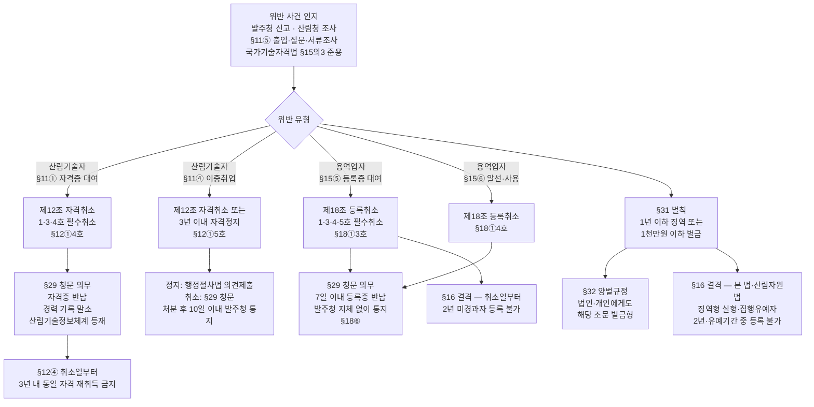
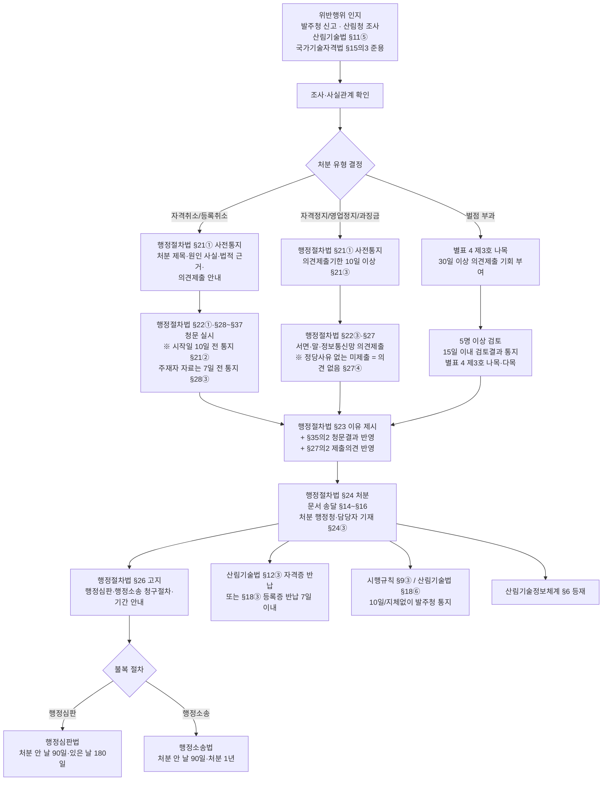

# 산림기술자 자격증 대여·이중취업 행정처분·벌칙 체계

> 근거: 산림기술 진흥 및 관리에 관한 법률(법률 제21405호, 시행 2026-08-28) §11·§12·§15·§16·§18·§24·§29·§31·§32·§33 + 시행규칙 §9·§14·§18 + 별표 2·3·4 + 「행정절차법」 §21·§22·§23·§24·§26·§27·§28~§37
> 원문 wiki: [[법령/산림기술법/법률_자격관리_벌칙]] · [[법령/산림기술법/별표2_자격취소_자격정지_세부기준]] · [[법령/산림기술법/별표3_등록취소_영업정지_등록말소_세부기준]] · [[법령/산림기술법/별표4_벌점관리기준]] · [[타부처법령/법제처/행정절차법]]

산림기술자 **자격증 대여(명의 대여)**, **이중취업(두 개 이상 업체 중복 취업)**, 산림기술용역업 **등록증 대여**가 발생했을 때 한 사건에서 다섯 트랙 — ① 자격 행정처분(§12), ② 등록 행정처분(§18), ③ 형사벌칙(§31·§32), ④ 과태료(§33), ⑤ 부실측정 벌점(§24·별표 4) — 이 **동시에·중첩적으로** 적용되고, **「행정절차법」**에 따른 사전통지·청문/의견제출·이유 제시·고지의 순서를 거친다. 본 페이지는 그 체계를 한 장으로 정리한다.

**섹션 구성**
1. 금지행위 — §11·§15⑤·⑥ 매트릭스
2. 위반 → 처분·벌칙 체계도(mermaid)
3. 트랙별 정리 (① 자격처분 / ② 등록처분 / ③ 형사벌칙 / ④ 과태료 / ⑤ 벌점)
4. **행정처리 순서 (행정절차법 근거)** — 처분 단계별 흐름도 + 단계별 세부 조문
5. 한 사건에서 동시 적용 사례
6. 발주청 실무 체크포인트
7. 관련 wiki
8. 관련 외부 법령·참조

---

## 1. 금지행위 — §11·§15⑤·⑥

| 구분 | 행위 주체 | 금지행위 | 근거 |
|------|----------|----------|------|
| **자격증 대여** | 산림기술자 | 자기 성명을 다른 사람에게 사용하게 하거나 산림기술자 자격증을 빌려줌 | §11① |
| 자격증 차용 | 누구든지 | 다른 사람의 명의·자격증을 빌려 산림기술용역업·산림사업시행업 수행 | §11② |
| 알선 | 누구든지 | §11①·②의 행위를 알선 | §11③ |
| **이중취업** | 산림기술자 | 산림기술자 자격이 필요한 **두 개 이상 업체에 중복 취업** | §11④ |
| **등록증 대여** | 산림기술용역업자 | 타인에게 상호·성명 사용 또는 등록증 대여 | §15⑤ |
| 등록증 차용 | 누구든지 | §15⑤ 행위 알선 또는 타인 등록증 사용 | §15⑥ |

> 산림기술자 **자격증** 라인(§11)과 산림기술용역업 **등록증** 라인(§15⑤·⑥)은 별도이며, 하나의 사건이 두 라인 모두 위반에 해당할 수 있다.

---

## 2. 위반행위 → 처분·벌칙 체계도

---

## 3. 트랙별 정리

### 트랙 ① — 산림기술자 행정처분 (§12 + 시행규칙 별표 2)

> 세부 처분 일수는 [[법령/산림기술법/별표2_자격취소_자격정지_세부기준]] 참조 (시행규칙 §9① + 별표 2, 개정 2022.4.15).

| 위반행위 | 근거 | 1차 위반 | 2차 위반 | 3차 이상 |
|---------|------|---------|---------|---------|
| **§11① 명의대여·자격증 대여** | §12①4호 | **자격취소** | — | — |
| **§11④ 이중취업** | §12①5호 | **자격정지 36개월** | **자격취소** | — |
| 거짓·부정 자격 취득 | §12①1호 | 자격취소 | — | — |
| 거짓 서류 작성·**고의** 부실수행 | §12①2호 | 자격취소 | — | — |
| **과실**로 업무 부실수행 | §12①2호 | 자격정지 6개월 | 자격정지 12개월 | 자격취소 |
| 자격정지기간 중 업무수행 | §12①3호 | 자격취소 | — | — |
| 발주청 정당 시정명령 미이행 | §12①6호 | 자격정지 6개월 | 자격정지 12개월 | 자격취소 |
| §7② 교육·훈련 미이수 | §12①7호 | 자격정지 3개월 | 자격정지 6개월 | 자격정지 12개월 |

**일반기준 (별표 2 제1호)**
- **가중**: 최근 **3년간** 같은 위반행위로 처분받은 경우만 차수 가중. 소급 3년 전 처분은 차수 산정에서 제외
- **복수 위반 병합**: 처분기준이 다른 경우 무거운 처분에 따름. 둘 이상이 같은 자격정지면 무거운 처분기준의 **1/2까지 가중 가능**(합산 **3년 초과 불가**)
- **감경(자격정지만 해당)**: 다음 사유 시 **1/2 범위 감경 가능** — ⓐ 고의·중대 과실 아닌 사소한 부주의·오류 ⓑ 위반행위 즉시 정정·시정 ⓒ 내용·정도·동기·결과 고려

**절차·사후효과**
- **청문**: §29 — 자격취소 시 필수 (자격정지는 행정절차법 의견제출)
- **자격증 반납**: §12③ 지체 없이 산림청장에게 반납
- **재취득 금지**: §12④ — 자격취소일부터 **3년 이내** 동일 자격 재취득 불가
- **소속 업체 통지**: 시행규칙 §9③ — 처분 통보받은 산림기술용역업자·산림사업시행업자는 **10일 이내 발주청에 통지**

### 트랙 ② — 산림기술용역업자 행정처분 (§18 + 시행규칙 별표 3)

> 세부 처분 일수는 [[법령/산림기술법/별표3_등록취소_영업정지_등록말소_세부기준]] 참조 (시행규칙 §14① + 별표 3, 개정 2023.1.6).

| 위반행위 | 근거 | 1차 위반 | 2차 위반 | 3차 이상 |
|---------|------|---------|---------|---------|
| 거짓·부정 등록 | §18①1호 | **등록취소** | — | — |
| 등록요건 미달 | §18①2호 | 영업정지 **3개월** | 영업정지 **6개월** | **등록취소** |
| **§15⑤ 상호·성명 사용·등록증 대여** | §18①3호 | **등록취소** | — | — |
| **§15⑥ 알선·타인 등록증 사용** | §18①4호 | **등록취소** | — | — |
| 영업정지기간 중 영업 | §18①5호 | **등록취소** | — | — |
| 등록 취소된 경우 | §18② | **등록말소** | — | — |
| 폐업 후 §15④ 신고 누락 | §18② | **등록말소** | — | — |
| 휴업 후 §15④ 신고 누락 | §18② | **경고** | **등록말소** | — |

**일반기준 (별표 3 제1호)**
- **가중**: 최근 **3년간** 같은 위반행위로 처분받은 경우만 차수 가중. 소급 3년 전 처분은 차수 산정에서 제외
- **복수 위반**: 처분기준이 다른 경우 무거운 처분에 따름 (자격정지처럼 합산 가중 규정 없음)
- **일반 감경 (라목)**: 다음 사유 시 ⓐ 영업정지 → **1/2 범위 감경** ⓑ 등록취소 → **6개월 영업정지로 갈음 가능** (단 **§18①제1·3·4·5호 등록취소는 감경 불가**)
  - 사유: 고의·중대 과실 아닌 사소한 부주의·오류 / 위반 즉시 정정·시정 / 내용·정도·동기·결과 고려
- **소상공인 추가 감경 (마목, 라목과 중복 적용 불가)**: 고의·중과실 없는 「소상공인기본법」§2 소상공인 → ⓐ 영업정지 **70/100 범위 감경** ⓑ 등록취소(2호만) → 6개월 영업정지로 갈음
- **영업정지 갈음 과징금**: §18④ — §18①제2호(등록요건 미달) 영업정지를 **3천만원 이하 과징금**으로 갈음 가능

**절차·사후효과**
- **청문**: §29 — 등록취소 시 필수
- **등록증 반납**: §18③ 통지일부터 **7일 이내**
- **발주청 통지**: §18⑥ — 처분 받은 산림기술용역업자가 지체 없이 통지
- **계약 계속수행**: §18⑦·⑧ — 처분 전 체결 계약 업무는 원칙 계속수행 가능. 단 ⓐ 발주청이 30일 이내 계약 해지, ⓑ 30일 이내 발주청 동의 미획득, ⓒ 필수취소 사유(§18①1·3·4·5호) → 즉시 중단
- **결격사유**: §16②호 — 등록취소일부터 **2년 미경과자 등록 불가**
- **지위승계 효과**: §20① — 양수인등에 처분 효과 **1년간 승계** (개정 2026.2.27)

### 트랙 ③ — 형사벌칙 (§31·§32)

| 위반조항 | 벌칙 |
|----------|------|
| §11①가목 자격증 대여 | 1년 이하 징역 / 1천만원 이하 벌금 |
| §11①나목 자격증 차용 영업 | 1년 이하 징역 / 1천만원 이하 벌금 |
| §11①다목 알선 | 1년 이하 징역 / 1천만원 이하 벌금 |
| §11①라목 **이중취업** | 1년 이하 징역 / 1천만원 이하 벌금 |
| §15① 무등록 영업 | 1년 이하 징역 / 1천만원 이하 벌금 |
| §15⑤ 등록증 대여 | 1년 이하 징역 / 1천만원 이하 벌금 |
| §15⑥ 등록증 대여 알선·사용 | 1년 이하 징역 / 1천만원 이하 벌금 |
| §17② 설계·감리 위반 | 500만원 이하 벌금 |

- **양벌규정 §32**: 법인 대표자·대리인·사용인·종업원의 §31 위반 시 법인·개인에게도 **해당 조문 벌금형** 과함 (상당한 주의·감독 게을리하지 않은 경우 제외)
- **결격사유 §16③·④**: 본 법 또는 산림자원법 위반으로 **징역형 실형** 종료 후 2년 미경과자 / **징역형 집행유예** 기간 중인 자는 산림기술용역업 등록 불가

### 트랙 ④ — 과태료 (§33)

자격증 대여·이중취업 본 위반은 형사벌칙(§31) 대상이라 §33의 100만원 이하 과태료에는 해당하지 않음. 다만 부수 의무 위반 시 과태료 부과:

- §10④ **경력등 거짓신고** (자격증 대여를 가리기 위한 거짓 경력 신고 등): 100만원 이하 과태료
- §25② **현장 이탈** (자격증만 빌려주고 실제 현장 미배치 사례 적발 시 동시 적용 가능): 100만원 이하 과태료
- §22② 산림청장 검사 거부·방해·기피: 100만원 이하 과태료

### 트랙 ⑤ — 벌점(부실측정) (§24 + 시행규칙 §18·§19 + 별표 4)

> 자격증 대여·이중취업 자체는 별표 4 부실내용에 직접 매칭되지 않으나, **대여·이중취업 상태에서 발생한 무자격 참여·현장 이탈·부실 시공·안전사고**는 별표 4 항목으로 벌점 부과 → 입찰감점 → 신규 수주 차질로 이어진다. 자세한 내용은 [[법령/산림기술법/별표4_벌점관리기준]] · [[산림작업/자원조성/산림기술자_벌점관리]].

**대여·이중취업과 연결되는 대표 벌점 항목 (별표 4)**

| 부실항목 | 위반내용 | 벌점 |
|---------|---------|------|
| **1.7-1)** | 참여 예정 산림기술자 불참 또는 **무자격자 참여** (설계) | **2점** |
| **2.1-4)** | 산림기술자등의 허락 없이 현장 이탈 (시행) | 1점 |
| **2.4-3)** | 산림기술자등이 발주청·감리원 허락 없이 무단 현장 이탈 (시행) | 1점 |
| **2.5-1)** | 발주자 승인 없이 산림기술자등 교체 | 2점 |
| **3.6-1)** | 산림기술자등의 **자격 미달** (감리) | 2점 |
| **3.7-1)** | 참여 예정 산림기술자 불참 또는 **무자격자 참여** (감리) | **3점** |
| **2.13-1) / 3.12-1)** | 산림사업 현장 안전사고로 **사망자 발생** (1명당) | **5점 / 3점** |

**적용 효과 — 입찰참가자격 사전심사 감점 (별표 4 제5호)**

| 누계 평균벌점 | 입찰 감점 |
|---|---|
| 1점 이상 ~ 2점 미만 | 0.2점 |
| 2점 이상 ~ 5점 미만 | 0.5점 |
| 5점 이상 ~ 10점 미만 | 1점 |
| 10점 이상 ~ 15점 미만 | 2점 |
| 15점 이상 ~ 20점 미만 | 3점 |
| 20점 이상 | **5점** |

- **누계 평균벌점 산정**: 최근 **2년간 받은 벌점 합계 ÷ 2** (반기별 합산, 매 반기 말일부터 2개월 경과 후 산정)
- **소멸**: 벌점 **7점 이하**이고 마지막 부과일부터 **1년간 추가 부과 없는 경우** 전체 소멸 (별표 4 제4호 가목)
- **감경**: 전문교육 **35시간 이수**시 **7점 감경** (제4호 나목)
- **승계**: 산림기술용역업 ↔ 산림사업시행업 분야 변경 시에도 벌점 승계 (제5호 다목)
- **공개**: 매 반기 말일 2개월 경과 후 **산림기술정보체계 홈페이지에 공개** — 업체명·등록번호·업무영역 / 산림기술자 성명·기술 종류·등급·자격증 번호 (제6호)
- **공동도급 부과**: 공동이행방식은 **출자비율** 분담 / 분담이행방식은 분담 사업자에 부과 (제3호 라목)

**위반행위 → 벌점 → 행정처분 연쇄 가능성**
- 별표 4 부실은 직접 자격취소·등록취소 사유는 아니나, 동일 사실이 **§12①2호(고의·과실 부실수행, 자격취소~정지) 또는 §18①2호(등록요건 미달, 영업정지~취소)에 함께 해당**할 수 있음
- 벌점 누적은 입찰감점·공개로 **계약 수주 손실**을 일으키고, 부실 정도에 따라 발주청은 **§24④ 시정명령** → 미이행 시 **§12①6호 자격처분** 가능

---

## 4. 행정처리 순서 (행정절차법 근거)

산림기술법 §29(청문)은 청문 의무 사유만 정하고, 절차 실체는 **「행정절차법」**(법제처 소관)이 일반법으로 적용된다. 자격취소·자격정지·등록취소·영업정지·과징금·벌점 부과 처분의 전 과정은 다음 순서를 따른다.

### 처분유형별 절차 분기

| 처분 | 청문 의무 | 의견제출 | 사전통지 기한 | 처분 방식 |
|------|----------|---------|--------------|----------|
| 자격취소 (§12) | **필수**(산림기술법 §29 + 행정절차법 §22①3나 신분·자격 박탈) | (청문이 의견청취 갈음) | 청문일 **10일 전**(행정절차법 §21②) | 문서(§24) |
| 자격정지 (§12) | 의무 아님 | **의무**(행정절차법 §22③) | **10일 이상**의 의견제출기한(§21③) | 문서 |
| 등록취소 (§18) | **필수**(산림기술법 §29 + 행정절차법 §22①3가 인허가 취소) | (청문이 갈음) | 청문일 **10일 전** | 문서 |
| 영업정지 (§18) | 의무 아님 | **의무** | **10일 이상** | 문서 |
| 과징금(§18④) | 의무 아님 | **의무** | **10일 이상** | 문서 |
| 벌점(별표 4 제3호) | — | **의무**(별표 4 자체 절차) | **30일 이상** 의견제출 기회 | 문서 |

### 처분 단계별 흐름 (필수 트랙)

### 단계별 세부 — 행정절차법 조문 근거

#### ① 사전통지 — 행정절차법 §21

당사자에게 의무 부과/권익 제한 처분 시 **미리** 다음 통지 의무:
- 처분 제목 / 당사자 성명·주소 / **처분 원인 사실 + 처분 내용 + 법적 근거** / 의견제출 가능 안내 + 미제출 시 처리방법 / 의견제출기관 명칭·주소 / **의견제출기한(10일 이상)** / 그 밖에 필요한 사항
- **청문 시**: 시작일부터 **10일 전까지** 통지(§21②). 의견제출 관련 항목은 청문 주재자 소속·직위·성명, 청문 일시·장소, 불응 시 처리방법으로 갈음
- **생략 가능**(§21④): ⓐ 공공안전·복리 긴급 ⓑ 자격 상실이 법원 재판으로 객관적 증명 ⓒ 처분 성질상 의견청취 현저 곤란/명백 불필요

#### ② 의견청취 — 행정절차법 §22

- **청문 의무**(§22①): 다른 법령에서 청문 규정 / 행정청 필요 인정 / **인허가 등 취소·신분/자격 박탈·법인 설립허가 취소**
  - 산림기술법 §29 자격취소·등록취소·전문기관 지정취소·교육기관 지정취소 → 청문 의무
- **의견제출 의무**(§22③): 청문·공청회 미해당 권익제한 처분 모두 의견제출 기회 부여 (자격정지·영업정지·과징금·벌점)
- 의견청취 생략(§22④): §21④ 사유 또는 당사자 의견진술 기회 포기 명백 표시
- 처분 지연 금지(§22⑤): 의견청취 후 신속 처분

#### ③ 청문 절차 — 행정절차법 §28~§37

- **§28** 청문 주재자 공정 선정 (필요시 2명 이상) + 시작 **7일 전까지** 자료 통지
- **§29** 제척·기피·회피
- **§30** 공개 (당사자 신청 또는 주재자 인정 시. 공익·제3자 이익 침해 우려 시 비공개)
- **§31** 주재자가 예정 처분 내용·원인 사실·법적 근거 설명 → 당사자 의견·증거 제출
- **§33** 직권·신청 증거조사
- **§34** 청문조서 작성
- **§35** 청문 종결
- **§35의2** 청문조서·증거 종합하여 **처분에 반영 의무**
- **§37** 당사자는 청문 통지~종결까지 **문서 열람·복사 요청권**

#### ④ 의견제출 절차 — 행정절차법 §27·§27의2

- §27① **서면·말·정보통신망** 모두 가능
- §27② 증거자료 첨부 가능
- §27④ **정당한 이유 없이 의견제출기한 내 미제출 = 의견 없는 것으로 본다**
- §27의2① 제출 의견에 상당한 이유 인정 시 **반영 의무**
- §27의2② 미반영 처분 시 당사자가 **처분 안 날부터 90일 이내** 이유 설명 요청 시 **서면 회신**

#### ⑤ 처분 — 행정절차법 §23·§24

- **§23 이유 제시**: 근거와 이유 제시 의무 (긴급·경미·단순반복 처분 제외)
- **§24 방식**: **문서 원칙**. 처분 문서에 **행정청·담당자 소속·성명·연락처** 기재. 긴급·경미 시 말·전화·문자·팩스·전자우편 가능(당사자 요청 시 지체없이 문서 교부)

#### ⑥ 송달 — 행정절차법 §14~§16

- §14 우편·교부·정보통신망. 주소·거소·영업소·사무소·전자우편주소
- §15 송달은 도달한 때 효력 발생
- §16 천재지변·당사자 책임 없는 사유 시 기간 정지

#### ⑦ 고지 — 행정절차법 §26

처분 시 **행정심판·행정소송 제기 가능 여부, 청구절차·청구기간** 등 불복 방법 안내 의무.

#### ⑧ 산림기술법 고유 후속절차

- **자격증/등록증 반납**: 자격취소 시 지체없이(§12③) / 등록취소 통지 후 **7일 이내**(§18③)
- **발주청 통지**: 자격처분은 소속 업체가 **10일 이내** 발주청 통지(시행규칙 §9③) / 등록처분은 산림기술용역업자가 **지체없이** 발주청 통지(§18⑥)
- **산림기술정보체계 등재·공고**: 시행규칙 §9② / §14② — 처분일부터 10일 이내 지방산림청장·시·도지사·수탁기관 통보
- **계약 계속수행 판단**: 발주청은 처분 후 **30일 이내** 계약 해지 또는 계속수행 동의 결정(§18⑦·⑧)

#### ⑨ 불복

- **행정심판** (행정심판법): **처분 안 날부터 90일** / 처분 있은 날부터 **180일** 이내 청구
- **행정소송** (행정소송법): **처분 안 날부터 90일** / 처분 있은 날부터 **1년** 이내 제기
- **과징금 미납**: §18⑤ 국세 강제징수의 예에 따라 징수

---

## 5. 한 사건에서 동시 적용되는 사례 시뮬레이션

> 사례: 산림기술자 A가 산림사업법인 X에 등록된 상태에서 산림기술용역업 Y에 자격증을 대여하여 Y가 그 자격증을 등록 기술인력으로 신고

| 적용 트랙 | 대상 | 조문 | 효과 |
|----------|------|------|------|
| ① 자격처분 | A(기술자) | §12①4호 → §11① 위반 | **자격취소(필수)** + 3년 재취득 금지(§12④) |
| ① 자격처분 | A(기술자) | §12①5호 → §11④ 위반(이중취업으로 해석되는 경우) | 자격취소 또는 정지 |
| ② 등록처분 | Y(용역업자) | §18①4호 → §15⑥ 위반(타인 자격증 사용 → 등록요건 충족 가장) | 등록취소(필수) + 2년 결격(§16②) |
| ③ 벌칙 | A | §31①1가 | 1년 이하 징역 또는 1천만원 이하 벌금 |
| ③ 벌칙 | Y 대표 | §31①1나·다 + §32 양벌 | 같은 벌금형 |
| ④ 부수 과태료 | A·Y | §33①3호(경력 거짓신고) 등 부수의무 위반 시 | 100만원 이하 |
| ⑤ 벌점 | A·Y | 별표 4 1.7-1)·3.7-1)(무자격자 참여) | A·Y 각 2~3점 → 입찰 감점·산림기술정보체계 공개 |

→ **하나의 사건에서 자격취소·등록취소·형사처벌·결격·벌점이 모두 발생**할 수 있음에 유의.

---

## 6. 발주청 실무 체크포인트

발주청이 산림기술용역업자·산림사업시행업자와 계약을 체결·관리할 때:

1. **자격증 진위·이중취업 확인** — 산림기술정보체계(§6) 또는 한국산림기술인회(§13)를 통한 조회
2. **현장배치 산림기술자 일치 여부** — §25① 배치된 산림기술자가 실제 현장에 있는지 점검 (현장 이탈은 §25②·§33①10호 과태료)
3. **처분 사실 통지 수령** — §18⑥ 처분받은 용역업자는 발주청에 지체없이 통지 의무
4. **계약 계속수행 판단** — §18⑦·⑧ 처분 후 30일 이내에 발주청이 ⓐ 계약 해지 또는 ⓑ 계속수행 동의 결정. 필수취소(§18① 1·3·4·5호)는 무조건 중단
5. **벌점 관리** — §24 부실 측정 시 시행규칙 별표 4 벌점관리기준 적용 → 입찰 시 불이익(§24②)

---

## 7. 관련 wiki

- [[법령/산림기술법/법률_자격관리_벌칙]] — §11·§12·§15·§16·§18·§29·§31~33 원문 발췌
- [[법령/산림기술법/별표2_자격취소_자격정지_세부기준]] — 시행규칙 §9① 별표 2
- [[법령/산림기술법/별표3_등록취소_영업정지_등록말소_세부기준]] — 시행규칙 §14① 별표 3
- [[법령/산림기술법/별표4_벌점관리기준]] — 시행규칙 §18② 별표 4 (벌점 부과기준·소멸·감경·입찰 감점·공개)
- [[타부처법령/법제처/행정절차법]] — §21·§22·§23·§24·§26·§27·§28~§37 (사전통지·청문·의견제출·이유 제시·고지)
- [[행정규칙/고시/산림기술용역업_관리지침]] — 산림기술용역업(설계·감리업) 등록 절차 — 산림기술자 자격증 사본 확인(§3), 퇴사 확인 기준(고용보험 상실신고서)
- [[산림작업/자원조성/산림사업법인]] — 산림사업법인(시행업) 등록·기술자 보유요건 (산림자원법 §24)
- [[산림작업/자원조성/국유림영림단]] — 국유림영림단 등록·취소 (산림자원법 §23의2)
- [[법령/산림자원법/법률_2장_조성육성]] — 산림기술자 인용 조항 (§13③·§23·§24)

## 8. 관련 외부 법령·참조

- 「국가기술자격법」 §15의3 — 자격증 대여 조사 절차 준용 근거 (산림기술법 §11⑤)
- 「행정심판법」 — 처분 안 날 90일 / 처분 있은 날 180일 청구
- 「행정소송법」 — 처분 안 날 90일 / 처분 있은 날 1년 제기
- 「소상공인기본법」 §2 — 별표 3 마목 소상공인 추가 감경 적용 근거
- 원본 PDF: `raw/law-go-kr/별표/산림기술법/별표2_*.pdf`, `별표3_*.pdf`, `별표4_*.pdf`
